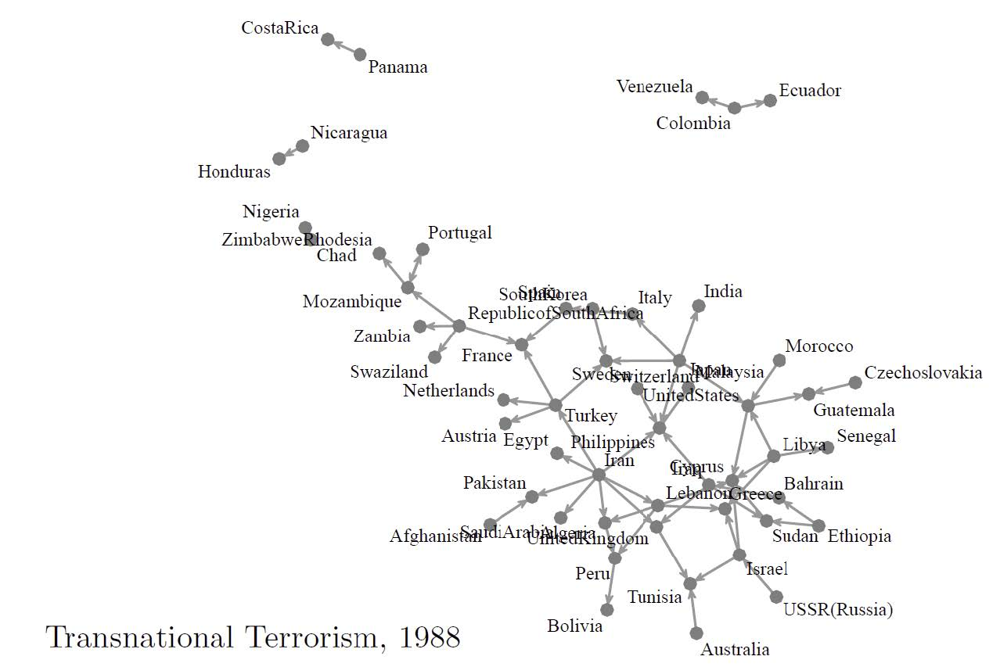

## 概要

.left-column[
### 认识网络

+ 网络分析方法论
+ 网络要素
+ 自我核心网络
+ 网络扩散与改变
]

.right-column[
### 理解网络

+ 整体网络分析
+ 网络与时间
+ 全网分析延展
]

---

class: inverse, bottom

# 认识网络

---

## 先说点别的：方法论 vs. 方法

+ 你学过什么方法论？
+ 你学过什么方法？

--

.left-column[

### 方法

+ .red[假定]
+ 数据
+ 过程
+ 检验

]

.right-column[

### 方法论

+ .red[视角]
+ 理论
+ 现实
+ 方法

]

???

视角：从什么角度看世界，individual, culture, structure
理论：rational choice, marixism
现实：行为、互动

---

class: Large, center, middle

定性研究 vs. 定量研究

---

## 方法论的迁越：社会网络研究

> For the last thirty years, empirical social research has been
dominated by the sample survey. But as usually practiced,..., the
survey is a sociological meat grinder, tearing the individual from his
social context and guaranteeing that nobody in the study interacts
with anyone else in it (Allen Barton 1968).

???

Barton, Allen H. 1968. “Survey Research and Macro-Methodology.” American Behavioral Scientist 12(2): 1–9.

---

## 特殊之处

行为体间的相互依赖关系（.red[I]nterdependence）

--

关系（.red[R]elationships）的丈量

--

结构（.red[S]tructure）的重要性

---

## 当你使用网络分析方法时……

.left-column[
### 建构理论？

理解社会关系：

+ 相似性
+ 关联性
+ 互动性
+ 流动性
]

???

Parkinson, Sarah Elizabeth. 2013. “Organizing Rebellion: Rethinking High-Risk Mobilization and Social Networks in War.” American Political Science Review 107(3): 418–32.

+ Similarity
+ Social relations
+ Interactions
+ Flows

--

.right-column[
### 应用方法？

分析关系体量：

+ 距离
+ 通道
+ 聚类
+ 预测
]

???

Mucha, Peter J. et al. 2010. “Community Structure in Time-Dependent, Multiscale, and Multiplex Networks.” Science 328(5980): 876–78.

+ Distance
+ Degree (popularity)
+ Modularity
+ Predicting the relations

---

## 操作层面：SNA能做什么？

.left-column[

### 解释

+ 关系 &rarr; 行为
+ 位置 &rarr; 推广
+ 距离 &rarr; 效率

]

???

+ Friendship &rarr; Behavior
+ Centrality &rarr; Promotion
+ Distance &rarr; Efficiency in problem solving

.right-column[

### 被解释

+ 同质性 &rarr; 关联的紧密程度
+ 特质性 &rarr; 谁是核心
+ 组织结构 &rarr; 系统密度

]

???

+ Homophily &rarr; Strength of connection
+ Personality &rarr; Who becomes central
+ Organization structure &rarr; Density

---

background-image: url("images/networkIllustration.jpg")
background-position: center
background-size: contain

---

.center[]

+ .navy[Relation/Edge/Link/Tie]
+ .red[Node/Actor/Vertex]

---

.navy[Subgraphs]: .red[Dyads, triads, k-ads, isolate/island]

---

## 网络分型学

+ “全网”数据 (Complete network)
    + 二模网络(`r emo::ji("confounded")` Two-mode/bipartite)

--

+ 样本网数据 (Sample network)
    + 自我核心网络(Ego-net)
    + 滚雪球网络(Respondent-drive sampled data) 
    + Somewhere in between (略略略~)

---

background-image: url("images/network_complete.png")
background-position: center
background-size: contain

---

background-image: url("images/network_liars.png")
background-position: center
background-size: contain

---

background-image: url("images/network_bipartiteI.png")
background-position: center
background-size: contain

---

background-image: url("images/network_bipartiteII.png")
background-position: center
background-size: contain

