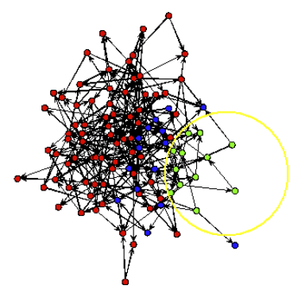
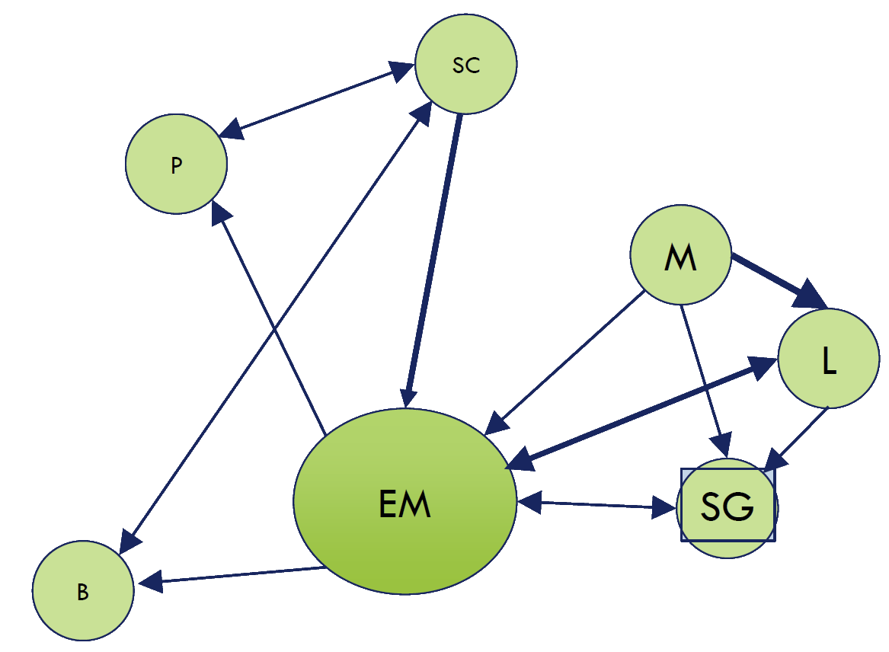
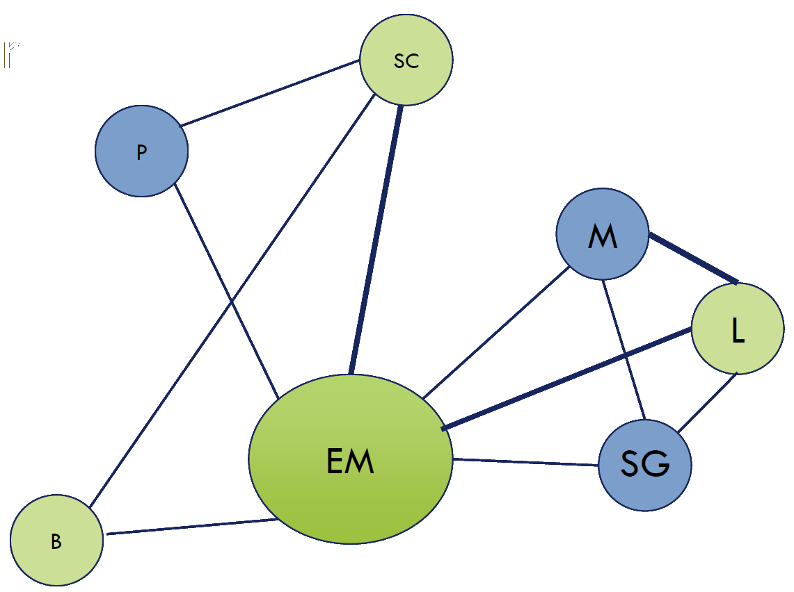

## 概要

.left-column[
### 认识网络

+ 网络分析方法论
+ 网络要素

+ 自我中心网络
+ 网络扩散与改变
]

.right-column[
### 理解网络

+ 整体网络分析
+ 网络与时间
+ 全网分析延展
]

---

class: inverse, bottom

# 认识网络

---

## 先说点别的：方法论 vs. 方法

+ 你学过什么方法论？
+ 你学过什么方法？

--

.left-column[

### 方法

+ .red[假定]
+ 数据
+ 过程
+ 检验

]

.right-column[

### 方法论

+ .red[视角]
+ 理论
+ 现实
+ 方法

]

???

视角：从什么角度看世界，individual, culture, structure
理论：rational choice, marixism
现实：行为、互动

---

class: Large, center, middle

定性 vs. 定量

---

## 方法论的迁越：社会网络研究

> For the last thirty years, empirical social research has been
dominated by the sample survey. But as usually practiced,..., the
survey is a sociological meat grinder, tearing the individual from his
social context and guaranteeing that nobody in the study interacts
with anyone else in it (Allen Barton 1968).

???

Barton, Allen H. 1968. “Survey Research and Macro-Methodology.” American Behavioral Scientist 12(2): 1–9.

---

## 特殊之处

行为体间的相互依赖关系（.red[I]nterdependence）

--

关系（.red[R]elationships）的丈量

--

结构（.red[S]tructure）的重要性

---

## 当你使用网络分析方法时……

.left-column[
### 建构理论？

理解社会关系：

+ 相似性
+ 关联性
+ 互动性
+ 流动性
]

???

Parkinson, Sarah Elizabeth. 2013. “Organizing Rebellion: Rethinking High-Risk Mobilization and Social Networks in War.” American Political Science Review 107(3): 418–32.

+ Similarity
+ Social relations
+ Interactions
+ Flows

--

.right-column[
### 应用方法？

分析关系体量：

+ 距离
+ 通道
+ 聚类
+ 预测
]

???

Mucha, Peter J. et al. 2010. “Community Structure in Time-Dependent, Multiscale, and Multiplex Networks.” Science 328(5980): 876–78.

+ Distance
+ Degree (popularity)
+ Modularity
+ Predicting the relations

---

## 操作层面：SNA能做什么？

.left-column[

### 解释

+ 关系 &rarr; 行为
+ 位置 &rarr; 推广
+ 距离 &rarr; 效率

]

???

+ Friendship &rarr; Behavior
+ Centrality &rarr; Promotion
+ Distance &rarr; Efficiency in problem solving

.right-column[

### 被解释

+ 同质性 &rarr; 关联的紧密程度
+ 特质性 &rarr; 谁是核心
+ 组织结构 &rarr; 系统密度

]

???

+ Homophily &rarr; Strength of connection
+ Personality &rarr; Who becomes central
+ Organization structure &rarr; Density

---

background-image: url("images/sna_networkIllustration.jpg")
background-position: center
background-size: contain

## SNA专有名词

---

.center[]

+ .navy[Relation/Edge/Link/Tie]
+ .red[Node/Actor/Vertex]

---

.navy[Subgraphs]: .red[Dyads, triads, k-ads, isolate/island]

---

background-image: url("images/sna_eulerCircuits.bmp")
background-position: center
background-size: contain

.navy[Walks/Paths]

???

柯尼斯堡七桥问题（Seven Bridges of Königsberg）是图论中的著名问题。这个问题是基于一个现实生活中的事例：当时东普鲁士柯尼斯堡（今日俄罗斯加里宁格勒）市区跨普列戈利亚河两岸，河中心有两个小岛。小岛与河的两岸有七条桥连接。在所有桥都只能走一遍的前提下，如何才能把这个地方所有的桥都走遍？

每一座桥视为一条线，桥所连接的地区视为点。这样若从某点出发后最后再回到这点，则这一点的线数必须是偶数，这样的点称为偶顶点。相对的，连有奇数条线的点称为奇顶点。欧拉论述了，由于柯尼斯堡七桥问题中存在4个奇顶点，它无法实现符合题意的遍历。

---

## 网络分型学

+ “全网”数据 (Complete network)
    + 二模网络(`r emo::ji("confounded")` Two-mode/bipartite)

--

+ 样本网数据 (Sample network)
    + 自我核心网络(Ego-net)
    + 滚雪球网络(Respondent-drive sampled data) 
    + Somewhere in between (略略略~)

---

background-image: url("images/sna_network_complete.png")
background-position: center
background-size: contain

---

background-image: url("images/sna_network_liars.png")
background-position: center
background-size: contain

---

background-image: url("images/sna_network_bipartiteI.png")
background-position: center
background-size: contain

---

background-image: url("images/sna_network_bipartiteII.png")
background-position: center
background-size: contain

---

## 网络是如何抽样的？

.left-column[

]

.right-column[

随机抽样？

]

???

随机抽样是什么方法论视角？

---

.left-column[

]

.right-column[
### 自我中心网络样本

]

???

Sampled ego-network

---

.left-column[

]

.right-column[
### 痕迹网络样本

]

???

Sampled trace network

---

.left-column[

]

.right-column[
### 边际网络样本

]

???

Sampled boundary network

---

### 滚雪球样本

.center[

]

???

Sampled trace network

---

## 社会网络 = .red[关系]

+ 有向（directed）vs. 无向（Undirected）

--

+ 有无（binary）vs. 多少（valued）？

--

+ 单线（single）vs. 多线（multiplex）？

--

+ DGP是否会产生影响？

???

multiplex：In a multiplex network, each type of interaction between the nodes is described by a single layer network and the different layers of networks describe the different modes of interaction.

DGP：Were responses constrained in some way?

+ List up to 5
+ Roster-based
+ Who do you discuss 'important questions' with?

--

+ .Large[Missing Data]

???

Boundary, omission of nodes/ties, measurement error (human recall, actual/perceived relationship)

Observed is reliable? (莆田系，笑果文化前台后台)

---

## 网络数据

+ Adjacency matrix
+ Incidence matrix
+ Edge list

--

+ Nodal attribute data
+ Edge weights

---

## Adjacency Matrix

.center[

]

---

## Incidence Matrix

.center[

]

---

## Incidence to Adjacency

.center[

]

---

## Incidence to Adjacency

.center[

]

---

## Adjacency & Edge List

.center[

]

---

class: inverse, bottom

# 网络最简型：自我中心网络

---

## 数据生成（DGP）

* 全网抽样
* Name generators

---

## 数据类型

+ 我他关联 (Ego-alter connections)
    + 方向、强度
    + 关联频率
--

+ 他他关联 (Alter-alter connections)
    + 他他联乎？
    + 强度、频率？
--

+ 他者特征 (Alter characteristics)

---

## 网络描述

+ 量级（Size）
+ 密度（Density）
+ 同质性（Homophily）
+ 结构“洞”（Structural Holes）
+ 中介（Brokerage）

---

### 量级

.left-column[

]

Size = Count(Alters)

--

nEM = 6.

---

### 密度

.left-column[

密度公式： $d_i = \frac{L_{-i}}{n(n-1)/2}$

* L-i: 与他者的连结数
* ni: 量级（他者数）
]

.right-column[]

---

### 密度

.left-column[

密度公式： $d_i = \frac{L_{-i}}{n(n-1)}$

* L-i: 与他者的连结数
* ni: 量级（他者数）
]

.right-column[]

---

## 应用实例：Security Egonets (Maoz 2010)

### 数据

新独立国家独立五年内和以独立国家发生MID五年内的国际环境

???

Maoz, Zeev. 2010. Networks of Nations: The Evolution, Structure, and Impact of International Networks, 1816–2001. Cambridge University Press.

MID: Militarized interstate disputes

--

### Strategic Reference Group (SRG)

.red[以国家为中心]，测量与其产生敌对关系、冲突的国家及国家联盟

--

### 观点

国家的SRG越大，其越有可能在外交政策中施用争端性政策工具（如介入MID或战争）

---

## 应用案例：Weak Ties (Roch et al. 2000)

### 研究问题

SNA对纳税人税收政策态度影响

### 理论

动机和能力 &rarr; weak ties （同事、熟人等）
+ &rarr; 比从strong ties获取更多对税务的知识
+ &rarr; 与strong ties 一起决定对照章纳税的态度

???

Roch, Christine H., John T. Scholz, and Kathleen M. McGraw. 2000. “Social Networks and Citizen Response to Legal Change.” American Journal of Political Science 44(4): 777–91.

---

## 应用案例：Weak Ties

.left-column[

### 强项

+ 数小时深入访谈
+ 辨析多层决策

]

.right-column[

### 弱项

+ 对关系的先验判断

]

???

同学和同学能一样么~

---

class: inverse, bottom

# 网络最“直观”：同质性

---

## 同质性：行为体（nodes）间异同

.center[]

???

Moody, James. 2001. “Race, School Integration, and Friendship Segregation in America.” American Journal of Sociology 107(3): 679–716.

美国共公学校在中等多样化学校友谊种族隔离最严重，最多样的反而不严重

---

## 同质性

.center[]

???

各年按年龄分布的社会距离

性别同质性降低，但在race 和age上依然稳固，教育和宗教同质性上升

Smith, Jeffrey A., Miller McPherson, and Lynn Smith-Lovin. 2014. “Social Distance in the United States: Sex, Race, Religion, Age, and Education Homophily among Confidants, 1985 to 2004.” American Sociological Review 79(3): 432–56.

---

## 什么创造了同质性

.center[Similarity breeds connection.]

+ 人口学因素
+ 状态
+ 价值
+ 行为

---

## 衡量同质性

.center[]

|        | Same  | Different |
|--------|-------|-----------|
| Tie    | (a) 4 | (b) 7     |
| No tie | (c) 7 | (d) 3     |

---

class: middle

.left-column[
### Yule's Q

Q = (ad - bc)/(ad + bc)

### EI

EI = (b - a)/(b + a)
]

.right-column[

|        | Same  | Different |
|--------|-------|-----------|
| Tie    | (a) 4 | (b) 7     |
| No tie | (c) 7 | (d) 3     |

]