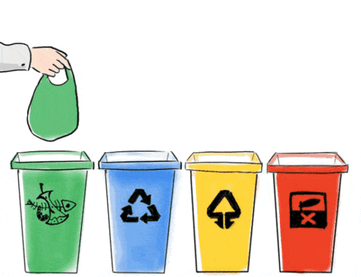
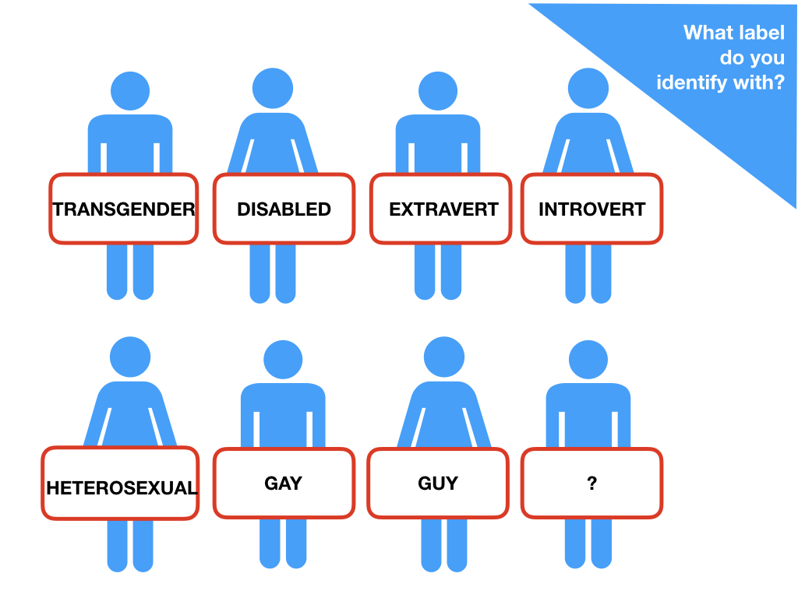
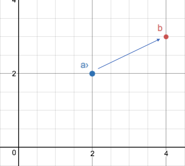
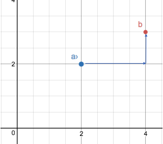
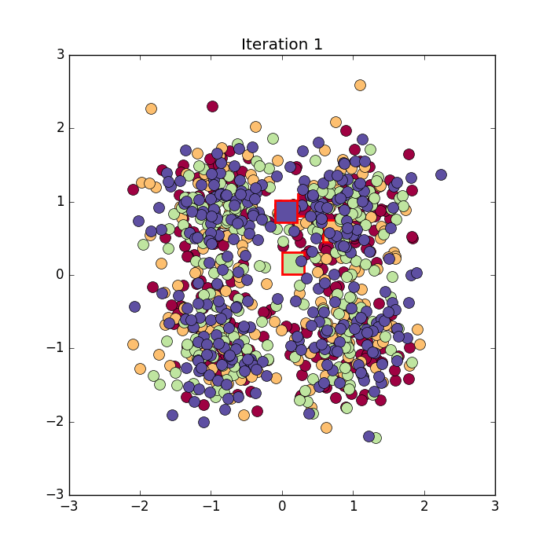
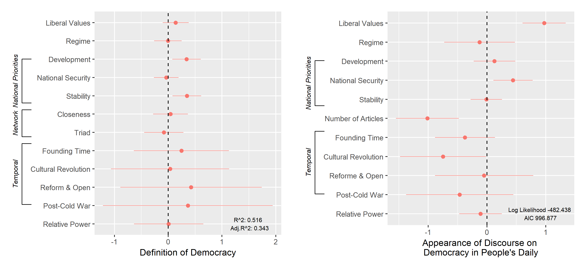

```{r setup, include=FALSE}
gc()

knitr::opts_chunk$set(echo = TRUE,
                      message = FALSE,
                      warning = FALSE)


htmltools::tagList(rmarkdown::html_dependency_font_awesome())

if (!require(pacman)) install.packages("pacman")
library(pacman)

p_load(
  flextable, gridExtra,
  knitr, # dependency
  tidyverse,
  broom
) # data wrangling # data wrangling

xaringanExtra::use_xaringan_extra(c("tile_view", # O
                                    "broadcast", 
                                    "panelset",
                                    "tachyons"))

# Theme setup
theme_set(theme_minimal())

# Functions preload
set.seed(313)

#Sys.setlocale(, "Chinese") # Leting the computer recognize Chinese
```


## Overview

.pull-left[
### 文字分析

+ 词频分析
+ 信息提取
+ 情感标记
+ 语义网络

]

.pull-right[
### 文本分析

+ 文本分类
+ 文本聚类
+ 语义联系*

]

--

### 技术来源 （R）

[`rvest`](https://rvest.tidyverse.org/)   
[`jiebaR`](https://qinwenfeng.com/jiebaR/)/[`TopWORDS`](http://www.stat.tsinghua.edu.cn/kdeng/r-package/)    
[`tidytext`](https://www.tidytextmining.com/)   
[`quanteda`](https://quanteda.io/index.html) series

---

class: inverse, bottom

# 文字分析

---

## 何为文字分析

+ 单位：词、句、段、章

--

+ 目的和方法：
    + 写作特征 &larr; 词频分析
    + 用语特征 &larr; 信息提取
    + 情绪特征 &larr; 情感分析
    + 概念关系 &larr; 语义网络

--

+ 分析案例

.center[]

---

## 数据获取

From html

1. 打开来源网站[新华网](http://www.xinhuanet.com/politics/2021-07/15/c_1127658385.htm)
1. `SelectorGadget` 选择内容部分
1. 使用scraper进行抓取（以`rvest`为例)

```{r scrape-xiSpeech}
library(tidyverse) # data cleaning and management
library(rvest)

link_speech <- "http://www.xinhuanet.com/politics/2021-07/15/c_1127658385.htm"

tx_xi <- read_html(link_speech) %>% 
  html_nodes("p") %>%
    html_text

head(tx_xi)
```

```{r output-csv, include=FALSE, eval=FALSE}
#Saving csv for later Baidu API
tx_xi <- strsplit(tx_xi, "\\s")

names(tx_xi) <- "paragraph"

tx_xi <- as.data.frame(tx_xi) %>% 
  dplyr::filter(paragraph != "") %>% 
  dplyr::filter(!grepl('/摄|新华社记者', paragraph))

write.csv(tx_xi, "tx_xi.csv", fileEncoding = "GBK")
```

---

## 简单清理

1. 去掉前五行无关内容
1. 将所有段合并

```{r truncate-speech}
paragraph_xi <- tx_xi[6:length(tx_xi)]
tx_xi <- paragraph_xi %>% paste(collapse = "")
substr(tx_xi, 1, 50)

# Saving the data to local
# writeLines(tx_xi, file("data/tx_xi.txt", encoding = "UTF-8")) 
```

---

From text

```{r input-txt}
tx_xi <- readLines("data/tx_xi.txt", encoding = "UTF-8")
substr(tx_xi, 1, 50)
```

From pdf

```{r input-pdf}
library(pdftools)
# library(tesseract) # Loading this package if you need ocr

pdf_xi <- pdf_text("data/tx_xi.pdf")
pdf_xi[1]
```

???

https://alexluscombe.ca/blog/getting-your-.pdfs-into-r/

---

## 文字处理

Tokenizing + Segmenting

```{r seg-raw}
library(jiebaR)

cutter <- worker() # segment engine
segment(tx_xi, cutter)[1:20]
```

--

.pull-left[
### Tokenizing
1. 去掉空格、标点、特殊符号
1. 自定义停词（不想计入统计之词)
1. 标记词性
1. Stemming*
]

.pull-right[
### Segmenting

Languages w.o. inter-word spaces

1. 选择分词器（Rwordseg, jiebaR, etc.）
1. 自定义专有之词
]

---

```{r seg-customized}
library(stringr)

tx_xi <- str_remove_all(tx_xi, "\\s|\\t|\\n|\\r|\\v|\\f")

# Saving the stopwords to a file so as to be accessed by jiebaR functions
stopwords::stopwords("zh", source = "stopwords-iso") %>% 
  writeLines(file("data/stopwords.txt", encoding = "UTF-8")) # make sure saving stuff with utf-8

cutter <- worker(type = "tag", # tagging
                 stop_word = "data/stopwords.txt") 

new_user_word(cutter, "同志们", "r") # customize segmentation
new_user_word(cutter, "朋友们", "r") 
```

---

```{r result-seg}
seg_xi <- segment(tx_xi, cutter)
seg_xi[1:50]
```

```{r id-paragraph, include=FALSE}
paragraph_xi <- str_remove_all(paragraph_xi, "\\s|\\t|\\n|\\r|\\v|\\f") %>% 
  .[nchar(.) != 0]

paragraph_xi <- paragraph_xi[nchar(paragraph_xi) != 0]

seg_xiPara <- map(paragraph_xi, ~ segment(., cutter))
df_xiPara <- map2_df(seg_xiPara, 1:length(seg_xiPara), ~tibble(id = .y, words = .x))
```

---

## 词频分析

Do you remember the BOW? 

```{r arrange-freq}
freq_xi <- freq(seg_xi)
arrange(freq_xi, desc(freq))
```

???

BOW: Bag of Words assumption

---

.pull-left[
```{r plot-bar, echo=FALSE}
library(ggplot2)

mutate(freq_xi, char = reorder(char, freq)) %>% 
  filter(freq >= 20) %>% 
  ggplot(aes(char, freq)) +
  geom_col() +
  xlab(NULL) +
  ylab("词频统计") + 
  theme(axis.text = element_text(size = 20)) +
  coord_flip()
```
]

.pull-right[
```{r plot-cloud, echo=FALSE}
library(wordcloud2)

wordcloud2(freq_xi)
```
]
---

## 关键词分析

Keyword 是个“坑”，还是个“深坑”😫

1. Frequency (?)
1. Co-occurence/Collocation (?)
1. Term frequency–inverse document frequency (TF-IDF, ?)

......


???

TF-IDF: Compare (multiply) term frequency in a document with the inverse document frequency (how rare or common that word is in the entire data set)

The higher the score is, the more relevant the word is to the document.

--

```{r id-keywords}
vector_keywords(seg_xi, worker(type = "keywords", topn = 5))
```

Make sense?

---

## 信息提取

文本中提到了多少次“人民”？

```{r check-people}
freq_xi %>% 
  filter(grepl("人民", char))
```

---

围绕“人民”都说了什么 (n-gram)

.pull-left[
```{r bigram-people}
ngram_xi <- NLP::ngrams(seg_xi, n = 2) 

vec_cond <- map_dbl(ngram_xi, ~ grepl("人民", .) %>% 
      sum) %>% as.logical()

ngram_people <- ngram_xi[vec_cond] %>% 
  map(~.[!grepl("人民", .)]) %>% 
  unlist %>% 
  freq 
```
]

.pull-right[
```{r bar-people, echo=FALSE}
mutate(ngram_people, char = reorder(char, freq)) %>% 
  filter(freq > 2) %>% 
  ggplot(aes(char, freq)) +
  geom_col() +
  xlab(NULL) +
  ylab("和“人民”出现词汇") + 
  theme(axis.text = element_text(size = 20)) +
  coord_flip()
```
]

---

## 情感分析

Sentiment analysis (or opinion mining)

.center[]

???

在“负-中-正”谱系上界定文本的.red[属性]或.red[位置]

--

.center[
实现方法

1. 自定义词典
1. 调用API
1. 自定义机器学习
]
---

## 基于自定义词典的分析

案例：简·奥斯汀的长篇小说中的情感走向

```{r data-austen, include=FALSE}
library(janeaustenr)
library(tidytext)

tidy_books <- austen_books() %>%
  group_by(book) %>%
  mutate(
    linenumber = row_number(),
    chapter = cumsum(str_detect(text, 
                                regex("^chapter [\\divxlc]", 
                                      ignore_case = TRUE)))) %>%
  ungroup() %>%
  unnest_tokens(word, text)

library(tidyr)

jane_austen_sentiment <- tidy_books %>%
  inner_join(get_sentiments("bing")) %>%
  count(book, index = linenumber %/% 80, sentiment) %>% # set the threshold
  pivot_wider(names_from = sentiment, values_from = n, values_fill = 0) %>% 
  mutate(sentiment = positive - negative)
```

```{r plot-sentimentAusten, echo=FALSE, out.width="100%", fig.height=3, fig.align='center'}
ggplot(jane_austen_sentiment, aes(index, sentiment, fill = book)) +
  geom_col(show.legend = FALSE) +
  xlab("") +
  facet_wrap(~book, ncol = 3, scales = "free_x")
```

???

https://www.tidytextmining.com/sentiment.html

《理智与情感》（1811）
《傲慢与偏见》（1813）
《曼斯菲尔德庄园》（1814）
《埃玛》（1815）
《诺桑觉寺》（1818，去世后出版）
《劝导》（1818，去世后出版）

---

常见中文情感词典：

+ 知网（HowNet）情感词典
+ 台湾大学（NTSUSD）简体中文情感极性词典
+ 大连理工大学情感词汇本体

---

.pull-left[
## 调用API

中文情感分析API：

+ [百度](https://ai.baidu.com/tech/nlp_apply/sentiment_classify)
+ [讯飞](https://www.xfyun.cn/doc/nlp/emotion-analysis/API.html)
+ [腾讯云](https://wiki.open.qq.com/wiki/%E6%83%85%E6%84%9F%E5%88%86%E6%9E%90API)
+ [华为云](https://support.huaweicloud.com/api-nlp/nlp_03_0015.html)
]

.pull-right[
## 机器学习

1. 训练集 &rarr; 预测集
1. 深度学习
]

--

.center[

百度API分析讲话（以段为单位）

```{python sentiment-Baidu, echo = FALSE, eval = FALSE}
tx_xi = pd.read_csv("/Users/sunyufei/Downloads/tx_xi.csv", encoding = "GBK")

from aip import AipContentCensor
import pandas as pd
from aip import AipNlp

# set API & read data
APP_ID = '24047356'
API_KEY = 'GDGSN58wcscFOBH8gv9lolcu'
SECRET_KEY = 'GFBfGF7SYebN5bp7DEnN0LkOSnMh2aj8'
client = AipNlp(APP_ID, API_KEY, SECRET_KEY)
    
# sentiment

n = 0
tx_xi["sentScore"] = ""

while n < len(tx_xi["paragraph"]):
  try:
    result = client.sentimentClassify(text = tx_xi["paragraph"][n])
    tx_xi["sentScore"][n] = result["items"][0]["positive_prob"]
    print(n)
    print(tx_xi["sentScore"][n])
    n = n + 1
  except:
    print("ERROR")
    n = n + 1

tx_xi.to_csv("data/sentScore.csv", columns=["paragraph", "sentScore"])
```

```{r sentScore-speech, echo=FALSE}
df_sentScore <- read.csv("data/sentScore.csv", encoding = "UTF-8")
rbind(
  df_sentScore %>% arrange(desc(sentScore)) %>% .[1,],
  df_sentScore %>% arrange(sentScore) %>% .[1,]
) %>%
  select(-X) %>% 
  kable
```
]
---

## 语义网络

基于词语关联性（Correlation, collocation, etc.）搭建的社交网络

```{r build-semanticNetwork}
# count words co-occurring within sections
df_xi_pairs <- df_xiPara %>% 
  group_by(words) %>% 
  filter(n() > 10) %>% 
  widyr::pairwise_cor(words, id, sort = TRUE)
```

---

```{r plot-semanticNetwork, echo=FALSE, out.width="100%", fig.height=4, fig.align='center'}
library(ggraph)

a <- arrow(angle = 30, length = unit(0.1, "inches"), ends = "last", type = "open")

df_xi_pairs %>% 
  filter(correlation > 0.4) %>%
  igraph::graph_from_data_frame() %>%
  ggraph(layout = "fr") +
  geom_edge_link(aes(color = "red", width = correlation), arrow = a) + geom_node_point() +
  geom_node_text(aes(label = name), vjust = 1, hjust = 1)
```

---

class: inverse, bottom

# 文本分析

---

.pull-left[
## 文字分析

+ 单位：词、句、段、章

+ 目的和方法：
    + 写作特征 &larr; 词频分析
    + 用语特征 &larr; 信息提取
    + 情绪特征 &larr; 情感分析
    + 概念关系 &larr; 语义网络
]

.pull-right[
## 文本分析
+ 单位：篇、部、月、年

+ 目的和方法：
    + 风格判断 &larr; 文本分类
    + 特征提取 &larr; 文本聚类
    + 语义联系 &larr; 语义关系
]

---

## 文本分析基本思路

.pull-left[
方法：

1. 有监督式(Supervised)
1. 半监督式(Semi-supervised)
1. 无监督是(Unsupervised)
]

.pull-right[
材料：

1. 训练集(training set)
1. 预测集(testing set)

]

---

## 文本分类（Classification/Scaling)

已知类别 &rarr; 量化特性 &rarr; “装箱/标记”

1. 内容比较
1. 作者预测
1. 文体划分

--

形式：

1. 有监督式分类
1. 半监督式分类

--

思路：

学习训练集 &rarr; 确定辨识规律 &rarr; 使用检验集验证规律有效性      
&rArr; 
使用规律分类预测集

---

class: center, middle


---

## 文本分类

\1. 训练集导入

```{r input-gutenberg}
library(tidytext)
library(gutenbergr)

titles <- c("The War of the Worlds","Pride and Prejudice")

books <- gutenberg_works(title %in% titles) %>%
  gutenberg_download(meta_fields = "title") %>%
  mutate(document = row_number())

books
```

---

\2. 训练集清理（segment, token, stemming等)

+ 划分比较单位（行、段、章、本等)
+ 保留常用词

```{r str-2books}
tidy_books <- books %>%
  unnest_tokens(word, text) %>%
  group_by(word) %>%
  filter(n() > 10) %>% # keep words occurring over 10 times
  ungroup()

tidy_books
```

---

\3. 特征提取（高频词等）

```{r classification-supervised, eval=FALSE}
tidy_books %>%
  count(title, word, sort = TRUE) %>%
  anti_join(get_stopwords()) %>%
  group_by(title) %>%
  top_n(20) %>%
  ungroup() %>%
  ggplot(aes(reorder_within(word, n, title), n,
    fill = title
  )) +
  geom_col(alpha = 0.8, show.legend = FALSE) +
  scale_x_reordered() +
  coord_flip() +
  facet_wrap(~title, scales = "free") +
  scale_y_continuous(expand = c(0, 0)) +
  labs(
    x = NULL, y = "Word count",
    title = "Most frequent words after removing stop words",
    subtitle = "Words like 'said' occupy similar ranks but other words are quite different"
  )
```

---

```{r output-classification, echo=FALSE, fig.align='center', fig.height=4, out.width="100%"}
tidy_books %>%
  count(title, word, sort = TRUE) %>%
  anti_join(get_stopwords()) %>%
  group_by(title) %>%
  top_n(20) %>%
  ungroup() %>%
  ggplot(aes(reorder_within(word, n, title), n,
    fill = title
  )) +
  geom_col(alpha = 0.8, show.legend = FALSE) +
  scale_x_reordered() +
  coord_flip() +
  facet_wrap(~title, scales = "free") +
  scale_y_continuous(expand = c(0, 0)) +
  labs(
    x = NULL, y = "Word count",
    title = "Most frequent words after removing stop words",
    subtitle = "Words like 'said' occupy similar ranks but other words are quite different"
  )
```

---

\4. （依据特征）判断预测集

（一段文字这些词用得越多，越可能是某个作者的，that's it 😋)

???
https://juliasilge.com/blog/tidy-text-classification/

One can perform other types of comparison, e.g., with tf-idf


---

class: middle

.pull-left[
### 文本分类·有监督式

1. 训练集导入
1. 训练集清理
1. 人工特征提取
1. 检验集评估*
1. 判断预测集
]

.pull-right[
### 文本分类·半监督式

1. 训练集导入
1. 训练集清理
1. .red[机器]特征提取
1. 检验集.red[评估]
1. 判断预测集
]

---

## 机器学习辅助特征提取

让我们来造一个训练集 vis-&agrave;-vis 预测集

```{r classification-semisupervised}
library(rsample)

books_split <- books %>%
  select(document) %>%
  initial_split() # prop = 3/4
train_data <- training(books_split)
test_data <- testing(books_split)

```

---

## 机器学习特征提取操作步骤

\1. 建构sparse matrix

```{r sparseMatrix}
sparse_words <- tidy_books %>%
  count(document, word) %>%
  inner_join(train_data) %>%
  cast_sparse(document, word, n)

dim(sparse_words)

# Create a response variable to associate each of the rownames() of the sparse matrix 

word_rownames <- as.integer(rownames(sparse_words))

books_joined <- data_frame(document = word_rownames) %>%
  left_join(books %>%
    select(document, title))
```

(可以并入meta data作为新features)

???

12,028 training observations and 1652 features

---

\2. 通过机器学习生成分类器

基于LASSO regularization 

其他分类器: Naive Bayes, Wordscores, Wordfish（也可使用SVM、深度神经网络等）

--

```{r train-lasso}
library(glmnet)
library(doParallel)
registerDoParallel(cores = 8)

is_jane <- books_joined$title == "Pride and Prejudice"
model <- cv.glmnet(sparse_words, is_jane,
  family = "binomial",
  parallel = TRUE, 
  keep = TRUE
)
```

---

```{r plot-lasso, echo = FALSE, fig.align='center', fig.height=4, out.width="100%"}
plot(model)
```

---

\3. .red[Validation! Validation! Validation!]

结果是不是make sense?

对分类影响最大的coefficients有哪些?   
（择取第一个标准差的系数/词）

```{r evaluate-largeLambda}
library(broom)

coefs <- model$glmnet.fit %>%
  tidy() %>%
  filter(lambda == model$lambda.1se)
```

---

## 提到Maritians的不太可能是奥斯汀的作品🥱

```{r plot-largeLambda, echo=FALSE, fig.align='center', fig.height=4, out.width="100%"}
coefs %>%
  group_by(estimate > 0) %>%
  top_n(10, abs(estimate)) %>%
  ungroup() %>%
  ggplot(aes(fct_reorder(term, estimate), estimate, fill = estimate > 0)) +
  geom_col(alpha = 0.8, show.legend = FALSE) +
  coord_flip() +
  labs(
    x = NULL,
    title = "最大影响词汇"
  )
```

---

\4. 检验集评估

```{r evaluate-coef}
intercept <- coefs %>%
  filter(term == "(Intercept)") %>%
  pull(estimate)

classifications <- tidy_books %>%
  inner_join(test_data) %>%
  inner_join(coefs, by = c("word" = "term")) %>%
  group_by(document) %>%
  summarize(score = sum(estimate)) %>%
  mutate(probability = plogis(intercept + score))

classifications
```

???

并入检验集，右侧是可能性概率

---

## 何为有效

法1：Receiver Operating Characteristic (ROC) Curve


.pull-left[
$$TPR = \frac{TP}{TP + FN}$$
判断是奥斯汀写的/实际是奥斯汀写的    


$$FPR = \frac{FP}{FP + TN}$$

判断非奥斯汀写的/实际非奥斯汀写的
]

--

.pull-right[]

---

```{r evaluate-roc, echo=FALSE, fig.align='center', fig.height=4, out.width="100%"}
library(yardstick)

comment_classes <- classifications %>%
  left_join(books %>%
    select(title, document), by = "document") %>%
  mutate(title = as.factor(title))

comment_classes %>%
  roc_curve(title, probability) %>%
  ggplot(aes(x = 1 - specificity, y = sensitivity)) +
  geom_line(
    color = "midnightblue",
    size = 1.5
  ) +
  geom_abline(
    lty = 2, alpha = 0.5,
    color = "gray50",
    size = 1.2
  ) +
  labs(
    title = "ROC Curve"
  )
```


使用AUC也可以

???

Area under the ROC Curve: AUC measures the entire two-dimensional area underneath the entire ROC curve from (0,0) to (1,1).

---

法2：Confusion Matrix

ROC的粗暴2 &times; 2 版（以50%可能性为界）

```{r evaluate-CM, echo=FALSE, fig.align='center', fig.height=3, out.width="100%"}
comment_classes %>%
  mutate(
    prediction = case_when(
      probability > 0.5 ~ "Pride and Prejudice",
      TRUE ~ "The War of the Worlds"
    ),
    prediction = as.factor(prediction)
  ) %>%
  conf_mat(title, prediction) %>% 
  autoplot
```

---

## 哪些错了？Type I & Type II Errors

.center[]

---

不是但错认为奥斯汀写的 (Type I, prob > 0.5)

```{r evaluate-typeI}
comment_classes %>%
  mutate(
    prediction = case_when(
      probability > 0.5 ~ "Pride and Prejudice",
      TRUE ~ "The War of the Worlds"
    ),
    prediction = as.factor(prediction)
  ) %>%
  conf_mat(title, prediction) %>% 
  autoplot
```

---

是但未被认为奥斯汀写的 (Type II, prob < 0.3)

```{r evaluate-typeII}
comment_classes %>%
  filter(
    probability < .3,
    title == "Pride and Prejudice"
  ) %>%
  sample_n(10) %>%
  inner_join(books %>%
    select(document, text)) %>%
  select(probability, text)
```

---

想知道更多？

Emil Hvitfeldt & Julia Silge [Supervised Machine Learning for Text Analysis in R](https://smltar.com/)

.center[]

---

## Classification vs. Scaling

.pull-left[
### Classification: 装箱

+ 作者
+ 风格、流派
+ 时期


]

--

.pull-right[
### Scaling：标签，latent traits

+ Ideology
+ Policy standpoint
+ Soft facts vs. hard facts   
......



]

???

https://lse-me314.github.io/lecturenotes/ME314_day10.pdf

---

.pull-left[
### 文本分类（Classification)

.red[已知]分类 &rarr; 量化个性 &rarr; “装箱”

1. 内容比较
1. 作者预测
1. 文体划分

形式：

1. 有监督式分类
1. 半监督式分类
]

.pull-right[
### 文本聚类 (Clustering)

.red[未知]差异 &rarr; 量化共性 &rarr; “分包”

1. 物以类聚
1. 概念提取

形式：

半监督式聚类    
无监督式聚类

1. 单标签聚类
1. 混合标签聚类
]

---

## 单标签聚类（Single-Membership Clustering)

量化共性 &rarr; 相似归组 &rarr; 最大化.blue[组内]相似度，最小化.blue[组间]相似度

--

### 归组逻辑

Hierarchical/Agglomerative

起点：各点各自一组    
过程：不断合并距离最近组

Point Assignment

起点：随机将点分组    
过程：不断改变分组方式使组内距离最小

---

## 距离

两个数据点的相异程度

--

### 空间距离测算法

.pull-left[


Euclidean Distance




]

--

.pull-right[

Manhattan Distance


]

???

https://www.datanovia.com/en/lessons/clustering-distance-measures/
https://shairozsohail.medium.com/a-comprehensive-introduction-to-clustering-methods-1e1e4f95b501

---

### 相似性距离测算法

.center[
Pearson metrics

Spearman metrics

Kendall metrics

Cosine metrics
]

--

.center[欢迎来 70700173	治理技术专题：政治数据分析 🎉]

---

## Hierarchical Clustering

聚类美国总统国情咨文

```{r euclidean}
library(quanteda)
library(quanteda.corpora)
library(quanteda.textstats)
pres_dfm <- tokens(corpus_subset(data_corpus_sotu, Date > "1980-01-01"), remove_punct = TRUE) %>%
  tokens_wordstem("en") %>%
  tokens_remove(stopwords("en")) %>%
  dfm() %>%
  dfm_trim(min_termfreq = 5, min_docfreq = 3)

# hierarchical clustering - get distances on normalized dfm
pres_dist_mat <- dfm_weight(pres_dfm, scheme = "prop") %>%
    textstat_dist(method = "euclidean") %>% 
    as.dist()

# hiarchical clustering the distance object
pres_cluster <- hclust(pres_dist_mat)
```


???

https://books.psychstat.org/textmining/cluster-analysis.html

---

```{r plot-hiearchical, echo=FALSE, fig.align='center', fig.height=4, out.width="100%"}
# label with document names
pres_cluster$labels <- docnames(pres_dfm)

# plot as a dendrogram
plot(pres_cluster, xlab = "", sub = "", 
     main = "Euclidean Distance on Normalized Token Frequency")
```

---

## Point Assignment

K-mean

.center[]


---

```{r kmean}
k <- 4

pres_kmean <- stats::kmeans(pres_dist_mat, 
                            centers = k,
                            nstart = 10) # number of iterations
```

```{r plot-kmean, echo=FALSE, fig.align='center', fig.height=3, out.width="100%"}
factoextra::fviz_cluster(pres_kmean, data = pres_dist_mat,
             geom = "point",
             ellipse.type = "convex", 
             ggtheme = theme_minimal())
```


---

Get the K right

检验1--20个mean之区别

```{r knum, echo=FALSE, fig.align='center', fig.height=4, out.width="100%"}
k <- 20
varper <- NULL
for (i in 1:k) {
    kfit <- kmeans(pres_dist_mat, i)
    varper <- c(varper, kfit$betweenss/kfit$totss)
}

plot(1:k, varper, xlab = "# of clusters", ylab = "explained variance")
```

---

```{r plot-kmean6, echo=FALSE, fig.height=7, out.width="50%", results='hold'}
k <- 6
pres_kmean6 <- stats::kmeans(pres_dist_mat, 
                            centers = k,
                            nstart = 10) # number of iterations

factoextra::fviz_cluster(pres_kmean6, data = pres_dist_mat,
             geom = "point",
             ellipse.type = "convex", 
             ggtheme = theme_minimal())

factoextra::fviz_cluster(pres_kmean, data = pres_dist_mat,
             geom = "point",
             ellipse.type = "convex", 
             ggtheme = theme_minimal())
```

---

## 混合标签聚类（Mixed-Membership Clustering)

.pull-left[

主题模型(Topic modeling)

主题: 概念

Decisions:

1. 主题数量
1. 起始点
1. 主题.red[含义]
]

.pull-right[
<video width="500" height="500" controls>
<source src="images/text_topicModeling.webm" type="video/webm">
</video>
]

---

## 主题模型举例

What does "democracy" mean in Chinese political language?

--

.center[]

---

Structural Equation Model

1. Identifying concept and conceptual relations
1. Meta data

--

Data: 

People's Daily (1949--2003)

--

Decisions:

1. How many topics?
1. Model robustness?
1. Meanings of the topics?

---

## How Many Topics?

Data driven: Testing 20--140 topics

Criteria:

1. Leveraging held-out likelihood and semantic coherence
1. Residual dropped more

--

&rArr; 40 topics


---

## Model Robustness

### Influences beyond the text per se

Controls:

1. Time dependency
1. Period
1. Holidays and two Sessions ("Liang Hui")

--

### Avoiding initialization sensitivity


Drop low likelihood values after 20 E-M iterations;     
Only the highest 20% were converged and the one with highest semantic coherence and exclusivity were used.

---

## Model Interpretation

Five vital concepts: Democracy, liberal values, regime feature, national priority (economy, security, stability)

Keywords &harr; FREX score words

---

## Conceptual Network

Topic Correlations across years

.pull-left[
### 1991


]
.pull-right[
### 1997


]

---

## What Can Explain Democracy Within and Between Discourses

.center[]

---

## Bonus: 语义关系

vector("paris")−vector("france")+vector("germany")

.center[]

???

https://towardsdatascience.com/word-embeddings-for-nlp-5b72991e01d4

高纬度词汇降维表达相近的向量(关系)

降维方式：

PCA/LSA

Word2Vec

GloVe: Leverage LSA and skip-gram model of Mikolov (Word2Vec)

https://www.cnblogs.com/mantch/p/11403771.html

LSA（Latent Semantic Analysis）是一种比较早的count-based的词向量表征工具，它也是基于co-occurance matrix的，只不过采用了基于奇异值分解（SVD）的矩阵分解技术对大矩阵进行降维，而我们知道SVD的复杂度是很高的，所以它的计算代价比较大。还有一点是它对所有单词的统计权重都是一致的。而这些缺点在GloVe中被一一克服了。

而word2vec最大的缺点则是没有充分利用所有的语料，所以GloVe其实是把两者的优点结合了起来。从这篇论文给出的实验结果来看，GloVe的性能是远超LSA和word2vec的，但网上也有人说GloVe和word2vec实际表现其实差不多。

https://towardsdatascience.com/word-embeddings-for-nlp-5b72991e01d4

---

## Take-Home Points

.pull-left[
### 文字分析

+ 单位：词、句、段、章
+ 目的和方法：
    + 写作特征 &larr; 词频分析
        + **高频词、关键词**
    + 用语特征 &larr; 信息提取
        + **特征词、N-gram**
    + 情绪特征 &larr; 情感分析
        + **词典、调用API、机器学习**
    + 概念关系 &larr; 语义网络
        + **共现、相关性**

]

.pull-right[
### 文本分析

+ 单位：篇、部、月、年

+ 目的和方法：
    + 风格判断 &larr; 文本分类
        + **有监督、机器学习**
    + 特征提取 &larr; 文本聚类
        + **单标签（hierarchical, point assignment）**
        + **混合标签（主题模型）**
    + 语义联系 &larr; 语义关系
        + **Word embedding (word2vec, GloVe)**
]

---

class: inverse, center, middle

# Thank you!

<i class="fa fa-envelope fa-lg"></i>&nbsp; [yuehu@tsinghua.edu.cn](mailto:yuehu@tsinghua.edu.cn) 

<i class="fa fa-globe fa-lg"></i>&nbsp; https://sammo3182.github.io/

<i class="fab fa-github fa-lg"></i>&nbsp; [sammo3182](https://github.com/sammo3182)