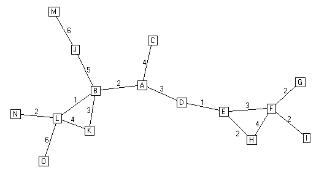

## 概要

.pull-left[
.gray[
### 认识网络

+ 网络分析方法论
+ 网络要素
+ 自我中心网络
]
]

.pull-right[
### 理解网络

+ 邻居分析
+ 扩散分析
+ 全网分析
]

---

class: inverse, bottom

# 邻居分析

---

## 邻居类型

1. Dyads
1. Triads
1. Communities

---

## Dyads种类

1. None: A &nbsp; B
1. Arc: A &rarr; B; B &larr; C
1. Mutuality: A &harr; B

---

## 互惠（Reciprocity）分析

### Dyads 视角

$R = \frac{\#Reciprocated\ Pairs}{\# Connected\ Pairs}$

### Arc 视角

$R = \frac{\#Reciprocated\ Arcs}{\# Total\ Arcs}$

???

Arc is a directed edge

Both are using the described the same phenomenon

---

### Simmelian tie

.center[]

???

Dyads more stable when embedded in triads, Simmelian tie 同时与第三方有互惠关系。

---

## Triad 种类

A、B、C三方，存在几种建立关系的方式?

(22)3 = 64

???

A 指向B/不指向B * 指向C/不指向C：2*2 = 2^2

3 nodes, (2^2)^3

---

background-image: url("images/sna_triads.gif")
background-position: center
background-size: contain

---

background-image: url("images/sna_triadsTrans.png")
background-position: center
background-size: contain

## Transitive Triads

???

A&rarr;B&rarr;C + A&rarr;C

---

background-image: url("images/sna_triadsVac.png")
background-position: center
background-size: contain

## Vacuous Triads

???

No feature a directed path

Used to study social capital: closure (all nodes are reciprocal) and brokerage

Prell, Christina, and John Skvoretz. 2008. “Looking at Social Capital Through Triad Structures.” Connections 28(2): 4–16.

---

## 应用: 网络结构均衡（Structural Balance）

.center[]

???

The enemy of my enemy is my friends.

---

background-image: url("images/sna_structuralBalance.png")
background-position: center
background-size: contain

???

Maoz, Zeev, Lesley G. Terris, Ranan D. Kuperman, and Ilan Talmud. 2007. “What Is the Enemy of My Enemy? Causes and Consequences of Imbalanced International Relations, 1816–2001.” Journal of Politics 69(1): 100–115.

过往186年中，IR充满了imbalance, 友之敌为友，友by alliances, 敌military disputes

Realistic factors increase imbalance: strategic rivalry, opportunism and exploitative tendencies, capability parity, and contiguity

Liberal factors reduce it: joint democracy, economic interdependence, shared
IGO membership

---

background-image: url("images/sna_smallWorld.bmp")
background-position: center
background-size: contain

## 社群： 小世界网络

.pull-right[
.small[
+ 695 人
+ 平均距离为大约5步
+ 平均每人3步以内就能覆盖75个其他人
]
]

???

超越strong, presented ties，小世界网络是一类特殊的复杂网络结构，在这种网络中大部分的节点彼此并不相连，但绝大部分节点之间经过少数几步就可到达，比如六度空间理论（实际可能在2左右，最长不过8）

### Reachability in Colorado Springs

Epidemic Potential in Human Sexual Networks

sexual contact only, STD 

High-risk actors over 4 years

---

## 辨别社群

### 自下而上法

Cliques &rarr; n-cliques &rarr; n-clans

--

### 自上而下法

k-cors &rarr; factions &rarr; modularity

---

## K-Core Collapse

The k-core of a network graph G is the maximal subgraph H &sube; G, such that

.center[]

???

https://www.youtube.com/watch?v=rHVrgbc_3JA

每个人都与其他若干人相连

---

## Faction

理想状态：

> 邻国相望，鸡犬之声相闻，民至老死，不相往来 ——《老子·第八十》

组内紧密连结，无跨组连结。

--

.center[]

---

## 寻找Factions算法

### 目的

Arranging actors to resemble the ideal as closely as possible.

--

### 步骤

1. Partition
1. Evaluation
1. Moving
1. Evaluation, again
1. Repeat

???

+ Partition the network
+ Evaluate how good the partition is
+ Move some actors from one group to another
+ See if there’s improvement
+ Keep repeating the above steps until further improvement is impossible

---

## 寻找社群

Faction method? 

???

heuristic method, 但难以进行并行运算

--

潜在解法: Hierarchical clustering

---

## Hierarchical Clustering

Agglomerative method

.center[]

???

Agglomerative 基于 a wide variety of similarity measures，从empty graph （没有任何ties）开始，将最similar的nodes加在一起

---

## 度量关联: 内聚性

形成凝聚力的两点原则：

连结性

.center[]

???

孤立个体不存在内聚性

---

可达性

.center[]

???

由一点到其他点paths越多可达性越高

---

## 最小内聚性与强内聚力

.center[]

.pull-left[
.small[
+ 集权
+ 信息集中
+ 不平等
+ 个体行为影响大
+ 碎片化结构
]

]

.pull-right[
.small[
+ 分权
+ 信息透明
+ 平等
+ 个体行为难以撼动结构
+ 均衡结构
]
]

???

Minimal cohesion: without that node, the network will break apart

---

## 回到社群

寻找社群方法：

Agglomerative method

???

可能丢失弱连结vertices

--

Divisive method

.center[]

???

Divisive 从complete graph 开始， dedrogram横切二分点）（halting points）

---

## Agglomerative vs. Divisive

.center[]

???

A善于发现强连结community， D不会地区除peripheral vertices

---

## 社群到社会

&zwj;Modularity: 比起.navy[辨别]出社群，更关注一个社会是否由若干个社群.red[组成]。

.center[]

---

## 应用：语言与身份认同

Tamburrini et al 2015

.center[]

???

Tamburrini, Nadine, Marco Cinnirella, Vincent A. A. Jansen, and John Bryden. 2015. “Twitter Users Change Word Usage According to Conversation-Partner Social Identity.” Social Networks 40: 84–89.

modula-rity maximisation algorithm

word-usage frequencies (solid bars at the top of eachplot),   
word-ending frequencies (slashed bars in the middle)    
apostrophe usage (crossed bars at the bottom).

1. 人们根据自己的community改变语言特征
1. communities越独立，语言特征越明显

---

class: inverse, bottom

# 扩散分析

---

## 分析方向

.center[]

1. （法律、政策、习惯.etc）采用的时间
1. 谁是“始作俑者” vis-a-vis “第一个吃螃蟹的人”
1. 扩散过程是谁影响了谁

---

## 网络视角

1. 联系网络（Contact network）
1. 暴露网络（Exposure network）
1. 传动网络（Transmission network）

---

## 联系网络

“Patient 0”效应

.center[]

???

所有相连点，从A开始

---

## 暴露网络

.center[]

???

联系网络的子集

---

## 传动网络

.center[]

---

## 应用

Valente 1996

.center[]

Threshold model in the view of network

???

exposure：按时间adopt

Valente, Thomas W. 1996. “Social Network Thresholds in the Diffusion of Innovations.” *Social Networks* 18(1): 69–89.

Threshold: Early adopter, early majority, late majority, laggards.

个体网络与全网角度理解threshold

---

## “始作俑者”

Brokers?

Centrality?

Node attributes?

---

## 谁影响谁？

.pull-left[
### 机制

+ 学习
+ 竞争
+ 模仿
]

.pull-right[
### 表现

+ Homophoily
+ Direct effect
+ Hierarchy
+ Equivalence
]

---

## 应用

Desmarais, Harden, Boehmke (2015)

捕捉传播路径：

+ i州比j州早采用一个政策的次数
+ 同一政策i和j采用的时间差
+ i采用在多大程度上能预测j的采用

???

Desmarais, Bruce A., Jeffrey J. Harden, and Frederick J. Boehmke. 2015. “Persistent Policy Pathways: Inferring Diffusion Networks in the American States.” *American Political Science Review* 109(2): 392–406.

---

.center[]

???

佛罗里达是近五年policy的主要推动者

一个州被认为innovative，并不单纯取决于它多快采用一个policy

---

## 机制判断

e.g., 影响还是仅仅是相似？（Aral et al 2009）

???

influence vs. homophily

--

传统方法会高估影响机制 300-700%

--

Matched sample estimation

???

Aral, Sinan, Lev Muchnik, and Arun Sundararajan. 2009. “Distinguishing Influence-Based Contagion from Homophily-Driven Diffusion in Dynamic Networks.” Proceedings of the National Academy of Sciences 106(51): 21544–49.

在用Yahoo！Go（类似于企业微信）使用者数据

根据节点的网络性质：在控制了nodes的各种行为和个体特点后，比较那些有很多adopted friends 和没有那么多adopted friends之人

---

e.g. "云集响应"还是"人以群分" （Lazer et al. 2010）

+ 164公共政策2年级硕士生
+ 同cohort
+ 刚入学(T1)，第二学期开始(T2)，第二学期结束(T3)

???

Influencing vs. affiliating 

Lazer, David et al. 2010. “The Coevolution of Networks and Political Attitudes.” *Political Communication* 27(3): 248–74.

个体根据其associates改变正政治看法，这种conformity受social ties 而非task ties影响。而政治看法反过来对relationship影响不大。

---

## Modeling Peer Influence

.center[**Y**(1) = **XB**]
.center[**Y**(T) = &alpha;**WY**(T) + (1 - &alpha;)**Y**(1)]

**Y**(1): N个人，每人对M个问题的.navy[初始]看法 (N &times; M);   
**X**: K个会影响个体看法的（.navy[外生性]）变量（N &times; K;）   
&alpha;: （内生性的）人际影响对Y的作用的.navy[比重]  ;  
**W**: .red[人际关系矩阵]（N &times; N).

---

class: inverse, bottom

# 全网分析

---

## Again, 方法论的跃迁

--

.pull-left[
1. 确定H0
1. 描述H0下样本分布特征
1. 检验观测值是否在“null distribution的尾巴上”
1. 拒绝/不拒绝H0

## Assumption

+ IID observations
+ Sample distribution 已知

]