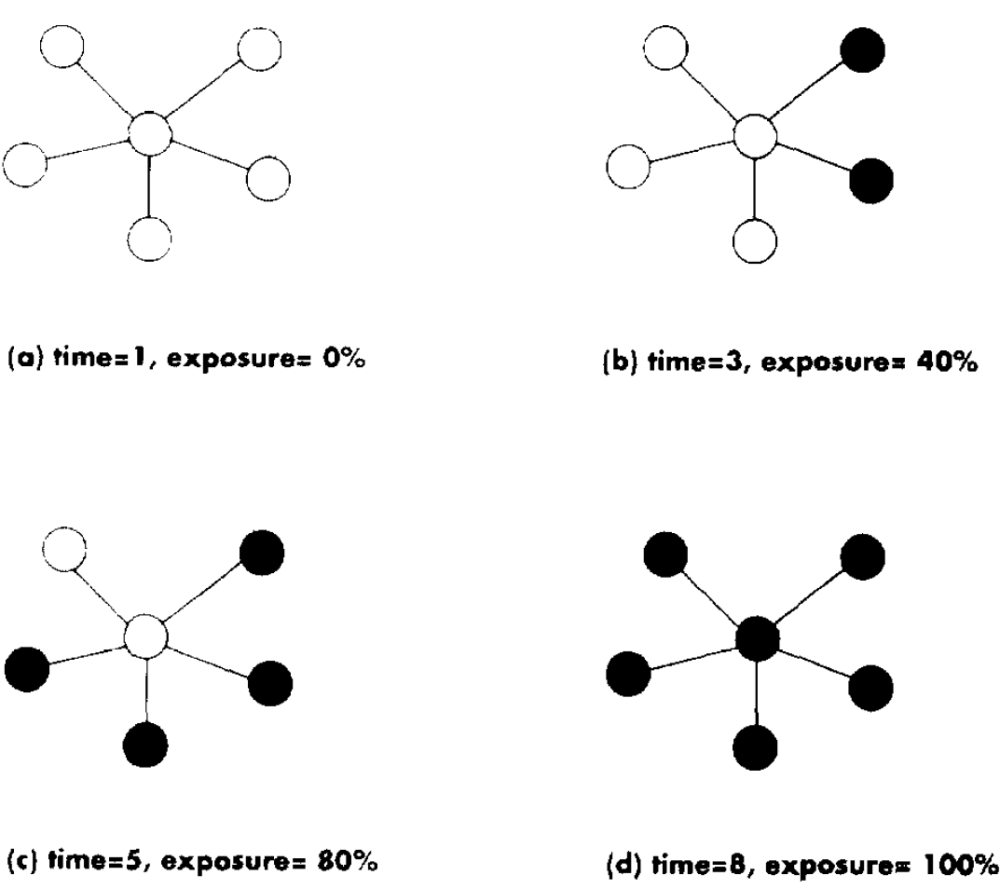

```{r setup, include = FALSE}
knitr::opts_chunk$set(echo = FALSE, message = FALSE, warning = FALSE, htmltools.dir.version = FALSE)

if (!require(pacman)) install.packages("pacman")
library(pacman)

p_load(
  knitr, icons, xaringanExtra,sna, network, tidyverse
) # data wrangling # data wrangling

use_xaringan_extra(c("tile_view", # O
                                    "broadcast", 
                                    "panelset",
                                    "tachyons"))

use_extra_styles(
  hover_code_line = TRUE,
  mute_unhighlighted_code = TRUE
)

# Functions preload
set.seed(313)
```

## 概要

.pull-left[
.gray[
.normal[认识网络]

+ 网络分析方法论
+ 网络要素
+ 自我中心网络
]
]

.pull-right[
### 理解网络

+ 邻居分析
+ 扩散分析
+ 全网分析
]

---

class: inverse, bottom

# 邻居分析

---

## 邻居类型

1. Dyads
1. Triads
1. Communities

---

## Dyads种类

1. None: A &nbsp; B
1. Arc: A &rarr; B; B &larr; C
1. Reciprocal(互惠): A &harr; B

.left-column[
### 互惠分析
]

.right-column[
Dyads 视角

$$R = \frac{\#Reciprocated\ Pairs}{\# Connected\ Pairs}$$

Arc 视角

$$R = \frac{\#Reciprocated\ Arcs}{\# Total\ Arcs}$$

]

???

Arc is a directed edge

Both are using the described the same phenomenon

---

## Dyads种类

1. None: A &nbsp; B
1. Arc: A &rarr; B; B &larr; C
1. Reciprocal(互惠): A &harr; B

.left-column[
### 互惠分析
### Simmelian tie
]

.right-column[
.center[]
]

???

Dyads more stable when embedded in triads, Simmelian tie 同时与第三方有互惠关系。

---

## Triadic Analysis

A、B、C三方，存在几种建立关系的方式? (2<sup>2</sup>)<sup>3</sup> = 64

???

A 指向B/不指向B * 指向C/不指向C：2*2 = 2^2

3 nodes, (2^2)^3

--

.center[]

---

.left-column[
### Transitive Triads
]

.right-column[
.center[]
]


???

A&rarr;B&rarr;C + A&rarr;C

---


.left-column[
### Transitive Triads
### Vacuous Triads
]

.right-column[
.center[]

]


???

No feature a directed path

Used to study social capital: closure (all nodes are reciprocal) and brokerage

Prell, Christina, and John Skvoretz. 2008. “Looking at Social Capital Through Triad Structures.” Connections 28(2): 4–16.

---

## 应用实例

.center[
网络结构均衡（Structural Balance）
]

???

The enemy of my enemy is my friends.

---

background-image: url("images/sna_structuralBalance.png")
background-position: center
background-size: contain

???

Maoz, Zeev, Lesley G. Terris, Ranan D. Kuperman, and Ilan Talmud. 2007. “What Is the Enemy of My Enemy? Causes and Consequences of Imbalanced International Relations, 1816–2001.” Journal of Politics 69(1): 100–115.

过往186年中，IR充满了imbalance, 友之敌为友，友by alliances, 敌military disputes

Realistic factors increase imbalance: strategic rivalry, opportunism and exploitative tendencies, capability parity, and contiguity

Liberal factors reduce it: joint democracy, economic interdependence, shared
IGO membership

---

background-image: url("images/sna_smallWorld.bmp")
background-position: center
background-size: contain

## Beyond k-ads: 社群（Community）

小世界网络

.pull-right[
.small[
+ 695 人
+ 平均距离为大约5步
+ 平均每人3步以内就能覆盖75个其他人
]
]

???

超越strong, presented ties，小世界网络是一类特殊的复杂网络结构，在这种网络中大部分的节点彼此并不相连，但绝大部分节点之间经过少数几步就可到达，比如六度空间理论（实际可能在2左右，最长不过8）

### Reachability in Colorado Springs

Epidemic Potential in Human Sexual Networks

sexual contact only, STD 

High-risk actors over 4 years

---

## 辨别社群

.center[]

--

.pull-left[
Bottom Up: 

Cliques &rarr; n-cliques &rarr; n-clans
]

--

.pull-right[
Top down: 

k-cores &rarr; factions &rarr; modularity

]

---

## K-Core

The k-core of a network graph G is the maximal subgraph H &sube; G, such that

.center[]


???

https://www.youtube.com/watch?v=rHVrgbc_3JA


每个人都与其他若干人相连

4-core is the null graph of the original graph or DNE (does not exist)

---

## Faction

理想状态：

> 邻国相望，鸡犬之声相闻，民至老死，不相往来 ——《老子·第八十》

--

.pull-left[]

???

组内紧密连结，无跨组连结。

--

.pull-right[
实现：Arranging actors to resemble the ideal as closely as possible.

步骤： 

1. Partition
1. Evaluation
1. Moving
1. Evaluation, again
1. Repeat
]

???

+ Partition the network
+ Evaluate how good the partition is
+ Move some actors from one group to another
+ See if there's improvement
+ Keep repeating the above steps until further improvement is impossible

---

## 寻找社群

Faction method? 

???

heuristic method, 但难以进行并行运算

--

Hierarchical Clustering

.center[
Agglomerative method


]

???

Agglomerative 基于 a wide variety of similarity measures，从empty graph （没有任何ties）开始，将最similar的nodes加在一起


---

## 度量关联: 内聚性

形成凝聚力的两点原则：

1. 连结性

.center[]

???

孤立个体不存在内聚性

---

2\. 可达性

.center[]

???

由一点到其他点paths越多可达性越高

---

## 最小内聚性与强内聚力

.center[]

.pull-left[

+ 集权
+ 信息集中
+ 不平等
+ 个体行为影响大
+ 碎片化结构

]

.pull-right[
+ 分权
+ 信息透明
+ 平等
+ 个体行为难以撼动结构
+ 均衡结构
]


???

Minimal cohesion: without that node, the network will break apart

---

## 寻找社群另一种方法

Agglomerative method：可能丢失弱连结vertices

Divisive method (top down)

.center[]


???

Divisive 从complete graph 开始， dedrogram横切二分点）（halting points）

---

## Agglomerative vs. Divisive

.center[]

???

A善于发现强连结community， D不会地区除peripheral vertices

---

## Modularity: 社群到社会

&zwj;Modularity: 比起.red[辨别]出社群，更关注一个社会是否由若干个社群.red[组成]。

.center[]

---

## Modularity应用：语言与身份认同

Tamburrini et al 2015

.center[]

???

Tamburrini, Nadine, Marco Cinnirella, Vincent A. A. Jansen, and John Bryden. 2015. “Twitter Users Change Word Usage According to Conversation-Partner Social Identity.” Social Networks 40: 84–89.

modula-rity maximisation algorithm

word-usage frequencies (solid bars at the top of eachplot),   
word-ending frequencies (slashed bars in the middle)    
apostrophe usage (crossed bars at the bottom).

1. 人们根据自己的community改变语言特征
1. communities越独立，语言特征越明显

---

class: inverse, bottom

# 扩散分析

---

## 分析方向

.center[]

1. （法律、政策、习惯.etc）采用的时间
1. 谁是“始作俑者” vis-a-vis “第一个吃螃蟹的人”
1. 扩散过程是谁影响了谁

---

## 网络视角

1. 联系网络（Contact network）
1. 暴露网络（Exposure network）
1. 传动网络（Transmission network）

---

## 联系网络

“Patient 0”效应: 谁接触了Patient 0，最终感染了谁

.center[]

???

Wu, J., Crawford, F. W., Kim, D. A., Stafford, D., & Christakis, N. A. (2018). Exposure, Hazard, and Survival Analysis of Diffusion on Social Networks. Statistics in Medicine, 37(17), 2561–2585. https://doi.org/10.1002/sim.7658


---

## 暴露网络

谁是易感人群

.center[]

???

联系网络的子集

---

## 传动网络

传播（传递）路径究竟是怎样的

.center[]

---

## 扩散应用

.pull-left[
Valente 1996

.center[]

Threshold model in the view of network
]

???

exposure：按时间adopt

Valente, Thomas W. 1996. “Social Network Thresholds in the Diffusion of Innovations.” *Social Networks* 18(1): 69–89.

Threshold: Early adopter, early majority, late majority, laggards.

个体网络与全网角度理解threshold

--

.pull-right[
**“始作俑者”**?

Brokers?

Centrality?

Node attributes?
]

---

## 谁影响谁？

.pull-left[
### 机制

+ 学习
+ 竞争
+ 模仿
]

.pull-right[
### 表现

+ Homophoily
+ Direct effect
+ Hierarchy
+ Equivalence
]


---

## 应用

Desmarais, Harden, Boehmke (2015)

.pull-left[
捕捉传播路径：

+ i州比j州早采用一个政策的次数
+ 同一政策i和j采用的时间差
+ i采用在多大程度上能预测j的采用
]

???

Desmarais, Bruce A., Jeffrey J. Harden, and Frederick J. Boehmke. 2015. “Persistent Policy Pathways: Inferring Diffusion Networks in the American States.” *American Political Science Review* 109(2): 392–406.


--

.pull-right[]

???

佛罗里达是近五年policy的主要推动者

一个州被认为innovative，并不单纯取决于它多快采用一个policy

---

## 机制判断

影响还是仅仅是相似？（Aral et al 2009）

???

influence vs. homophily

--

传统方法会高估影响机制 300-700%

--

Matched sample estimation

???

Aral, Sinan, Lev Muchnik, and Arun Sundararajan. 2009. “Distinguishing Influence-Based Contagion from Homophily-Driven Diffusion in Dynamic Networks.” Proceedings of the National Academy of Sciences 106(51): 21544–49.

在用Yahoo！Go（类似于企业微信）使用者数据

根据节点的网络性质：在控制了nodes的各种行为和个体特点后，比较那些有很多adopted friends 和没有那么多adopted friends之人

--

e.g. "云集响应"还是"人以群分" （Lazer et al. 2010）

+ 164公共政策2年级硕士生
+ 同cohort
+ 刚入学(T1)，第二学期开始(T2)，第二学期结束(T3)

???

Influencing vs. affiliating 

Lazer, David et al. 2010. “The Coevolution of Networks and Political Attitudes.” *Political Communication* 27(3): 248–74.

个体根据其associates改变正政治看法，这种conformity受social ties 而非task ties影响。而政治看法反过来对relationship影响不大。

---

## Modeling Peer Influence

.center[**Y**<sup>(1)</sup> = **XB**]
.center[**Y**<sup>(T)</sup> = &alpha;**WY**<sup>(T)</sup> + (1 - &alpha;)**Y**<sup>(1)</sup>]

**Y**<sup>(1)</sup>: N个人，每人对M个问题的.red[初始]看法 (N &times; M);   
**X**: K个会影响个体看法的（.red[外生性]）变量（N &times; K;）   
&alpha;: （内生性的）人际影响对Y的作用的.red[比重]  ;  
**W**: .red[人际关系矩阵]（N &times; N).

---

class: inverse, bottom

# 全网分析

---

## (复习)方法论的跃迁

.pull-left[

**传统计量经济学**

1. 确定H<sub>0</sub>
1. 描述H<sub>0</sub>下样本分布特征
1. 检验观测值是否在“null distribution的尾巴上”
1. 拒绝/不拒绝H<sub>0</sub>

.center[ASSUMPTION]

+ Sample distribution 已知
+ IID observations

]

--

.pull-right[

**网络分析**

1. 如何随机建立网络
1. H<sub>0</sub>是什么

]

---

## 随机网络构建与测试

1. Conditional Uniform Graph (CUG)
1. Quadratic Assignment Procedure (QAP)

---

## Conditional Uniform Graph

"Baseline network"比较的一种

.pull-left[

1. 固定属性 (size, prob of edges, dyad census, degree, # of triangles, etc.)
1. 同等可能

]

.pull-right[

```{r cugNet}
library(sna)
rand.gr <- rgraph(20, m=1000, tprob=0.3)
plot(density(gden(rand.gr)))
```

]

???

根据特定属性通过bernoulli分布建立随机网络，所有网络都是被视为同等可能出现

Generating 1000 random graphs of size 20; assumes digraph. tprob, probility of any tie existing is 30%. Plotting the density. it is probability, so, some is before 0.3, some beyone 0.3


---

## Network Hypotheses (H<sub>0</sub>)

.center[]

???

检验观测网络与随机网络在这些方面是否相异

---

## Conditional Uniform Graph Test

.pull-left[
```{r cugNetReal}
library(network);data(emon)
g <- emon$Cheyenne
g
```
]

???

Drabek et al. (1981) provide seven case studies of emergent multi-organizational networks (EMONs) in the context of search and rescue (SAR) activities. Networks of interaction frequency are reported, along with several organizational attributes.

--

.pull-right[
```{r cugTestDens, fig.align='center'}
## Density 
cug.test(g, gden, mode="digraph", cmode="size", reps=1000) %>% 
  plot.cug.test()
```
]

---

```{r cugTests, echo = TRUE, eval=FALSE}
###Reciprocity
cug.test(g, grecip, mode="digraph", cmode="size", reps=1000)

####Controlling the number of edges & size
cug.test(g, grecip, mode="digraph", cmode="edges", reps=1000)

####Controlling the dyad census
cug.test(g, grecip, mode="digraph", cmode="dyad.census", reps=1000) 

###Transitivity
cug.test(g, gtrans, mode="digraph", cmode="edges", reps=1000) 
```

---

## Quadratic Assignment Procedure

.pull-left[
1. 创建随机网络分布 (= CUG)
1. 控制网络结构 (&ne; CUG)

通过permutation test实现
]

???

网络结构: centrality 等

non-parametric，从sample中抽出两组，对比stats，看是否一样。
与t-test等的对比重要不同在于不是跟normal比

--

.pull-right[
**网络Permutation Test**

1. 计算原始网络的correlation coefficient<sup>1</sup>;
1. Permute一些vertices；
1. 将Permuted 网络和原始网络相对比；
1. 一顿狂Permute + 狂比
1. 看看correlation的分布
1. 确定特定值和原始网络相同的概率
]
.footnote[<sup>1</sup> Pearson's r correlation or Euclidean distance]

???

网络correlation 根据两点除相互连接外的其他degree (remaining degree)计算

---

## 多元“回归”分析

&zwj;DV: 网络   
&zwj;IV: 解释变量adjacency matrices

.center[E[Y<sub>ij</sub>] = &beta;<sub>0</sub> + &beta;<sub>1</sub>X<sub>1ij</sub> + &beta;<sub>2</sub>X<sub>2ij</sub> + ... + &beta;<sub>k</sub>X<sub>kij</sub>]


QAP can help

```{r netReg}
reports<-read.csv("data/reports.csv")
reports<-reports[, -1]
friends<-read.csv("data/friends.csv", row.names="ID")
advice<-read.csv("data/advice.csv", row.names="ID")

qap_reg <- netlogit(advice, list(friends, reports), nullhyp="qap", reps=10)

summary(qap_reg)
```

???

There are also `netlm` etc.

Not 10, often over 1000

nullhyp choices: qap quick, qapspp robust

---

class: middle

.pull-left[

]

???

ERGM就如同从图画到拉洋片/电影

--

.pull-right[

## ERGM

1. Nodal
1. Edge (Dyadic)
1. Network (Structural)

]

???

更关键在，在理解一个的时候考虑到其他层次问题，“全方位视听感受”

但如果对structure不感兴趣，不需要用ERGM

Latent space models 也可以控制structure，但目的在于去除而不是care，而且是基于baysian

---

## ERGM能解决问题举例

.pull-left[
*Interdependence*

1. 面对共同的敌人，是否减小彼此敌意？
1. 合作者选择过程终得Popularity effects
]

???

联合抗敌 vs "攘外必先安内"

--

.pull-right[
*Dyadic Covariate*

1. 国家是否与相同政体国家更可能结盟
1. 同个党派议员是否比不同党派议员合作更多
]

???
partisanship vs. issues

--

.center[
*Structural*

1. Cosponsorship是否存在互惠
1. 教室中指定同桌，是否改变不同人群关系
]

---

## ERGM要素与组合

Simple Random Graph Model

$$P(X = x) = \frac{exp(\theta_LL(x))}{k(\theta)}$$

+ L: # of arcs

???

1959，只允许specify links

&theta; 是edge parameter, k(&theta)只是normalize整个结果sum为1

--

.red[Bernoulli Assumption]

+ Tie 是独立的（呵呵~）
+ IID ties &rarr; 
    + Log-probability of a graph is proportional to a weighted sum of edge-count

???

基于这个assumption才有simple random graph

---

## P<sup>1</sup> Model

$$P(X = x) = \frac{exp(\theta_LL(x) + \color{red}{\theta_MM(x) + \sum_i\alpha_iy_{i+} + \sum_j\beta_iy_{+j}})}{\kappa(\theta)}$$

+ M: # of mutual
+ y<sub>i+</sub>: # outgoing ties
+ y<sub>+j</sub>: # incoming ties

.red[Dyad Independence Assumption]

+ 允许互惠和不同方向的不同作用
+ 用于binary,有向网络

???

+ Allows for reciprocity and differential attractiveness
+ Useful for binary, directed graphs

--

&zwj;缺陷：~~结构~~

???

所有高于degree of reciprocity的性质都不能解决, 没人再用

---

## P<sup>*</sup> Model

$$P(X = x) = \frac{exp(\sum_i\theta_i\color{red}{z_i(x)})}{\kappa(\theta)}$$

???

z<sub>i</sub>可以是any network statistics，可以把他们加在一起

--

.red[MARKOV ASSUMPTION]

+ Ties are (conditionally) independent unless they .red[share] a node.
    + Parallels in Markov chains, time series, spatial analysis
+ Think of nodes as .red[connecting] edges to obtain this dependence structure
+ Ties are conditionally dependent if and only if they .red[share] a node

???

ERGM基于此发展而来，现在两者区别更多是computational而非想法上的

---

.pull-left[

]

.pull-right[

]

???

Things one can test in P*, path closure: 多重triangle

算起来更麻烦， necessary 

---

## 如果你想了解更多

```{r echo = TRUE}
library(ergm)
?ergm.terms
search.ergmTerms(keyword = "triangle")
```

???

GOOGLE上没有全的表

---

## ERGM完全式

\begin{align}
P(N, \boldsymbol{\theta}) =& \frac{exp(\sum_i\theta_iz_i(N))}{\kappa(\theta)}\\
P(N, \boldsymbol{\theta}) =& \frac{exp(\boldsymbol{\theta'h}(N))}{\sum_{N^*\in N}exp(\boldsymbol{\theta'h}(N^*))}
\end{align}

.red[ASSUMPTION]

1. Model是正确的
1. 在设定了network statistics后，观测到任何两个具有同样网络属性的networks的几率是相同的

???

N* 是特定network statistics 的数目
分母随所加statistics而变得复杂

1. Model is correctly specified
1. Given a set of network statistics, there's equal probability of observing any two networks with the same values of those statistics.

---

## ERGM结果解释

Network level：.red[exp(&theta;)]，relative likelihood of observing N<sup>i+</sup> to observing N<sup>i-</sup>

???

增加一个network statistics 比不加它变化的likelihood

odd-like stuff: 那么 &theta; = 0代表什么？

&theta; = 0 &rArr; exp(&theta;) = 1 &rArr; 增加或不增加这个stats看到observed network几率是一样的，a.k.a., 没用


--

Edge level：P(N<sub>ij</sub> = 1|N<sub>-ij</sub>, &theta;) = logit<sup>-1</sup>&sum;<sub>r=1</sub>&theta;<sub>r</sub>&delta;<sub>r</sub><sup>(ij)</sup>(N)

.center[.red[exp(&theta;<sub>r</sub>&delta;<sub>r</sub><sup>(ij)</sup>)]]

???

&delta;<sub>r</sub><sup>(ij)</sup>: Change parameter

记录改变多少： 比如同样是增加一个edge，对于mutual（包含reciprocal和not conntected），对于i 和 j已经相连的情况，加一个edge是增加了一个mutual，那么&delta; + 1, 但如果i 和 j不相连，那么加一个edge，是把一个互不相连的mutual弄没了，&delta; - 1。 所以实际计算比较复杂，但btergm::interpret

$logit^{-1} = frac{1}{1 + e^{-1}}$

--

Nodal level: Block-wise conditional distributions

???

Blocks are split according to an attribute, complicated

---

.pull-left[
## ERGM Diagnoses

Convergence

Degeneracy


SUPER Important!


但我们只有两堂课……
]
???

???

Degenracy is ERGM goodness of fit, unstable results, random process, model fit, little changes a lot; leading to prediction that everyone should connect to everyone or none

Looking for high p-value (not violate the assumptions)

COnvergence is for Markov Chain

--

.pull-right[
## ERGM的局限

1. MPLE vs. MLE vs. MCMC-MLE

1. Degeneracy

1. Sensitivity to missing data
]

???

1. Maximum pseudo LE； 前两个对P1之前还好，之后算不出来

Theory really matters!! 来解释要加什么network statistics

怎么解决 geometrically weighted degree distribution

1. Sensitivity

--

.pull-right[
*进化版*

+ GERGM
+ TERGM
    + STERGM
+ FERGM

......
]

???

G ERGM: weighted ergm

S TERGM: Network panel data, Separable TERGM for each time point the ties formating and disoluting independently

F ERGM: Frailty ERGM "individual-level random effects" for the propensity for a directed tie

---

## Wrap Up

.pull-left[
Edge Effect (邻居效应)

+ Dyad/Triad Census
+ 社群 (Homophily)

Diffusion Effect (扩散分析)

+ 联系
+ 暴露
+ 传动
]

.pull-right[
Network Effect (全网分析)

+ ERGM
]

```{r pdfPrinting, eval = FALSE, include = FALSE}
pagedown::chrome_print(list.files(pattern = "09_networkAnalysisII.html"), timeout = 400)
```