```{r setup, include = FALSE}
knitr::opts_chunk$set(echo = FALSE, message = FALSE, warning = FALSE)

htmltools::tagList(rmarkdown::html_dependency_font_awesome())

if (!require(pacman)) install.packages("pacman")
library(pacman)

p_load(
  knitr, 
  RColorBrewer, dotwhisker, interplot, modelsummary, # dependency
  stringr, haven, purrr, broom, tidyr, tidyverse
) # data wrangling # data wrangling

# Functions preload
set.seed(313)
```

## 提要

1. 别画什么图
1. 要画什么图
1. 如何引导视线

---

class: small

## 参考书

Cleveland, William S. 1985. *The Elements of Graphing Data*. 1st Printing edition. Monterey, Cal: Wadsworth, Inc.

Tufte, Edward R. 2001. *The Visual Display of Quantitative Information*. 2nd edition edition. Cheshire, Conn: Graphics Press.

Wilkinson, Leland. 2005. *The Grammar of Graphics*. 2nd ed. New York: Springer-Verlag.

张杰. 2019. 《R语言数据可视化之美：专业图表绘制指南》. 第1版. 电子工业出版社.

---

## 心理准备

.center[]

---

class: small

## “全民可视化”？

Kastellec, Jonathan P., and Eduardo L. Leoni. 2007. “Using Graphs Instead of Tables in Political Science.” *Perspectives on Politics* 5(4): 755–71.

检验APSR，AJPS和PA 2006年五刊，发现如下结果

.center[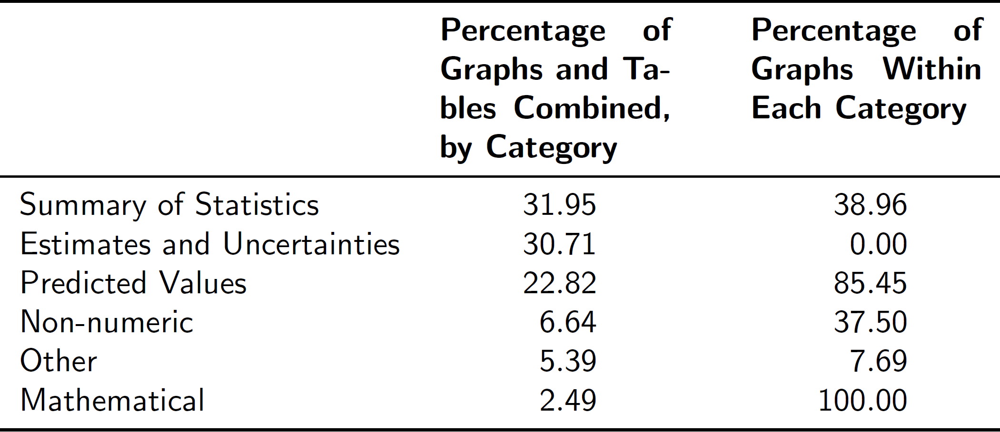]

--

.magenta[如何可视化上表？]

???
 mathematical: formal modeling

---

background-image: url("images/tableGraph.png")
background-position: center
background-size: contain

---

## 图 vs. 表

.left-column[

### 表

* 容易制作
* 发表常见
* “有助于后续研究”
]

--

.right-column[

### 图

* 制作费事
* 信息不“精确”
* 形式不统一

]

---

class: inverse, bottom

# 可视化鉴赏家
## 培养教程

---

哪个性别及收入水平人群的三酸甘油脂水平趋势与其他均不同？

.center[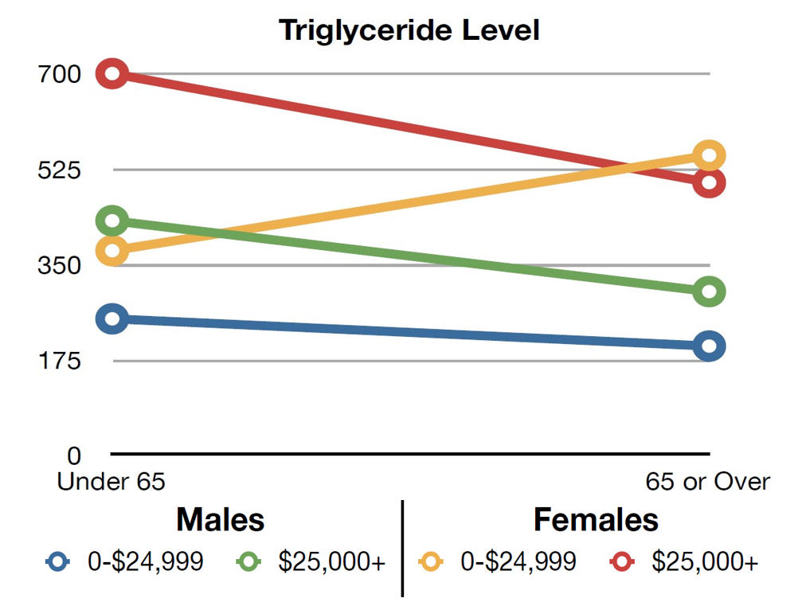]

???

身体脂肪量

---

印象更深

便于比较、突出重点

信息传递高效

比表格占据更小版面


---

## 从头开始

.left-column[


]

.right-column[

| 政党 	| 得票率 	|
|------	|--------	|
| A    	| 38     	|
| B    	| 34     	|
| C    	| 24     	|
| D    	| 4      	|

]

---

## 饼状图？

.left-column[

| 政党 	| 得票率 	|
|------	|--------	|
| A    	| 38     	|
| B    	| 34     	|
| C    	| 24     	|
| D    	| 4      	|

]

.right-column[

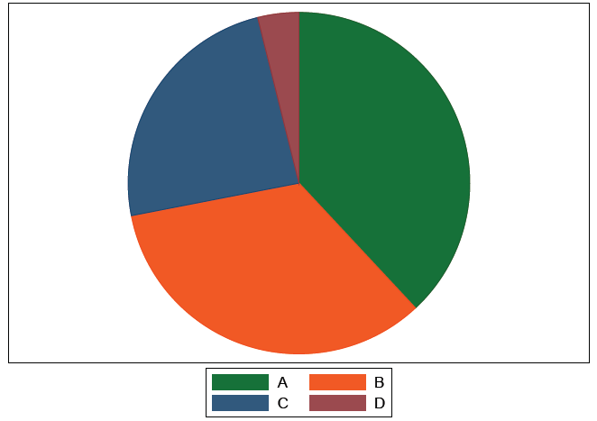

]

---

## 饼状图？

.left-column[

| 政党 	| 得票率 	|
|------	|--------	|
| A    	| 38     	|
| B    	| 34     	|
| C    	| 24     	|
| D    	| 4      	|

]

.right-column[

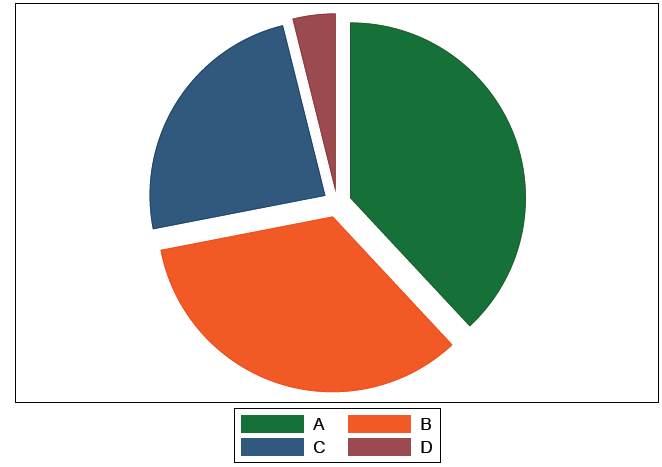

]

---

## 饼状图？

.left-column[

| 政党 	| 得票率 	|
|------	|--------	|
| A    	| 38     	|
| B    	| 34     	|
| C    	| 24     	|
| D    	| 4      	|

]

.right-column[

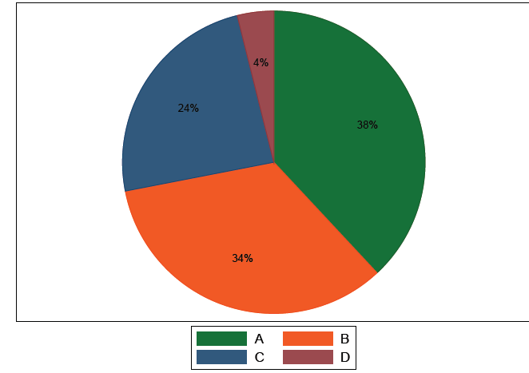

]

---

## 饼状图？

.left-column[

| 政党 	| 得票率 	|
|------	|--------	|
| A    	| 38     	|
| B    	| 34     	|
| C    	| 24     	|
| D    	| 4      	|

]

.right-column[


]

---

## 饼状图？

.left-column[

| 政党 	| 得票率 	|
|------	|--------	|
| A    	| 38     	|
| B    	| 34     	|
| C    	| 24     	|
| D    	| 4      	|

]

.right-column[


]

---

## 饼状图？

.left-column[

| 政党 	| 得票率 	|
|------	|--------	|
| A    	| 38     	|
| B    	| 34     	|
| C    	| 24     	|
| D    	| 4      	|

]

.right-column[

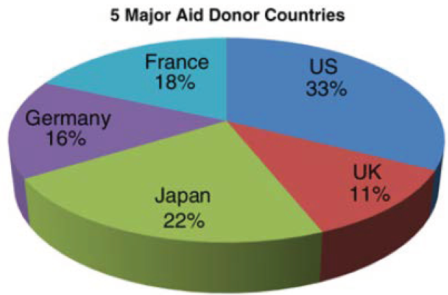

]

---

## Why Is Pie Chart a Big No-No?

* 用于呈现百分比（一维）
* 容易误导读者（见后）
* 浪费油墨（Why do we care?）

被誉为垃圾图形（[junk chart](http://junkcharts.com)）首选

---

## 另一个例子

墨西哥各政党在大选中得票比例趋势

| Party 	| PRI  	| PAN  	| PRD  	| Others 	|
|-------	|------	|------	|------	|--------	|
| 1991  	| 64   	| 17.8 	| 8.2  	| 10     	|
| 1994  	| 60   	| 23.8 	| 14.2 	| 2      	|
| 1997  	| 47.8 	| 24.2 	| 25   	| 3      	|
| 2000  	| 42.2 	| 41.2 	| 10   	| 6.6    	|
| 2003  	| 44.8 	| 30.2 	| 19.4 	| 5.6    	|

怎么可视化这个数据？

---

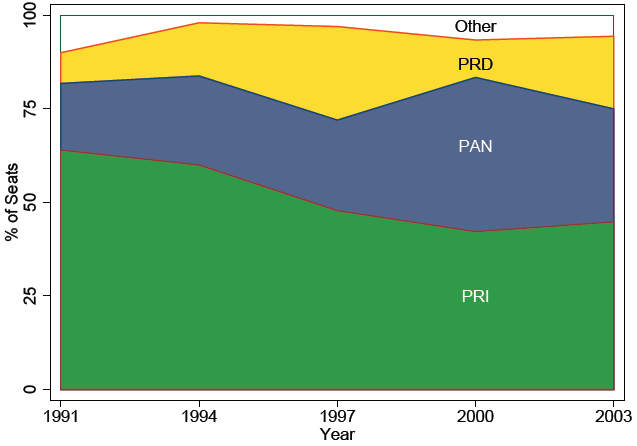


---

## No?

.center[]

1. 比折线图费更多墨。

--

1. 各个时间序列间的比较容易误导读者，而且焦点容易被面积所模糊。


???

1. 应将变化较不明显的序列至于最底端。


---

## 高效可视化

.left-column[

| 政党 	| 得票率 	|
|------	|--------	|
| A    	| 38     	|
| B    	| 34     	|
| C    	| 24     	|
| D    	| 4      	|

]

.right-column[


]

---

## 高效可视化？

.left-column[

| 政党 	| 得票率 	|
|------	|--------	|
| A    	| 38     	|
| B    	| 34     	|
| C    	| 24     	|
| D    	| 4      	|

]

.right-column[


]

---

## 高效可视化

.left-column[

```{r nightinggale}
mydata <- data.frame( Day=c("Monday","Tuesday","Wednesday","Thursday","Friday","Saturday","Sunday"),
                      Browse=c(50, 60, 70, 20,90,110,30))
kable(mydata, format = "html")
```
]

.right-column[

```{r fig.width=6}
myAngle <-seq(-20,-340,length.out =7)

ggplot(mydata) +
  geom_bar(aes(x=Day, y=Browse),width = 1,stat="identity",
           colour = "black",fill="#F8766D") +
  geom_text(aes(x=Day,y = Browse-8,label = Browse),color="white") +
  coord_polar(theta = "x",start=0) +
  ylim(c(0,120))+
  xlab("") + ylab("")+
  theme_light()+
  theme( panel.background = element_blank(),
         panel.grid.major = element_line(colour = "grey80",size=.25),
         axis.text.y = element_text(size = 12,colour="black"),
         axis.line.y = element_line(size=0.25),
         axis.text.x=element_text(size = 13,colour="black",angle = myAngle))
```

]

???

Nightingale Rose diagram, created by the famous Florence Nightingale

Good for time series,save space than bars

---

## 高效可视化

.left-column[

| 政党 	| 得票率 	|
|------	|--------	|
| A    	| 38     	|
| B    	| 34     	|
| C    	| 24     	|
| D    	| 4      	|

]

.right-column[


]

---

## 一维图升维

.center[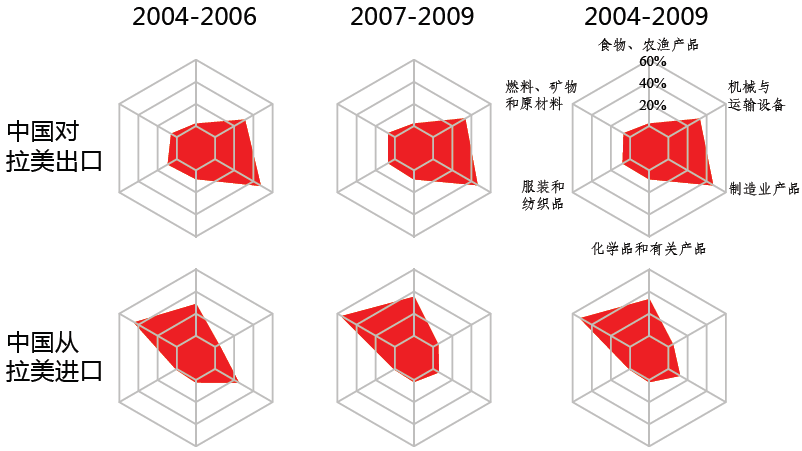]

---

## 二维数据可视化


| Party 	| PRI  	| PAN  	| PRD  	| Others 	|
|-------	|------	|------	|------	|--------	|
| 1991  	| 64   	| 17.8 	| 8.2  	| 10     	|
| 1994  	| 60   	| 23.8 	| 14.2 	| 2      	|
| 1997  	| 47.8 	| 24.2 	| 25   	| 3      	|
| 2000  	| 42.2 	| 41.2 	| 10   	| 6.6    	|
| 2003  	| 44.8 	| 30.2 	| 19.4 	| 5.6    	|

---

.center[]

---

.center[]

---

## 极简主义

.center[]

---

## 极简主义

.center[]

---

## 极简升维

.center[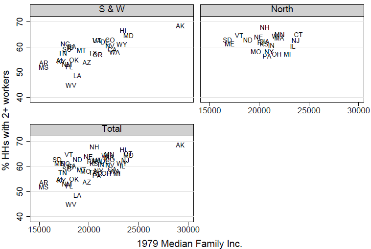]

---

## 单图多维信息

| 学生 	| 原始成绩 	| 补习班周数 	| 进步分数 	|
|------	|----------	|------------	|----------	|
| A    	| 712      	| 18         	| 100      	|
| B    	| 1105     	| 4          	| 57       	|
| C    	| 690      	| 7          	| 80       	|
| D    	| 687      	| 27         	| 191      	|
| E    	| 725      	| 2          	| 5        	|
| F    	| 1200     	| 25         	| 10       	|
| G    	| 470      	| 19         	| 25       	|
| H    	| 752      	| 10         	| 123      	|


---

## Bubble Chart

.center[]

--

有什么问题？

---

## Better Bubble Chart

.center[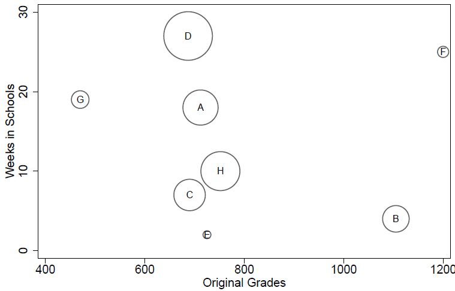]

---

## Bubble Chart 优劣

### Pro

* 散点图变异
* 通过气泡大小呈现第三维度数据

--

### Con

* 气泡大小当接近时可能造成便是困难，信息无法完全精确地传达

---

class: inverse, bottom

# 可视化设计家
## 培养教程

---

## 回归本质：可视化是什么？

.center[]

---

## 可视化的作用

* 记录信息
* 分析推理
* 证实假设
* 交流思想

---

## “工笔”、“写意”之分：统计可视化

.center[]

---

background-image: url("images/sexism_image.jpg")
background-position: center
background-size: contain

## “工笔”、“写意”之分：传播可视化

---

## Attractive vs. Professional

.left-column[]
.right-column[]

---

## 可视化编码

.center[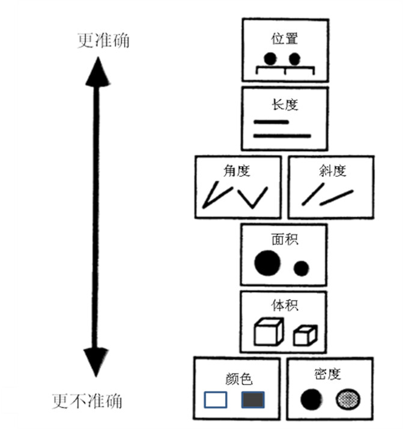]

---

## 编码类型


* 数值（continuous）
    + 10厘米，17厘米，23厘米
* 定序（ordinal）
    + 小，中，大
    + 周日，周一，周二……
* 定类（nominal）
    + 苹果，桔子，香蕉……

---

## 编码要素

标记：点、线、面


--

通道：位置、大小、形状、方向、色调、饱和度、亮度……

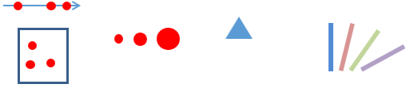

---

## 通道

.left-column[

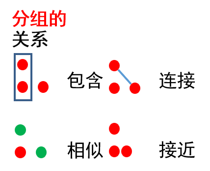
]

.right-column[

]

---

class: small

## 通道选择

* 类型（type）
    + 是什么/在哪里（what/where）
    + 何种程度（how much）
    
--
    
* 有效性（effectiveness）
    + 通道表现力符合属性的重要性
    
--

* 表现力（expressiveness）
    + 表达且仅表达数据的完整属性
    + 判断标准（ADSP）：精确性、可辨性、可分离性、视觉突出

???

Accuracy, Discriminibility, Separability, Pop-out

---

### 精确性（Accuracy）

.center[]

???

刺激增加：

* 关注度敏感度降：点亮度、声音响度
* 关注度敏感度不变：线长度
* 关注度敏感度加：痛感

psychophysicist Stanley Smith Stevens (1957, 1961)

$\displaystyle \psi (I)=kI^{a}$, k proportionality constant that depends on the units used

---

.left-column[


网格处于背景,会不凸显

]

.right-column[


网格处于前景,遮挡地图

]

---

### 可辨性（Discriminability） 

.center[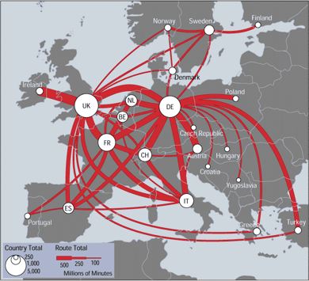]

???

通过粗细动态表现范围

---

background-image: url("images/contract.png")
background-position: center
background-size: contain


---

### 可分离性（Separability）

.center[]

---

### 视觉突出（Pop-out）

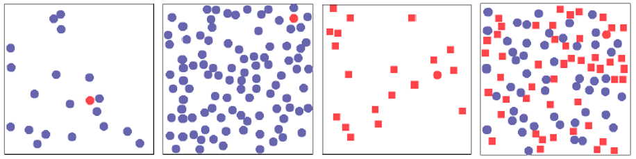

--
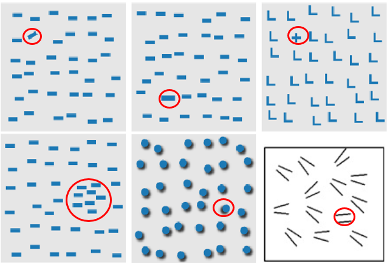

---

## 焦点引导

.center[]

---

background-image: url("images/popOut3.png")
background-position: center
background-size: contain

---

background-image: url("images/Os.png")
background-position: center
background-size: contain

---

background-image: url("images/Os2.png")
background-position: center
background-size: contain

---

background-image: url("images/Os3.png")
background-position: center
background-size: contain


---

## “看家功夫”：分组与分层

* 分组会对大部分任务有效
* 如果不能进行分组，则需要转换任务目标以支持分组
* 避免过多类别
* 对数据的每个维度指定一种或一个阶层的颜色

---

background-image: url("images/network_democracy.png")
background-position: center
background-size: contain

---

## 色彩信息

* 灰度值可被认为是有序的 


* 可用于编码数值型数据


* 色调通常认为是无序的，可用于编码不同维度的值


---

## 色彩意义：一种主观感受

.center[]

---

## 色彩设计基本原则

* 使用有限的色调范围
    + 控制低饱和度色彩中的色彩视觉突出
    + 避免过多颜色交错导致的杂乱无章

--

.left-column[]

--

.right-column[]

---

* 使用中性背景色
    + 控制对全局色彩的影响
    + 最小化“同时对比” （simultaneous contrast）

--

.left-column[]

.right-column[]


???

如果纯色为绿色，则灰色色块看起来带有红味,产生颜色偏差

---

## 对于新手而言

辅助软件来选择合适的色阶：

http://colorbrewer2.org/ 

http://paletton.com/


---

class: inverse, bottom

# 理论应用
## 以`ggplot`为例

---

class: small

## `RColorBrewer` Package

### 主要code

`colorRampPalette(brewer.pal(<num.>, <name of pallette>))(n)`

### Alternative

`ggsci`: 包含Nature、Science等期刊配色（Check "Tron Legacy"）

`wesanderson`

`ggthemes`

`ggtech`

---

## Name of Palette

.left-column[]

.right-column[

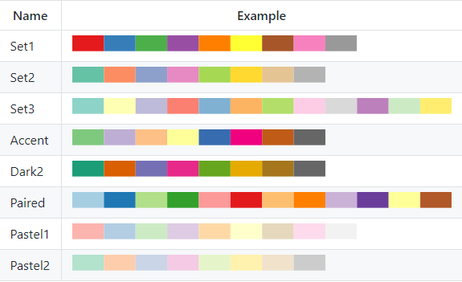
]

---

## 一维图

```{r data-1D, include=FALSE}
mydata <-
  data.frame(
    Cut = c("Fair", "Good", "Very Good", "Premium", "Ideal"),
    Price = c(4300, 3800, 3950, 4700, 3500)
  )
mydata2 <- arrange(mydata, desc(Price))
mydata$Cut <- factor(mydata$Cut, levels = mydata2$Cut)


mydata2 <-
  read.csv(
    "data/MultiColumn_Data.csv",
    sep = ",",
    na.strings = "NA",
    stringsAsFactors = FALSE
  ) %>% 
  pivot_longer(-Catergory, names_to = "variable")

```

```{r plot-1D, echo=TRUE, eval=FALSE}
ggplot(data = mydata, aes(Cut, Price)) +
  `geom_bar`(
    stat = "identity",
    width = 0.8,
    colour = "black",
    size = 0.25,
    fill = "#2ca25f",
    alpha = 1
  )

ggplot(data = mydata2, aes(Catergory, value, 
                           `fill = variable`)) +
  geom_bar(
    stat = "identity",
    color = "black",
    position = position_dodge(),
    width = 0.7,
    size = 0.25
  ) +
  scale_fill_manual(values = c("#ef8a62", "#67a9cf")) +
  ylim(0, 10) +
  theme(
    axis.title = element_text(size = 15, face = "plain", color = "black"),
    axis.text = element_text(size = 12, face = "plain", color = "black"),
    legend.title = element_text(size = 14, face = "plain", color = "black"),
    legend.background  = element_blank(),
    legend.position = c(0.88, 0.88)
  )
```

---

.left-column[
```{r plot-1DI, fig.width=5}
ggplot(data=mydata,aes(Cut,Price))+ 
  geom_bar(stat = "identity", width = 0.8,
           colour="black",size=0.25,fill="#2ca25f",alpha=1)
```
]

.right-column[
```{r plot-1DII, fig.width=5}
ggplot(data=mydata2,aes(Catergory,value,fill=variable))+
  geom_bar(stat="identity", color="black", position=position_dodge(),width=0.7,size=0.25)+
  scale_fill_manual(values= c("#ef8a62", "#67a9cf"))+
  ylim(0, 10)+
  theme(
    axis.title=element_text(size=15,face="plain",color="black"),
    axis.text = element_text(size=12,face="plain",color="black"),
    legend.title=element_text(size=14,face="plain",color="black"),
    legend.background  =element_blank(),
    legend.position = c(0.88,0.88)
  )
```
]

---

```{r data-radar, include=FALSE}
coord_radar <- function (theta = "x",
                         start = 0,
                         direction = 1)
{
  theta <- match.arg(theta, c("x", "y"))
  r <- if (theta == "x")
    "y"
  else
    "x"
  ggproto(
    "CoordRadar",
    CoordPolar,
    theta = theta,
    r = r,
    start = start,
    direction = sign(direction),
    is_linear = function(coord)
      TRUE
  )
}


label_data<-data.frame(car=c("Math" , "English" , "Biology" , "Music" , "R-Coding" ),
                    id=c(1:5) ,
                    value=c(12 , 2 ,14 ,20, 18))

AddRow<-c(NA,nrow(label_data)+1,label_data[1,ncol(label_data)])
mydata<-rbind(label_data,AddRow)

myAngle<- 360- 360 * (label_data$id-1) /nrow(label_data)  
```

.left-column[
```{r data-radar-show}
kable(mydata, format = "html")
```
]

.right-column[
```{r plot-radar-code, fig.width=5}
ggplot() + 
  geom_polygon(data=mydata,aes(x=id, y=value),color = "black", fill=brewer.pal(7,"Set1")[1],alpha=0.1)+
  geom_point(data=mydata,aes(x=id, y=value),size=5,shape=21,color = 'black', fill=brewer.pal(7,"Set1")[1])+
  coord_radar() + #实现为图3-8-1(c) 的圆形雷达图
  #coord_radar()+  #
  scale_x_continuous(breaks =label_data$id,labels=label_data$car)+
  ylim(0,22)+
  theme_light()+
  theme(axis.text.x=element_text(size = 11,colour="black",angle = myAngle))
```
]

---

```{r plot-radar, echo=TRUE, eval=FALSE}
ggplot() + 
  geom_polygon(data=mydata,aes(x=id, y=value),color = "black", fill=brewer.pal(7,"Set1")[1],alpha=0.1)+
  geom_point(data=mydata,aes(x=id, y=value),size=5,shape=21,color = 'black', fill=brewer.pal(7,"Set1")[1])+
  `coord_radar`() +
  scale_x_continuous(breaks =label_data$id,labels=label_data$car)+
  ylim(0,22)+
  theme_light()+
  theme(axis.text.x=element_text(size = 11,colour="black",angle = myAngle))
```

---

class: small

## 二维图

```{r data-2D, include = FALSE}
mydata<-read.csv("data/Scatter_Data.csv",stringsAsFactors=FALSE) 
```

.left-column[
```{r plot-2D-code, eval=FALSE, echo=TRUE}
ggplot(data = mydata, aes(x, y)) +
  `geom_point`(
    fill = "black",
    colour = "black",
    size = 3,
    shape = 21
  ) +
  `geom_smooth`(
    method = 'loess',
    span = 0.4,
    se = TRUE,
    colour = "#00A5FF",
    fill = "#00A5FF",
    alpha = 0.2
  ) + 
  scale_y_continuous(breaks = seq(0, 125, 25)) +
  theme(
    text = element_text(size = 15, color = "black"),
    plot.title = element_text(
      size = 15,
      family = "myfont",
      hjust = .5,
      color = "black"
    ),
    legend.position = "none"
  )
```

]

.right-column[
```{r plot-2D, fig.width=5}
ggplot(data = mydata, aes(x,y)) +
  geom_point(fill="black",colour="black",size=3,shape=21) +
  #geom_smooth(method="lm",se=TRUE,formula=y ~ splines::bs(x, 5),colour="red")+ #(h)
  #geom_smooth(method = 'gam',formula=y ~s(x))+   #(g)
  geom_smooth(method = 'loess',span=0.4,se=TRUE,colour="#00A5FF",fill="#00A5FF",alpha=0.2)+ #(f)
  scale_y_continuous(breaks = seq(0, 125, 25))+
  theme(
    text=element_text(size=15,color="black"),
    plot.title=element_text(size=15,family="myfont",hjust=.5,color="black"),
    legend.position="none"
  )
```
]

---

class: small

## 统计图

.left-column[
```{r ols-table}
m1 <- lm(mpg ~ wt + cyl + disp, data = mtcars)
msummary(m1, stars = TRUE)
```
]

.right-column[
```{r ols-dw, echo=TRUE, fig.width=5}
library(dotwhisker)
dwplot(m1)
```
]

---

class: small

## 网络图 (Complete Network)

```{r network, eval=FALSE, echo=TRUE}
library(network) # for data
data(emon)
`library(ggnetwork)`

ggplot(emon[[1]], aes(
  x = x,
  y = y,
  xend = xend,
  yend = yend
)) +
  `geom_edges`(arrow = arrow(length = unit(6, "pt"), type = "closed")) +
  `geom_nodes`(color = "tomato", size = 4)
```

---

```{r network-plot, fig.width = 10, fig.height= 8, fig.align="center"}
library(network) # for data
data(emon)
library(ggnetwork)

ggplot(emon[[1]], aes(x = x, y = y, xend = xend, yend = yend)) +
  geom_edges(arrow = arrow(length = unit(6, "pt"), type = "closed")) +
  geom_nodes(color = "tomato", size = 4)
```

---

## 网络图 (Sankey/Alluvial)

```{r sankey, eval=FALSE, echo=TRUE}
`library(ggalluvial)`
data(vaccinations)
levels(vaccinations$response) <- rev(levels(vaccinations$response))

ggplot(vaccinations,
       aes(x = survey, stratum = response, alluvium = subject,
           y = freq,
           fill = response, label = response)) +
  scale_x_discrete(expand = c(.1, .1)) +
  `geom_flow()` +
  `geom_stratum(alpha = .5)` +
  geom_text(stat = "stratum", size = 3) +
  theme(legend.position = "none") +
  ggtitle("vaccination survey responses at three points in time")
```

---

```{r sankey-plot, fig.width = 10, fig.height= 8, fig.align="center"}
library(ggalluvial)
data(vaccinations)
levels(vaccinations$response) <- rev(levels(vaccinations$response))
ggplot(vaccinations,
       aes(x = survey, stratum = response, alluvium = subject,
           y = freq,
           fill = response, label = response)) +
  scale_x_discrete(expand = c(.1, .1)) +
  geom_flow() +
  geom_stratum(alpha = .5) +
  geom_text(stat = "stratum", size = 3) +
  theme(legend.position = "none") +
  ggtitle("vaccination survey responses at three points in time")
```

---

## 地图

你需要三个ArcGIS文件：

`bou2_4p.shp`: 多边形要素图形文件

`bou2_4p.dbf`: 要素属性信息

`bou2_4p.shx`: 多边形要素索引文件


---

```{r map, results=FALSE, echo = TRUE, fig.height=6, fig.align="center"}
china_map1 <- rgdal::readOGR("data/bou2_4p.shp")

ggplot(china_map1, aes(x = long, y = lat, group = group)) +
	geom_polygon(fill = 'beige') + 
  geom_path(color = "grey40")
```


---

background-image: url("images/patrioBase9709.gif")
background-position: center
background-size: contain

## gganimate

---

name: takeHome

## Take-Home Points

* 好的图形必须进行.magenta[比较]分析。
* 图形不仅可以呈现原始数据，也可以呈现.magenta[推论]结果。
* .magenta[善用]数据可视化，方能成为沟通研究者与读者的工具。

---

background-image: url("images/powerWisely.jpg")
background-position: center
background-size: contain

---

class: inverse, center, middle

# Thank you!

<i class="fa fa-envelope fa-lg"></i>&nbsp; [yuehu@tsinghua.edu.cn](mailto:yuehu@tsinghua.edu.cn)

<i class="fa fa-globe fa-lg"></i>&nbsp; https://sammo3182.github.io/

<i class="fab fa-github fa-lg"></i>&nbsp; [sammo3182](https://github.com/sammo3182)

```{r pdfPrinting, eval = FALSE, include = FALSE}
pagedown::chrome_print(list.files(pattern = "10_dataVisualization.html"), timeout = 300)
```