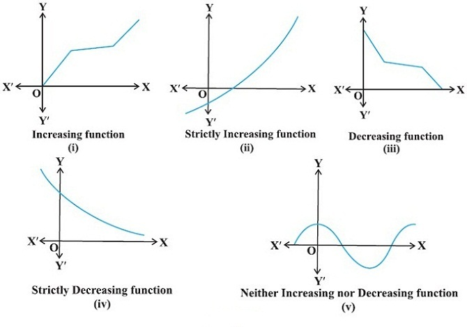
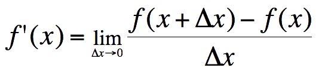
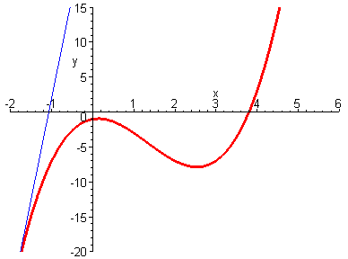
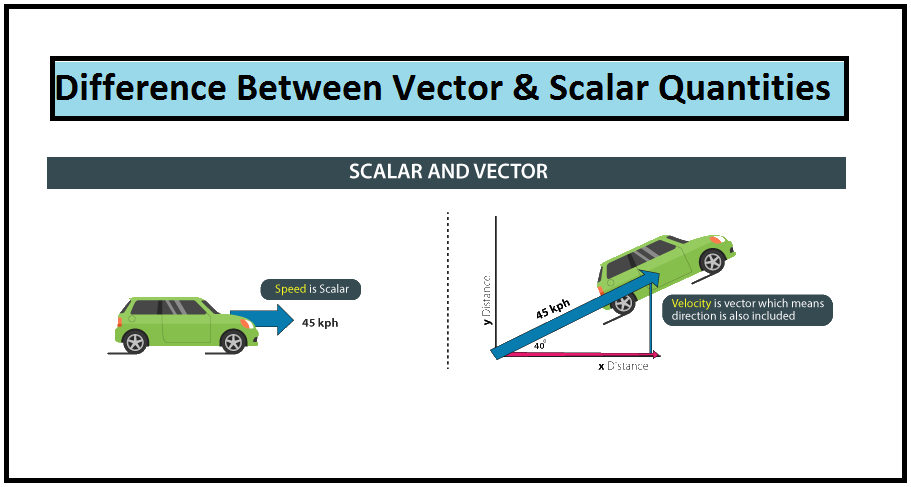
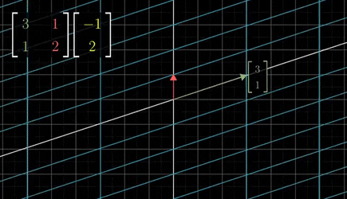
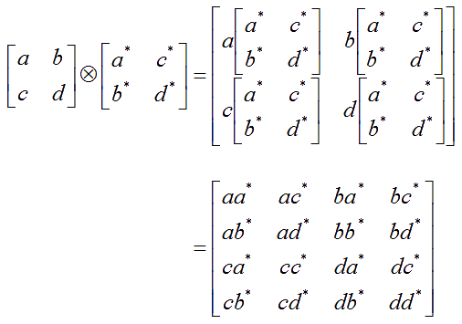
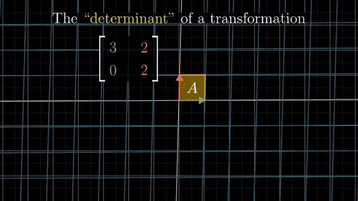

```{r setup, include = FALSE}
knitr::opts_chunk$set(echo = FALSE, message = FALSE, warning = FALSE, htmltools.dir.version = FALSE)

library(pacman)
p_load(icons, xaringanExtra)

use_xaringan_extra(c("tile_view", # O
                                    "broadcast", 
                                    "panelset",
                                    "tachyons"))
use_extra_styles(
  hover_code_line = TRUE,         #<<
  mute_unhighlighted_code = FALSE  #<<
)

use_fit_screen()


# Functions preload
set.seed(313)
```

## Overview

1. Mindset of learning math
1. Calculus
1. Linear Algebra

---

class: bottom, inverse

# Mindset

---

class: center, middle

<video width="1000" height="600" controls>
    <source src="images/math_anciousMath.mp4" type="video/mp4">
</video>

---

class: bottom, inverse

# Calculus

---

## High-School Math

### Function in Math

.bg-black.golden.ba.shadow-5.ph4.mt3[
A relation that .red[assigns] one element of the range to each element of the domain.

.tr[
---Moore & Siegel 2013, p.45.
]
]

+ $Y = f(X).$
+ X: domain
+ Y: codomain

---

## Function in Life 👻

.pull-left[
Domain: 
]

.pull-right[
Codomain: 
]

???

Optimus prime

--

.center[Function: ]

---

## Math Jargon

* **Implicit ~**: y = f(X).
    + y: A function of x.
    + x: Argument.
    + f: Mapping
        + *We map the values of Y for any given set of X values.*
        + *f maps x into y.*

--

.pull-left[
* **Explicit ~**: y = 1 - x<sup>2</sup>.
* **Function Composition**: g(f(x)), "g composed with f."
]

--

.pull-right[]

---

Functions with two arguments

.center[]

---

.pull-left[
* **Identity ~**: f(x) = x.
* **Inverse ~**: 

\begin{align}
f(x) =& 2x + 3;\\
f^{-1}(x) =& \frac{x - 3}{2}.
\end{align}

Properties:

.center[
f(f<sup>-1</sup>(x)) = x.   
f<sup>-1</sup>(f(x)) = x.
]
]

--

.pull-right[
**Monotonic Functions**

* Increasing vs. Decreasing
* Strictly increasing/decreasing
* Weakly increasing/decreasing



]

???

* Strictly increasing/decreasing
    + "A strictly monotonic function is strictly increasing over its entire domain (Moore & Siegel 2013, 50)." 
    + A function is monotonic if its first derivative does not change sign.
* Weakly increasing/decreasing
    + Not decreasing
    + Not increasing


---

## Linear function

.center[y = f(x) = ax + bx<sup>0</sup>.

a: slope; b: intercept.
]
--

### Properties:

Additivity (superposition): f(x<sub>1</sub> + x<sub>2</sub>) = f(x<sub>1</sub>) + f(x<sub>2</sub>).

Scaling (homogeneity): f(ax) = af(x).

???

There are three nonlinear models as shown following

---

## Nonlinear function: Exponents

.center[b<sup>n</sup> = x.]

x is called the base.    

+ *Quadratic* (parabola): y = &beta;<sub>0</sub> + &beta;<sub>1</sub>x + &beta;<sub>2</sub>x<sup>0</sup>;
+ *Polynomial*: $y = \sum_0^n \beta_n x^n$.

--

### Property: 

.pull-left[
+ Multiplication: 
    + x<sup>m</sup> * x<sup>n</sup> = x<sup>m + n</sup>;
    + x<sup>m</sup> * z<sup>m</sup> = (xz)<sup>m</sup>;
    + (x<sup>m</sup>)<sup>n</sup> = x<sup>mn</sup>.
    + x<sup>0</sup> = 1.
 ]
 
.pull-right[
* Division
    + $\frac{x^m}{x^n} = x^{m - n};$ 
    + $\frac{x^m}{z^m} = (\frac{x}{z})^m.$
    
.footnote[\* m and n are constant]
]

---

## Nonlinear function: Radicals

.center[b<sup>n</sup> = x.]

* Radical function is to solve for b.
    + e.g., $y = \sqrt[n]{x} = x^{\frac{1}{n}}.$
* Properties
    + Multiplication: $\sqrt[n]{x}\times \sqrt[n]{z} = x^{\frac{1}{n}}\times z^{\frac{1}{n}} = (xz)^{\frac{1}{n}}.$
    + Division: $\frac{\sqrt[n]{x}}{\sqrt[n]{z}} = (\frac{x}{z})^{\frac{1}{n}}.$

---

## Nonlinear function: Logarithms

.center[b<sup>n</sup> = x.]

* Logarithm function is to solve for n.
    + The inverse of exponential functions, such as $y = e^x; y = 10^x$.
    + e.g., $y = ln(x); y = log(x).$
    
--

### Properties
+ $ln(1) = 0; log_a(a) = 1$
+ $ln(x_1\cdot x_2) = ln(x_1) + ln(x_2);$
+ $ln(\frac{x_1}{x_2}) = ln(x_1) - ln(x_2);$
    + $ln(x_1\pm x_2)\neq ln(x_1)\pm ln(x_2).$
+ $ln(x^b) = bln(x).$

---

## Differential/Derivative

.center[]

--

Geometrically,

.center[]

---
    
### Rules

.pull-left[
* $(C)' = 0$.
* $(x^{\mu})' = \mu x^{\mu - 1}$.
* $(a^x)' = a^xln\ a$.
* $(log_ax)' = \frac{1}{xln\ a}$.
* Let u, v are derivable, 
    + $(u\pm v)' = u' \pm v'$.
    + $(Cu)' = Cu, C\ is\ constant.$
    + $(uv)' = u'v + uv'$.
    + $(\frac{u}{v})' = \frac{u'v - uv'}{v^2},\ where v\neq 0.$
] 

--

.pull-right[
* Chain rule: $g(f(x))' = g'(f(x))f'(x)$
    + To solve $g(f(x))'$, let $u = f(x)$.
    + $g(f(x))' = g(u)'u' = g(u)'f(x)'$
]

---

## Integral

.center[]

--

Mathematically,

If $\exists \int f(x)dx$, and F'(x) = f(x) for $\forall x\in[a, b]$

$\int^b_af(x)dx = F(x)|^b_a = F(b) - F(a)$

???

微求点，积求面

---

class: inverse, bottom

# Linear Algebra

---

## Why Should We Care? 

* Methodologically
    + Reading the method papers.
    + Spatial, game, dynamic, etc.
    + Learning R.

--

* As a lazy person,

.center[y = &beta;<sub>0</sub> + &beta;<sub>1</sub>X<sub>1</sub> + &beta;<sub>2</sub>X<sub>2</sub> + ... + &beta;<sub>n</sub>X<sub>n</sub> + &varepsilon;]

.center[v.s.]

.center[**Y** = **X&beta;**]

---

## Concept

### Scalar vs. Vector
  
.center[]

???

scalar is only about the speed; 

vector is speed and direction.

---

### Matrix

.center[]

---

## Vector Algorithm

### Length:

$$||\boldsymbol{x}|| = \sqrt{\sum x_i^2}.$$
 Example: If $\boldsymbol{x} = (2, 4, 4, 1)$, its length $||\boldsymbol{x}|| = \sqrt{2^2 + 4^2 + 4^2 + 1^2} = \sqrt{37}$. 

--

Vector .red[normalization]: $\frac{\boldsymbol{x}}{||\boldsymbol{x}||}.$
    
---

### Addition

$\boldsymbol{a} \pm \boldsymbol{b} = (a_1 \pm b_1, a_2 \pm b_2, ..., a_n \pm b_n).$

.pull-left[]

--

.pull-right[Example: $(1,2) + (5,8) = (1 + 5, 2 + 8) = (6, 10).$]

---

### Multiplication

* Scalar ~: $c\boldsymbol{x} = (cx_1, cx_2,..., cx_n).$

.center[]

--
* Vector ~ (Dot product): $\boldsymbol{a\cdot b} = \sum a_ib_i = |\boldsymbol{a}||\boldsymbol{b}|cos\theta.$

---

## Matrix in Types

.pull-left[
*Square matrix*

$$A_{2\times2} = \left(\begin{array}{cc} 
                  1 & 2\\
                  3 & 4
                  \end{array}\right)$$
]

--

.pull-right[
*Zero matrix*

$$\left(\begin{array}{ccc} 
                  0 & 0 & 0\\
                  0 & 0 & 0
                  \end{array}\right)$$
]

--

.pull-left[
*Diagonal matrix *

$$\left(\begin{array}{ccc} 
          1 & 0 & 0\\
          0 & 2 & 0\\
          0 & 0 & 3
          \end{array}\right)$$
]

--

.pull-right[
*Identity matrix*

$$I = \left(\begin{array}{cc} 
                      1 & 0 & 0\\
                      0 & 1 & 0\\
                      0 & 0 & 1
                      \end{array}\right)$$
]

---

.pull-left[
*Permutation matrix*

$$\left(\begin{array}{cc} 
                      0 & 1 & 0\\
                      1 & 0 & 0\\
                      0 & 0 & 1
                      \end{array}\right)$$
]

.pull-right[
*Upper/lower matrix*

$$\left(\begin{array}{cc} 
                      1 & 4 & 5\\
                      0 & 2 & 6\\
                      0 & 0 & 3
                      \end{array}\right)$$
]

---

## Matrix Transposition

Row to column, $A^t$.

.center[]


---

## Matrix Addition

$$A \pm B = a_{ij} \pm b_{ij}$$
Example

$$A = \left(\begin{array}{cc} 
                  1 & 2\\
                  3 & 4
                  \end{array}\right)$$

$$B = \left(\begin{array}{cc} 
                  5 & 6\\
                  7 & 8
                  \end{array}\right)$$

$$A + B = \left(\begin{array}{cc} 
                  6 & 8\\
                  10 & 12
                  \end{array}\right)$$

---

## Matrix Multiplication

Scalar Multiplication: 

.center[c**A** = ca<sub>ij</sub>.]

--

Matrix Multiplication

$$C_{n\times p} = A_{n\times m}B_{m\times p} = \sum_{k = i}^{m}a_{ik}b_{kj}.$$

--

NB : $AB \neq BA$!

---

.center[]

.center[]
  
---

.pull-left[
Hadamard (circle) Product: 

$\boldsymbol{A_{ij}\circ B_{ij}} = C_{ij}$


]

.pull-right[
Kronecker Product: 

$A_{m\times n}\otimes B_{p\times q} = C_{mp\times nq}.$

.center[]
]
---

## Inverse

* If $AB = BA = I$, then B is the inverse of A, i.e., $B = A^{-1}$. Therefore, 
$A\cdot A^{-1} = I.$

* Calculate the inverse
    + Cofactor Matrix: $A_{ij} = (-1)^{i + j}M_{ij}$, where $M$ is the minor of $a_{ij}$.
    + Adjoint matrix: the matrix of cofactor matrices.
    + $A^{-1} = \frac{1}{|A|}adj(A)$
    + Example: Moore & Siegel 2013, pp.295-6.

---

## Determinant

.center[
   
]
Convert the matrix into scalar; Matrices with non-zero determinant are **non-singular matrices**, which means invertible.

--

.pull-left[
* $2\times 2$ matrix (butterfly method)

    ]
    
.pull-right[
* Laplace expansion: using minors.

    ]

---

## Eigenvector

$$\mathbf{A} \mathbf{v} = \lambda \mathbf{v}$$

v: eigenvector; &lambda;: eigenvalue


---

## Norm

.center[]

--

Frobenius norm: 
$||A||_F = \sqrt{\displaystyle{\sum^m_{i = 1}\sum^n_{j = 1}|a_{ij}|^2}}$


???

The Frobenius norm, sometimes also called the Euclidean norm, is matrix norm of an m×n matrix A defined as the square root of the sum of the absolute squares of its elements. 

---

## Properties
* Matrix
    + Associative: $(AB)C = A(BC)$.
    + Additive distributive: $(A + B)C = AC + BC$.
    + Scalar commutative: $xAB = (xA)B = A(xB) = ABx$
* Transpose
    + Inverse: $(A^T)^T = A$.
    + Additive: $(A + B)^T = A^T + B^T$.
    + Multiplicative: $(AB)^T = B^TA^T$.
    + Scalar multiplication: $(cA)^T = cA^T$.
    + Inverse transpose: $(A^{-1})^T = (A^T)^{-1}$.

---

* Determinant
    + Transpose: $det(A) = det(A^T)$.
    + Identity: $det(I) = 1$.
    + Multiplicative: $det(AB) = det(A)det(B)$.
    + Inverse: $det(A^{-1}) = \frac{1}{det(A)}$.
    + Scalar multiplicative: $det(cA_{n\times n}) = c^ndet(A)$.
* Inverse
    + Inverse: $(A^{-1})^{-1} = A$.
    + Multiplicative: $(AB)^{-1} = B^{-1}A^{-1}$.
    + Scalar multi: $(cA)^{-1} = c^{-1}A^{-1}, \mbox{if}\ c\neq 0$.
    
---

## Solving System of Equations

.center[]

---

class: inverse, center, middle

.center[]

```{r pdfPrinting, eval = FALSE, include = FALSE}
pagedown::chrome_print(list.files(pattern = "mathcamp.html"), 
                       timeout = 500, 
                       box_model = "padding")
```

---

## A Reminder

We are largely .red[feeling] math here, if you want to understand it...

.pull-left[]
.pull-right[]

---

class: inverse, middle, center

