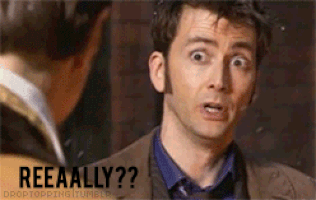
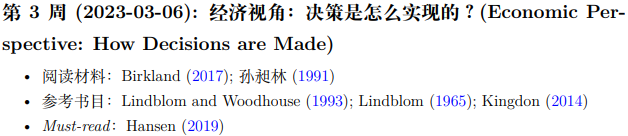
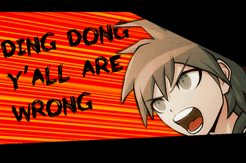
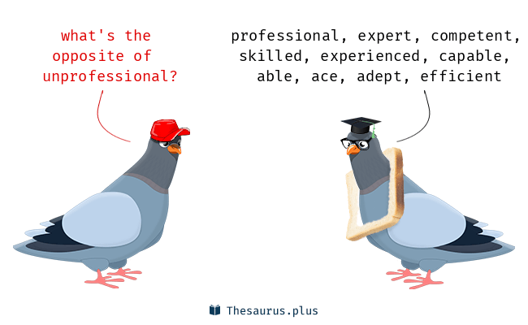
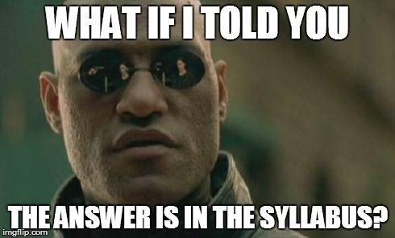

```{r setup, include = FALSE}
knitr::opts_chunk$set(echo = FALSE, message = FALSE, warning = FALSE)

if (!require(pacman)) install.packages("pacman")
library(pacman)

p_load(
  xaringanExtra
) 


use_xaringan_extra(c("tile_view", # O
                     "broadcast",
                     "panelset",
                     "tachyons",
                     "fit_screen"))
use_extra_styles(
  hover_code_line = TRUE,         #<<
  mute_unhighlighted_code = FALSE  #<<
)


# Functions preload
set.seed(313)
```

## Overview

- Mutual introduction
- Take this class? (.red[IMPORTANT])
- Goal of this course
- Commitment


No hardcore knowledge, but tips that may save your semester.

---

class: inverse, center, middle

# Who Are You

(and Why do you deserve to be remembered?)


---

## An Elevator Pitch

.center[]

.center[
30 s preparation    
30 s presentation
]

---

class: center, middle, inverse

# Ready? 
---

class: center, center

## Tips for Elevator Pitching

Smile 

Body language

Audience view

- Question
- Fact
- Story

--

## Two Goals for the Elevator Pitch


Key point of public policy analysis (.red[oft-ignored])

(One of) the .red[primary features] of this class

???

- Not only understanding but also explaining/illustrating/convincing

- Being practical both on researching but also thinking

- Key: audience position, What may impress me?


---

class: center, middle

## My Turn

Passionate Political .red[Scientist]

???

Political Psychologist and Methodologist; Comparativist and China Expert

--

Tropical .red[Instructor]

--

Diehard Fan of .red[R] Programming

--

King of .red[Anti-jokes] and Old Gags

--

I am .Large[DR. HU!]



???

David Tennant (2005--2010)

---

class: center, middle, huge

Your    
lovely 
.red[TA]

---

class: inverse, bottom

# Take (Or Not Take) This Class?

---

## So...?

--

.center[]

---

## A Typical PA Class

### GOAL

1. Policy .blue[whisperer]
1. .blue[Paradigm] of social science
1. .red[Academic] writing/presenting

---

## A .red["]Typical.red["] PA Class

* Little about policy process
* Little about statistics

--

* Primarily .red[perspectives and methods]
* .blue[Professional] training

---

class: small

## In a Conventional PA Class

* A lot of .red[concepts and procedures]
    + Structures/systems/branches/sections
    + Procedures/execution/communication
    + Outcomes
    + Evaluation/Issue    
    ......

--

* A lot of .red[models]
    + Smith Model
    + Mutual Adaptation Model
    + Communication Model of Intergovernmental Policy Implement   
    ......

--

* A lot of .red[specific] areas
    + Bureaucratic system
    + Social welfare
    + Environmental, distribution, tax, revenue    
    ......


---

## Why

> [A PA class is] a program that prepares individuals to .red[serve as managers] in the executive arm of local, state, and federal government and that focuses on the .red[systematic study] of executive organization and management.

> --- National Center for Education Statistics (NCES) of the US


???

Incorporate with organization theories, law management, bureaucrat, budget analyses, etc.

---

## In This Class...

.left-column[

* ~~Procedure~~
* ~~Evaluation~~
* ~~Policy Topics~~
]

--

.right-column[

* Perspectives
* Approaches
* Methods
]

???

Why? 

General education class; not every manager knows the above to be the manager

---


background-image: url("images/intro_design.png")
background-position: center
background-size: contain


---

## Partially, A Methodological Course

We'll talk about a variety of approaches and methods, BUT...

--

.red[No] math required

.red[No] programming required

.red[No] textbooks required.

.center[]

---

## What I Want You to Learn

A story first

--

Long long time ago, like in 1927,...

.center[]

???

William Howard Taft: The 27th president of the United States and the tenth chief justice of the United States

Robert Maynard Hutchins: Dean of Yale Law School (28 yr old), 后president of the U of Chicago

---

## Chief Justice vs. Chancellor of the School

1927, Yale

--

[Taft:] Well, I understand that at Yale you teach your students that judges are fools.

--

[Hutchins:] No, Mr. Chief Justice, at Yale we teach our students to .blue[find that out] for .red[themselves].

---

class: inverse, bottom

# Finding for Yourselves, But How?


---

## What Will You Commit

- 3+ Presentations (You've done one of them already~)
- 3 assignments

--

A.k.a., a lot of work than a regular GE class

???

The plus depends on how many left.

--

- Tasks 
    1. Reading
    1. Listening
    1. Expressing
    1. Writing

---

background-image: url("images/intro_shouldITake.png")
background-position: center
background-size: contain

## Take or Not Take

---

class: small

## Reading

.center[]

--

"Birkland (2007); 孙昶林(1991)"

> Required readings (~~word by word~~, just going through)

--

"参考文献: Lindblom and Woodhouse (1993); Lindblom (1965); Kingdon (2014)"

> References (a.k.a., no need to read immediately)

--

"Must-read: Hansen (2019)"

> AFTER the class (elaborated later)

--

Oh, btw, "retail English" all the time... .center[]

???

1. 

---

## Listening and Expressing

--

Attend and listen carefully!    
(Let me see your pretty face every time~~)

--

Certainly respond!

--

Please ask questions!

--

Well, also point out the typos~

.center[]

---

class: center, middle

## Expressing (Continued)

.huge[Challenging]

.Large[课堂宾主对]

---

background-image: url("images/intro_monkDebate.jpg")
background-position: center
background-size: contain

---

background-image: url("images/intro_greeceDebate.jpeg")
background-position: center
background-size: contain

---

background-image: url("images/intro_qipashuo.jpg")
background-position: center
background-size: contain

---

## Presenter vs. Challenger

.pull-left[
### Presenter

1. 10 min
1. Presenting
    + Content
    + Connection
    + Inspiring
]

--

.pull-right[
### Challenger

1. 10-20 min
1. Answering a question
1. Asking a question

]

---

## Writing

### Smart Learning
 
<video width="1000" height="500"  controls>
  <source src="https://link.jscdn.cn/1drv/aHR0cHM6Ly8xZHJ2Lm1zL3YvcyFBcnR0dk83MHdLSU8yWHplRUx2MmdMYll5QmdkP2U9RVlkcVU0.mp4" type="video/mp4">
</video>

---

class: middle

- Light note (or even zero note)
  - "Do I in what case look into the notes again?"

--

- Learning the logic

--

- Relating to your own area

--

- Open-minded (Please!)

--

- Being .red[humble] (Please, please!)

---

### Final project

A proposal of public policy analysis

--

A semester-long project

1. A topic with .red[approval] (Week 4)
1. An .blue[annotated] bibliography (Week 9)
1. A .blue[complete] proposal (Week 16)

--

.right[]

???

Take the chance to learn how to be convincing. 

---

## Extra Credits

.left-column[.center[]]

.right-column[
1. Voluntary presenter (2' max)
1. Tournament with the class project (3' max)
]

---

## Take-Home Points

- Mutual introduction
    - Political scientist instructing a public policy course
- Take this class? (.red[IMPORTANT])
- Goal of this course
- Commitment

.right[]

```{r pdfPrinting, eval = FALSE, include = FALSE}
pagedown::chrome_print(list.files(pattern = "01_.*.html"), timeout = 300)
```