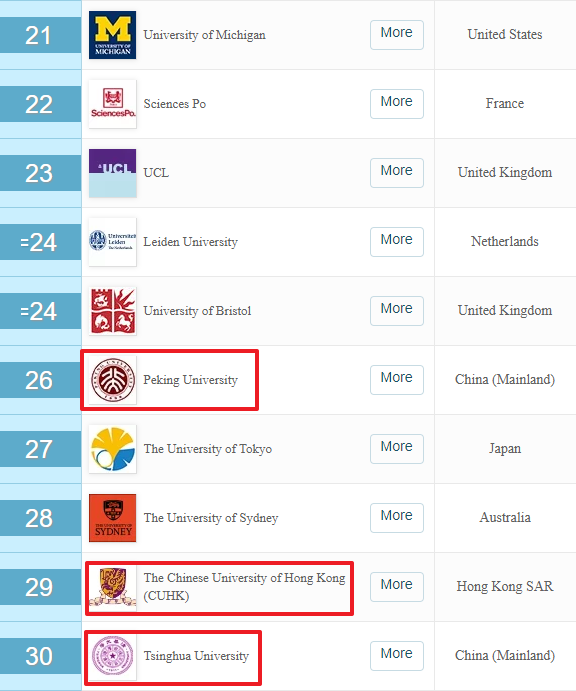
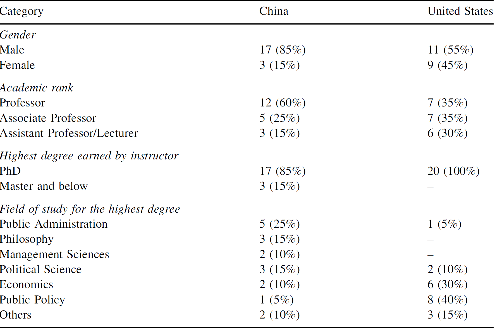
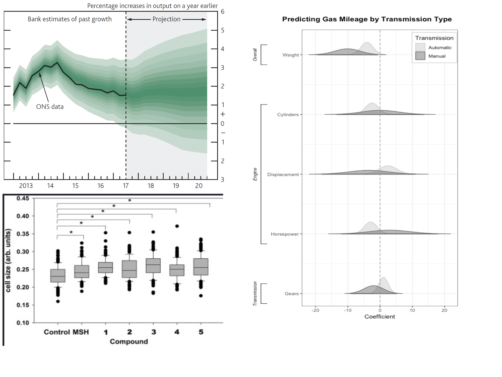

```{r setup, include=FALSE}
knitr::opts_chunk$set(echo = FALSE, message = FALSE, warning = FALSE)

htmltools::tagList(rmarkdown::html_dependency_font_awesome())

if (!require(pacman)) install.packages("pacman")
library(pacman)

p_load(
  flextable, gridExtra,
  knitr, # dependency
  descr, stringr, broom, dotwhisker, interplot, tidyverse
) # data wrangling # data wrangling

xaringanExtra::use_xaringan_extra(c("tile_view", # O
                                    "broadcast", 
                                    "panelset",
                                    "tachyons"))

# Functions preload
set.seed(313)
```

## Administrative

--

1. Thank you for keeping coming!

--

1. Syllabus updated.
    + Slides needed?

--

1. First assignment
    + Group assignment
    + Topic choice

---

## Overview

1. .blue[Landscape] of policy analysis
1. Understanding policies .red[scientifically]
    + Steps of scientific inquiries
    + Necessity to understand policies scientifically
    
---

class: inverse, bottom

# Previously in the *Understanding Policies*...

---

## A Taste of the Professional Area

Who are the (potentially) professionals?

+ Major: 
    + Public Policy/Administration
    + Social Policy/Administration
+ Degree: Ph.D., MPA

--

+ Over 200 institutions by 2014

---

## The Top Dogs

.left-column[]

--

.right-column[]

---

.center[]

???

Reference: "[QS World University Ranking](https://www.topuniversities.com/university-rankings/university-subject-rankings/2019/social-policy-administration#indicator-tab)"

Quacquarelli Symonds: a British company specializing in education
Previous known as "Times Higher Education-QS World University Rankings"

---

## What Makes Them the Best? 

.center[]

--

.center[*Spoiler alert: the .red[evaluation]*]

???

Goal of the policies

---

### Indicators

1. Academic reputation .small[(respondents from 83,000 academics)]
1. Employer reputation .small[(42,000 responses from graduate employers worldwide)]
1. Research citations per paper
1. H-index .small[(the most cited papers and the number of citations that they have received in other publications)]

--

&rArr; .red[Weighted] results

???

Weight: based on area, e.g. publication rates are very high, research citations and the h-index account for 25% of each university's total score.

.orange[NEXT]: Let's compare the U.S. and China, Talk about approach, content, and instructors

---

## Approach

| Approach         | China | U.S. |
|------------------|-------|------|
| Outsider<sup>1</sup>         | 55%   |      |
| Limited insider<sup>2</sup>  | 15%   | 75%  |
| In-depth insider<sup>3</sup> | 30%   | 25%  |

.right[.small[Source: He et al 2016, Table 4]]

.footnote[

[1] Solely of public policy .blue[theories].  
[2] Positivist .blue[framework] and .red[analysis] based on welfare economics.  
[3] Strong .red[analytic orientation]

]


---

## Content

### China

Public policy theories, policy environments, and policy processes

--

### U.S.

Welfare economics, rational modeling, utilities


---

background-image: url("images/sci_heetal2016tb3.png")
background-position: center
background-size: contain

???

The U.S, on Cost-benefit analysis and below, strategy of policy making

---

## Instructors

.center[]

???

Few Chinese instructors focus on applied policy research

**NEXT**: In this class, teaching positivist policy analysis based on *social scientific paradigm*. 

Is that even possible?


---

class: inverse, bottom

<video width="700" height="500" controls preload>
    <source src="images/sci_sheldon_socialScience.mp4" type="video/mp4">
</video>


# Being a .blue[Scientist] of the Human Society

???

Why do we need being scientific

---

## Paradigms to Understand Policies

> Paradigm: a bag of theories, research methods, postulates, and standards for what constitutes contributions to a field.

--

+ Positivist: 
    + *Data*-based
    + Problem solving through systematic queries

???

Dominant, 实证主义

Re-imported from the French word positivisme(/positee vish men/), derived from positif in its sense of 'imposed on the mind by experience'. 

--

+ Post-positivist
    + *Culture*-based (norms, morality, values)
    + Normative, ethical process


???

.greenLight[Q]: Does Positivist mean scientific? 

---

## A Story

On the Omniscience Internet, a doc of traditional medicine told a [story](http://szyyj.gd.gov.cn/zyyfw/ysbj/content/post_2541293.html) about drinking water. 

.center[《为什么外国人喝凉水没事》 之 

“每天早晨喝一杯凉水，是一个错误的养生做法”]

---

> 每天早晨喝一杯凉水，是一个错误的养生做法……[大历害老医师]是偶然发现这个问题的，当时他在给一位女士调理身体，本来调理得很好……突然有一天，再诊脉的时候，发现她的舌质又淡白了，舌体胖大，病情反复，忙问这是怎么回事儿？她回答，半个月前，看到电视里面有养生专家让晨起喝凉水，于是坚持了这些天，已经腹泻了很多次了。这么样，损失了阳气，导致水湿重。有位中医也被这一说法骗了……最后竟然收集了几百例的病例，都是晨起喝凉水，导致的各种复杂古怪的病症的。

???

.greenLight[Q]: How do you feel? Convincing?

---

class: small

## Let's Decompose It

*Problem* 

"给一位女士调理身体，本来调理得很好……突然有一天，再诊脉的时候，发现她的舌质又淡白了，舌体胖大，.red[病情反复]。"

--

*Theory*

".blue[损失了阳气]，导致水湿重。"

--

*Evidence*

"晨起喝凉水，于是坚持了这些天，已经.blue[腹泻]了很多次了。"

--

*Conclusion*

"每天早晨喝一杯凉水，是一个.red[错误]的养生做法"


---

## Why's this Story Convincing?

"Seeing is believing"

Half-way scientific inquiry: A human inquiry

<video width="700" height="400" controls preload>
    <source src="images/sci_Charle's_Angle_ScientistScene.mp4" type="video/mp4">
</video>


???

Charle's Angle, 2019, Columbia Pictures, Elizabeth Banks' film

Let's see another example: mushroom

---

.left-column[

### Eatable?


]

--

.right-column[

### Find your BFF and observe...


]

--

What's the Problem Then?

---

## An eclipse in 2017

.center[]

???
/ɪkl'ɪps/
--

Was the former POTUS idiot?

---

## Depending on Whether You Observe Enough

<video width="700" height="500" controls preload>
    <source src="images/sci_Trump Watches Eclipse From White House.mp4" type="video/mp4">
</video>


---

## Flaws of Human Inquiries

Selection observation  

--

Inaccurate observation  

--

Overgeneralization  

--

Illogical reasoning  

......


???


.orange[NEXT]: What should we do?

---

## Human &rarr; Scientific Inquiries

After the guessing/hypothesis...

--

.pull-left[

### Data Collection

.blue[Valid]
+ Representative

.blue[Sufficient]
+ Diverse

]

--

.pull-right[

### Analysis

.blue[Proper]

P &rarr; A &rarr; M & M

&rArr; implications/conclusions
]

???

Perspective, approach, method and measurement

Approach includes inductive and deductive, elaborated later

.orange[NEXT]: Why are these scientific? 

---

## Why Are These More Scientific?

--

.center[]

---

## Why Being Scientific?

Data (observations) alone are not enough~ 

1. Where to find data?
1. Are the data legit?
1. How to make sense of the data?

--

&rArr; Conducting .red[credible] analyses

Assumption + Theory   
&rarr; Method + Data    
&rarr; Conclusion

???

Another way to say: Perspective, approach, method and measurement

---

## Scientific Process in Scientific Terms

.pull-left[

### Three(Four) Steps<sup>1</sup>

Exploration

Description

Explanation

(Prediction)  

]

.footnote[
[1] NB: No need to complete in one piece.
]

???

NB: Notare bene (note well)

--

.pull-right[

### Two Approaches

Inductive

Deductive

]


???

.orange[NEXT]: Explained in the next page

---

background-image: url("images/wheelScience.png")
background-position: center
background-size: contain

???

The mushroom, the traditional medicine are inductive

---

class: inverse, bottom

# Is Science Always Wannted?

---

.center[Credibility vs. Strong conclusions]

.bg-black.golden.ba.shadow-5.ph4.mt3[
.center[
## The Law of Decreasing Credibility

Credibility .red[&darr;] when strength of assumptions .blue[&uarr;]]
]


???

只要有疫苗了，我们就安全了

疫苗是战胜新冠病毒之制胜关键

---

## When Strong Conclusions Are Needed...

Congressional Budget Office & Joint Committee on Taxation:

1. Patient Protection and Affordable Care Act 
1. Reconciliation Act

---

.left-column[]
.right-column[]

> CBO and JCT estimate that enacting both pieces of legislation...would produce a .blue[net reduction] of changes in federal deficits of .red[$138 billion] over the 2010–-2019 period as a result of changes in direct spending and revenue.


???

Congressional Budget Office, CBO;  
Joint Committee on Taxation, JCT

Douglas Elmendorf: dean and Don K. Price Professor of Public Policy at Harvard Kennedy School

House of Representatives Speaker Nancy Pelosi

.orange[NEXT]: What's the problem

---

## Problem?

> All such estimates are .red[uncertain] and that actual future impacts could differ significantly from the estimates of any given organization.--- U.S. Dep of Health and Human Services

???

On a separate estimation of the health care legislation

--

.center[.Large[Uncertainty!]]

---

## Uncertainty/Alternative Assumptions

CBO:

> ...a .blue[net reduction] of changes in federal deficits of .red[$138 billion]...

Douglas Holtz-Eakin (Syracuse University): 

> The health care reform legislation would .magenta[raise], not lower, federal deficits, by .red[$562 billion].

--

.center[**138+562 (700)** billion]

???
an economics professor at Syracuse University, 2003 director of CBO, Director of the Congressional Budget Office, and chief economic policy adviser to Senator John McCain's 2008 presidential campaign

.orange[NEXT]: why do people tend to ignore the uncertainties

+ Complicated
+ Leader

---

## Why Does Nobody Like Uncertainty?

.center[]


???

left-up: fan chart from the Bank of England about inflation forecast

---

## Why Nobody Like Uncertainty?

Lyndon Johnson, the 36th POTUS:

> Ranges are for cattles. Give me a number.

--

Jerry Hausman, MIT economist, the inventor of the Durbin-Wu-Hausman test:

> You can't give the client a bound. The client needs a point.

---

class: middle, center

.Large[What Should I Do?]

--

.large[Being scientific, and in a .blue[flexible] way!]

--

Especially when someone is .red[hearing] you!


---


## Take-Home Points

1. Landscape of the Field
    + Positivist vs. post-positivist
    
--

1. Steps of scientific inquiries:   
    + Assumption + Theory &rarr; Method + Data &rarr; Conclusion
    
--

1. Being scientific, being flexible.

---

### Extended reading 

1. The case of selective incapacitation
1. Hansen 2019 (for the "challenging" section)

1. Slides needed ahead?

```{r pdfPrinting, eval = FALSE, include = FALSE}
pagedown::chrome_print(list.files(pattern = "02_.*.html"), timeout = 300)
```