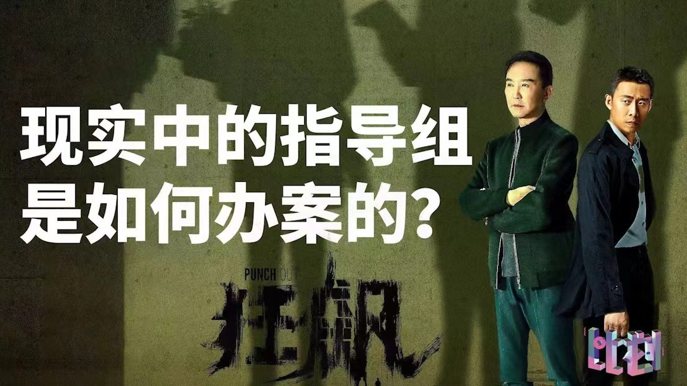
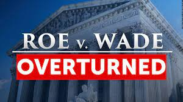
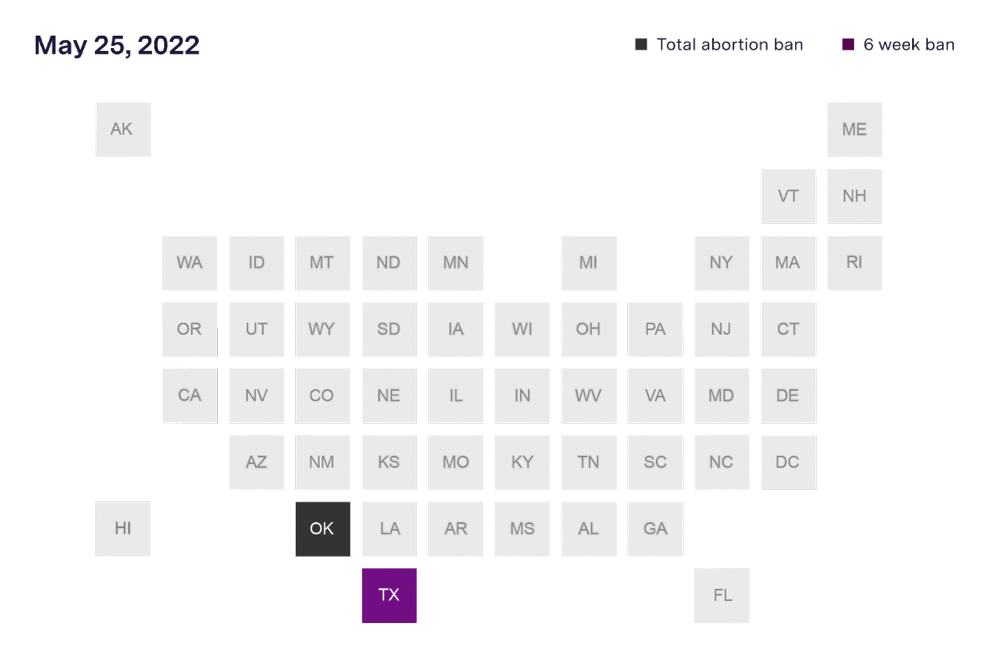

<!-- No need for agenda setting any more -->

```{r setup, include=FALSE}
knitr::opts_chunk$set(echo = FALSE, message = FALSE, warning = FALSE)

if (!require(pacman)) install.packages("pacman")
library(pacman)

p_load(
  icons
) # data wrangling # data wrangling

xaringanExtra::use_xaringan_extra(c("tile_view", # O
                                    "broadcast", 
                                    "panelset",
                                    "tachyons"))

# Functions preload
set.seed(313)
```

background-image: url("images/cha_challenge.gif")
background-position: center
background-size: contain


---

## Procedure

.pull-left[
### Presenting

The presenter talks.

### Drawing the Luck Dog


]

.pull-right[
### Challenging

1. Presenter queries.
1. Challenger responds.
1. Challenger queries.
1. Presenter responds.
]

---

class: inverse, bottom

# Decision Making Theory

---

## Decision Making Models

### Rational-Choice Based Models

+ Economic Rational-Choice
    + Bounded Rational-Choice

--

### Irrational Models

+ Belief System
+ Incremental

---

## Classic Rational-Choice Model

E.g., when you are a Savior

.center[]

---

background-image: url("../analysisOfPublicPolicy/images/rat_allias1.png")
background-position: center
background-size: contain


???

Which one do you choose?

https://www.youtube.com/watch?v=c26wIhnDK9Q

---

background-image: url("../analysisOfPublicPolicy/images/rat_allias2.png")
background-position: center
background-size: contain

---

class: center, middle

## To Be Rational

.center[Goal &rArr; preference &rArr; decisions]

--

.center[Goal: Utility = .blue[Earning] - .red[Cost]]

--

.bg-black.golden.ba.shadow-5.ph1.mt1[
.center[To be rational &rarr; Utility **maximizer**.]
]

$${\displaystyle \mathrm {E} [u(X)]=\sum _{i}\;u(x_{i})\;P(x_{i}).}$$

.footnote[i is the option; P(x) is the probability of x.]

--

.center[.large[How beautiful it is 🙏]]

???

Is Lei Feing rational?

Does being self-interest mean selfish? No, being selfish is satisfying one's own needs *at the expense of others*.

---

## Let's Try Again

background-image: url("images/rat_allias4_1.png")
background-position: center
background-size: contain

---

background-image: url("images/rat_allias4_2.png")
background-position: center
background-size: contain


---

background-image: url("../analysisOfPublicPolicy/images/rat_allias4.png")
background-position: center
background-size: contain


## Allias Paradox

???

By Maurice Allais, Nobel Prize in Economics in 1988

Experiment on real people: more people pick blue pile and yellow piles

People should consistently choose left or right strategy, rather than blue and yellow or red and green. 

The experiment shows most people choose blue plus yellow, indicating that people choose what to gain or loose right now, not on the final outcome, and certainty over risk.

---

## Adjustment of the Classic Model

.pull-left[
Bounded Rationality .small[(Hebert Simon)]~~

Goal : ~~Utility~~ Satisfying (Satisfy + Suffice)
]
.pull-right[]

???

Simon, American political scientist, whose work also influenced the fields of computer science, economics, and cognitive psychology. 

--

Causes?

+ .red[Lack] of information
+ Cognitive .red[limitation]
+ Time .red[constraint]

???

e.g., decision making in drug safety, inventory control(存货管理), system modeling, game strategy

Cognitive Limitation: difficulty to evaluate data

--

Sequences? Step 1: Intelligence Phase: Problem identification

???

Collective information, formulating the situation

--

Step 2: Design Phase: Developing alternatives

--

Step 3: Choice Phase: Choosing the option

---

## Heuristics and Bias (Tversky & Kahneman 1974)

.center[]

> Whilst heuristics can speed up our problem-solving and decision-making processes, they can introduce errors and bias judgements.   
---Dale 2015


???

举不举得起来，用脚踢


This article described three heuristics that are employed in making judgments under uncertainty: (i) representativeness, which is usually employed when people are asked to judge the probability that an object or event A belongs to class or process B; (ii) availability of instances or scenarios, which is often employed when people are asked to assess the frequency of a class or the plausibility of a particular development; and (iii) adjustment from an anchor, which is usually employed in numerical prediction when a relevant value is available. These heuristics are highly economical and usually effective, but they lead to systematic and predictable errors. A better understanding of these heuristics and of the biases to which they lead could improve judgments and decisions in situations of uncertainty.


---

## Prospect Theory (Kahneman and Tversky 1979)

.pull-left[


]

--

.pull-right[

Reference dependency model

- Endowment effect
- Status quo bias
......

.huge[
Look at where you are sitting!
]

]

???

individuals disproportionately stick with the status quo, which is an important reference point

Loss aversion + Reference dependency

people make decisions based on the potential gain or losses relative to their specific situation (the reference point) rather than in absolute terms; this is referred to as reference dependence.

Faced with a risky choice leading to gains, individuals are risk-averse, preferring solutions that lead to a lower expected utility but with a higher certainty (concave value function).
Faced with a risky choice leading to losses, individuals are risk-seeking, preferring solutions that lead to a lower expected utility as long as it has the potential to avoid losses (convex value function).

---

class: bottom, inverse

# Criticism: Irrationality

---

## Irrational Models in General


Rationality is just a conjecture of economists.<sup>&midast;</sup>

.footnote[
[&midast;] See rationalists' defense in, e.g., Bueno de Mesquita, Bruce, et al. 2003. *The Logic of Political Survival*. Cambridge, MA: The MIT Press.
]

--

### Irrational models

- Bureaucratic organization model  
- Belief system model  
- Incremental model......

---


## Incremental Model

.center[]

Lindblom, Charles E. 1959. *The Science of Muddling Through*. Place of publication not identified: publisher not identified.


---

## Muddle How

.pull-left[

### Simon

1. Intelligence
1. Design
1. Choice

]

--

.pull-right[

### Lindblom
*Muddling Through*

+ Identification
+ Development
+ Selection
    + Judging
    + Analyzing
    + **Bargaining**
    + Authorizing
+ Dynamic Factors

]

--

.pull-right[
.red[Experience based]
- No goal
- Conservative
]

---

## Space Transportation System (1960s)

.pull-left[

+ Initiated by NASA and DoD
+ Announced by JFK
+ Delegated to NASA
+ Clear goal, mean to an end, adequate resources

]

.right-column[]

???

Placed after Gagarin, Bay of Pigs

---

## Spatial Shuttle in a Incremental System

Identification: Gagarin, Bay of Pigs

--

Development

+ NASA led the fight and construct .blue[a broad coalition] of scientists, military, aerospace companies, international partners, presidential advisers, some members of congress

+ The president's budget bureau .red[doubted] the benefits.

---

## Selection: "Everyone a shuttle designer"

+ No long-range plan
+ No agreement on objectives
+ .red[One step at a time]
+ Officials pursue similar goals for different reasons
+ The program turns to satisfy multiple constituencies with unresolved interests.

&rArr; Leading to programs .red[with conflicting] and often .red[forgotten objectives], funded with insufficient resources.

---

## Muddling, Muddling

> We must think of (space activities) as part of a continuing process…and not as a series of separate leaps, each requiring a .red[massive concentration] of energy...Space expenditures must take their proper place within a rigorous system of national priorities.  
---Richard M. Nixon (March 7, 1970)

--

*Where the Policy Ended*

> The increased complexity of a Shuttle designed to be all things to all people created .red[inherently greater risks than if more realistic technical goals] had been set at the start...The greatest compromise NASA made was...with the premise of the vehicle itself.  
--- Columbia Accident Investigation Board, (2003)

---

class: bottom, inverse

# One Step Back: What Decisions to Make

---

## Agenda Setting 


.center[]

???

A collection of problems, understandings of causes, symbols, solutions, and other elements of public problems that come to the attention of members of the public and their governmental officials.

boundaries of the system agenda represents the limit of legitimate jurisdiction of existing governmental authority---changing over time

---

## Nature of Agenda Setting

.pull-left[
Three faces of power: 

1. Coercive
1. Blocking
1. Shutting-up
]

--

.pull-right[]

???

e.g., of the third face: Appalachian coal miners. The mining company remains dominant and the miners cannot conceive of a situation. When the miners show some signs of rebelling, the dominant interests are able to ignore pressure for change. In the long run, people may stop fighting as they become and remain alienated from politics; quiescence is the result.

---

## Hey


.pull-left[
.center[ ]
]

???

Going Public

--

.pull-right[

 ]

???

Appealing to higher level

1. Going public with a problem by using symbols and images to induce greater media and public sympathy for their cause.

《爆炸新闻》 Fox CEO Roger Ailes sexual scandal

1. Groups that lose in the first stage of a political conflict appealing to higher decision-making level, such as when losing parties appeal to state and then federal institutions for an opportunity to be heard, hoping that in the process they will attract others who agree with them and their cause

Seven gop-led states bid to overtern Biden's win

https://www.dallasnews.com/news/politics/2020/12/10/trump-hosts-lunch-for-texas-paxton-and-other-ags-trying-to-void-10m-votes-and-overturn-bidens-election/

---

## Timing Matters

Kingdon, John W. 2013. *Agendas, Alternatives, and Public Policies*. Pearson Education Limited.


.center[ ]

--

1. Problem stream: The power of the society
1. Political stream: The power of politicians
1. Policy stream: The power of interest groups

???

a.k.a., Simon's intelligence phase and Lindblom's identification phase

e.g., Obamacare

e.g., the Space shuttle case.

Why is gun-control not successful (still) in the U.S.?

Political stream, strong democratic & policy stream, constitution

---

## Windows


.pull-left[ ]

--

.pull-right[
.center[]
 ]

???

spillover

Johnson's "Great Society" program

1960 Lyndon Johnson (after JFK) administration’s Great Society program, which contained a package of policies that sought to attack poverty, poor health, racial discrimination, and urban decline, among other problems. This package of programs was made possible by an aggressively activist president and a large Democratic majority in the Congress

---

## Take-Home Points

.pull-left[
### Modeling Decision Making:

Rational Choice Models: 

1. Economic rational: E(Utility)
1. Bounded rational: Satisfying

Adjusted Models:

- Heuristics and Bias
- Prospect Theory

Irrational Model:

- Incremental model
]

.pull-right[
### Agenda Setting

Coercing, blocking, and shut-up   
Streams and policy window
]

```{r pdfPrinting, eval = FALSE, include = FALSE}
pagedown::chrome_print(list.files(pattern = "03_.*.html"), timeout = 300)
```