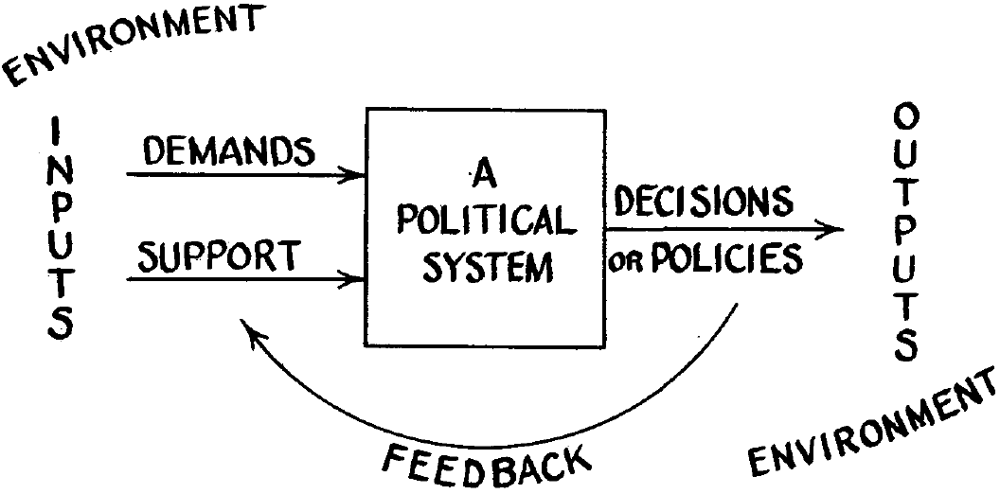
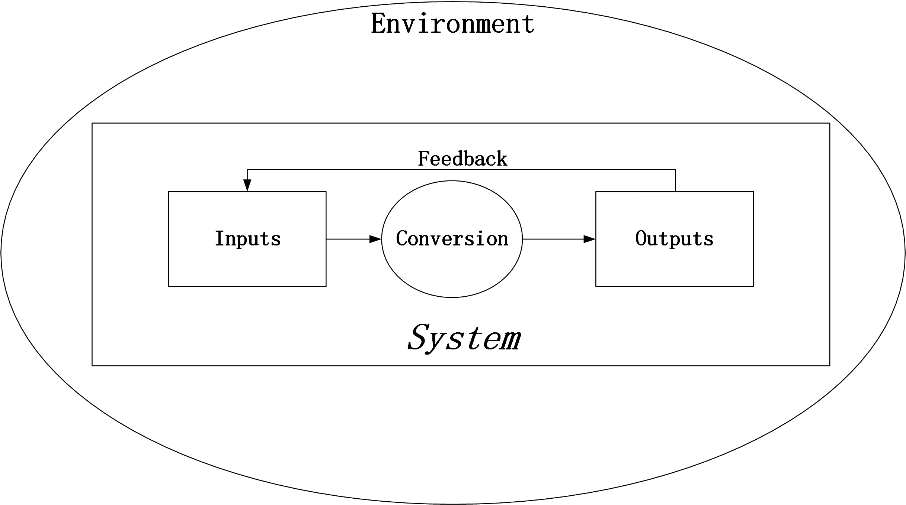

```{r setup, include=FALSE}
knitr::opts_chunk$set(echo = FALSE, message = FALSE, warning = FALSE)

if (!require(pacman)) install.packages("pacman")
library(pacman)

p_load(
  emo
) # data wrangling # data wrangling

xaringanExtra::use_xaringan_extra(c("tile_view", # O
                                    "broadcast", 
                                    "panelset",
                                    "tachyons"))

# Functions preload
set.seed(313)
```

## Literature Review: Just Follow the Advices Below?

.center[]

???

What's the problem? Lack of a functionalist view

---

## Format Requirement

1. 10 academic articles

--

1. Reference style: .red[Author-Date] system of the .red[17th Edition] of the Chicago Manual of Style

--

1. Generalization rather than summary.
    - What has and hasn't been found rather than who said what
    - How do studies connect rather than what each says
    - The location of your research question in the literature tree


---

## Overview of Today

1. Functionalism
1. Structural ~
1. Application

---

class: inverse, bottom

# Functionalism

---

## What's Functionalism

.pull-left[

]

.pull-right[
+ Biology
+ Sociology
+ Anthropology
+ Political Science (public administration)

Focus: 

~~Internal structure~~ 

What it can achieve (purpose, utility)
]

???

Sociology: Emile [ei'mi:l] Durkheim [ˈdɜːkhaɪm], 涂尔干

In social sciences, functionalism is a theory based on the premise that all aspects of a society serve a purpose and that all are indispensable for the long-term survival of the society. The approach gained prominence in the works of 19th-century sociologists, particularly those who viewed societies as organisms1. 

In philosophy, functionalism in the philosophy of mind is the doctrine that what makes something a mental state of a particular type does not depend on its internal constitution, but rather on the way it functions, or the role it plays, in the system of which it is a part2. 

In architecture, functionalism is a style of architecture that emerged in the early 20th century, characterized by an emphasis on function and utility over ornamentation and aesthetics3.

---

### Application in Policy Making

+ Popular since 1960s
    + Political development in newly independent countries 

???

The approaches for the U.S. and European politics didn't work for new countries

--

.pull-left[.center[]]

.pull-right[.center[]]

???

Almond, Gabriel Abraham, and James Smoot Coleman. 1960. The Politics of the Developing Areas. Princeton University Press.

Almond, Gabriel A., and G. Bingham Jr. Powell. 1978. Comparative Politics: System, Process, and Policy. 2nd edition. Boston: Scott Foresman & Co.

---

class: middle, normal

.bg-black.golden.ba.shadow-5.ph4.mt3[
习近平同志强调：“.red[我国国家治理的一切工作和活动都依照中国特色社会主义制度展开，并在这一过程中不断积累经验、提高水平。]”发挥治理效能与发挥*制度功能*密不可分，制度优势的发挥离不开治理环节。

.tr[
--- 宇文利 (2020,《人民日报》)
]
]

???

北京大学马克思主义学院教授

http://www.qstheory.cn/llwx/2020-04/13/c_1125847069.htm

---

## Literature Review: A Functionalist Definition?

.center[]

???

Last sentence

---

class: inverse, bottom

# Structural Functionalism

???

http://udel.edu/~jdeiner/strufunc.html
http://www.politicalsciencenotes.com/articles/almonds-model-structural-functionalism/735


---

## Objective

.center[.red[Political System]]

.center[]

What's in the "box"?

--

.red[Structures] w. .blue[functions]!

???

what does a structure (guerrilla movement, political party, election, etc.) do within the political system (of country x)? 

---

## Components

.huge[System]

???

A kind of interdependence between the parts and a kind of boundary between the system and the environment.

1. The connection of structures
1. Conversion process, basic pattern maintenance, and various capabilities (distributive, symbolic, etc.)
1. Developing countries have a simpler system, and developed have a complex one, but both have structures with SIMILAR functions.

--

.center[.Large[&rarr; Structures]: Organizations & institutions]

???

Basic unit: political party, legislature, executive, judiciary, interest group, officials

Organizations and institutions that maintain or change political structure.

--


.pull-right[
&rarr; **Functions**:     
Interacts with domestic and foreign environments

+ Input
+ Output (Aha!)
]

???

1. Economic terms
1. Input: political socialization & recruitment, interest articulation/aggregation, and political communication
1. Output: rule-making, rule implementation/adjudication
1. Different structures may perform others' function: executive has legislature functions (部门立法)

---

## Functions (of Structures)

.pull-left[
*System function*

Maintaining or changing political structure
]

???

- political socialization
- political recruitment
- political communication

--

.pull-right[
*Process function*

The processing process of political requirement by political system 
]

???

- interest expression
- interest synthesis
- law and decision making

--


.center[
*Policy function*

Mainly reflected in this process function. 
]

???

- The public, consumer organizations and trade unions' demands for their own interests are finally reflected in the policy process through the integration of the government.

---

## Structural Functionalism vs. System Theory

.center[

]

--

.pull-left[]

???

There's time, no development in political system

Interaction w. environments

--

.pull-right[]

---

## Change

.pull-left[
### Political Development

1. Penetration (elites &rarr; masses)
1. Commitment (elites &larr; masses)
1. Participation (elites &harr; masses)
1. Distribution (elites &rarr; masses)
]

???

Penetration: Whether political elites can get what they want from people over whom they seek to exercise power (Joseph LaPalombara, poli sci Yale)


--

.pull-right[
### System Change (*Inevitable*)

+ Political system: Openness
+ Challenges from the environments  
&rarr; adaptions and adjustment
+ Stability bias &rarr; Conservative, evolutionary changes

*Motivations*
- Elites and their associates
- Social groups 
- System's own demands
]

---

class: bottom, inverse

# Structural Functionalism Under a Micro-View

---

## Operationalizing Structural Functionalism

Using a microanalytic, individualistic perspective

.bg-black.golden.ba.shadow-5.ph4.mt3[
Where rational choice theory wants to simplify, the micro-version of structural-functionalism calls for enrichment.

.tr[
--- Lane (1994: 466)
]
]

--

1. Actors
1. Goal
1. Interests
1. Interaction

---

.pull-left[
## Actors

The actors are .blue[groups]: 

1. Elites
1. Masses
1. Governments

*Does individuals enter the picture?*

]

???

How? As leaders 

--

.pull-right[
## Goal

Actors have *fixed* preference orders and move *strategically* to *maximize* their interests.

*Where are the interests from?*

- Economics: Utility function  
- Poli sci/sociologist: Non-universal, narrow, monetary &check;

&rArr; Social equilibria

]

???

Structural-functionalism: brings political culture in

Pye: Elites behave differently in different countries and circumstances

民主党（Union, LGBTQ, environmentalists） vs. 共和党

---

## Interaction (Micro &rarr; Macro)

I. Each actor evaluates goals and opportunities &rarr; conform/fight

???
conform: following the existing rule

--

II. Game
+ All actor conform &rarr; system stable
+ Fighter vs. conformer &rarr; fighter wins
+ Fighter vs. fighter &rarr; "Stronger" wins

--

III. Winners .red[rerule] the system

--

IV. The process repeats in the new system.

---

## Pro and Cons

--

.pull-left[
*Contribution*

Bring the .blue[variety] and .blue[variance] in:

1. Varieties of the institutions, leaders, social configurations
1. Variances in space and time
]

--

.pull-right[
1. Concept stretching: e.g., system, interactions
1. Actor exclusion
1. Normative bias
1. "A theory about social wholes as social wholes"?
]


???
From anthropology.  
Giovanni Satori, David Collier


Only a mere number of structures


Pro-capitalism

---

## Taking-Home Points

.pull-left[
- Functionalism
    - Focus: Purpose & utility
]

--

.pull-right[
- Structural functionalism
    + System
    + Structure
        + Functions
    + Interact w. Environment
        - Domestic
        - Foreign
    + Pro & Cons
        - Variety & variation
        - Concept, actor, normative, coverage
]

--

- Micro perspective on SF
    - Actors
    - Goal
    - Interaction

    
```{r pdfPrinting, eval = FALSE, include = FALSE}
pagedown::chrome_print(list.files(pattern = "05_.*.html"), timeout = 300)
```