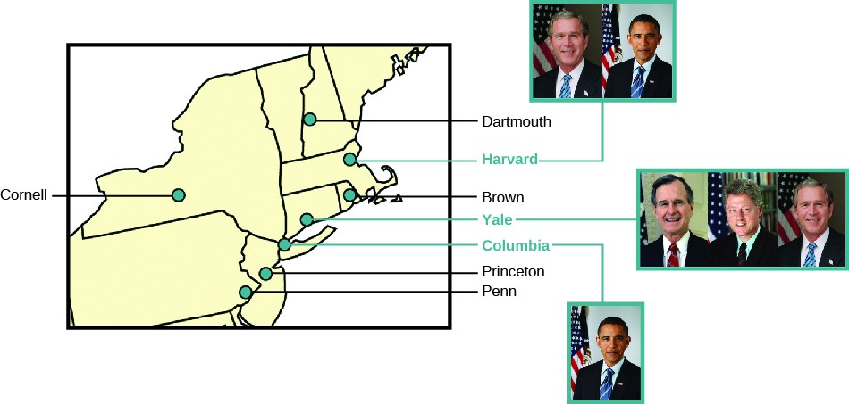
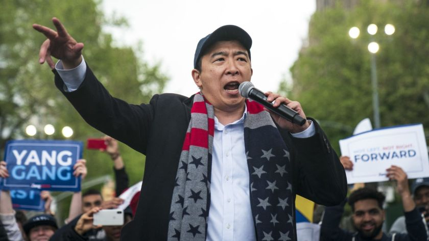
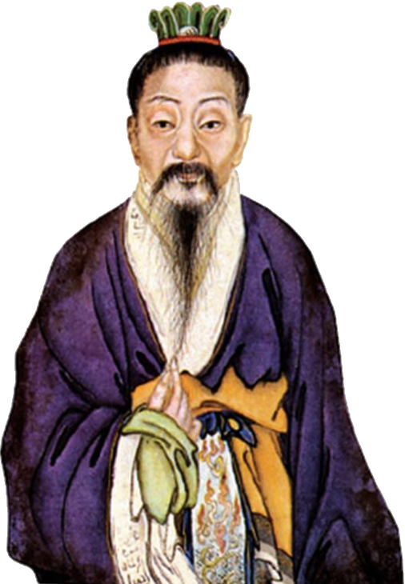
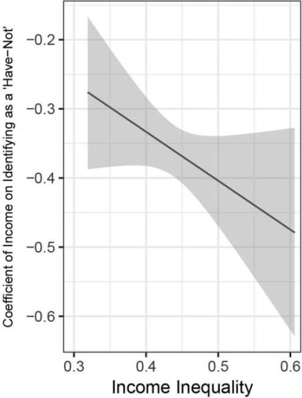
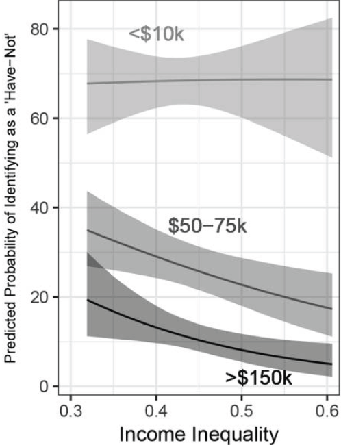

```{r setup, include=FALSE}
knitr::opts_chunk$set(echo = FALSE, message = FALSE, warning = FALSE)

if (!require(pacman)) install.packages("pacman")
library(pacman)

p_load(
  icons
) # data wrangling # data wrangling

xaringanExtra::use_xaringan_extra(c("tile_view", # O
                                    "broadcast", 
                                    "panelset",
                                    "tachyons"))

# Functions preload
set.seed(313)
```

## Preface

We started from **rational choice theory**....

--

.pull-left[
*Goal & Preference order*

- How the goals and preferences are set up? 
    - System theory
    - Structural functionalism
]

--

.pull-right[
*Decision Maker*

- Elitism
- Group theory
]

---

## Overview

- Actor
- Model
- Interaction
- Application

---

class: inverse, bottom

# Classic Elitism

---

## What Can You Learn from the Video

<video width="1000" height="500" controls preload>
    <source src="https://link.jscdn.cn/1drv/aHR0cHM6Ly8xZHJ2Lm1zL3YvcyFBcnR0dk83MHdLSU8yZ3JyU1E3U1RqdTZBMXlWP2U9VFlSNWkw.mp4" type="video/mp4">
</video>

???

Some celebrities are  elites; elites are not celebrities.

---

## The Elites

Vilfredo Pareto: .red[Governing] elites; non-elites; masses

???

统治精英集团、非统治的精英集团和普通大众

社会的发展过程就是政治精英的无限循环过程，是一个精英集团衰落和另一个精英集团兴起的“精英循环”

--

Gaetano Mosca: .red[Political] class; non-~

???

???

same as Pareto, circulation of elites

Elites that are superior organizational skills

精英的形成有两种方式：
- 渐变机制，即下层社会的一部分人地位不断上升，最终导致现有精英的新陈代谢，类似于精英的循环；
- 突生机制，即无论是被统治阶级还是统治阶级，都存在自己的精英，两种精英在权力斗争中发生相互替代，类似于精英再生产。

Unlike Marx, Mosca has not a linear concept of time, but a circular one

--

Robert Michels: A few individuals &rarr; social .red[organizations] &rarr; masses

???

iron law of oligarchy.

same with Mosca, elites need to be organized

Variance of leaders
1. Need for leaders, specialized staff and facilities
1. Utilization of facilities by leaders within their organization
1. The importance of the psychological attributes of the leaders

--

.pull-left[

### Classic Elitism

Elites have better skills and resources;

Masses are unorganized;

Elite governance is inevitable.
]

--

.pull-right[
Elites .red[have] the power;    

Elites .red[make] the rule;   

Masses .red[follow] the rule;   

Elites .blue[get] benefits; masses .red[suffer].    
]


---

## Elite-Mass Relationship (Classic Version)

.center[
    
<br>
]

???

Money talks
Power talks

circulation of elites

道德三皇五帝，功名夏侯商周，五霸七雄闹春秋，顷刻兴亡过手，青史几行名姓，北邙无数荒丘，前人播种后人收，说甚龙争虎斗


---

class: inverse, bottom

# Adjusted Elitism

---

## Evolution

.pull-left[

### Classic Elitism

Elites .red[have] the power;    

Elites .red[make] the rule;   

Masses .red[follow] the rule;   

Elites .blue[get] benefits; masses .red[suffer].    
]

--

.pull-right[

### Adjusted Elitism

Elites .red[have] the power;

Elites .blue[lead] the rule;

Masses .blue[participate];

Elites .blue[get] benefits; masses .blue[satisfy].

]

---

## The Elites (Adjusted)

E.E. Schattschneider: The most .red[educated and highest-income] members of society

???

/shat'shnaider/ 謝茨施耐德

EE Schatttschneider APSA best phd dissertation award

--

.center[]

???

Bush: MBA from Harvard Business School  

Trump: UPenn, Wharton School

Biden: Syracuse University

--

C. Wright Mills: A .red[triumvirate] of power groups---political, economic and military

???

Power Elite Theory, people in dominant positions in the three pillar institution

Distinguishable, not unified, power-wielding body

---

<image src = "../analysisOfPublicPolicy/images/elite_mao.png" height = 600>

<image src = "../analysisOfPublicPolicy/images/elite_xi.jpg" height = 600 width = 500>

---

## Adjusted Focus

.pull-left[


]

.pull-right[


]


.center[What can you see?]

???

Elite bring benefit -> Elite shape the masses (became the core in their own selfies)


---

## How Do Elites Influence You

.pull-left[]
.pull-right[]

???

Individual: voting and personal contact  

--


.pull-left[]
.pull-right[]

???

Collective: Campaigning and communal


---

class: inverse, bottom


# Application

---

## Who activates political participation, the poor or the rich?


.pull-left[]
.pull-right[]

---

class: center

## Once upon a time...

Newman, Johnston & Lown 2015

Exposure to higher levels of local income inequality

--

&darr;

Low-income people to view the United States as .red[divided];     
Low-income people identify themselves as the .red["have-not"]

--

&darr;

Class consciousness

---

## Theoretical Debate


.pull-left[.center[]]
.pull-right[.center[]]

???

贤哉回也！一箪食,一瓢饮,在陋巷,人不堪其忧,回也不改其乐

仓廪实而知礼节，衣食足而知荣辱

--

.pull-left[
*Social Psychology (Verba-Nie)*

SES &rarr; civic orientation &rarr; participation
]

--

.pull-right[
*Relative Power (Goodin-Dryzek)*

Pr(participation) &prop; Pr(win)<sup>*</sup> &times; Payoff

.footnote[\* The richer can .blue[afford more] participation cost---they also .red[what they can win].]
]


---

## Empirical Examination


.pull-left[.center[]]

???

More income, more unlikely to identify as the have-not

It looks significant, when inequality increases, the income's effect on identifying inequality

--

.pull-right[.center[]]


---

## Bonus: What's the Opposite of Elitism?

Populism or Pluralism?

--

Key question: Who's in charge?

--

.pull-left[

### Elitism

.large[A set of elites.]

]

.pull-right[

### Pluralism

.large[Interest groups]

]

???

There are places among the levels and branches that people and groups can engage.


---

## Take-Home Points

Elitism is a micro, individual perspective

Elitist theory has two approaches:

+ Classic view
+ Adjusted focus

Application of Elitist theory:

1. Officials' renting behavior
1. Relative Power


```{r pdfPrinting, eval = FALSE, include = FALSE}
pagedown::chrome_print(list.files(pattern = "06_.*.html"), timeout = 300)
```