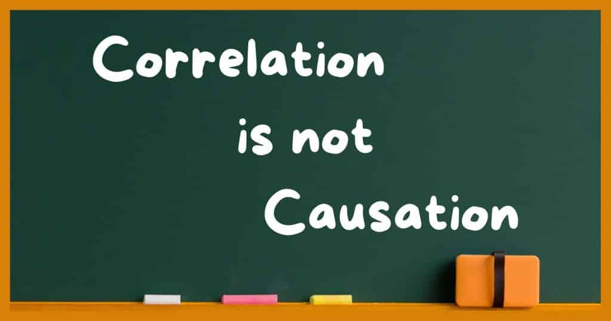
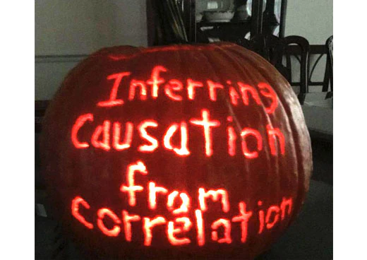
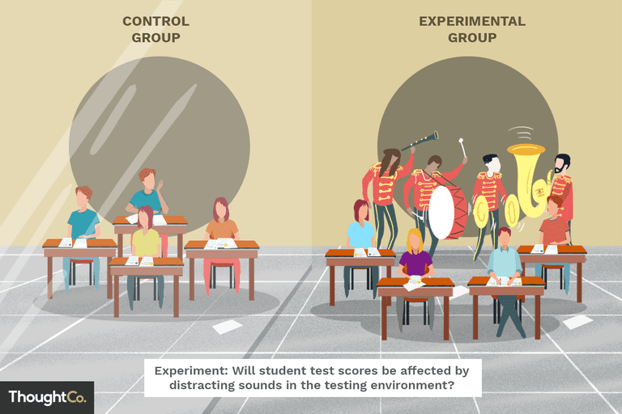
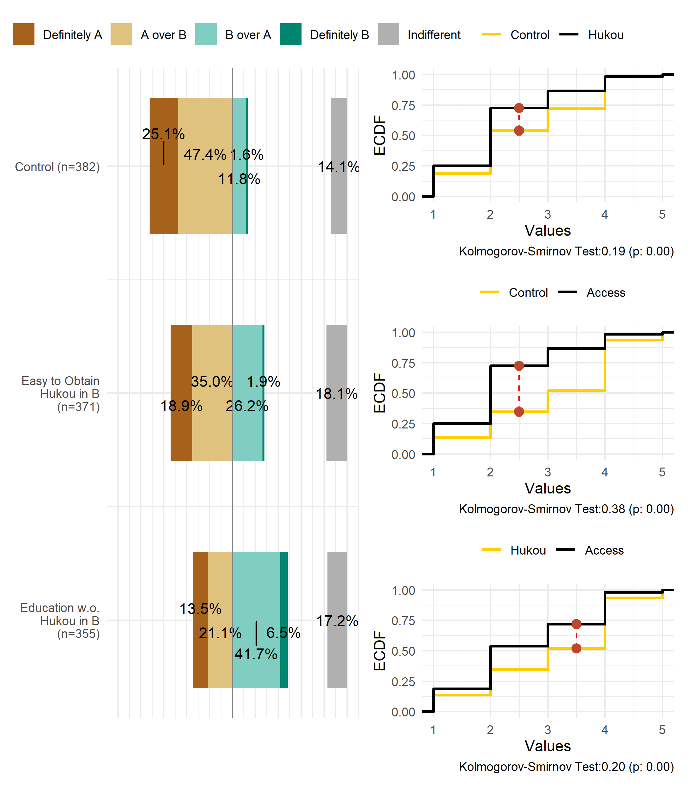

```{r setup, include=FALSE}
knitr::opts_chunk$set(echo = FALSE, message = FALSE, warning = FALSE)

if (!require(pacman)) install.packages("pacman")
library(pacman)

p_load(
  icons
) # data wrangling # data wrangling

xaringanExtra::use_xaringan_extra(c("tile_view", # O
                                    "broadcast", 
                                    "panelset",
                                    "tachyons"))

# Functions preload
set.seed(313)
```


## Overview

- Why Experiment
  - What's _not_ an experiment
- What's a good experiment
- How to design an experiment

---

class: inverse, bottom

# What's an Experimental Design, and Why

---

class: middle

## Why Experiment

.bg-dark-red.golden.ba.shadow-5.ph4.mt3[
我们必须坚持解放思想、实事求是、与时俱进、求真务实，一切从实际出发，着眼解决新时代改革开放和社会主义现代化建设的实际问题，不断回答中国之问、世界之问、人民之问、时代之问，作出符合中国实际和时代要求的正确回答，得出**符合客观规律的科学认识**，形成与时俱进的理论成果，更好指导中国实践。

.tr[
--- 习近平 (2020,《在中国共产党第二十次全国代表大会上的报告》)
]
]

---

background-image: url("images/intro_design.png")
background-position: center
background-size: contain

## How to Get a Scientific Understanding

---

## A Classic Puzzle

.pull-left[

]

--

.pull-right[

]

???

What's the problem？

- Causation is the phenomenon (why); causality is the mechanism (how)
  - So correlation can imply causation, but it's not causation without evidence of causality


---

## What's the Problem

.center[]

--

.center[]


---

class: center, middle

## Giving examples

- Daily life
- Academic studies

--

.huge[Let's talk]

```{r, echo = FALSE}
library(countdown)

countdown(
  minutes = 2,
  seconds = 0,
  warn_when = 5,
  bottom = "5%",
  right = "30%",
  font_size = "3.5em",
  play_sound = TRUE
)
```


???

- Daily: Roster and sun
- Academic
  - Media exposure and political knowledge: First, much of what people know at the end of the campaign they knew at the beginning, such that only very distinctive campaign messages are likely to produce significant effects (Bartels, 1993). Second, correlations between self-reported exposure to news and political knowledge could be the result of the reverse causal process: prior knowledge might cause people to consume news in the first place (Price & Zaller, 1993). Alternatively, knowledge and news consumption might both be caused by some third variable (such as interest in politics).
  - Slavory and economy: 
  
Fogel, Robert William. 1970. *Railroads and American Economic Growth: Essays in Econometric History*. Johns Hopkins Press.
如果没有铁路，美国的国民生产总值至多减少3%。铁路在美国的经济发展中并不像某些学者所说的那样起着至关重要的作用。

Fogel, Robert William, and Stanley L. Engerman. 1995. *Time on the Cross: The Economics of American Negro Slavery*. W. W. Norton & Company.

南方奴隶制农业比北方家庭农场的生产效率高出 35%。

典型的黑奴并非传统观念认为的那样懒散、无能和低效，平均意义上，黑奴比自由的白人农业工人更加勤奋和高效。

南方奴隶制拥有灵活而高效的激励机制，诸如奖金，休假，年终奖，对「劳动能手」的奖励，对完不成劳动定额的拖后腿者的惩罚，还有班组制和劳动分工，流水线作业等等。

南方奴隶主对奴隶的剥削率比人们通常认为的要低得多。黑奴的平均收入和生活水平高于自由农业工人，营养水平甚至高于美国人在 1964 年的平均水平。

关于奴隶的繁衍、性虐待与滥交摧毁了黑人家庭的观点只是一个传说.像自由人一样，大多数奴隶都拥有独门独户的住宅，几户人家共享一套房屋的情况并不常见。有些种植园甚至有一些专为未婚男女黑奴提供的宿舍，但这些都属例外，奴隶独门独户的房屋才是主流。

南方奴隶制之所以被终结，不是因为它的体系不能有效率地运作，而是由于在道德上不被接受，所以人们要求从政治上消除这种不道德的体制。


---

## Why Can Experiments Help

--


???

Everything Everywhere All at Once

我记得成龙给我发短信说，‘祝贺你!你知道你的人是先来找我谈的’，我说，‘谢谢你，哥们儿，你可是帮了我一个大忙。’

https://www.bcbay.com/ent/2023/02/08/842770.html


---

## How

.center[]

???

Watching from Group Comparison

--

But *how*?

---

## A Procedure

.center[A _complete_ version of an experiment]

.pull-left[
1. Assignment
1. Pre-test
1. Stimulating
1. Post-test
1. Comparing
]

.pull-right[
```{r experimentTable}
library(knitr)
library(kableExtra)

text_tb <- data.frame(
  Test = c("Pre", "Post"),
  Stim. = rep("Treatment", 2),
  NonStim. = rep("Control", 2)
)

kable(text_tb, "html", align = "lcc")%>%
  kable_styling(full_width = TRUE, font_size = 25) %>%
    add_header_above(c(" " = 1, "Assignment" = 2)) %>%
      column_spec(c(2,3), width = "6em")
```
]

--

.center[.large[What step makes the trick?]]

---

## Randomization, Randomization

Randomizaiton, how?

--

A good randomization &rarr; .red[balanced] data

.pull-left[]

--

.pull-right[Experiment w.o. random assignment?]


---

## Simplified versions

.pull-left[

1. Assignment
1. ~~Pre-test~~
1. Stimulating
1. Post-test
1. Comparing

]

???

Assumption? Previously the same on the investigated variable

--

.pull-right[

1. ~~Assignment~~
1. Pre-test
1. Stimulating
1. Post-test
1. ~~Comparing~~
]

???

Assumption? The treatment is the only intervension.

Improvements could result from retest, regression to the mean effects, effect of intervening events (history), motivation and expectations (placebo), social contact, etc.


---

class: bottom, inverse

# What's a _Good_ Experiment

---

## Validity

.bg-black.golden.ba.shadow-5.ph4.mt3[
The approximate truth of the inference or knowledge claim.

.tr[
--- Morton & Williams (2010, 254)
]
]

--

.pull-left[Internal Validity]
.pull-right[External Validity]

???

Morton, Rebecca B., and Kenneth C. Williams. 2010. *Experimental Political Science and the Study of Causality: From Nature to the Lab*. Cambridge; New York: Cambridge University Press.

---

## Validation for an Experimental Designer

.pull-left[
### Internal Validity

The approximate truth of the inference or knowledge claim .red[within] a target population studies.

- Construct validity
- Causal validity
- Statistical validity
]

???

- Construct validity: Whether the inferences from the data are valid for the theory the researcher is evaluating in a theory testing experiment
- Causal validity: Whether the relationship the researcher finds within the target population analyzed are causal
- Statistical validity: Whether there is a statistically significant convariance between the variables the researcher is interested in and whether the relationship is sizable.

--

.pull-right[
### External Validity

The approximate truth of the inference or knowledge claim .red[beyond] a target population studies.
]

--

### Ecological Validity

Whether the methods, materials, and settings of the research are similar to a given target .red[environment].


---

## Quize: Problem in Validity?

**Question**: Do people treat others differently due to their accent?  
**Subjects**: 400 Sichuannese in Shanghai   
**Design**: Linguistic experiment  

1. Let people watch each piece
1. Recording their intimacy to Pikachu

<video width="700" height="300" controls preload>
    <source src="https://link.jscdn.cn/1drv/aHR0cHM6Ly8xZHJ2Lm1zL3YvcyFBcnR0dk83MHdLSU8ybG12OXRPOXJtNWNNNVBlP2U9bmlTR2xn.mp4" type="video/mp4">
</video>

```{r, echo = FALSE}
library(countdown)

countdown(
  minutes = 2,
  seconds = 0,
  warn_when = 5,
  bottom = "10%",
  font_size = "3.5em",
  play_sound = TRUE
)
```

---

class: inverse, bottom

# How to Design Experiments

---

## Types of Experiments

.pull-left[

1. Scenario ~
1. Behavior ~
]

--

.pull-right[

1. Lab ~
1. Survey ~
1. Field ~
1. ~~Natural~~ ~

]

---

## Survey Experiment

* Subject: Sample from the target population

.pull-left[]

--

.pull-right[
* Pro: Ecological and external validity
* Con: Internal validity
]

---

## Field Experiment

* Subject: Sample from the target population

.center[]

???

Random experiments in schools in urban India in 2007, hiring young women, test score increase .28 sd.

**Banerjee, Abhijit** V., Shawn Cole, **Esther Duflo**, and Leigh Linden. 2007. “Remedying Education: Evidence from Two Randomized Experiments in India.” The Quarterly Journal of Economics 122(3): 1235–64.

--

* Pro: Ecological validity
* Con: Internal and external validity

---


## Facts You Should Know

1. Not every research .red[in the lab] is an experiment.

???

what you did in chemistry in middle school.

--

1. Not every experiment has to be conducted .red[in the lab].

???

field, survey

--

1. Not every research question can be tested by an experiment .red[in practice].

--

1. Not every method called "experiment" is an experiment.

???

natural experiment

---

## Natural "Experiment"

* "Treatment": Something just happened.

<video width="1000" height="300" controls preload>
    <source src="https://link.jscdn.cn/1drv/aHR0cHM6Ly8xZHJ2Lm1zL3YvcyFBcnR0dk83MHdLSU8ybHEyQVJpb3JGanV1LXk1P2U9MEtFR3Vn.mp4" type="video/mp4">
</video>

???

Rural north carolina, mental health of children, 1996, casino opened, profit distributed to some family. Turns out to be effect for improving mental health

--

.center[Why is natural experiments .large[not] an experimental design?]


---

## Take-Home Points

- Why Experiment
  - Correlation is not causation
  - Group-level observation
  - What's _not_ an experiment
    - In the lab
    - Called "experiment"
- What's a good experiment
  - Internal validity: Construct, causal, statistical
  - External validity
  - Ecological validity
- How to design an experiment
  - Lab
  - Survey
  - Field
    
```{r pdfPrinting, eval = FALSE, include = FALSE}
pagedown::chrome_print(list.files(pattern = "09_.*.html"), timeout = 300)
```