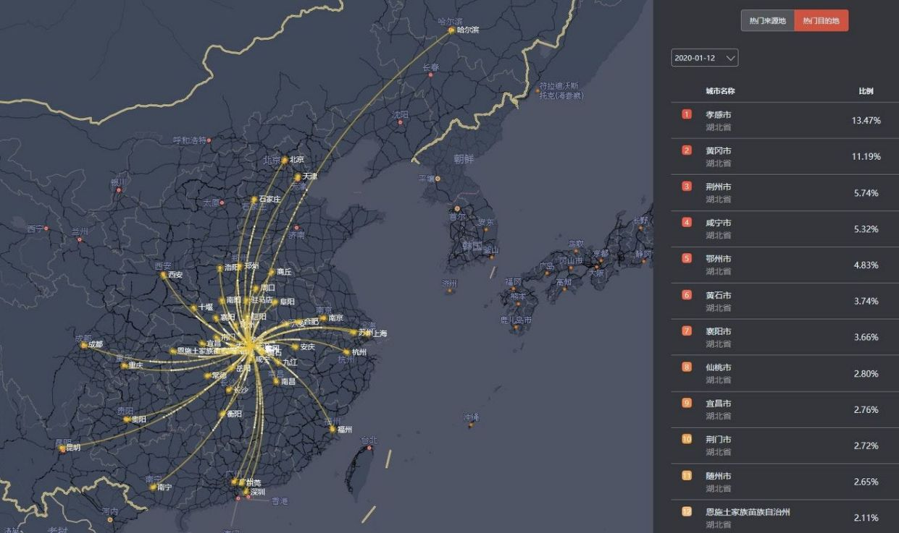
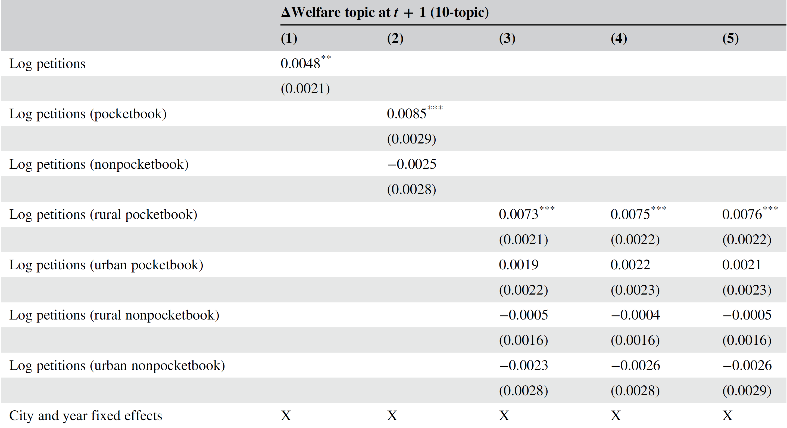
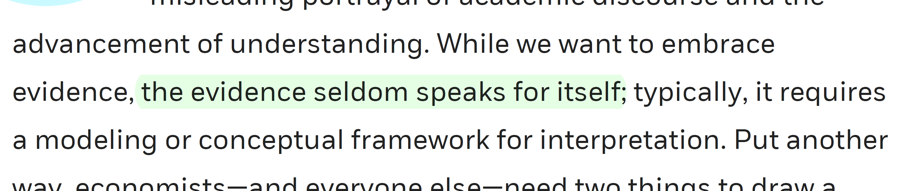

```{r setup, include=FALSE}
knitr::opts_chunk$set(echo = FALSE, message = FALSE, warning = FALSE)


if (!require(pacman)) install.packages("pacman")
library(pacman)

p_load(
  emo, knitr, kableExtra, # dependency
       stringr, arm, car, 
       modelsummary,
       broom, tidyverse
) # data wrangling # data wrangling

xaringanExtra::use_xaringan_extra(c("tile_view", # O
                                    "broadcast", 
                                    "panelset",
                                    "tachyons"))

xaringanExtra::use_fit_screen() # Alt + F

# Functions preload
set.seed(313)
```

background-image: url("images/cha_challenge.gif")
background-position: center
background-size: contain

---

## Overview

* What's "big" data?
* What can big data do?
* Limitation of big-data analysis

---

class: inverse, bottom

# "Big-Data" Analysis (Data Sciene) 

---

## What's Big Data?

.bg-black.golden.ba.shadow-5.ph4.mt3[
Data sets characterized by huge amounts<sup>1</sup> of frequently updated<sup>2</sup> data in various formats<sup>3</sup>, such as numeric, textual, or images/videos.<sup>4</sup>  
]

--

[1] **.red[V]olume**  
[2] **.red[V]elocity**  
[3] **.red[V]ariety**

[4] Two more "**.red[v]**"s: veracity and value

???

veracity: accuracy, integrity (how do you know?)  
value: how much value for each unit of data?

---

## Policy Analysis with Big Data

.pull-left[
### Sources

1. Data from e-government, civil service hotlines, government-citizen interactions
1. Official data from bureaus and departments
1. Speeches, statements
1. Traditional and new media
1. Official document archives
1. Judicial documents  
......
]

--

.pull-right[
### Goals

1. Initiation of the agenda
1. Profile of policy makers
1. Policy making process
1. Logic of policy decisions and implementation
1. Policy evaluation
1. Prediction of policy outcomes  
......
]

---


.pull-left[

### Methods

1. Description✨
1. Relationship analysis
1. Pattern (machine) learning
1. Text analysis
......
]

--

.pull-right[
### Ta-Da~~

.large[.green[政务大数据应用与分析(80700673)]]

]
---

## Description

.pull-left[
.center[]
]
.pull-right[]

---

background-image: url("images/big_baiduWuhan3.png")
background-position: center
background-size: contain

---

## Example: Relationship Analysis

Petition -?&rarr; *Dibao*

.center[]

???

Jiang, Junyan, Tianguang Meng, and Qing Zhang. 2019. “From Internet to Social Safety Net: The Policy Consequences of Online Participation in China.” *Governance* 32(3): 531–646.

1. 900,000 petitions
    + A substantial share of the LLMB (Local Leader Message Board) petitions concern personal problems that are most likely to be experienced by lower-class citizen.
    + A sizable share of the petitions are originated from rural and suburban areas


(pocketbook: individual economic sources)


2. 4,400 government reports at both the city and provincial levels between 2000 and 2014
    + cities that receive a larger number of online petitions in a year tend to devote significantly higher proportions of government reports in the following year to a topic on social welfare
    + policy effect appears to be mainly driven by petitions filed by rural residents concerning issues related to their pocketbook conditions.

---

## Example: Pattern (Mechine) Learning

.center[]

???

Iyyer, Mohit, Peter Enns, Jordan Boyd-Graber, and Philip Resnik. 2014. “Political Ideology Detection Using Recursive Neural Networks.” In 52nd Annual Meeting of the Association for Computational Linguistics, 1113–22.


Ideological Books Corpus (IBC) developed by Gross et al. (2013). This is a collection of books and magazine articles written between 2008 and 2012 by authors with well-known political leanings.

A subset of 55,932 sentences.

---

class: bottom

background-image: url("images/big_pd0.png")
background-position: center
background-size: contain

## Example: Text analysis

---

background-image: url("images/big_pd7.png")
background-position: center
background-size: contain

---

background-image: url("images/big_pdregression.png")
background-position: center
background-size: contain

---

## Example: Audio/video analysis  

.center[]

???

Dietrich, Bryce J., Matthew Hayes, and Diana Z. O’Brien. 2019. “Pitch Perfect: Vocal Pitch and the Emotional Intensity of Congressional Speech.” American Political Science Review: Forthcoming.

female MCs speak with greater emotional intensity when talking about women as compared to both their male colleagues and their speech on other topics.

---

## Issues about Big-Data Based Analysis

1. How "big" is big?
1. Anything new?
1. Where are they from?
1. How do we understand?
1. Is it morally correct?

---

## How Big is Big

.center[]

---

## Anything new?

.center[
[](https://www.computerworld.com/article/3162030/microsofts-big-data-like-study-on-sleep-proves-what-doctors-already-know.html)
[](https://www.independent.co.uk/voices/gender-pay-gap-worst-offenders-government-targets-diversity-disability-equality-a8788341.html)
]

---

## Where are they from & Is It Morally Correct?

<video width="1000" height="500" controls>
    <source src="images/big_dataPrivacy.mp4" type="video/mp4">
</video>

???


2018年FB数据泄露事件: 脸书2015年就发现英国剑桥分析公司“窃用”大量用户隐私数据用于投放政治广告，却为何没能及时告知用户、非等到媒体今年曝光才承认？

Cambridge Analytica助选

---

## How do we understand?

.center[
Sampling bias,  
Provenance conflicts,  
Increased fluctuations,  
Error rates...
]

--

.center[]

???

Challenging reading of W3

Hansen, Lars Peter. 2019. “Purely Evidence-Based Policy Doesn’t Exist.” Chicago Booth Review. http://review.chicagobooth.edu/economics/2019/article/purely-evidence-based-policy-doesn-t-exist (March 27, 2019).


---

## Take-Home Points

.pull-left[
+ What's BD?
    + Non-intentional
    + 3 or 5 Vs
+ What BD can do
    + Description
    + Relation analysis
    + Pattern identification
    + Text analysis
]

.pull-right[
+ Limitations of BD
    1. Data size
    1. Substantive meaning
    1. Representativenss
    1. Patten identification
    1. Ethnicity
]

```{r pdfPrinting, eval = FALSE, include = FALSE}
pagedown::chrome_print(list.files(pattern = "11_.*.html"), timeout = 300)
```