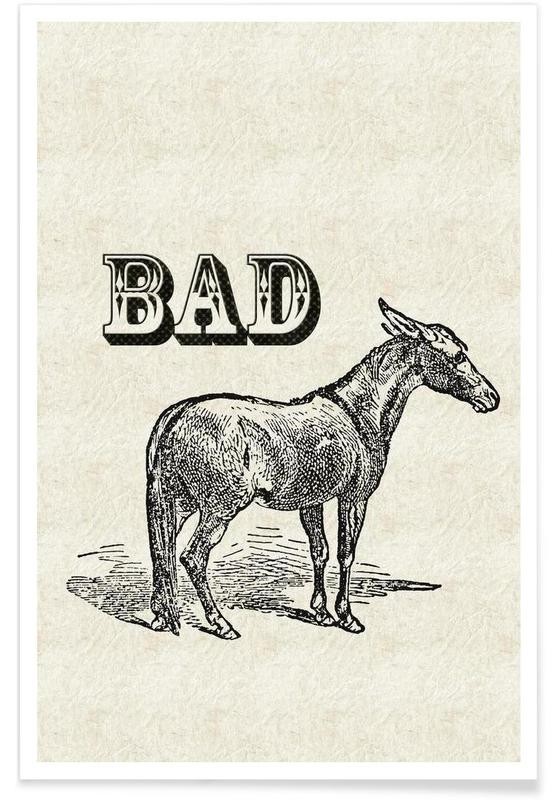
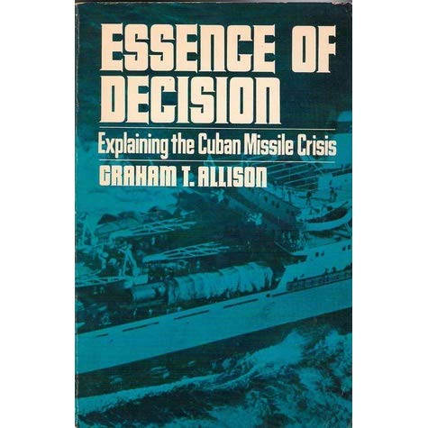

```{r setup, include=FALSE}
knitr::opts_chunk$set(echo = FALSE, message = FALSE, warning = FALSE)


if (!require(pacman)) install.packages("pacman")
library(pacman)

p_load(
  emo, knitr, kableExtra, # dependency
       stringr, arm, car, 
       modelsummary,
       broom, tidyverse
) # data wrangling # data wrangling

xaringanExtra::use_xaringan_extra(c("tile_view", # O
                                    "broadcast", 
                                    "panelset",
                                    "tachyons"))

xaringanExtra::use_fit_screen() # Alt + F

# Functions preload
set.seed(313)
```

background-image: url("images/cha_challenge.gif")
background-position: center
background-size: contain

---

## Overview

1. What's a small-N analysis?
1. What can it do?
1. How can you tell a small-N based research is good?
1. How is it different from LNA?


---

## Small-N Analysis

a.k.a., interpretive approach (vs. naturalist approach)

--

Why small N? The data doesn't allow large N analysis...

--

.pull-left[
WRONG!

.center[]

]

--

.pull-right[

### What Can an Interpretive Approach Do?

1. Value judging
1. Story telling
1. Narrative analysis
1. Dramaturgical analysis
1. Category analysis

]


---

### Value Judging

.pull-left[
+ Identifying "communities of meaning"
+ Studying the framing and interactions among the communities
]

.pull-right[

]

???

Graham Tillett Allison Jr. , American political scientist and professor at the John F. Kennedy School of Government at Harvard

Another example: George Lakoff: Don't Think of an Elephant! 

Writing about framing and metaphor, a book writing for liberal peoples. Thus called them (Democrats) the 进步的, the Republicans 保守派

---

### Story Telling

.pull-left[
Telling stories about a certain group or policy based on archives and interviews.
]

.pull-right[]

???

Balay, Anne. 2018. Semi Queer: Inside the World of Gay, Trans, and Black Truck Drivers. UNC Press Books.

Winner of the Lambda Literary Emerging Writers Award. PhD students at University of Michigan’s American Culture.

Another example: 1587, a Year of No Significance: The Ming Dynasty in Decline，一个皇帝和五个名臣的故事

--

### Narrative Analysis

Going .red[beyond] telling a story  
Using story to make an argument
Putting an argument in the .blue[thick context]

???

Skocpol, Theda. 1979. States and Social Revolutions: A Comparative Analysis of France, Russia and China. Cambridge University Press.


---

### Dramaturgical Analysis

How do policy and policy makers "act"?

.pull-left[
+ "Actors"
+ "Content"
+ "Theme"
+ "Space"
]

--

.pull-right[

]

???

Dutch film actor Theo van Gogh was assassinated by a Dutch-Moroccan Muslim wo ojbected to the director's movie Submission that criticized the treatment of women in Islam.

Application: 被套路，人生如戏

---

### Category Analysis

+ Identity: Welfare recipients, official language...

--

+ Levels: Comprehensive strategic partners, strategic and cooperative partners, strategic partners, constructive cooperative partners...

???
Strüver, Georg. 2017. “China’s Partnership Diplomacy: International Alignment Based on Interests or Ideology.” The Chinese Journal of International Politics 10(1): 31–65.

--

+ Direction: Smart city, service-oriented government, neo-urbanization...

---

## Small-N vs. Large-N

+ Role
+ Data collection
+ Analysis

---

.pull-left[
### Role

1. Researchers are .blue[human]
    + Experiences
    + Cognitive differences

1. Researchers have .blue[value]

1. Researchers .blue[participate]
    + Observer vs. Insider
    + Undercover vs. Activist
]

???
Cognitive differences: men and women; allowing tourists entering the campus

Researchers generalize/create culture, etc.

--

.pull-right[

### Data Collection

1. Observing with intention to .red[understand];

1. Interviewing with respondents as .red[conversational] partner;  

1. Reading the documents as they were writing .red[meaningfully].
]

???

1. Pader, Ellen-J. 1994. “Spatial Relations and Housing Policy: Regulations That Discriminate Against Mexican-Origin Households.” Journal of Planning Education and Research 13(2): 119–35.

Using American view of occupancy (and thus housing policy enforcement) is discriminated.

2. Schaffer, Frederic Charles. 2000. Democracy in Translation: Understanding Politics in an Unfamiliar Culture. Cornell University Press.

Interview of people in Senegal about democracy and American democracy

3. Chock, Phyllis Pease. 1995. “Ambiguity in Policy Discourse: Congressional Talk about Immigration.” Policy Sciences 28(2): 165–84.

By examining the written record of spoken language, she was able to analyze the ways in which legislators’ and expert witnesses’ embedded ideas about immigrants reflected and shaped immigration reform and policy contentions.

---

### Analysis

.center["No need to transform words into numbers"]

+ Numbers are not the results but the sources

--

+ More details than digits

???

Narrative reports often read like novels.

--

+ Where did the number or whatever data come from?

--

+ Where to find the data, what are data, how to know what are saying in the data?...

???

Analysis and collection are intertwined.

---

## Evaluating SNA

.pull-left[

~~Be objective~~

Reality is not universal;
Policy is constructed.

]

--

.pull-right[

~~Be voiceless~~    
.center[]

]

???

西蒙娜·德·波伏娃

Simone de Beauvoir, The Second Sex, gender is constructed.

One is not born a woman, but becomes one.

--

.pull-left[

~~Be experimental~~

The SNA assumes impacts and multicausality are data and useful.

]

--

.pull-right[
~~Be replicated~~

.center[]

]

---

~~Be generalized~~

.center[]

---

## An Alternative Evaluation System

+ Credibility
+ Transferability
+ Dependability
+ Confirmability

---

### Credibility

.center[]

???

If the data and implications are presented credibly.

Based on enough description and background

e.g.2 Censorship

---

### Transferability

> 当年的SARS也属于冠状病毒，公众容易将二者相类比。当年在应对SARS的过程中，我们是有过教训的。这就提醒我们，千万不可产生轻敌心态和麻痹思想，更不能犯下和当年一样的错误。  
---"尽快掐灭疫情传播的'火种'"《人民日报客户端》（2020-01-22）

???

a result of detailed, illustrative description, and the responsibility shifts from the researcher (the sender) to individuals in other settings (the receivers)

https://wap.peopleapp.com/article/5060699/4954813

Should we learn from Singapore?

--

Readers' call, though.

---

### Dependability

Legit process of inquiry

+ What kinds of data, what period of time? 
+ Over a determined period of time, or simply one visit and a few interviews?  
...


???

Censorship

Authoritarianism, communist capitalism can be used to describe nowadays China?

---

### Confirmability

Findings clearly linked to analysis, data, and the research site.

.center[]

???

There's an alternative set of criteria which is more philosophical,

Morrow, Susan L. 2005. “Quality and Trustworthiness in Qualitative Research in Counseling Psychology.” Journal of Counseling Psychology 52(2): 250–60.

---

## A Good ?-N Analysis

| Large-N           | Small-N           |
|---------------|---------------|
| Objective     | Understanding |
| Voiceless     | Voice         |
| Experimental  | Comparison    |
| Replicable    | Depth         |
| Generalizable | Context       |

Always care about the framing and understanding an issue from different angles.

???

+ Understanding: the researchers' background, view, approach, and value; 钟南山更可信
+ Voice: Study by Bourgois and Schonberg (2009) of homeless men and women who were addicted to drugs is compelling because it showed they care.
+ Comparison: reflexivity: Well-crafted studies provide the reader an opportunity to reflect on his or own situations in regard to similarities and differences.
+ Depth: richesness for understanding and context differences
+ Context: not only if policy works, but what cases not and why

---

## Take-Home Points

Interpretive approach is a different world!

.pull-left[
### Different criteria
+ Credibility
+ Transferability
+ Dependability
+ Confirmability
    ]
    
.pull-right[
### Different ways
+ Understanding
+ Voice
+ Comparison
+ Depth
+ Context
]


```{r pdfPrinting, eval = FALSE, include = FALSE}
pagedown::chrome_print(list.files(pattern = "12_.*.html"), timeout = 300)
```