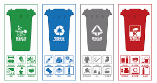
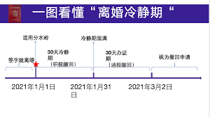
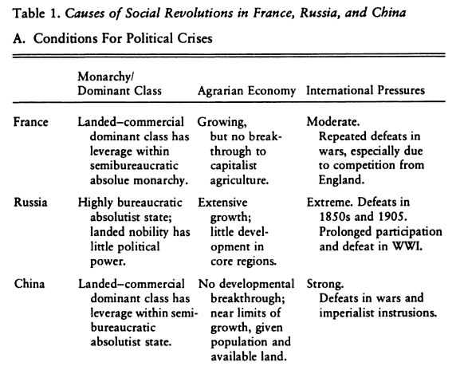
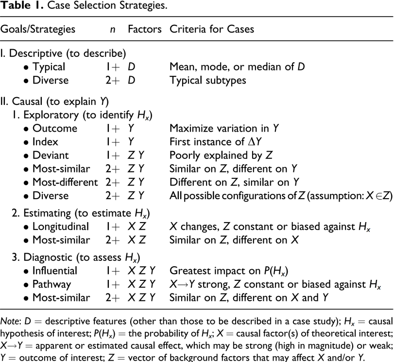

## Overview

```{r setup, include=FALSE}
knitr::opts_chunk$set(echo = FALSE, message = FALSE, warning = FALSE)

library(kableExtra)

xaringanExtra::use_xaringan_extra(c("tile_view", # O
                                    "broadcast", 
                                    "panelset",
                                    "tachyons"))

xaringanExtra::use_fit_screen() # Alt + F

# Functions preload
set.seed(313)
```

.bg-dark-red.golden.ba.shadow-5.ph4.mt3[

综合性决策部署要考虑方方 面面的差异性，专项性决策部署要找准在全局中的合理定 位，这些都需要充分熟悉情况、深入分析论证、科学把握尺度。

.tr[
--- 习近平 (《中央政治局的同志必须有很强的看齐意识》, 2015年12月)
]
]

--

.pull-left[
1. What's a case study
1. How to do a case study
1. How to do it professionally
]

--

.pull-right[

### Where Are You

+ Case study

.gray[
+ Process tracing
+ Interview
+ Focus group
+ Content analysis
]

]

---

class: bottom, inverse

# Case Study: What

---

## What's a Case Study

.bg-black.golden.ba.shadow-5.ph4.mt3[
An intensive study of a .magenta[single unit] for the purpose of understanding a larger class of (similar) units.


.tr[
---Gerring (2004: 342)
]
]


???
Gerring, John. 2004. “What Is a Case Study and What Is It Good For?” American Political Science Review 98(2): 341–54.

--

.pull-left[

### A Case

A unit within a boundary

+ Spatial
+ Temporal
]

--

.pull-right[
### Types of cases

1. One unit over time
1. N subunit at one time
1. N subunit over time

Hint: .red[Varying] is the key!
]

---

## Differentiation: Observation, Variable, or Case

```{r unitCase}
text_tb <- data.frame(Observed = 1:8,
                      Party = rep(c("Party Member", "Non-PM"), times = 4), 
                      Region = rep(c("Educational", "Dependents"), each = 4))

kable(text_tb, "html", align = "crr")%>%
  kable_styling(full_width = TRUE, font_size = 25, bootstrap_options = c("responsive"))
```


---

### Representativeness of Cases

Randomization is cool, right?

Why not randomly bring a case to analyze?


???

Representativeness roots from large-N analysis

---

## Goal of Case Study

*General goals*

+ Credibility
+ Transferability
+ Dependability
+ Confirmability

--

*In terms of case studies*

You should conduct a case study when you are looking for...

* .red[Deep] rather than broad, bounded scope of proposition
* .red[Comparing] with rather than represent other cases
* .red[Mechanism] rather than effect
* .red[Deterministic] rather than probabilistic relations
* .red[Exploring] rather than confirmatory test

---

class: inverse, bottom

# Case Study: How

---

## A Nonacademic Example

<video width="1000" height="200" controls preload>
    <source src="https://link.jscdn.cn/1drv/aHR0cHM6Ly8xZHJ2Lm1zL3YvcyFBcnR0dk83MHdLSU8yMHk2MmJ5dzRXa2xxWF9MP2U9VVFtWFdq.mp4" type="video/mp4">
</video>

- What's the .red[problem] did the upper intend to solve?
- What product does she .red[select], and why?
- How did she do it?
    - What **logic** did she apply?
    - What **empirics** did she provide?
        - How do they **relate to** the problem?
- What .red[conclusions] did she draw? 
- Are you **convincing**, and why specifically?
    - Can you do better?

```{r stopwatch1, echo = FALSE}
library(countdown)

countdown(
  minutes = 2,
  seconds = 0,
  warn_when = 30,
  right = "0%",
  bottom = "5%",
  font_size = "3.5em",
  play_sound = TRUE
)

```

---

## Descriptive Case Study

Goal: Details and Mechanisms

--

 Approach:

- Clear question
- Detailed narrative
- Calling back to the questions
- Extension (more than the initial question)

--

 Quality: Credibility > Confirmability > Transferability > Dependability

---

## Another Nonacademic Example

<video width="1000" height="200" controls preload>
    <source src="https://link.jscdn.cn/1drv/aHR0cHM6Ly8xZHJ2Lm1zL3YvcyFBcnR0dk83MHdLSU8yMDMxb1B5Rk0tX205Z3JhP2U9c1VNdjNE.mp4" type="video/mp4">
</video>

- What's the .red[problem] did the upper intend to solve?
- What products does he .red[select], and why?
- How did he do it?
    - What **logic** did he apply?
    - What **empirics** did he provide?
        - How do they **relate to** the problem?
- What .red[conclusions] did he draw? 
- Are you **convincing**, and why specifically?
    - Can you do better?

```{r stopwatch2, echo = FALSE}
library(countdown)

countdown(
  minutes = 2,
  seconds = 0,
  warn_when = 30,
  right = "0%",
  bottom = "5%",
  font_size = "3.5em",
  play_sound = TRUE
)

```

---

## Analytic case study

Goal: Testing inferences

--

 Approach:

.pull-left[
- Clear question
- Careful case selection (elaborated later)
- Delicate design of comparison
- General conclusion
]

.pull-right[

.gray[
- Clear question
- Detailed narrative
- Calling back to the questions
- Extension (more than the initial question)
]

]

--

 Quality: Credibility = Confirmability = Transferability = Dependability

--

.center[Descriptive vs. Analytic]


???

What's the core difference? 

a phase of comparison

- Hypotheses test
- Completion
- Quality

---

class: inverse, bottom

# From Analysis to Research

---

class: Large, center, middle

## Fundamental Logic

Most .red[similar] systems    
Most .red[different] systems

---

## Most Similar Systems (Concomitant Variation)

.bg-black.golden.ba.shadow-5.ph4.mt3[
The belief that systems as similar as possible with respect to as many features as possible constitute the optimal samples for comparative inquiry.

.tr[
--- Przeworski and Teune (1970, 32)
]
]

???

Raoul Naroll, “Some Thoughts on Comparative Method in Cultural Anthropology."

Concomitant: something that happens at the same time as another thing and is connected with it.

--

**Explanatory Variable**: intersystemic .red[differences]

--

**Control Variables**: .red[Similarities] between the systems

--

**Assumption**: Characteristics shared by one group of systems, such as can be .red[removed]. 

---

## E.g.: About Leadership Powerfulness

```{r leadership}
text_tb <- data.frame(US = c("American continent", "Broad territory", "Anglo-Saxon", "Democracy", "Federal", "Presidential"), 
                      Canada = c("American continent", "Broad territory", "Anglo-Saxon", "Democracy", "Federal", "Parliamentary"))
rownames(text_tb) <- c("Position", "Size", "Culture", "Polity", "Government", "Legislature")

kable(text_tb, "html", align = "cll")|>
  kable_styling(full_width = TRUE, font_size = 25, bootstrap_options = c("responsive"))
```

What argument can this study make? 

---

## Practice
.pull-left[
Beijing's waste-sorting policy works?

.center[]
]
.pull-right[
Cooling-off period works?
.center[]

]

1. Define an outcome variable
1. Pick an explanatory variable
1. Make a most-similar-case study design
1. Descriptive (the conditions of) the cases 
1. Writing out and shoot to our class chat group in .red[10min]

```{r stopwatch3, echo = FALSE}
library(countdown)

countdown(
  minutes = 10,
  seconds = 0,
  warn_when = 30,
  right = "0%",
  bottom = "5%",
  font_size = "3.5em",
  play_sound = TRUE
)

```

---

## Most Different System

.bg-black.golden.ba.shadow-5.ph4.mt3[
The alternative strategy takes as the starting point the variation of the
observed behavior at a level lower than that of systems...If the relationship between an independent and the dependent variable is the same within the subgroups of the population, then again the systemic differences need not be taken into consideration.

.tr[
--- Przeworski and Teune (1970, 34--35)
]
]

--

**Explanatory Variable**: intrasystemic .red[similarities]

--

**Control Variables**: .red[Differences] in the common systemic characteristics

--

**Assumption**: Systemic factors .red[do not play any role] in explaining the observed behavior.

---

## E.g.: About the Cause of the Revolution

.center[]

???

Skocpol, Theda. 1979. *States and Social Revolutions: A Comparative Analysis of France, Russia, and China*. Cambridge: Cambridge University Press.


Causes of revolution:

First, there must be a "crisis of state," often provoked by international factors.

Second, patterns of class dominance determine which group will rise up to exploit the revolutionary situation.

---

## Practice

.pull-left[
Beijing's waste-sorting policy works?

.center[]
]
.pull-right[
Cooling-off period works?
.center[]

]

1. Define an outcome variable
1. Pick an explanatory variable
1. Make a most-similar-case study design
1. Descriptive (the conditions of) the cases 
1. Writing out and shoot to our class chat group in .red[10min]

```{r stopwatch4, echo = FALSE}
library(countdown)

countdown(
  minutes = 10,
  seconds = 0,
  warn_when = 30,
  right = "0%",
  bottom = "5%",
  font_size = "3.5em",
  play_sound = TRUE
)

```


---

## How to Pick a Case?


.center[]

.footnote[Gerring, John, and Lee Cojocaru. 2016. “Selecting Cases for Intensive Analysis: A Diversity of Goals and Methods.” *Sociological Methods & Research* 45(3): 392–423.]


---

## Take-Home Points

1. What's a case study
  - A study on a case
  - Case types
    - Spatial
    - Temporal 
1. How to do a case study
  - Descriptive
  - Analytic
1. How to do it professionally
  - Most similiar
  - Most different