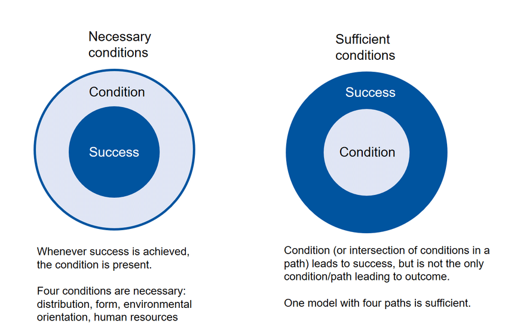
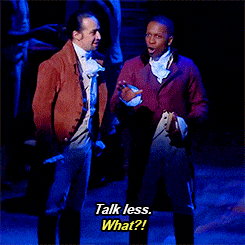

```{r setup, include=FALSE}
knitr::opts_chunk$set(echo = FALSE, message = FALSE, warning = FALSE)

if (!require(pacman)) install.packages("pacman")
library(pacman)

p_load(
  emo, knitr, kableExtra, # dependency
       stringr, arm, car, 
       modelsummary,
       broom, tidyverse
) # data wrangling # data wrangling

xaringanExtra::use_xaringan_extra(c("tile_view", # O
                                    "broadcast", 
                                    "panelset",
                                    "tachyons"))

xaringanExtra::use_fit_screen() # Alt + F

# Functions preload
set.seed(313)
```

## Presentation

+ Time: 10min presentation + 3min Q & A
+ Content:
    + Intro of the targeted policy (Why should we care?)
    + Theory and hypothesis (What's your OV & EV and how are they connected)
    + Method and data (How do you test your theory?)
    + Operation (Can you actually do it?)
+ Questions (Randomly drawing a challenger)

---

background-image: url("images/cha_challenge.gif")
background-position: center
background-size: contain

---

## Overview
.pull-left[
### Process tracing
+ What's that
+ How to conduct it
+ How to draw a conclusion

### Overview
+ Interview-based methods
    + Interview
    + Focus group
+ Discourse-based method
    + Content analysis
]


--

.pull-right[
## A Glimpse of Interpretive Methods

+ Case study

+ Process tracing

+ Interview

+ Focus group

+ Content analysis
]

---

## Process Tracing

.center[

Tenet in a case


**Goal**: Theory testing

**Hypothesis**: Explanation rivalry
]

---

## Example: English Recognition in Singapore

Why did English become a recognized official language in the Singaporean language policy?


Esp. given there were only 21% of the population spoke this language when the country was independent.


---

background-image: url("images/process_routine.gif")
background-position: center
background-size: contain


---

class: large, middle, center

### Step 1: Identify Hypotheses

State (institutional) capacity  

vs.

Prioritization of the education ministry

???

Goh Keng Swee (吴庆瑞): 财政部长、内政及国防部长、副总理, 奠定了新加坡教育的精英主义政策, 取得伦敦政经学院经济学博士学位。

The Goh Report identified and set out recommendations to address three shortcomings: high education wastage, low literacy, and ineffective bilingualism. English was taught to maximize proficiency

---

background-image: url("images/process_timelineEnglish.jpg")
background-position: center
background-size: contain

### Step 2: Establish Time Line


???

1. The very second step right after determining the DV
1. Before the evidence collection

---

class: center

### Step 3: Construct Causal Graph


???

Causal process of X &rarr; Y  
Used to identify relevant moments and actors that could affect the results.

---

class: center, middle

### Step 4, 5: Identify Alternative Choice or Event and Counterfactual Outcomes

Counterfactual 1: Weak State &rarr; language of the dominant population.

Counterfactual 2: Leed did not assign Goh as the MOE &rarr; the status quo.

???

A reason that choices might make differences  
If there's no comparative cases, then conterfactual outcomes.

--

How to find the evidence?

---

## Terminology of Evidence

*Necessary* & *sufficient* conditions/statments

When A is a .magenta[sufficient] condition of B, then once A happens, B must happen.  
When A is a .magenta[necessary] condition of B, then there must be A for B to happen.

.center[]

---

## Practice

+ Being 2, 4, 6, or 8 is __ for being an even natural integer.
+ Being 2, 4, 6, or 8 is __ for being an even natural integer <10.

--

+ Being highly intelligent is __ for being a student of Tsinghua.
+ Showing up to class is __ for getting an A.
+ Being mortal is __ for being human.
+ Being a rational animal is __ for being human.

--

*Let's back to learning process tracing*

---

### Step 6: Find Evidence for Primary Hypothesis

|<sup>&midast;</sup>.small[Necessity\\Sufficiency] | Yes             | No                |
|-----------------------|-----------------|-------------------|
| Yes                   | Double-Decisive | Smoking Gun  |
| No                    | Hoop Test | Straw-in-the-Wind |

.footnote[
&midast; Evera, Stephen Van. 1997. *Guide to Methods for Students of Political Science*. Ithaca: Cornell University Press.
]

???


柯南：幸级呲 哇 一次摸 hi 拖呲

1. Hoop test: no alibi, the accused in the state when murder happens? If not innocent, but passing does not mean being guilty. 《顶楼》中女孩儿死时最上面女主在现场，但并不代表就是她造成的女孩儿的死亡（虽然其实是）
1. Smoking-gun test: a smoking gun seen in a suspect's hand moments after a shooting is quite conclusive proof of guilt, but a suspect not seen with a smoking gun is not proven innocent. 途中确实是收费人员不动，但司机之前戏耍收费人员在先
1. Double-decisive test: hoop + smoking-gun, like a camera record 柯南说是就是
1. Straw-in-the-wind test: Richard Liu seemed friendly with the girl. 之前女主挽着Richard上电梯，并不代表之后不存在sexual harassment或rape

---

background-image: url("images/process_evidenceEnglish.png")
background-position: center
background-size: contain

???

The primary hypothesis failed the hoop test: when recognition happened, the state was not a strong state

---

class: inverse, bottom

# Other Tools of the Interpretive Approach

---

## Interview

.center[]

---

### How a Interview Processes

.center[
<video width="700" height="500" controls>
    <source src="images/process_interview.mp4" type="video/mp4">
</video>
]

???

Brexit: The Uncivil War  

Benedict Cumberbatch as Dominic Cummings, main political strategist for Vote Leave, 

---

.pull-left[

### Techniques

+ Structured interview
+ Semi-structured interview
+ Unstructured interview

### Outcome: 
+ Open answers
+ Messy details
+ Contradictory points

]  

--

.pull-right[
### Conditions
+ Safe environment
+ Design the interview strategy + pilots
+ More listening, less talking

.center[]
]

???

Aaron Burr

---

### Be Prepared...

.center[]

---

class: small

## Focus Group

Procedure:

1. Size: 5--15
1. Subjects read or watch something.
1. Researcher ask the questions.
1. Subjects express the feelings and opinions.

.center[]

---

## How Focus Group Works

.center[
<video width="700" height="500" controls>
    <source src="images/process_focusGroup.mp4" type="video/mp4">
</video>
]

???

Brexit: The Uncivil War  

Rory Kinnear as Craig Oliver, the former Director of Politics and Communications for British prime minister David Cameron

---

.pull-left[
### Pros:

1. Real-life (conversational) environment
1. Flexibility
1. Low cost (< case studies)
]

--

.pull-right[
### Cons:

1. Non-privacy-protection
1. Who lead the talk?
1. No SUTVA
1. Selection interviewees
]
---

## Content analysis

.center[]

---

## Step 1: Content Sampling

* Terminology:
    + Content analysis: 100 and below
    + Text analysis: above 100 (usually above 1,000)
    + Unit of analysis?

--
    
* Sampling technique
    + Convenient sample
    + Stratification
    + Clustering

---

## Step 2: Coding

* Manifest content
* Latent content
* Online assistance: [CATMA](http://catma.de/) or eMargin


.center[]

---

.pull-left[]


.pull-right[

## Step 3 Analysis

Not much different from other interpretive methods

1. Context
1. Transparency
1. Transferability

]

---

.pull-left[
### Pros

* Economic
* Allowing correction
* Overtime survey
* Third party
]

--

.pull-right[
### Cons

* Limited content
* Limited scale
* Subjective consistency
]
---

## Techniques for Interpretive Methods

.pull-left[

### Coding

Open coding
     
]

--

.pull-right[

Axial coding


Selective coding

]

???

1. Open
2. Axial
3. Selective

---

### Lab Notes

Keep everything in record!!

* Code notes
* Theoretical notes
* Operational notes

---

## Take-Home Points

.pull-left[

### Process tracing

+ Six steps
    1. Hypotheses
    1. Time line
    1. Causal graph
    1. Alternative choice
    1. Counterfacutal outcomes
    1. Evidence


+ Evidence types
    1. Straw-in-the-wind
    1. Hoop
    1. Smoking gun
    1. Double-decisive
    
]

???

1. Identify hypotheses
1. Establish time line
1. Construct causal graph
1. Identify alternative choice or event
1. Identify counterfacutal outcomes
1. Find evidence for primary hypothesis
    
--

.pull-right[
### Interpretive Toolkit

+ Case study
+ Process-tracing
+ Interview
+ Focus group
+ Content analysis
        
]
