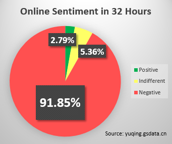

class:large

```{r setup, include=FALSE}
options(htmltools.dir.version = FALSE)
```

## Political Influences of Language Policy

--

* Language policy and language habits of Chinese citizens

--

* Influences on institutional-based political trust

--

* .magenta[Influences on process-based political trust]

--

* Influences on political beliefs

---

class:large

## Process-based Trust?

--

* Institutional-based vs. Process-based trust (Zucker 1986)

--

* Imagined vs. Engaged (Thomas 1998; Wang 2005)

--

* Support for the government and regime legitimacy (Tolbert and Mossberger 2006; Li 2004; Reisinger et al. 2017)

---

class:large

## Process-based Trust in China

--

* 7.19 million

--

* Deep engagement<br><div>


</div>

---

name: fragile

## Fragile Processed-Trust

<div>


</div>

--

* Dialect/language Choice

???

网友爆出9月22日福建高速收费站一司机与高速收费员持卡“对峙”

清博大数据, 清华新闻系教授博导沈阳

---

## Dialect Choice

.center[]


---

class:large

## Language Attitudes

* .magenta[Attitudes] $\leadsto$ Speakers of different .orange[languages].
    + A "turn-on" button<br><br><div class="centered">
    
--


</div>

---

class:large

## Language Attitudes

--

* Systematic (Gardner and Lambert 1972; Hiraga 2005)

--

* Influential (Kervel 2011; Dragojevic 2017) 

---

class:large

## Culture-Marker Theory


.center[]


* Language marks culture.

--

* People prefer speakers from the same cultural communities.

--

* $H_{Culture}$: *People have more trust in .red[dialect]-speaking government representatives.*

???

1. Other cases: Northern vs. Southern, Nevada

1. Cross nationally: standard mandarin in China and Singapore

---

class:large

## Authority-Marker Theory

--

* .magenta["New"] language

--

* .magenta[Unique] voice of the authority

--

* $Attitude_{gov} \leadsto Attitude_{rep}$

--

* $H_{Authority}$: *People have more trust in .red[Putonghua]-speaking government representatives.*


???

Other cases: interpreters are more respected in colonial countries.

---

## Examining Language Attitudes

--

### Method

.center[]


---

name: experiment

## Adjusted Matched-Guise Experiment

.pull-left[

### Original Design


]

.pull-right[

### Adjusted Design


]


---

class:large

### Internal validity: $\checkmark$

--

### External validity: Scenarios-embedded

--

* Scenario I: Shuffle Response

> Earlier this month, a downstairs neighbor continually made loud noises in the apartment beneath the one in which one of your classmates lives. It had a serious effect on people's lives there. To resolve this issue, the parent of your classmate called the public service hotline. The call was first transferred to the .magenta[City Department of Property Management] and then to the .magenta[Municipal Construction Committee]. Public servants responded to the call in the following recording.

???

假设你一个同学家楼下是底商。本月初发现楼底下有极大的噪音，请专人测量确实噪音已经超出了规定范围。调查发现底商中央空调的压缩机产生的。为了解决这个问题，这位同学的家长打电话给12345市民服务热线，先后被转到物管办和住建委。录音记录了他们的回应。

---

class:large

* Scenario II: Recrimination

.center[]


???

一天，一名早点摊摊主来你这里对城市管理人员执法进行投诉。以下是投诉录音。

---

class:large

* Questions on each speaker respectively.
    + General trust (Trust game)
    + Emotional closeness (IOS measurement)
    + Content authenticity

???

* 总体信任
* 感情上亲切
* 内容上可信
       
---

name:trustGame
class:large

## Measurement of General Trust

Trust game:

* Strength: Abstract trust $\rightarrow$ money decision
* Process: Subjects have ten golden coins
    + Play with the speaker
    + 1-coin investment from subject = 3-coin profits of speaker
    + Speaker decides how much to return
    + Goal: maximize the own coins
    

---
name: subMeasures
class:large

## Measurement of Emotional Closeness

* IOS<br><br>
* Direct question

???

这两个部门的工作人员谁听上去更亲切些？

---

name: subMeasures
class:large

## Measurement of Content Authenticity

* Authenticity: Do you believe what the speaker said?
     + e.g., "*Given there is one department in the recording actually responsible to the complaint, which department do you think it is, City Department of Property Management or Municipal Construction Committee?*"
     

---

## Application in China

--

* 2016.12 -- 2017.01

--

* 421 high school students
    + Feasible
    + Valid
    + Implicatable

???

Gauge [geɪʤ]

Census [sɛnsəs]

over 92% of the current school-age students will enter high school

---

### Ecological validity:

.pull-left[]
.pull-right[]


---

## Balance of the Experiment


.center[]

---

## Results: Improving Trust


.center[]


???

Fixed effect is used to rule out the influence of experiment place on the results. 

Results do not substantively change after controlling for female, local growth, family income, interpersonal trust, mandarin proficiency.


---

class: large

## Results II: Minimzing Distrust

--

What should a government care more? 

--

* Trust $\leadsto$ Super trust?

--

* Distrust $\leadsto$ Trust?

---

class: large

## Results II: Minimzing Distrust

What should a government care more? 

* Trust $\leadsto$ Super trust < .magenta[Distrust] $\leadsto$ .magenta[Trust]

--

.center[]

---

## Substantively Significant?

.center[]


---

class:large

## What Is This Effect About?

--

Esteem of the Educated?

--

.center[]

---

class:large

## What Is This Effect About?

--

* Respect for the Authority vs. Esteem of the Educated

--

* Same experiments, same subjects, scenarios of .magenta[ordinary] people

---

class:large

## What Is This Effect About?

* Respect for the Authority vs. Esteem of the Educated

* Same experiments, same subjects, scenarios of .magenta[ordinary] people
    + Response: cell phone selection (friends)
    + Recrimination: traffic accident (private car drivers)

--

.center[]

---

class:large

## Implications

--

* Language attitude $\rightarrow$ political trust.

--

* Over 87% countries have at least one official language. 

--

* Domestic $\leadsto$ local & cross-national.
    + Valid experimental approach.


---

class: inverse, center, middle

# Thank you!

<i class="fa fa-envelope fa-lg"></i>&nbsp; [yue-hu-1@uiowa.edu](mailto:yue-hu-1@uiowa.edu)

<i class="fa fa-globe fa-lg"></i>&nbsp; https://sammo3182.github.io/

<i class="fa fa-github fa-lg"></i>&nbsp; [sammo3182](https://github.com/sammo3182)

<i class="fa fa-twitter fa-lg"></i>&nbsp; [@yuehupolisci](https://twitter.com/yuehupolisci)
