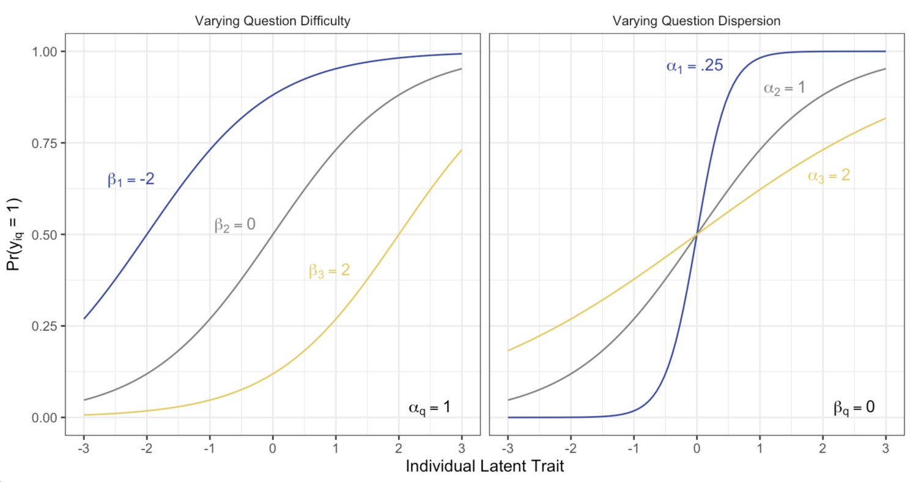
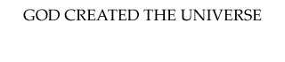

class: inverse, bottom

```{r setup, include = FALSE}
knitr::opts_chunk$set(echo = FALSE, message = FALSE, warning = FALSE, htmltools.dir.version = FALSE)

xaringanExtra::use_xaringan_extra(c("tile_view", # O
                                    "broadcast", 
                                    "panelset",
                                    "tachyons"))


library(pacman)
p_load(
  "icons",
  "ltm",
  "mirt",
  "TeachingSampling",
  "lme4",
  "DCPO",
  "knitr",
  "ggalt",
  "drhutools",
  "latex2exp",
  "tidyverse"
)

# Functions preload
set.seed(313)

theme_set(theme_minimal())
```


+ Common problem
+ Methodological solution
+ A new weapon
+ [Un]expected findings 

# Overview

---

class: center, middle

.bg-black.golden.ba.shadow-5.ph4.mt3.center[
Social scientists are interested in complex, abstract concepts.
]


.large[Common objectives]    
Development, culture, democracy...

\+ 

.large[Rich data]    
WVS, Global Barometers, ?GSS, Pew ...


.large[.red[&#10504;]]

.large[Clear patterns]


---

## E.g.: Democracy &larr;?&rarr; Public support

Support .navy[&uarr;] &rarr; democracy .navy[&uarr;] .small[(e.g., Inglehart & Welzel 2005, Claassen 2019)]    
Support .navy[&uarr;] &rarr; democracy .red[&#8675;] .small[(e.g., Fails & Pierce 2010)]

???

Countries with greater democratic support have been found to become stronger and more stable democracies

Inglehart, Ronald and Christian Welzel. 2005. *Modernization, Cultural Change, and Democracy*. Cambridge: Cambridge University Press. 

Fails, Matthew D. and Heather Nicole Pierce. 2010. “Changing Mass Attitudes and Democratic Deepening.” *Political Research Quarterly* 63(1):174–187.

(Insignificant positive with one-year survey, and insig negative with multiple years)

--

Democracy .navy[&uarr;] &rarr; support .navy[&uarr;] .small[(e.g., Wuttke et. al. 2020) ]   
Democracy .navy[&uarr;] &rarr; support .red[&darr;] .small[(e.g., Foa & Mounk 2017)]  
Democracy .red[&darr;] &rarr; support .navy[&uarr;] .small[(Claassen 2020)]

???
More experience with democracy yields more democratic support 
vs.
Long-established democracies are suffering from democratic fatigue 

Wuttke, Alexander, Christian Schimpf and Harald Schoen. 2020. “When the Whole Is Greater
than the Sum of Its Parts: On the Conceptualization and Measurement of Populist Attitudes and Other Multidimensional Constructs.” *American Political Science Review* 114(2):356–374.

Foa, Roberto Stefan and Yascha Mounk. 2017. “The Signs of Deconsolidation.” *Journal of Democracy* 28(1):5–15

thermostatic effect. 

---

## Puzzle Makers: Invisible Opinions

.red[Different] questions

.center[]

???
Why are there mixed results? 
Difficutlies in measuring. 
First, pub sp is latent variable, unobservable. Uncertainty. 
Sec, a big challenge is the sparced and fragmented data at aggregate level. 
churchihill items,  democracy has its probles, still the best one. 
milltary rule items, military should govern the country. what do you think. 
Worldwide survey project, 4 years. 
across countries, overtime. 

---

.red[Different] respondents

.pull-left[


]

--

.pull-right[


]

???

Different respondents have different concepts of democracy and different way to support democracy. 
United Kindom, lawmakers leave. 
Swarming Capital defending democracy.  

---

class: center, middle, large

Different questions   
Different people   
&dArr;    
.red[Incomparable] data   


--

w. 

.blue[Latent variable analysis]


---

class: inverse, bottom

+ Variable extraction
+ Individual IRT
+ Group IRT
+ DCPO

# Methodology Moment

---

.center[World of Latent Variable Analysis]

.pull-left[
### Factorial Models

1. Exploratory Factor Analysis
1. Confirmative Factor Analysis
1. Structural Equation Model
]

.pull-right[
### Typological Models

1. Item Response Theory (IRT)
1. Cross-Group Comparison(MrP, GIRT, DCPO)
]

--

.center[
## Operation

R<sup>\*</sup>    
[`mirt`](https://github.com/philchalmers/mirt/wiki);    
[`DCPO`](https://github.com/fsolt/DCPO)
]

.footnote[[\*] R packages for IRT > [50](https://www.tandfonline.com/doi/full/10.1080/15366367.2019.1586404?src=recsys).]

---

## IRT

Why not factor analyses?

--

1. The outcome is assumed .red[continual];
1. Different types (categorical, binary, ordinal, continual) of indicators are assumed .red[identical] in nature;
1. Ignoring .red[cross-group] differences;
1. EFA cannot address the .red[covariance] among indicators;
1. CFA: Simpler theory or .red[low-fit] model.

???

CFA理论通常简略，只涉及一部分indices，但实际可能很复杂；当囊括更多indices测量质量会高，但不符合理论。

---

class: middle


## Why IRT


1. Created for .red[noncontinuous] variables (binary &rarr; ordinal + continuous);

--

1. Open to incorporate with .red[Bayesian] inference and no .red[scaling] issue;

--

1. Better dealing with .red["don't know"s] within the Bayesian framework

--

1. Being Enable .red[cross-group] comparison.

---

## Individual-Level IRT

Usage: Within-survey latent variable analysis

Objective:

1. Yes/No;
1. Responses that can convert to binary;
3. Ordinal responses(e.g., Liker scale questions).

---

class: large

### IRT Assumption

1. Monotonicity
1. Unidimensionality
1. Local independence
1. Parameter invariance

---

class: center, middle, large

# Monotonicity

Trait level &uarr; &prop; Pr(=1) &uarr;


???

As the trait level is increasing, the probability of a correct response (=1) also increases.

单增趋势：随潜在变量增加，获得1的可能性也随之增加。

Item characteristic curve

比如随着能力的提高，回答正确答案的机会也就越高

---

class: center, middle, large

# Unidimensionality

One dominant latent variable &rarr; Observed items

???

One dominant latent trait driving force for the responses observed for each item

+ 聚合的项目均指向同一个潜在变量。  
+ 基于理论  

--

Until the multidimensional IRT

---

class: center, middle, large

# Local Independency

.red[cov(items) &larr; latent trait]

P(y<sub>iq</sub>,y<sub>i'q</sub> | &theta;<sub>q</sub>) = P(y<sub>iq</sub> | &theta;<sub>q</sub>)P(y<sub>i'q</sub> | &theta;<sub>q</sub>)

???

Responses given to the separate items in a test are mutually independent given a certain level of ability.

对于每一项目（e.g.,一道题）的响应(e.g., 选择的选项)间的关联性.red[只]来自.red[共同]的潜在变量。

换言之，控制潜在变量影响后，问题间响应相互独立

---

class: center, middle, large

# Parameter Invariance

Invariance among items    
Invariance among respondents (DIF)


???

+ Parameters在项目间不变
+ Parameters在响应人群间不变<sup>1</sup>
    + 当进行Multiple Group IRT时尤可能被违反

Easy to be avoid when involving multi-group IRT

.footnote[<sup>\*</sup> Check the differential item functioning (DIF) with Wald and likelihood-ratio approach.]

---

## IRT Models

### Individual IRT
Rasch Model (1PL)     
&rarr; Two-Parameter Logistic Model (2PL)     
&rarr; Three-Parameter Logistic Model (3PL)     
&rarr; Four-Parameter Logistic Model (4PL)

### Group IRT

MIRT    
&rarr; DGIRT    
&rarr; DCPO

---

## Rasch Model (1PL)

+ y<sub>iq</sub>&isin;{0,1}: subject `i`'s score on question `q`
+ &theta;<sub>i</sub>&isin;{-&infin;, +&infin;}: Unbounded latent trait
+ &sigma;<sub>q</sub>: Difficulty

.pull-left[.center[.orange[Pr(y<sub>iq</sub> = 1)] = ]]
.pull-right[.navy[logist<sup>-1</sup>(&theta;<sub>i</sub> - &sigma;<sub>q</sub>])]


???

Rasch /resh/  

Difficulty: 不同的问题回答肯定答案的难易度不一样, 通常显示为z scores， 低于0 表示比较简单
+ 当面临重大公共卫生威胁时，政府应该及时响应，采取果断措施
+ 政府是否可以牺牲少数民众安全和权力，来换取大多数社会成员的公共卫生安全时

--

.pull-left[
.orange[Item Response]
]

.pull-right[
.navy[Response Theory]
]

---

## An Simple Example (Bock & Lieberman 1970)

Law School Admissions Test, sec 7  
5 yes/no questions

```{r data-verbal}
df_lsat <- expand.table(LSAT7)
summary(df_lsat) %>% kable(format = "html")
```

???

[`mirt` Workshop 1](http://philchalmers.github.io/mirt/extra/mirt-Workshop-2015_Day-1.pdf)

---

## Difficulty Parameter

```{r rasch-difficulty, echo=TRUE}
m_lsat <- mirt(df_lsat, model = 1, itemtype = "Rasch", verbose = FALSE)
coef(m_lsat, simplify = TRUE) %>% 
  kable(format = "html")
```

???

The difficulty parameter is the `d`

The rest parameters we'll talk in 2pl and 3pl

---

class: center, middle

.bg-black.golden.ba.shadow-5.ph4.mt3.center[
.large[Please always diagnose your results and .red[understand] what you are diagnosing.]

.tr[
— Dr. Hu
]]

---

## IRT Diagnoses

+ General level：Global fit
+ Item level：Item fit & residual
+ Respondent level：Personal fit

---

## Global Fit<sup>1</sup>

$$G^2 = 2[\sum_l^s r_lln(\frac{r_l}{N\tilde{P}_l})]$$

N: Number of respondents  
l: Possible options   
r: Number of respondents who respond with l

--

When item > 10，M<sup>2</sup>, M<sup>2</sup>* (Modified version of G<sup>2</sup>)

```{r diagnostics-overall, echo=TRUE}
M2(m_lsat)
```


.footnote[
[1] RMSEA, SRMSR, CFI, TLI also works
]

???

REDO: @Maydeu-Olivares2013

N is the number of subjects, L is number of possible response patterns, $P_ l$ is the estimated probability of observing response pattern l, and $r_ l$ is the number of subjects who have response pattern l

&chi; sig   
Tucker-lewis index, 1 ideal, < .95 poor   
Comparative fit index, the same   
Root mean square error of approximation, 0 perfect, <.05 good, [.05, .08] ok, > .1 poor    
Standardized root mean square residual <.08 acceptable

---

## Item Characteristic Curves （ICC）

```{r icc, fig.height=8, fig.width=10, fig.align='center'}
plot(m_lsat, type = "trace", facet_items = FALSE)
```

???

检查各题affirmative的难易程度，看逐个是不是大体同一个趋势

---

## Test Charactersitic Curve

```{r tcc, fig.height=8, fig.width=10, fig.align='center'}
plot(m_lsat, type = "infoSE")
```

???

TCC： 所有ICC之和，体现how reliable, information 理想是形成一个钟形,顶尖处代表平均水平，据此对比个人&theta;可以判断这人是否是outlier
SE(&theta;) = (test)<sup>-1/2</sup>

---

## Item Diagnostics

Covariation-based residuals

```{r diagnostics-residual, echo=TRUE}
residuals(m_lsat)
```

???

看item residual的协变程度，多用于看multidimensionality, 不应有关联


---

Single item/person fit 

```{r item-infit, echo=TRUE}
# Item 
itemfit(m_lsat, fit_stats = "infit")
```

```{r personfit, echo=TRUE}
# Person
personfit(m_lsat)
```


???

Z<sub>h</sub> > 0 better

infit/outfit, close to 1 is good


---

## If There's a Problem


1. Check S-&chi;<sup>2</sup>, local dependency
1. Using more complex model types, e.g.,&rarr; 2PL, 3PL;
1. Binary to polytomous or nominal response models
1. Non-parametric smoothing techniques

---

## Cons of Rasch Model

Measurement error

.center[]

???

人们对同一个题理解不同，回答出affirmative答案可能性也不同。

---

## Two-Parameter Logistic Model (2PL IRT)

.center[

**Rasch**: Pr(y<sub>iq</sub> = 1) = logist<sup>-1</sup>(&theta;<sub>i</sub> - &sigma;<sub>q</sub>)

**2PL**: Pr(y<sub>iq</sub> = 1) = logist<sup>-1</sup>(.red[&kappa;<sub>q</sub>]&theta;<sub>i</sub> - &sigma;<sub>q</sub>)

]

&kappa;<sub>q</sub>: Discrimination (Parameter of dispersion)

???

Discrimination: how well a question can different people from below to above;

Rule of thumb above 1 meaning a good question in terms of examination

--

### Another format

$$Pr(y_{iq} = 1) = logist^{-1}[\frac{\theta_i - {\color{red}{\beta_q}}}{\color{red}{\alpha_q}}]$$


&beta;<sub>q</sub>: &sigma;<sub>q</sub> &frasl; &kappa;<sub>q</sub>, threshold("difficulty", location)  
&alpha;<sub>q</sub>: &kappa;<sub>q</sub><sup>-1</sup>, dispersion (slop)

???

Dispersion: magnitude of the measurement error 

---

.center[]

???

Difficulty/discrimination: how well a question can different people from below to above

Dispersion: magnitude of the measurement error

---

```{r ltm, echo=TRUE}
m_lsat2PL <-  mirt(df_lsat, model = 1, itemtype = "2PL", verbose = FALSE)
coef(m_lsat2PL, simplify = TRUE)
```

---

## Do We Really Need 2PL?

.center[]

--

Likelihood-Ratio Test

```{r llr, echo = TRUE}
anova(m_lsat, m_lsat2PL) %>%  
  select(AIC, SABIC, HQ, logLik, df, p) %>% 
  kable(format = "html")
```

---

## What If...

.center[]


.center[

&dArr;    
A lot of .red[low &theta;] respondents

]

???

很多人全凭猜怎么办？

---

## Three-Parameter Logistic Model (3PL)

$$Pr(y_{iq} = 1) = \color{red}{c_i + (1 - c_i)}logist^{-1}[\frac{(\theta_i - \beta_q)}{\alpha_q}]$$

c<sub>i</sub>：Item lower asymptote ("guessing")

--

 Tip: Recommend N > 1,000

???

极大增加演算成本&rarr;通常需要1000以上观测点

---

## What If...

.center[]

---

### Four-Parameter Logistic Model (4PL)

$$Pr(y_{iq} = 1) = c_i + (\color{red}{d_i} - c_i)logist^{-1}[\frac{(\theta_i - \beta_q)}{\alpha_q}]$$


c<sub>i</sub>：Item lower asymptote ("guessing")    
d<sub>i</sub>：Item .red[upper] asymptote ("carelessness"), d < 1

--

 Tip: Considering we already need .red[1,000] for 3PL....

???

鉴于3PL已经需要1000-ish观测点……

---

## Extentions: Unidimentional to Multidimentional

~~Unidimensionality~~


Multidimentional IRT (MIRT, Phil Chalmers, 2015)

$$Pr(y_{iq} = 1) = logist^{-1}[\frac{\boldsymbol{\theta_i} - \beta_q}{\boldsymbol{\alpha_q}}]$$


.center[**&theta;<sub>i</sub>** and **&alpha;<sub>q</sub>**: Scalar &rarr; Matrix。]

???

Pyschologist


1. Monotonicity
1. Unidimensionality
1. Local independence
1. Parameter invariance

---

## Extension: Binary to Ordinal

Logit &rarr; Cumulative logit

Pr(y<sub>iq</sub> = 1) &rarr; $Pr(\frac{y_{iq}\leq c}{y_{iq}>c})$

--

```{r twoDimension, fig.height=8, fig.width=20, fig.align='center'}
m_lsat2D <- mirt(df_lsat, model = 2, verbose = FALSE)
plot(m_lsat2D, type = "score")
```

---

## Ordinal IRT: Three Oft-Used Modeling

1. (Modified) Graded Response Model (GRM)
    + Better for scoring rubrics, e.g., Likert

--

1. (Generalized) Partial Credit Model (PCM)，Rating Scale Model (RSM)
    + Quit similar to GRM
    + Not require boundary parameters to be ordered
    + Need larger sample size

--

1. Nominal Response Model
    + Better for categorical

???

https://stats.stackexchange.com/questions/402440/how-should-we-select-between-various-item-response-theory-models-e-g-rsm-grm

The rating scale model (RSM) and partial credit model (PCM) are Rasch models. The graded response model (GRM) and the generalized partial credit model are non-Rasch (multinomial).


https://studylib.net/doc/18099752/irt-models-for-polytomous-response-data

---

class: inverse, bottom

# Group IRT

---

## Fixing the Measurement Error Due to the Group Variance

.center[]

Multilevel Mixture IRT with Item Bias Effects (Stegmueller 2011)

$$Pr(y_{iq} = 1) = logist^{-1}[\frac{\theta_i - {\beta_q}}{\color{red}{\alpha_q}}]$$


Using random effect estimating &alpha;<sub>q</sub>


???

Daniel Stegmueller, Duke U, poli sci

&alpha;: Dispersion: magnitude of the measurement error 

---

## Finding the Group-Level Latent Variables

Group mean of individual responses

.center[y<sub>kq</sub> = &Sigma;y<sub>ikq</sub> &frasl; n.]

--

Aggregation Issues:

1. The mean does not have much substantial influence to the result if the group `k` is too small.
1. Different `y`s have different contributions to the latent variable.

???

问题：

1. 如果群组过小，其平均值的代表意义不大
2. 不同的指标对于潜在变量贡献不一样

---

## Getting the Group Mean Right

Multilevel Regression and Post-stratification (MrP)

.red[Predict] a parameter of interest within .red[small domains] through .red[modeling the mean] of the variable of interest .red[conditional on poststratification counts]. 


???

Gelman, Andrew, and Thomas C. Little. 1997. “Poststratification Into Many Categories Using Hierarchical Logistic Regression.” Survey Methods 23: 127--135.


经过群组信息（地理、人口）加权的平均值


--

1. A population is .red[divided] into `H` strata of interest (for example states);

--

2. The parameters of interest are the .red[means in each strata] &theta;<sub>h</sub> (h = 1...H);

--

3. Every stratum is cross-classified by some .red[demographics] j &isin; H, besides every .red[population count] N<sub>j</sub> is known;

--

4. All of the population means &mu;<sub>j</sub> can be estimated by using some statistical technique, such as .red[multilevel regression].

.pull-left[
$$\theta_h = \frac{\sum_{j \in h} N_j \mu_j }{\sum_{j \in h} N_j}$$
]
.pull-right[
N: Population of the stratum (Census)
]

???

.Small[
1. 将总体（population）按群组（strata，如国家、地区）切分；
1. 估测对象为核心变量在每个群组中的平均值/比例， &theta;<sub>h</sub> (h &isin; {1, H});
1. 已知各群组以人口变量j（如老年男性、青年女性等）划分，群组人口（N<sub>j</sub>）或占总人口比；
1. 各组总体平均值&mu;<sub>j</sub>可通过multilevel model 进行估算。
]

---

## Example

Source: Economic variables of 2,396 industrial companies in a particular year

Goal: Average income of industries by .red[each of the five existing zones](&theta;<sub>1~5</sub>). 

Company levels and zones (the population, "company census")

```{r descriptive-level}
data(Lucy)
table(Lucy$Level, Lucy$Zone) %>% 
  kable(format = "html")
```

???

https://www.r-bloggers.com/gelmans-mrp-in-r-what-is-this-all-about/


---

Fortunately, we know the .red[true] averages at this time.


```{r trueMean}
tb_true <- group_by(Lucy, Zone) %>% 
  summarise(income = mean(Income) )
tb_true %>% 
  kable(format = "html", digits = 2)
```

---

A random sample of 1,000 from the 2,396 population

```{r rawVsTrue, fig.cap="Sample Means vs. True Means", fig.align='center', fig.height=6, fig.width=10}
SLucy <- sample_n(Lucy, size = 1000)
Np <- table(Lucy$Level, Lucy$Zone)


tb_compare <- group_by(SLucy, Zone) %>%
  summarise(income = mean(Income)) %>%
  left_join(tb_true, by = c("Zone")) %>%
  mutate(incomeTrue = 0,
         rawDiff = income.x - income.y, )

ggplot(tb_compare, aes(x = incomeTrue, xend = rawDiff, y = Zone)) +
  geom_dumbbell(
    size = 4,
    size_x = 8,
    size_xend = 8,
    color = gb_cols("gold"),
    colour_x = gb_cols("red"),
    colour_xend = gb_cols("black"),
  ) +
  labs(subtitle = "Raw Mean vs. True Value")
```

---

class: Small

## Step I: Mr

.center[
Income = &beta;<sub>0z</sub> + &beta;<sub>1z</sub>Level<sub>iz</sub> + &epsilon;<sub>iz</sub>

&beta;<sub>0z</sub> = &gamma;<sub>00</sub> + &gamma;<sub>01</sub>Zone<sub>z</sub> + u<sub>0z</sub>]

--

Output: Post-strata means

```{r mr, echo=TRUE}
# Step 1: <<MR>> - Multilevel regression
M1 <- lmer(Income ~ Level + (1 | Zone), data = SLucy)
SLucy$Pred <- predict(M1)

# Summary
sum <- group_by(SLucy, Zone, Level) %>% 
  summarise(mean2 = mean(Pred))
Mupred <- matrix(sum$mean2, ncol = 5, nrow = 3)

rownames(Mupred) <- levels(SLucy$Level)
colnames(Mupred) <- levels(SLucy$Zone)

Mupred %>% kable(format = "html", digits = 2)
```

---

## Step II: P

N<sub>z</sub> &times; weighted mean / N<sub>z</sub>

```{r p, echo=TRUE}
colSums(Np * Mupred) / count(Lucy, Zone)$n
```

---

## Comparision

```{r mrpVsraw, fig.height=8, fig.width=10, fig.align='center'}
# Step 2: <<Post-stratification>>
# Mean income estimation per zone
tb_compare$mrpDiff <-
  colSums(Np * Mupred) / count(Lucy, Zone)$n - tb_compare$income.y
tb_compare <- rename(tb_compare,
                     Raw = rawDiff,
                     MrP = mrpDiff)

tb_compare %>%
  pivot_longer(Raw:MrP, names_to = "methods", values_to = "diff") %>%
  ggplot(aes(
    x = incomeTrue,
    xend = diff,
    y = Zone,
    color = methods
  )) +
  geom_dumbbell(
    size = 3,
    size_x = 8,
    size_xend = 8,
    colour_x = gb_cols("red"),
    alpha = 0.7) +
  scale_color_gb(palette = "digitMixed")
```

---

## What MrP Can't Solve

+ Question uniqueness &times; Zones
+ Scale of questions
+ Measurement Error
+ Time trend

--

After, all, MrP is still a mean measurement of the latent variable.

--

### Solution

Dynamic Group-level IRT (DGIRT, Caughey & Warshaw 2015)

???

Combining IRT and MrP plus dynamic element

---

## DGIRT

1. Estimate IRT within each group;    
&rarr; .red[Latent variable] in
1. Embed the group IRT in a multilevel framework;    
&rarr; .red[Group] in
1. Allowing hierarchical parameters to evolve according to a dynamic model;    
&rarr; .red[Time] in
1. Weight the estimates with for groups.    
&rarr; .red[MrP] in


---

## Latent Variable Estimates at the Group Level

Individual

$$p_{iq} = logist^{-1}[\frac{\theta_i - {\beta_q}}{\alpha_q}]$$

--

Group     
(k &isin; {1...K})

$$\eta_{ktq} = logit^{-1}(\frac{\color{red}{\bar{\theta}_{kt}}- \beta_q}{\sqrt{\alpha^2_q + \color{red}{(1.7\sigma_{kt})^2}}}).$$

.center[
$\bar{\theta}_kt$ and &sigma;<sub>kt</sub> is the mean and SD the latent variable in Group `k` at time `t`.
]

???

1.7: sd of probit is (&pi;/3)<sup>1/2</sup> for logit, while Long 1997 found it is more close to 1.7 in actual estimations.

Mislevy, Robert J. 1983. “Item Response Models for Grouped Data.” Journal of Educational Statistics 8(4): 271–88.

&eta;: eta 

---

## Modeling Time and Space

$$\bar{\theta}_k\sim N(\xi_t + \boldsymbol{x'_k\gamma}, \sigma^2_{\bar{\theta}})$$

.center[&xi;<sub>t</sub> ~ N(&xi;<sub>.red[t-1]</sub>;&sigma;<sub>&gamma;</sub><sup>2</sup>)]

.center[&gamma;<sub>pt</sub> ~ N(&gamma;<sub>p,t-1</sub>&delta;<sub>t</sub> + .red[**z'<sub>p.</sub>&eta;<sub>t</sub>**], &sigma;<sub>&gamma;</sub><sup>2</sup>)]

.center[n<sup>*</sup><sub>kqt</sub>]

???
 
&xi;<sub>t</sub>: xi

x 为群组级变量  
t-1, dynamic linear model  
**z'<sub>p.</sub>&eta;<sub>t</sub>**: geography-level attributes, &eta;是coefficients  
n<sup>*</sup><sub>kqt</sub>基于MrP

---

.pull-left[
### Pros

+ Including time, space, and questions
+ Increasing representativeness
]

--

.pull-right[
### Cons

+ Complicated
    + In weeks
]

???

Caughey & Warshaw称会跑几个星期

--

### Simpler DGIRT (Claassen 2019)

Simplified 1. Only at the country level (no MrP then 😝)   
Simplified 2. From estimating &alpha; (dispersion) to &beta; (difficulty)  
Simplified 3. Ignoring polarization.


???

&delta;<sub>kq</sub>: 问题的difficulty随国家k变化。

---

## The Newest Development in Group IRT: DCPO

.pull-left[
.red[D]ynamic .red[C]omparative .red[P]ublic .red[O]pinion (Bayesian-Based)

### Complexity 

Claasseen 2019 < DCPO < DGIRT

]

.pull-right[


Frederick Solt (University of Iowa)
]

---


## DCPO

$$Pr(y_{ktqr} = 1) = logist^{-1}[\frac{\bar{\theta}'_{kt} - {(\beta_{qr} + \color{orange}{\delta_{kq}})}}{\sqrt{\alpha^2_q + (1.7\times \color{red}{\sigma_{kt}})^2}}]$$


.pull-left[
$\bar{\theta}$: Mean public opinion    
&beta;: Question difficulty   
&alpha;: Question dispersion
]

.pull-right[
.orange[&delta;]: Country-specific item bias   
.red[&sigma;:] Polarization in public opinion]

--

.green[Random walk priors] for opinion mean and sd

$$\bar{\theta}_{ktqr}\sim N(\bar{\theta}'_{k, \color{green}{t-1}}, \sigma^2_{\bar{\theta}'}),\sigma_{kt}\sim LN(\sigma_{k, \color{green}{t-1}}, \sigma^2_{\sigma})$$

???
D(dynamic)C(comparative)PO
model country specific-item to address equivalence. 
aggregate level public opinion 
polarizaiton 
ordinal scaled answers. 
The sophisticated measurement models ignite the hope on the studies of relationship between democratic development and public support. 

Claassen, Christopher. 2019. “Estimating Smooth Country–Year Panels of Public Opinion.” *Political Analysis* 27(1):1–20

Caughey, Devin, Tom O’Grady and Christopher Warshaw. 2019. “Policy Ideology in European
Mass Publics, 1981–2016.” American Political Science Review 113(3):674–693

Solt, Frederick. 2020b. “Modeling Dynamic Comparative Public Opinion.” SocArXiv
10.31235/osf.io/d5n9p.


---

background-image: url("../courses/governmentalBigData/images/irtCompare.png")
background-position: center
background-size: contain


???

Bounded: 使用logit归为0-1

---

## Validations

.center[]

---

## Operation

1. Collect survey data and identify the survey items (.red[mostly automated]);
1. Generate raw dataset (using `DCPOtools`, .red[automated]);
1. Reformat dataset for model (using `DCPOtools`, .red[automated]);
1. Analyze the data with `DCPO`
1. Diagnosis for convergence with `shinystan`.


---

class: middle, center

## One More Thing and An .red[Important] Thing to Use DCPO .red[Correctly]!

No uncertainty engaged &hArr; The latent variable is measured "perfectly".

&dArr; 

Biased coefficients and standard errors.


--

.bg-black.golden.ba.shadow-5.ph4.mt3.center[
Uncertainty Matters!
]

---

### How to Cope?

Overimputations (Alternative: model of compositions)

1. .red[Repeated] Latent variable estimation (e.g., DCPO &times; 1000);
1. Regressing with the .red[distribution];
1. .red[Combination] with Rubin's Rule.

???

Blackwell, Matthew, James Honaker, and Gary King. 2017. “A Unified Approach to Measurement Error and Missing Data: Overview.” Sociological Methods & Research: 303–41.


---

## Going Against the Most Recent Findings 

Claassen 2020 AJPS; Claassen 2020 APSR

.pull-left[]

--

.pull-right[
### More Data together with Better Method

1988~2020 (144 countries, 33 years)

Comparing with Claassen (2020a, 2020b):

> 26.2% .red[more] questions;     
33.3% .red[more] survey sources
]

---

background-image: url("../conference/2021-AsianPoliMeth/images/visualizeAJPS-1.png")
background-position: center
background-size: contain

## Findings

---

background-image: url("../conference/2021-AsianPoliMeth/images/visualizedAPSR-1.png")
background-position: center
background-size: contain

---

## Potential Explanations

.pull-left[
### Methodology

1. .red[Multidimensional] support;
1. Conceptual .red[Difference];
1. Relations with .red[other values].

]

???

survey questions do not ask respondents how they prioritize democracy relative to other values with which it may come into conflict, such as their partisanship.cannot capture the extent

--

.pull-right[
### Theory

1. Effectiveness .red[>] existence
1. Support + .red[dissatisfaction]
1. .red[Elite] driven

]

???

It's is the combination of democratic support and dissatisfaction with current regime performance that generates demand for greater democracy

Qi, Lingling and Doh Chull Shin. 2011. “How Mass Political Attitudes Affect Democratization: Exploring the Facilitating Role Critical Democrats Play in the Process.” *International Political Science Review* 32(3):245–262

---

## Take-Home Points

1. Rethinking Democracy &harr; Public support: .red[~~Sanguine~~] assessment
1. Cross-section time-series diverse-question method: .blue[DCPO]
    + `DCPO`
    + `DCPOtools`
    
<iframe src="https://ctai.shinyapps.io/dmsweb/" height = 300 width = 1000></iframe>
    

???
Uncertainty caused by measurement and in concept. 
without taking uncertainty into account, no way of knowing whether their conclusions are correct or not even their studies have been published in top journals. 

Sanguine, super optimistic fate of democracies rely on their public, but is not well grounded. 
practioners and researchers interested in democracy and understanding democracies should work hard to figour out what is going one. 
we point several potential explanations, but we dont' know which one is right. each of them is worth additional research. 

---

background-image: url("images/hives.png")
background-position: right bottom
background-size: 50%

class: inverse

# Thank you!

`r feather_icons("mail")`&nbsp;[yuehu@tsinghua.edu.cn](mailto:yuehu@tsinghua.edu.cn) 

`r feather_icons("globe")`&nbsp; https://sammo3182.github.io/

`r feather_icons("github")`&nbsp; [sammo3182](https://github.com/sammo3182)
