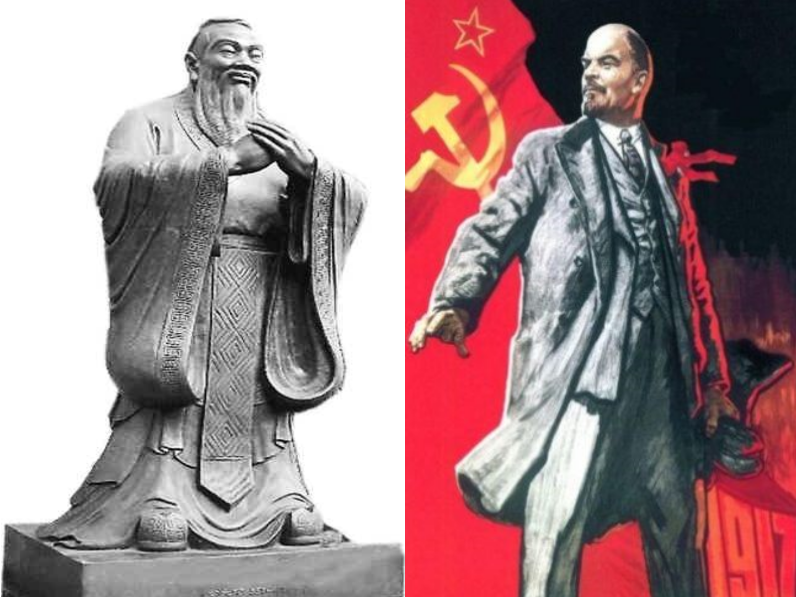

class:large

## 现象1：中国政治语言中的民主

* 《人民日报》：
    + 4000 次/年
    + 77 次/周
    + 11 次/日

--

* 并非特例
    + 俄罗斯
    + 老挝、阿尔及利亚
    + ……

---

class:large

## 现象2：“亚洲谜团”

Chu and Huang 2010:

* 亚洲国家的“两高”：
    + 高度支持民主
    + 高度支持非西方民主制度
    
---

class: large

## 迷思

“What happens to these Asian countries?!”

.center[]

--

.center[Asian puzzle]

---

class: large

## 可能的解释

此“民主”非彼“民主”——政府对民主的再建构

---

class: large

## Lu and Shi 2015 

--

.left-column[

Guardianship 文化

* 领导人品质
* 民本主义

 

* “群众路线”

]

--

.right-column[

.right[]

]

---

## 历史

.center[]

???

民本

---

class: large

## 然而……

* 没有直接证据

--

* 怎么做到的？
    + 对民主无所知？
    + 对西方民主制度无所知？