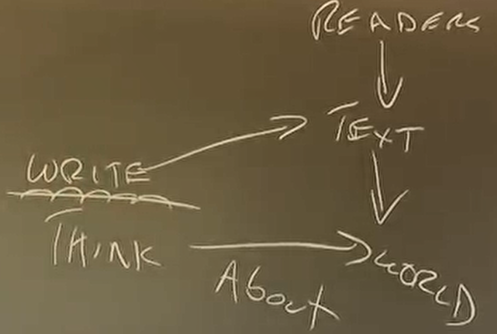

```{r setup, include = FALSE}
knitr::opts_chunk$set(echo = FALSE, message = FALSE, warning = FALSE)

if (!require(pacman)) install.packages("pacman")
library(pacman)

p_load(
  tidyverse, flexable, icons, xaringanExtra, ggeffects
) 


use_xaringan_extra(c("tile_view", # O
                     "broadcast",
                     "panelset",
                     "tachyons",
                     "fit_screen"))
use_extra_styles(
  hover_code_line = TRUE,         #<<
  mute_unhighlighted_code = FALSE  #<<
)


# Functions preload
set.seed(313)

theme_set(theme_minimal())
```

## Chicago approach

+ Top-down approach to write rather than bottom-up
+ Rule-governing training is for low-value writings
    + Memo, Reports

---

## Major Problem for Expert Writers

+ Expert writers: Writers who have expert knowledge in a certain area
    + Thinking/writing -about-> World
    + Unlike journalists, you write to help thinking
        + High-school style: Not start writing until thinking through

---

## Cross-section Problem



You create the text through the horizontal process but it is the vertical process decides whether it works.
+ Experts use language in one pattern to help thinking but read through another path.
    + Problem for readers: 
        1. Slowing down
        1. reread over and over (only you have/are forced to read)
        1. misunderstand
        1. Stop

---

## Why not readers stop reading if your work is actually terrible

+ That's also why you have no clue how to handle the problem

+ That's problem your readers are paid to read.
    + Your teachers to read the text not to understand the world but to teach you (never reach the understanding-the-world level)
    
---

## Why people read willingly?

+ When they are valuable to be read

+ Is students' writing valuable? 
    + Rarely (did the teacher publish it?)
    
---

## Rules and above rules

VALUABLE (value is NOT at the world but the READERs)

Persuasive 
organized
clear

---

## Common problem

When a PhD students come to my office, saying that this is important! I have to write about it!

What journal do you want to submit then? 

Why it matters?

It matters because value is the key! The readers are the key!

(A couse of the problem is in the examination: they do not teach you there are difference among readers)

---