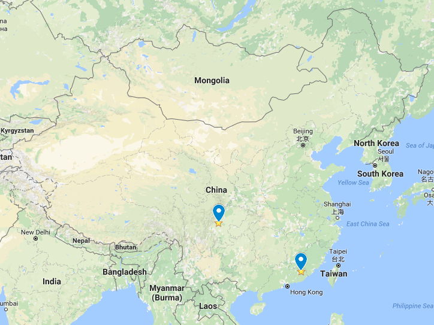

```{r setup, include=FALSE}
options(htmltools.dir.version = FALSE)
```

class:large

## 天下大势

--

.left-column[
### 因果推断逻辑

* 因果效果
* 因果机制
]

--

.right-column[
### 因果推断方法

* 计量经济学
* 实验
]

---

.center[]

## 为什么做因果推断

---

class: large

## 什么是因果效应

Neyman-Rubin causality theory (RCM):

* 实验对象（Subject, 被试） $i$
* 干预因素（Treatment, 0/1） $T$ 
* 引发效果（Effect） $Y_i$

--

* $T$ 对 $i$ 的因果效应为 $\delta$：

$$\delta_i = Y_{0i} - Y_{1i}.$$

---

class: large, center, middle

## 我们能同时看到 $Y_{0i}$ 和 $Y_{1i}$ 吗？

--

## 如果不能，我们怎么计算 $\delta$ ？

---

background-image: url(image/spiderMultiverse.png)
background-position: 50% 50%
background-size: 100%

## 反事实逻辑

???

New York City

---

class: large

## 实验室实验的基本原则

1. 目标人群 + 干预因素 $\leadsto$ 干预模式

--

1. 剔除（可见干扰 + 不可见干扰）

--

1. 控制组（后测 - 前侧）vs. 实验组（后测 - 前侧）
    + 统计推断
    + 存在、大小、方向

???

1. 研究者必须首先明确实验的目标人群以及核心干预因素，然后据此决定被试的来源和对其进行的干预模式。 
1. 研究设计必须充分考虑对可观察的干扰变量的控制，并通过随机分配控制组和实验组等方法对不可见干扰变量和难以控制的可见干扰变量进行进一步的剔除。 
1. 研究者需要对控制组和实验组在接受干预因素影响前后的态度和行为表现进行比对，并根据统计原则进行跨组比较，据此判断干预因素与行为态度之间的因果关系是否存在。


---

class:large

## 评价实验室实验——效度


.center[]

--

推断与真实的接近程度。

---

class: large

## 政治科学研究方法的效度

* 内部效度: 目标人群
    + 建构性
    + 因果性
    + 统计性
    
--


* 外部效度: 超越目标人群

--

* 生态效度: 嗯……


---

class: large

## 实验室实验的效度

.left-column[

* 一个事故
    + 可重复危机
        + 心理学（40%）
        + 经济学（50% -）
        + 自然科学
        + 政治学
        
        ]

--

.right-column[

* 几种批评
    + “学生被试”
    + “与真实不服”

{{content}}

]

--

* 一些方法
    + 内部：精确 + 控制
    + 外部：跨维度
    + 生态：真实材料、真实环境

{{content}}

---

## 怎么用

.center[]

---

class: inverse, center, middle

# Culture Marker vs. Authority Marker
## How Does Language Attitude Affect Political Trust?

---

class:large

## Process-based Trust?

--

* Institutional-based vs. Process-based trust (Zucker 1986)

--

* Imagined vs. Engaged (Thomas 1998; Wang 2005)

--

* Support for the government and regime legitimacy (Tolbert and Mossberger 2006; Li 2004; Reisinger et al. 2017)

???

Benedict Anderson, 1983, Imagined Communities.

---

class:large

## Process-based Trust in China

--

* 7.19 million

--

* Deep engagement<br><div>


</div>


---

## Dialect Choice

.center[]


---

class:large

## Language Attitudes

* Speakers of different .orange[languages] $\leadsto$ .magenta[Attitudes].
    + A "turn-on" button<br><br><div class="centered">
    
--

.center[]


---

class:large

## Culture-Marker Theory


.center[]


* Language marks culture.

--

* People prefer speakers from the same cultural communities.

--

* $H_{Culture}$: *People have more trust in .red[dialect]-speaking government representatives.*

???

1. Other cases: Northern vs. Southern, Nevada

1. Cross nationally: standard mandarin in China and Singapore

---

class:large

## Authority-Marker Theory

--

* .magenta["New"] language

--

* .magenta[Unique] voice of the authority

--

* $Attitude_{gov} \leadsto Attitude_{rep}$

--

* $H_{Authority}$: *People have more trust in .red[Putonghua]-speaking government representatives.*


???

1956年普通话审音委员会成立
1963《普通话异读词审音表初稿》

普通话国家通用语言

Other cases: interpreters are more respected in colonial countries.

---

## Examining Language Attitudes: An Experiment


.center[]


---

class:large

## Internal Validity

* Constructive: Matched-guise + delicate measurements
* Causal: Double-blind assignment + controls
* Statistical: 400 subjects

---

class:large

# Measurements

* Questions about each speaker respectively.
    + General trust
    + Emotional closeness
    + Content authenticity

???

* 总体信任
* 感情上亲切
* 内容上可信
       
---

name:trustGame
class:large

## Measurement of General Trust

Trust game:

--

* Strength: Abstract trust $\rightarrow$ money decision
* Process: Subjects have ten golden coins
    + Play with the speaker
    + 1-coin investment from subject = 3-coin profits of speaker
    + Speaker decides how much to return
    + Goal: maximize the own coins
    

---
name: subMeasures
class:large

## Measurement of Emotional Closeness

* Direct question

--

* IOS<br><br>

???

这两个部门的工作人员谁听上去更亲切些？

---

name: subMeasures
class:large

## Measurement of Content Authenticity

* Authenticity: Do you believe what the speaker said?
     + e.g., "*Given there is one department in the recording actually responsible to the complaint, which department do you think it is, City Department of Property Management or Municipal Construction Committee?*"
    
    
???

如果实际应负责单位就是这两个部门中一个（先听到的是物管办，后听到的是住建委），那么您觉得刚才的通话中是哪个部门在不作为呢？


---

## Balance of the Experiment


.center[]

---

## Ecological Validity: 

Again, mundate realism

--

1. Compensation
1. Scenarios-embedded

--

* Scenario I: Shuffle Response

> Earlier this month, a downstairs neighbor continually made loud noises in the apartment beneath the one in which one of your classmates lives. It had a serious effect on people's lives there. To resolve this issue, the parent of your classmate called the public service hotline. The call was first transferred to the .magenta[City Department of Property Management] and then to the .magenta[Municipal Construction Committee]. Public servants responded to the call in the following recording.

???

假设你一个同学家楼下是底商。本月初发现楼底下有极大的噪音，请专人测量确实噪音已经超出了规定范围。调查发现底商中央空调的压缩机产生的。为了解决这个问题，这位同学的家长打电话给12345市民服务热线，先后被转到物管办和住建委。录音记录了他们的回应。

---

class:large

* Scenario II: Recrimination

.center[]


???

一天，一名早点摊摊主来你这里对城市管理人员执法进行投诉。以下是投诉录音。

---

## Application in China

--

* 2016.12 -- 2017.01

--

* 421 high school students
    + Feasible
    + Valid
    + Implicatable

???

Gauge [geɪʤ]

Census [sɛnsəs]

over 92% of the current school-age students will enter high school

---

## External validity:

.center[]

---

## Results: Improving Trust


.center[]


???

Fixed effect is used to rule out the influence of experiment place on the results. 

Results do not substantively change after controlling for female, local growth, family income, interpersonal trust, mandarin proficiency.


---

class: large

## Results II: Minimzing Distrust

--

What should a government care more? 

--

* Trust $\leadsto$ Super trust?

--

* Distrust $\leadsto$ Trust?

---

class: large

## Results II: Minimzing Distrust

What should a government care more? 

* Trust $\leadsto$ Super trust < .magenta[Distrust] $\leadsto$ .magenta[Trust]

--

.center[]

---

## Substantively Significant?

.center[]


---

class:large

## Robustness Test and Impolications

### Ruling out alternative explanatoins

Esteem of the Educated

### Why are the findings important?

--

* Language attitude $\rightarrow$ political trust.
* Over 87% countries have at least one official language. 
* Domestic $\leadsto$ local & cross-national.
    + Valid experimental approach.


---

class: inverse, center, middle, large

# Thank you!

<i class="fa fa-envelope fa-lg"></i>&nbsp; [yue-hu-1@uiowa.edu](mailto:yue-hu-1@uiowa.edu)

<i class="fa fa-globe fa-lg"></i>&nbsp; https://sammo3182.github.io/

<i class="fa fa-github fa-lg"></i>&nbsp; [sammo3182](https://github.com/sammo3182)


