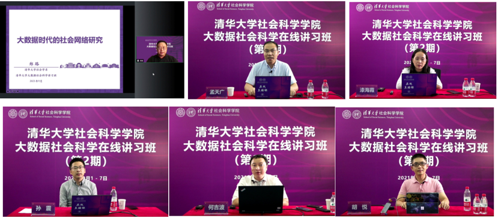
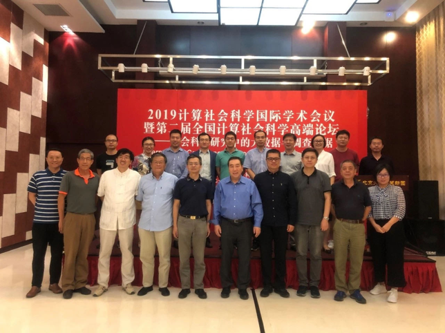
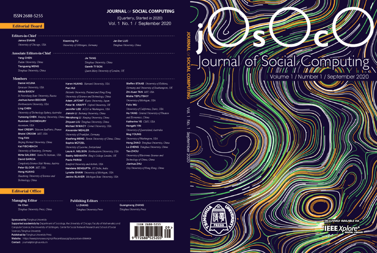
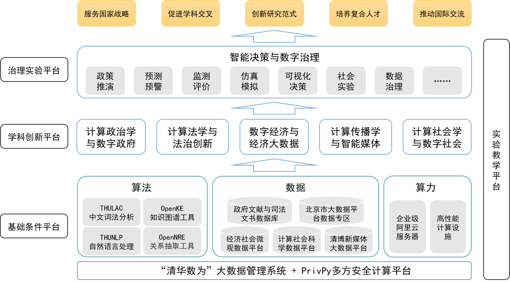

```{r setup, include=FALSE}
knitr::opts_chunk$set(echo = FALSE, message = FALSE, warning = FALSE)

if (!require(pacman)) install.packages("pacman")
library(pacman)

p_load(
  emo
) # data wrangling # data wrangling

xaringanExtra::use_xaringan_extra(c("tile_view", # O
                                    "broadcast", 
                                    "panelset",
                                    "tachyons"))

# Functions preload
set.seed(313)
```

## 发展沿革


2014年建设大数据社会科学（Big Data Social Science）研究小组

2016年5月建立计算社会科学平台（Institution of Computational Social Science）（国内首个）

2018年6月申报校级科研条件平台（与软件学院、法学院合作）

<br>
.center[
**立足清华社科、计算科学和数据科学.red[特色优势]和.red[交叉基础]**

学科交叉平台    
数据共享平台    
计算协作平台    
人才培养平台    
]

???

- 立足清华社科、计算科学和数据科学特色优势和交叉基础
- 2014年建设大数据社会科学（BDSS）研究小组
- 2016年5月建立计算社会科学平台（iCSS）（国内首个）
- 2018年6月申报校级科研条件平台（与软件学院、法学院合作）
    - 学科交叉平台
    - 数据共享平台
    - 计算协作平台
    - 人才培养平台

---

### 计算社会科学**数据**平台

.pull-left[
- 具备海量数据采集、存储和计算能力
    - 20类大数据资源
    - 6台高性能服务器
- 服务全校,促进交叉


]

.pull-right[
.tiny[
|     数据名称                   	|     数据描述                                                                                                                            	|
|--------------------------------	|-----------------------------------------------------------------------------------------------------------------------------------------	|
|     司法裁判文书               	|     全国依法公开的司法裁判文书数据，包括民事、刑事、行政、知识产权、执行案件等5000多万份。                                              	|
|     企业工商基本信息           	|     全国工商登记企业基本信息，3000多万份，8000多万个体户                                                                                	|
|     行政许可                   	|     对企业的行政许可信息                                                                                                                	|
|     行政处罚                   	|     对企业的行政处罚信息                                                                                                                	|
|     地方领导资料库             	|     地级以上城市主要领导履历资料信息，包括姓名、性别、省份、职位、任职地点、籍贯、出生年月、民族、毕业院校、学历、专业、工作经历等。    	|
|     供地计划                   	|     土地供地计划列表信息，包括行政区域、供地计划名称、计划详情链接、发布时间等。                                                        	|
|     供地结果公告               	|     土地使用结果公告列表信息，包括行政区域、土地坐落、总面积、土地用途、供应方式、签订日期、详情url地址等。                             	|
|     省市两级政府工作报告       	|     1980年以来有记录的政府工作报告                                                                                                      	|
|     失信人名单                 	|     全国公开失信人信息                                                                                                                  	|
|     网络问政数据               	|     人民网“领导留言板”版块190多万网民留言及政府回应信息                                                                                 	|
|     中国政府政策文件数据       	|     全国各级政府政策法规、政策文件数据                                                                                                  	|
|     微博数据                   	|     2012至2017年全国各省市政务微博数据、2000万条微博发帖、微博定位数据                                                                  	|
|     百度指数                   	|     25个政策领域400多个关键词的2011-2017年百度搜索日度指数，共2亿多条                                                                   	|
|     人大代表建议案             	|     部分省份人大代表的建议案                                                                                                            	|
|     环境治理                   	|     专项整治、专项治理信息                                                                                                              	|
|     反腐败数据                 	|     各级纪委发布涉腐官员、涉腐诉讼数据                                                                                                  	|
|     北京市12345数据（涉密）    	|     2014年至今北京市政务热线数据                                                                                                        	|]
]

???

为全校师生开展交叉学科研究提供了海量数据和计算资源支撑
https://css.sss.tsinghua.edu.cn/login

---

background-image: url("images/css_webpage2.png")
background-position: center
background-size: contain

---

background-image: url("images/css_webpage3.png")
background-position: center
background-size: contain

---

### 计算社会科学**算法**平台

- 基础设施（600多平米）
    - 1个机房（文北楼、明斋二层）
    - 研讨室、会议室（双清4号楼10层）
    - 6台高性能服务器（iCenter托管）
- 在线计算平台
- 软件配置
    - 数据爬虫（八爪鱼）
    - Tableau等可视化工具
    - Stata、Nvivo、MAXQDA等数据清理工具

---

### 计算社会科学**教育**平台

- “大数据社会科学讲习班”品牌讲习班
    - 2014年以来连续举办8期讲习班、19期计算社会科学工作坊、6期Python/R研习营，累计培养3000多名研究生和科研人员
    
.center[]

---

- 产出高水平教学资源
    - 出版系列教材、建设在线课程、前沿工作坊等多样化途径建设教学平台，形成交叉学科人才培养的教学、课程和教材体系，为学生提供在线教学基础设施

.center[]

---

- 搭建复合型人才培养体系

.pull-left[
## 大数据社会科学讲习班

迄今已经连续开办8届，累计培养近1200位硕博士研究生和研究人员等。

]
.pull-right[
## 大数据分析能力提升证书项目

6年多来已累计培养2500多名学生，其中已有450多位获得研修证书。

]
.center[
## 探索培养计算社会科学方向硕士生和博士生

各个学科的20多位教师围绕计算社会科学开设了25门相关研究生课程。

]

---

### 计算社会科学**学术共同体**

- 发起成立“中国计算社会科学联盟”（30多所高校）并担任秘书长单位
- 与哈佛、斯坦福、普林斯顿、芝加哥、哥廷根等建立计算社会科学国际合作网络




---

.center[]

- *Journal of Social Computing* (IEEE, 2020年)
- 《计算社会科学评论》 (2021年)

---

class: center

background-image: url("images/css_system.png")
background-position: center
background-size: contain

## 计算社会科学**清华布局**

---

## 阶段性成果: 承担国家重大科研任务

.pull-left[
.small[
|                       项目、任务名称                      	|      项目类别或任务委托单位     	|
|:---------------------------------------------------------:	|:-------------------------------:	|
|     大数据时代计算社会科学的产生、现状与发展前景研究      	|     国家社会科学基金重大项目    	|
|     基于大数据的中国宏观经济景气衡量方法研究              	|     国家社会科学基金重大项目    	|
|     大数据驱动下的国家治理能力建设研究                    	|     国家社会科学基金重大项目    	|
|     地缘政治风险预测的理论与方法研究                      	|     国家社会科学基金重大项目    	|
|     基于大数据的智能化社会治理监测、评估与应对策略研究    	|     国家社会科学基金重大项目    	|
|     语言、思维、文化层级的高阶认知研究                    	|     国家社会科学基金重大项目    	|
|     中外关系数据库建设                                    	|     国家社会科学基金重大项目    	|
|     新形势下我国科技创新治理体系现代化研究                	|     国家社会科学基金重大项目    	|
|     互联网交易制度和民事权利保护研究                      	|     国家社会科学基金重大项目    	|
|     大数据、人工智能背景下的公安法治建设研究              	|     国家社会科学基金重大项目    	|
|     互联网经济的法治保障研究                              	|     国家社会科学基金重大项目    	|
|     大数据时代个人数据保护与数据权利体系研究              	|     国家社会科学基金重大项目    	|
|     大数据背景下我国新经济新动能统计监测与评价研究        	|     国家社会科学基金重大项目    	|
]
]

.pull-right[
.small[
|                         项目、任务名称                        	|            项目类别或任务委托单位           	|
|:-------------------------------------------------------------:	|:-------------------------------------------:	|
|     意识形态视域下的网络文化安全治理研究                      	|           国家社会科学基金重大项目          	|
|     热点案件和民生案件审判智能辅助技术研究                    	|             国家重点研发计划项目            	|
|     智慧司法协同综合效能评价体系研究                          	|             国家重点研发计划项目            	|
|     公共部门数字化转型背景下协同治理模式创新与效能评价研究    	|           国家自然科学基金面上项目          	|
|     基于网络政府数据分析的政策扩散路径与回应关切能力研究      	|     国家自然科学基金重大研究计划培育项目    	|
|     大数据背景下的数据资产统计与核算问题研究                  	|     国家自然科学基金重大研究计划培育项目    	|
|     政务服务体系普查支撑服务研究                              	|             国务院办公厅委托课题            	|
|     政府网站检查指标研究                                      	|             国务院办公厅委托课题            	|
|     国家电子政务顶层设计                                      	|              中央网信办委托课题             	|
|     电子政务专项督查和绩效评估                                	|              中央网信办委托课题             	|
|     政务信息共享的权责关系及技术路径研究                      	|              中央网信办委托课题             	|
|     数字经济统计框架研究                                      	|          国家统计局重大统计专项课题         	|
|     政府数字化转型与治理现代化研究                            	|              中央网信办委托课题             	|
]
]

---

## 阶段性成果: 高水平学术发表

.pull-left[
.tiny[
|     成果名称                                                                                                          	|     第一作者              	|     出版单位/发表刊物及时间（期次）                 	|     所属专业方向          	|
|-----------------------------------------------------------------------------------------------------------------------	|---------------------------	|-----------------------------------------------------	|---------------------------	|
|     City Developments and   Well-Being: A Big Data Analysis on Chinese Social Media                                   	|     彭凯平                	|     Social Indicators Research                      	|     认知与智能            	|
|     A World of Blame to Go Around:   Cross-Cultural Determinants of Responsibility and Punishment Judgments           	|     彭凯平                	|     Personality and Social   Psychology Bulletin    	|     认知与智能            	|
|     Mutual Interferences of Driving and Texting Performance                                                           	|     何吉波                	|     Computers in Human Behaviors                    	|     认知与智能            	|
|     基于在线大数据的中国商品价格粘性研究                                                                              	|     姜婷凤                	|     经济研究,2020年第6期                            	|     计算经济与数字经济    	|
|     大数据时代与社会科学研究范式变革                                                                                  	|     刘涛雄                	|     理论探索,2017年第6期                            	|     计算经济与数字经济    	|
|     中国货币总量指数构建的新视角                                                                                      	|     刘涛雄                	|     投资研究,2018年第1期                            	|     计算经济与数字经济    	|
|     人工智能、机器人与经济发展研究进展综述                                                                            	|     刘涛雄                	|     经济社会体制比较,2018年第6期                    	|     计算经济与数字经济    	|
|     一种基于在线大数据的高频CPI 指数的设计及应用                                                                      	|     刘涛雄                	|     数量经济技术经济研究,2019年第9期                	|     计算经济与数字经济    	|
|     非权益众筹的亲社会动机及支持行为研究                                                                              	|     汤珂                  	|     经济学(季刊)                                    	|     计算经济与数字经济    	|
|     计算社会科学:涵义、特点与前景：对美国计算社会科学专家的访谈                                                       	|     李正风                	|     科学学研究                                      	|     计算社会学            	|
|     International Visibility as Determinants of Foreign Direct Investment: An Empirical Study of Chinese Provinces    	|     严飞                  	|     Social Science Research                         	|     计算社会学            	|
|     论社会学理论导引的大数据研究一一大数据、理论与预测模型的三角对话                                                  	|     罗家德                	|     社会学研究,2018年第5期                          	|     计算社会学            	|
|     政府数字化转型与治理现代化研究                                                                                    	|     中央网信办委托课题    	|                                                     	|                           	|
]
]

.pull-right[
.tiny[
|     成果名称                                                                                                                   	|     第一作者              	|     出版单位/发表刊物及时间（期次）              	|     所属专业方向    	|
|--------------------------------------------------------------------------------------------------------------------------------	|---------------------------	|--------------------------------------------------	|---------------------	|
|     大数据和结构化数据整合的方法论——以中国人脉圈研究为例                                                                       	|     罗家德                	|     社会学研究,2021年第2期                       	|     计算社会学      	|
|     大数据与国际关系研究创新                                                                                                   	|     漆海霞                	|     中国社会科学,2018年第6期                     	|     计算政治学      	|
|     政治科学视角下的大数据方法与因果推论                                                                                       	|     孟天广                	|     政治学研究,2018年第3期                       	|     计算政治学      	|
|     基于海量事件数据的中美关系分析一一对等反应、政策惯性及第三方因素                                                           	|     庞珣                  	|     世界经济与政治,2019年第5期                   	|     计算政治学      	|
|     重访回应性政府:网络问政制度的多样性与制度绩效                                                                              	|     孟天广                	|     中国社会科学(英文版),2019年第4期             	|     计算政治学      	|
|     中国共产党人民观的演进逻辑与特征一一基于历次党代会报告的词频统计和语料分析                                                 	|     张小劲                	|     社会主义研究,2019年第5期                     	|     计算政治学      	|
|     Conditional Receptivity to   Citizen Participation: Evidence from a Survey Experiment in   China                           	|     孟天广                	|     Comparative Political Studies                	|     计算政治学      	|
|     Geographical Leadership   Mobility and Policy Isomorphism Narrowing the Regional Inequality of Social Spending in China    	|     孟天广                	|     Policy Study Journal, 2020 48(3):806-832.    	|     计算政治学      	|
|     From Internet to social safety   net: The Policy Consequences of  Online   Participation in China                          	|     孟天广                	|     Governance, 2019 32(3):531-546.              	|     计算政治学      	|
|     Culture Marker Versus Authority   Marker: How do Language Attitudes Affect Political Trust?                                	|     胡悦                  	|     Political Psychology                         	|     计算政治学      	|
|     Encountering Dissimilar Views in Deliberation: Political Knowledge, Attitude Strength, and Opinion Change                	|     张开平                	|     Political Psychology                         	|     计算政治学      	|
|     论社会学理论导引的大数据研究一一大数据、理论与预测模型的三角对话                                                           	|     罗家德                	|     社会学研究,2018年第5期                       	|     计算社会学      	|
|     政府数字化转型与治理现代化研究                                                                                             	|     中央网信办委托课题    	|                                                  	|                     	|
]
]

???

围绕文理交叉，在数字经济、数字治理、计算法学与智能社会等新兴领域开展大量基础性和应用性研究，形成了引领性学术成果

在《中国社会科学》、《经济研究》、《社会学研究》、《政治学研究》、《法学研究》、《Governance》、《Comparative Political Studies》等顶级期刊发表中英文论文80多篇。

2020年，清华大学与芝加哥大学、哥廷根大学联合创办Journal of Social Computing英文期刊，成为国内首个发出国际声音的新文科高水平学术期刊。

---

## 阶段性成果: 品牌学术会议
.small[
|     会议名称                                      	|     年份    	|     主办单位                                                                                        	|     所属专业方向    	|
|---------------------------------------------------	|-------------	|-----------------------------------------------------------------------------------------------------	|---------------------	|
|     第一届网络经济学与大数据国际研讨会（NEBD）    	|     2015    	|     清华大学经济学研究所清华大学计算机系《经济学动态》杂志社                                        	|     计算社会学      	|
|     第二届网络经济学与大数据国际研讨会（NEBD）    	|     2016    	|     清华大学经济学研究所清华大学计算机系《数量经济技术经济研究》杂志社                              	|     计算政治学      	|
|     第三届网络经济学与大数据国际研讨会（NEBD）    	|     2017    	|     清华大学经济学研究所清华大学民生经济研究院                                                      	|     计算政治学      	|
|     第一届全国计算社会科学高端论坛                	|     2018    	|     清华大学社科学院清华大学计算社会科学平台清华大学数据科学研究院                                  	|     计算政治学      	|
|     第二届全国计算社会科学高端论坛                	|     2019    	|     清华大学计算社会科学平台北京大学中国社会科学调查中心北京大学计算社会科学研究中心                	|     计算政治学      	|
|     第三届全国计算社会科学高端论坛                	|     2021    	|     清华大学计算社会科学平台清华大学社会科学学院北京大学计算社会科学研究中心中国计算社会科学联盟    	|     计算政治学      	|
|     第四届全国计算社会科学高端论坛                	|     2021    	|     浙江大学计算社会科学平台中国计算社会科学联盟                                                    	|     计算政治学      	|
|     2019年计算社会科学国际学术会议                	|     2019    	|     清华大学计算社会科学平台北京大学中国社会科学调查中心北京大学计算社会科学研究中心                	|     计算政治学      	|
|     2021年计算社会科学国际学术会议                	|     2021    	|     清华大学社会科学学院清华大学计算社会科学平台                                                    	|     计算政治学      	|
|     第一届青年计算社会科学工作坊                  	|     2018    	|     复旦大学经济学院清华大学计算社会科学平台                                                        	|     计算政治学      	|
|     第二届青年计算社会科学工作坊                  	|     2019    	|     清华大学社会科学学院清华大学计算社会科学平台                                                    	|     计算政治学      	|
|     第三届青年计算社会科学工作坊                  	|     2020    	|     清华大学计算社会科学平台                                                                        	|     计算社会学      	|
|     第四届青年计算社会科学工作坊                  	|     2021    	|     清华大学计算社会科学平台山东大学政治与公共事务学院                                              	|                     	|
|     第一届数据治理研究论坛                        	|     2018    	|     清华大学政治学系                                                                                	|                     	|
|     第二届数据治理研究论坛                        	|     2019    	|     清华大学政治学系                                                                                	|                     	|
|     第三届数据治理研究论坛                        	|     2021    	|     清华大学政治学系                                                                                	|                     	|
|     第四届数据治理研究论坛                        	|     2021    	|     清华大学政治学系                                                                                	|                     	|
]

???

- 全国计算社会科学高端论坛（2018-）
- 计算社会科学国际大会（2019-）
- 计算法学国际论坛（2018-）
- 网络经济学与大数据国际研讨会（2015-）
- 社会计算国际会议（2019-）
- 数据治理论坛（2018-）
- 青年计算社会科学工作坊（2018-）

---

## 教育部哲学社会科学重点实验室



---

background-image: url("images/css_moePlatform1.png")
background-position: center
background-size: contain

---

## 清华路径

- 计算社会科学是数字与智能时代社会科学发展的必然趋势，是清华社会科学实现**学科引领、迈入国际顶尖的关键战略**;
- 计算社会科学是全球范围内的新鲜事物，清华文理交叉优势和中国社会数字化转型的先发实践驱动着承担**生产“新社会科学”新思想、新理论和新范式**的学术责任;
- 计算社会科学培养国家重大战略的急需人才，**为“数字中国”、“智慧社会”战略供给兼具数字素养和社科的复合型人才**， 清华具备人才培养先行先试的基础;
- 清华具备计算**社会科学学科发展的引领地位**，担任“中国计算社会科学联盟”秘书长单位，联合哈佛、普林斯顿、斯坦福、芝加哥等建立“计算社会科学国际网络”。

---

## 探索价值

.pull-left[
- **理论创新价值**

作为全球数字化先发国家，有必要从数字时代社会科学的概念重塑、理论重构上为理解数字经济、数字政府、数字社会贡献思想和理论。
]
.pull-right[
- **学科建设意义**

计算社会科学反映了数字时代社会科学在本体论、方法论和认识论的全方位转型，有必要聚焦原创理论和研究范式开展优先研究，力争占据该领域国际引领地位，形成中国话语。
]
.pull-left[
- **科研模式创新**

新科技条件下文科科研模式创新，培育文理交叉的文科实验室，探索PI制（首席科学家），建设文科共享科研基础设施（数据库+计算资源）
]
.pull-right[
- **国家战略价值**

探索数字时代的经济社会发展规律，推进我国数字化发展乃至数字文明在全球的引领性角色既提供了实践基础，更具备了国家战略需求。
]

---

class: inverse, center, middle


# 敬请指正 欢迎合作