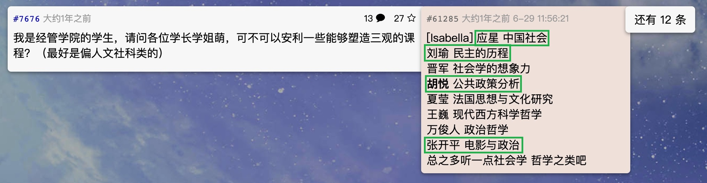
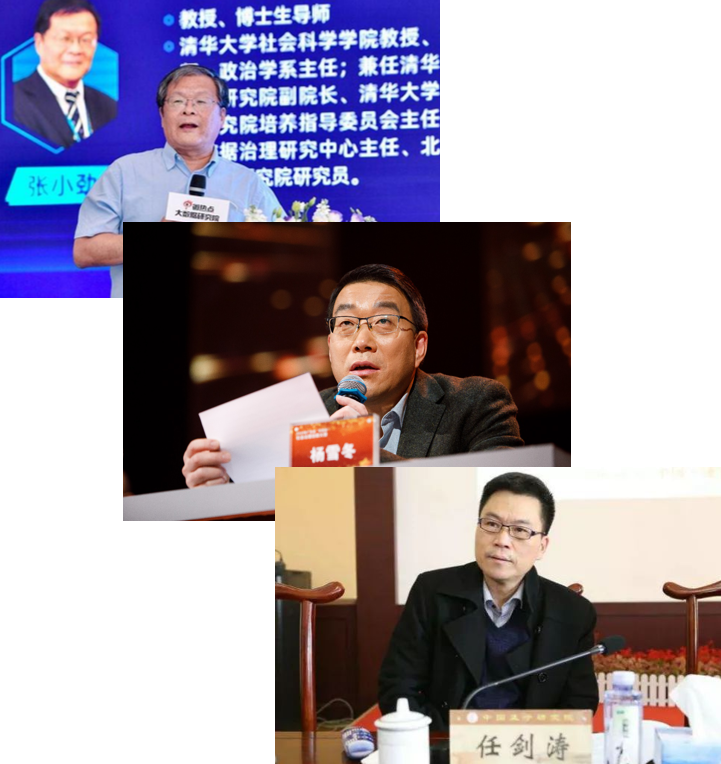
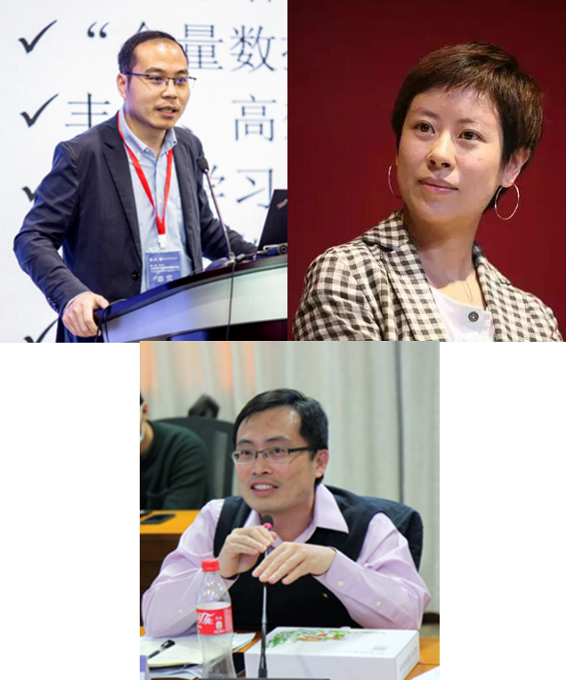

class: center, middle, normal

```{r setup, include = FALSE}
knitr::opts_chunk$set(echo = FALSE, message = FALSE, warning = FALSE)

if (!require(pacman)) install.packages("pacman")
library(pacman)

p_load(
  tidyverse, flexable, icons, xaringanExtra, ggeffects
) 


use_xaringan_extra(c("tile_view", # O
                     "broadcast",
                     "panelset",
                     "tachyons",
                     "fit_screen"))
use_extra_styles(
  hover_code_line = TRUE,         #<<
  mute_unhighlighted_code = FALSE  #<<
)


# Functions preload
set.seed(313)

theme_set(theme_minimal())
```

## 概要

**政治学 &ne; 政治课**  


**懂政治 &ne; 只懂政治**  


**清华政治学系 &ne; 一般政治学系**    

---

class: center

## 政治学 &ne; 政治课


政治理念、政治口号、政治宣传    
&uArr;    
政治科学（Political Science) 


???

1. 政治课上那些理念、口号、宣传，这些不是你们学习的内容，而将是你们研究的对象：是哪里来的，谁告诉你的，图的什么？政治科学告诉你

--


&dArr;    
中央与地方、国家与社会、民主与发展......


???

1. 人类社会最重要的几组关系：
    + 头儿们很重要：火车跑得快，全屏车头带
    + 领导的权力哪来的？人民给的，国家和社会如何互动的？
    + 方向问题，全过程民主

--

> 夫国有善政，而德泽不加於民者，政虽善，未尝入民也。---清·唐甄

???

Political science, in short, is not just an intellectual discipline; it is also a moral one.--- Huntington 1988, "One Soul at a Time: Political Science and Political Reform"

1. 政治学家也不是政客也不是空想家，唐甄，but how？why？


--

.bg-black.golden.ba.shadow-5.ph4.mt3[
以科学家眼光洞察世事，以领导者视角博古通今
]


???

我就是一个普通老百姓，我为什么要care这个？

---

## 懂政治 &ne; 只懂政治

.pull-left[
*政治(思维)*

《政治学原理》    
《认识现代国家》    
《民主的历程》         
《民主与当代政治生活》    
《中国政治思想史》


*议题*

《中国地方政府与基层治理》    
《中国改革的政治经济学》       
《大数据时代的司法与政治》    

]

.pull-right[
.red[*方法*]

《政治学研究方法》    
《公共政策分析：视角与方法》    
《博弈论与政治》

*视角*

《行政管理概论》    
《政治传播概论》    
《电影与政治》
……
]

---

## 懂政治 &ne; 只懂政治

.center[
政治心理学    
政治经济学    
政治法学    
政治语言学    
政治传播学    
信息政治学    
城市政治学    
**政治科学方法论**
]

--

.center[]

---

## 清华政治学系 &ne; 一般政治学系

.center[**资质久**、质量高、可持续]

???

聪明人要怎么做选择，和买东西一样，原来就是做药的，自然能买药材，但去那里买包子，那就不一定是个明智选择

--

+ 1926年始建，清华**首批**11个科系之一；

+ 1928年转制国立清华大学（时任校长罗家伦：“政治经济两系的学科与国家政治社会生活的改造**最为重要**”）

--

+ 中国政治学**先驱**：
    + 钱端升 (北京政法大学首任校长)
    + 张奚若 (中华人民共和国第二任教育部部长)
    + 萧公权（华盛顿大学教授）
    + 余日宣（沪江[复旦]大学政治与历史学系的创始人）……

--

+ 2017 教育部第四轮学科评估名列全国第四，入选教育部“双一流”
    + 2021 QS世界大学政治学学科排名
    
???

大陆**第一**

代管国家治理研究院、数字治理研究中心、地方治理研究中心、政治学理论研究中心等校级科研机构，主办“政治科学前沿理论与方法”研讨会和“大数据与首都基层治理”高端论坛等重要学术会议。

---

class: bottom

background-image: url("images/radar8.png")
background-position: center
background-size: contain

资质久、**质量高**、可持续

???

---

.center[资质久、质量高、**可持续**]

.pull-left[

]

???

张小劲：政治学系系主任，清华大学国家治理研究院副院长

杨雪冬：中组部“万人计划”哲学社会科学首批领军人才， 全国宣传文化系统“四个一批”人才称号， 国务院特殊津贴获得者

任建涛：教育部“长江学者”特聘教授


--

.pull-right[

]

???

青年长江学者, 社会科学学院副院长

民主女神

苏：曾论文连续六年入选ESI高被引论文


不只能有本事，在学术界、在政府、在业界，都有人脉，

找工作方面，两任学工组组长，一任研工组组长

国内：北京大学、人民大学、中山大学

国际：Columbia, Stanford, Cambridge, Harvard, City University of New York, University of Iowa

---

.pull-left[
## Placement

本科： 

+ 研究生
+ 公务员
+ 自主创业

博士、博士后：

+ 中国农业大学    
+ 中国政法大学    
+ 北京外国语大学    
+ 北京林业大学    
+ 首都师范大学    
+ 南开大学
+ 山东大学
+ 中山大学    
+ 陕西师范大学……    

]

???

过去三年

+ 一半以上 4/7 57%
+ 三分之一 2/7 29%    
+ 自主创业 1/7 14% 

--

.pull-right[
## 总结
.center[
**政治学 &ne; 政治课**  
(.navy[占位]高)    
\+     
**懂政治 &ne; 只懂政治**    
(.navy[思路]清)    
\+    
**清华政治学系 &ne; 一般政治学系**    
(.navy[品牌]响)

&dArr;

学术/就业/社会.red[竞争力]强
]
]

---

class: middle, center, inverse

.huge[欢迎！]

`r feather_icons("mail")`&nbsp;[yuehu@tsinghua.edu.cn](mailto:yuehu@tsinghua.edu.cn) 

`r feather_icons("globe")`&nbsp; https://sammo3182.github.io/

`r feather_icons("github")`&nbsp; [sammo3182](https://github.com/sammo3182)