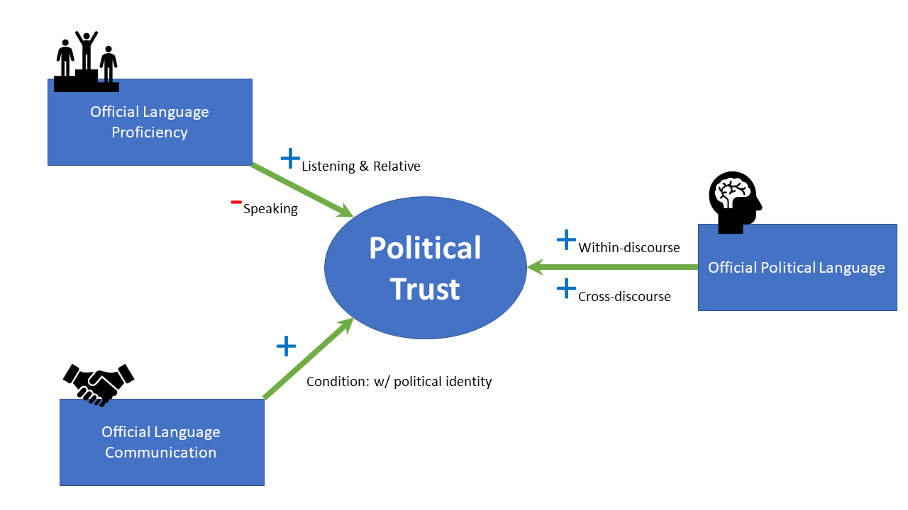

```{r setup, include=FALSE}
options(htmltools.dir.version = FALSE)
```


class:large

## Rebuilding the Towel of Babel?

.pull-left[]

--

.pull-right[]

--
<br><br>
.center[.large[<font color = "red">Language policy ?&#10132; Political trust</font>]]

---

class:large


## Going Beyond Existing Research

--


.pull-left[

### Limits

* Only minorities
* Only state-building phase
* Proxy of culture

]

--

.pull-right[

### Goal

1. .red[Full] population
1. .red[Established] environment
1. .red[Beyond] culture

]

--

<br>

### Shared Object

* Official Language

---
class:large

## Official Language Field (OLF)

.pull-left[]

--

.pull-right[

* Political .red[attitude] and .red[self-evaluation]
* .red[Relationship] with government representatives
* Political .red[value] system

]


???

Halliday: Register includes field of discourse (what's going on)
Zucker 1986


---

## Systematic Examination

```{r echo=FALSE, message=FALSE}
Empirical_Examination <- tibble::tribble(
  ~Object,                          ~Reflection,            ~Data,
     "Attitude",     "Institutional-based trust", "National surveys",
     "Relationship",    "Process-based trust",  "Lab experiments",
     "Value", "Concept-based trust",    "Political texts"
  )

require(knitr)
require(kableExtra)
kable_styling(
              kable(Empirical_Examination, digits = 3, row.names = FALSE, align = "l",
              caption = NULL, format = "html"),
        bootstrap_options = c("striped", "hover", "condensed"),
        position = "center", full_width = FALSE) 
```

--

**Case Selection**

.pull-left[

*Ethnicity (culture)*


]

.pull-right[

*Language*


]


???

Kloss 1969

---

## Results



---
class:large

## Implication

* Language policy beyond cultural boundaries
    + Responding to ethnolinguists
    + Responding to postmodernists
    + Policy making
    
--

* Comparative Politics
    + Policy &#8651; culture/identity
    + Government-citizen communication

---

class: inverse, center, middle

# Thank you!