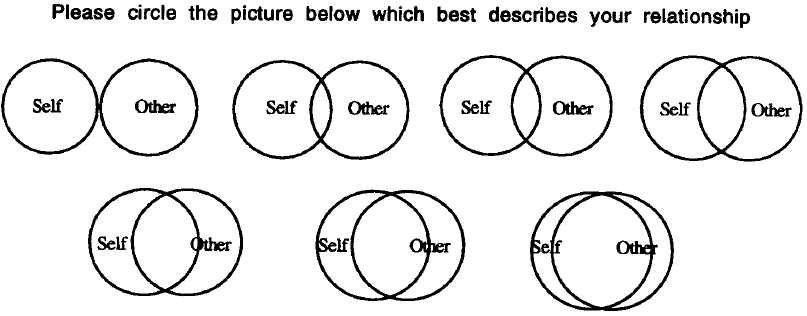

```{r}
#| include: false
#| label: setup

library(pacman)

p_load(
  "icons",
  "tidyverse"
)

set.seed(313)
```

# Language and the Political Mind

## Research Question

::: {.r-hstack}

{height=380}

{height=380}

:::

::: {style="text-align:center"}

> Does the language a state [endorses]{.red} change how citizens think about it?
>
> And do different language [functions]{.red} pull the same way?

:::

::: {.notes}

In 2009 a Shanghai newspaper article calling Shanghainese a mark of being uneducated triggered public backlash. In 2010 a proposal in Guangzhou to drop Cantonese from prime-time news drew demonstrations. Mother-tongue protection movements also appeared in Sichuan, Shaanxi and Beijing.

At the same time 80.72 percent of the population is proficient in Putonghua and over 95 percent use simplified characters. About 200 living dialects coexist with the official language.

<!-- [Suggest] A news photo of the 2010 Guangzhou "support Cantonese" gathering would sharpen the contrast against the promotion campaign photo -->

:::

## What We Thought We Knew

::::: {.columns}

:::: {.column width="47%"}

**Linguistic relativity**

- Mother tongue shapes [perception]{.red}
- Language exogenous and fixed

::::

:::: {.column width="53%"}

**Language as identity**

- Language marks [ethnic]{.red} membership
- Acculturation [&rarr;]{.large} align with dominant group
- [Ethnic]{.red} competition [&rarr;]{.large} opposite pull

::::

:::::

::: {.callout-warning}

## Three Blind Spots

1. Language [learning]{.red} underweighted
2. Non-identity variance ignored
3. Risk of a [Type S error]{.red} [@GelmanCarlin2014]

:::

::: {.notes}

Both branches treat language holistically, as a proxy for culture or for group membership. That holistic treatment is exactly what prevents the field from asking whether different language functions, listening versus speaking versus relative standing, do different political work.

On the second branch: the acculturation model expects that using the dominant language pulls people toward the dominant group and its authority; the ethnic competition model expects the opposite, that fluency sharpens awareness of inequality and exclusion. Both are identity stories.

A Type S error is a sign error: with a holistic measure, two functions that push in opposite directions can cancel, and the estimated sign can come out wrong.

:::

## The Official Language Field (OLF)

- Official language defined by [practice]{.red}, not legal recognition
- Whatever the authority habitually uses in political affairs
- The [voice of the state]{.red}, and the nationally common language
- Field: the [habitual hierarchy]{.red} of public language use
- Two layers: official on top, dialects and foreign languages below

::: {.notes}

Canada recognizes two official languages, Singapore four, and some states of the United States one or more, yet in each case a single language dominates political practice. China has never legally declared Putonghua an official language; the laws call it the nationally common language. The practical definition is what makes the theory portable.

<!-- [Suggest] A simple two-layer sketch, official language on top and dialects, minority languages and foreign languages below, would carry this slide. The theory diagram is deliberately held back for the next slide -->

:::

## Three Mechanisms

::::: {.columns}

:::: {.column width="55%"}

{fig-align="center" height=420}

::::

:::: {.column width="45%"}

**Exposure** rides on [listening]{.red}

- Information intake plus authority evocation

**Expression** rides on [speaking]{.red}

- Externalizing demands and opinions

**Competition** rides on [relative proficiency]{.red}

- Advantage against local peers

::::

:::::

::: {.notes}

The three mechanisms overlap in practice; the claim is that each has a distinct primary domain, not that they are mutually exclusive.

Relative proficiency is the difference between an individual's speaking proficiency and the average in their prefecture. A modest speaker in a low-proficiency county can hold a larger advantage than a strong speaker in Shanghai.


:::

## Hypotheses {.nonincremental}

- H<sub>1</sub>: Listening [&uarr;]{.blue} [&rarr;]{.large} knowledge and compliance [&uarr;]{.blue} [&rarr;]{.large} trust in the [central]{.red} government [&uarr;]{.blue}
- H<sub>2</sub>: Speaking [&uarr;]{.blue} [&rarr;]{.large} internal efficacy [&uarr;]{.blue}, external efficacy [&darr;]{.red} [&rarr;]{.large} political trust [&darr;]{.red}
- H<sub>3</sub>: Relative proficiency [&uarr;]{.blue} [&rarr;]{.large} gratification and standing [&uarr;]{.blue} [&rarr;]{.large} political trust [&uarr;]{.blue}

Same language, [three functions, three directions]{.red}

::: {.notes}

Internal political efficacy is confidence in one's own ability to understand and take part in politics. External political efficacy is the belief that government responds to people like oneself. High internal combined with low external is the combination the literature associates with falling trust.

H1 is stated for the central government specifically. Hierarchical trust theory expects central and local trust to move in opposite directions in China, so the prediction is not that listening raises trust in every institution.

This divergence is the claim that separates the official language field from the ethnolinguistic account. If language works holistically, as a proxy for culture, the three functions should not diverge in sign.

:::

# Testing the Field in China

## Research Design

::::: {.columns}

:::: {.column width="50%"}

**Why China**

- Linguistic map does [not]{.red} track the ethnic map
- About [200]{.red} living dialects, one dominant official language
- Sixty years of consistent promotion policy

::::

:::: {.column width="50%"}

**Data**

- Chinese General Social Survey (CGSS), 2010 to 2015
- Trust battery: [2010]{.red} only
- 17,664 families, 140 cities and counties, 31 provinces

::::

:::::

*Strategy*

- Three functions raced against each other in [one model]{.red}
- Proficiency is [not a proxy]{.red}: covariates explain only [30%]{.red} of listening variance

:::{.notes}

Listening and speaking are self rated on a 1 to 5 scale. Relative proficiency is the individual's speaking score minus the prefecture mean. The sampling is multistage stratified probability proportional to size, so the sample is nationally representative. The 17,664 figure is the pooled sample; the trust models run on the 2010 wave, so the N printed under that figure is closer to 10,200.

Note the wave qualification: the efficacy items run 2010 and 2012 and the political trust battery was asked only in 2010, so the trust models are cross sectional. Estimation is multilevel with province varying intercepts and wave fixed effects where multiple waves are available, with generalized additive models as a robustness check for nonlinear covariate effects. Controls are education, age, ethnicity, gender, family income, party membership, media habits, and occupation type.

The last bullet is the pre-emptive defence against the objection that Putonghua proficiency merely stands in for education, ethnicity, or region. Covariates at both the individual and provincial level explain only about 30 percent of listening variance and 50 percent of speaking variance. Once other factors are held constant, ethnic minorities show lower listening but higher speaking proficiency than Han, and Manchu, Mongolian, and Hui speakers match or exceed the Han average.

<!-- [Suggest] Two supporting figures for this claim exist only as inline output in proficiency.qmd, chunks `fig-individual` and `fig-ethnicity`. Add a ggsave export and they would make good appendix slides for the "is it just education" question -->

:::

## Findings: Political Cognition

::::: {.columns}

:::: {.column width="50%"}

{fig-align="center"}

*Exposure*

- Listening [&uarr;]{.blue} [&rarr;]{.large} political knowledge [&uarr;]{.blue}
- Compliance [&uarr;]{.blue}
- Opposes what the state restricts, favours what it promotes

::::

:::: {.column width="50%"}

{fig-align="center"}

*Expression*

- Speaking [&uarr;]{.blue} [&rarr;]{.large} internal efficacy [&uarr;]{.blue}
- External efficacy [&darr;]{.red}

*Competition* [&rarr;]{.large} standing [&uarr;]{.blue} (appendix)

::::

:::::

:::{.notes}

Political knowledge was measured by whether the respondent could name the sitting head of the National People's Congress, the national legislature. Compliance came from a graded response item response theory model, which extracts a latent compliance score from reported compliance with rules ranging from traffic law to policy regulation. The restrictive policy item was laissez-faire birth policy; the promotive one was population mobility. The competition mechanism results point the same way as H3 and sit in the appendix.

<!-- [Suggest] If time is short, drop the right column figure and keep only the arrow summary -->

:::

## Findings: Political Trust {.smaller}

{fig-align="center" height=280}

- Listening [&rarr;]{.large} central trust [&uarr;]{.blue} (main model inconclusive, nonlinear and legislature positive)
- Listening [&rarr;]{.large} local trust [&darr;]{.red}
- Speaking [&rarr;]{.large} central and legislature trust [&darr;]{.red}
- Relative proficiency [&rarr;]{.large} central and legislature trust [&uarr;]{.blue}
- Ethnic identity: [no effect at the national level]{.grayLight}
- One policy, a [more compliant]{.blue} and a [more critical]{.red} citizenry at once

:::{.notes}

NPC in the figure is the National People's Congress, the national legislature, used here as a robustness measure for central trust.

The listening to central trust estimate is inconclusive at the .05 level under the multilevel model but positive and significant under the generalized additive model, and the NPC result confirms it. The negative local coefficient matches hierarchical trust theory, the well documented Chinese pattern in which citizens trust the centre more than local authorities and the two move in opposite directions.

Relative proficiency carries the largest positive coefficient in the national trust models, ahead of education, income, and party membership. The null result on ethnic identity is what the ethnolinguistic account cannot accommodate: once the functional effects of proficiency are held constant, being an ethnic minority does not predict national political trust at all.

:::

## From Effect to Mechanism

> Does the official language itself call the [authority]{.red} to mind?

::::: {.columns}

:::: {.column width="50%"}

**Design**

- Adjusted matched-guise experiment, double blind [@Hu2020]
- Two scenarios: complaint response, street recrimination
- Same bilingual speakers, identical scripts
- Only the second speaker's language varies

::::

:::: {.column width="50%"}

**Subjects**

- 421 high school students
- Chengdu speaking Sichuanese
- Meizhou speaking Hakka
- Two dialect zones, two distances from Putonghua

::::

:::::

Measures: Trustworthy (trust game), Authentic, Close

:::{.notes}

Surveys show the outcome, not the evocation. That is the gap this experiment fills.

Classic matched-guise has each listener hear the same speaker twice in two languages, which hurts ecological validity and telegraphs the purpose. The adjustment randomizes listeners into groups that hear only one version, and supplies realistic background information first. For non political scientists, the trust game works like this: participants decide how many coins to transfer to the speaker, and the amount indexes trust. Sichuanese is partly intelligible with Putonghua while Hakka is linguistically distant, so the pair tests whether the finding depends on one particular dialect.

:::

## The Authority Marker

{fig-align="center" height=400}

- Trustworthy [&uarr;]{.blue}
- Authentic [&uarr;]{.blue} ([tentative]{.grayLight} at .05)
- Close [&uarr;]{.blue} (borderline under complaint response)
- Chance of being classed as distrustful falls by over [10%]{.red}

:::{.notes}

Results hold with and without controls for gender, length of local residence, family socioeconomic status, general interpersonal trust, and dialect proficiency, and with a fixed effect for experimental site. The authenticity result is tentative at the .05 level. It misses significance under the recrimination scenario in both the average effect and the distrust analyses, and closeness likewise misses under the complaint response scenario. Reducing distrust matters more for regime stability than converting moderate trust into high trust, which is why the last line is the one worth dwelling on.


:::

## The Placebo: Take Away the Badge

{fig-align="center" height=340}

Same speakers, same two languages, no government identity.

- General trust: [no difference]{.grayLight}
- Authenticity: [no difference]{.grayLight}
- Closeness: reverses toward the [vernacular]{.red}
- Political identity is the [switch]{.red}: without it, the culture marker returns

:::{.notes}

The replacement scenarios were a friend recommending a mobile phone and two private drivers arguing after a near miss, so the speakers carry no political role. This is the strongest single piece of evidence that the effect runs through the language to authority connection rather than through Putonghua as a marker of education or urban origin. It also shows the ethnolinguistic account is not wrong, it is conditional.


:::

# Extending the Field

## English as a Control Condition

::::: {.columns}

:::: {.column width="50%"}

**Shared with Putonghua**

- State [promotion]{.red} since 1964
- Compulsory in the college entrance exam since 1983
- Over 400 million users, close to a third of the population

::::

:::: {.column width="50%"}

**Missing**

- Promoted, never [endorsed]{.red} as the voice of the state
- Absent from political and public affairs

::::

:::::

*Design*

- CGSS 2010: the wave carrying efficacy and trust batteries
- Kernel regularized least squares, then causal mediation

:::{.notes}

English is also a recognized signal of education and ability in the Chinese labour market, which is what gives it a competition channel comparable to Putonghua.

The distinction between promotion and endorsement is the whole argument here. The state pushed English through the education system as hard as it pushed Putonghua, but it never speaks to citizens in English. So English isolates the endorsement variable while holding the education channel roughly constant. It functions as a placebo at the level of language type, parallel to the placebo experiment in the previous chapter.

Kernel regularized least squares fits a flexible surface without imposing a functional form, and its output reads like ordinary least squares coefficients. Provincial fixed effects are included and education and family income are controlled. An earlier version of this analysis appeared in @HuYueZhuMeng2022.

Average English proficiency is low, around 1.5 on the 1 to 5 scale, and respondents consistently rate listening above speaking.

:::

## The Sign Flips {.smaller}

{fig-align="center" height=260}

::::: {.columns}

:::: {.column width="50%"}

*Putonghua* (earlier slide)

- Listening [&rarr;]{.large} central trust [&uarr;]{.blue} (nonlinear model)
- Speaking [&rarr;]{.large} central trust [&darr;]{.red}

::::

:::: {.column width="50%"}

*English* (figure above)

- Listening [&rarr;]{.large} central trust [&darr;]{.red}
- Speaking [&rarr;]{.large} [central trust unaffected]{.grayLight}

::::

:::::

- English: both functions raise internal and external efficacy [&uarr;]{.blue}
- Efficacy runs through information and competition; [not values]{.grayLight}
- Trust: every identified path is positive [&rarr;]{.large} the negative sign is [unexplained]{.red}

:::{.notes}

This is the sharpest single demonstration of the theory. The same linguistic function, listening, moves central trust in opposite directions, and the substantive difference between the two languages is political endorsement.

One caveat worth conceding before someone raises it: the two sides come from different estimators and samples. The Putonghua side is a multilevel model on the 2010 trust battery within the 2010 to 2015 data; the English side is kernel regularized least squares on 2010. The contrast is a comparison across two analyses, not a single interaction test.

On efficacy, the identified paths are internet based information collection, self assessed social standing, and relative proficiency. Attitude toward freedom of speech was included as a value mediator and does not carry the effect, so learning English is not shifting people toward liberal values.

Be careful with trust. Every mediation path the analysis can identify is positive, yet the total effect is negative. So the mechanisms do not explain the negative sign; they push against it, and a negative direct effect survives them. Testing political efficacy as a second order mediator did not resolve it either. Say plainly that this is an open puzzle the book leaves to future work.

:::

## Dialects and Migration [@HuPizzi2022]

{fig-align="center" height=380}

- Stated: [few]{.red} claim language matters for where they move
- Revealed: hold income constant, about [10%]{.red} shift toward the closer dialect
- Putonghua [bypasses]{.red} the barrier, it does not dissolve it
- Local residents: 83% use the vernacular off work, 66% at work

:::{.notes}

Self reported preference rankings put economics first and language almost nowhere, which matches the migration literature. The survey experiment then held the economic profile of the two candidate cities constant and varied only the language barrier. In the control group over 45 percent were more likely to choose the richer city A and over 25 percent definitely preferred it. Adding the language condition cut those groups by about 10 percent and 5 percent respectively. Neither gender nor education moderates the effect.

Survey analysis on the China Labor-Force Dynamics Survey 2016 shows that better Putonghua makes migrants more willing to stay without learning the local vernacular, which is the bypass effect. If the appendix figure comes up, note that the relationship is U-shaped: the gain appears in the upper proficiency range. Language shapes the decision below the level of stated reasons.


:::

## Democracy and the Written Word

**Problem**

- Reading and writing cannot be separated cleanly from [education]{.red}

**Detour**

- Study the discourse rather than the reader
- Data: 58 years of People's Daily, computer assisted text analysis

**Finding, a [refocusing]{.red} strategy** [@Hu2020a]

- Within discourse: democracy defined by national priorities
- Across discourse: published alongside liberal values
- Payoff: support for democracy and support for the regime coexist

:::{.notes}

The strategy sidesteps direct confrontation with the globally dominant liberal understanding of democracy. Instead of denying it, the discourse redirects the definition toward national development and achievement, areas where the regime performs well. The pattern is stable across periods and across international conditions.

It connects to the literature on soft propaganda, where subtle framing outperforms hard line indoctrination, and it shows that such framing can run for decades rather than one news cycle.

<!-- [Suggest] This slide is text only. Two candidate figures exist: the 1991 discourse network graph saved by democracy.qmd chunk `networkPlot` to ../paper/figure/yr_netGraph1991.png, or the coefficient panel from chunk `fig-withinCross`, which is inline only and needs a ggsave export -->

:::

## Beyond China

- Two conditions suffice: a multilingual society, an identifiable official language
- France since the 16th century, nationwide from 1794
- Also Russia, Bangladesh, Nepal, Germany
- De facto cases fit too: United States, United Kingdom, Australia
- Modernization: in China, [diversity and irrelevance overlap]{.red}

:::{.notes}

The practical definition of official language is what makes the theory travel, since it does not require a particular legal arrangement. Where policies differ, the three mechanisms still apply, but the predicted directions may change with local conditions.

Modernization theory expects language policy to matter in three phases: unification builds allegiance to a new nation, then a developed society demands linguistic diversity, then perceived barriers fall away and policy loses relevance. China shows the second and third running together. The barrier has fallen for most citizens, yet attachment to the vernaculars persists, so language policy keeps shaping the whole population instead of fading out.

:::

# Taking Stock

## Conclusion {.nonincremental .smaller}

1. Language effects are [not exogenous]{.red}: proficiency does the work, not mother tongue
2. One language pulls in [opposite directions]{.red} across its functions
3. The authority marker needs a [politically marked speaker]{.red}; without one, culture returns
4. Remove the state's [endorsement]{.red} and the trust effect changes sign

**Theoretical**: OLF gives an endogenous, learnable, functionally divergent account of language effects [@Hu2025]<br>
**Practical**: language policy is public governance, not only education or ethnic management<br>
**Disciplinary**: political linguistics as a route into political cognition and legitimacy

> [Some of language's most significant effects occur at a deep, automatic level, influencing what is initially activated in memory.]{.red}<br>
[Pérez 2015, p. 266]{.red style="text-align:right"}

:::{.notes}

Finding 3 comes from the placebo experiment: strip the speaker's government identity and the Putonghua advantage disappears, with closeness reversing toward the vernacular. Finding 4 comes from the English chapter, a different manipulation on a different language. Keep the two separate when speaking; they are complementary, not the same test.

Stress that this is a claim about language effects and not about language determinism. Language almost always works together with other factors, above all with policy. The book argues against cultural determinism about language, not against culture.

:::

# Thank you {background="#43464B"}

:::{style="text-align: right; margin-top: 1em"}

[`r feather_icons("github")`&nbsp; sammo3182](https://github.com/sammo3182)

[`r feather_icons("mail")`&nbsp; yuehu@tsinghua.edu.cn](mailto:yuehu@tsinghua.edu.cn)

[`r feather_icons("globe")`&nbsp; https://www.drhuyue.site](https://www.drhuyue.site)

{height=250}

:::

## Reference

::: {#refs}

:::

# Appendix {.appendix visibility="uncounted"}

## Competition Mechanism

{fig-align="center" width="95%"}

- Relative proficiency [&rarr;]{.large} gratification, social standing, perceived fairness [&uarr;]{.blue}

## Putonghua Proficiency over Time

{fig-align="center" height=400}

- Listening consistently exceeds speaking, both stable across waves

## Provincial Distribution

{fig-align="center" height=400}

- Provincial averages vary widely; listening exceeds speaking almost everywhere

## Reducing Distrust

{fig-align="center" height=400}

- Putonghua raises the chance of clearing the trust thresholds [&uarr;]{.blue} (two of six [null]{.grayLight})


## Distrust Reduction in Substantive Terms

{fig-align="center" height=400}

- First differences in predicted probability, Putonghua versus vernacular


## Measuring Closeness: the IOS Scale

{fig-align="center" width="95%"}

- Inclusion of Other in the Self: overlapping circles index felt closeness (Aron et al. 1992)


## English: Mediation Paths

:::{.r-hstack}

{height=350}

{height=350}

:::

- Listening: identified paths positive, total effect [negative]{.red}
- Speaking: same positive competition path, [total effect null]{.grayLight}

:::{.notes}

The gap between the positive mediated paths and the negative total effect is the unexplained direct effect discussed on the sign flip slide.


:::

## Migrants' Language Choices

{fig-align="center" height=400}

- Residents and migrants diverge: migrants lean on Putonghua at work


## The Bypass Effect

{fig-align="center" height=400}

- The bypass effect: official language proficiency and willingness to stay

