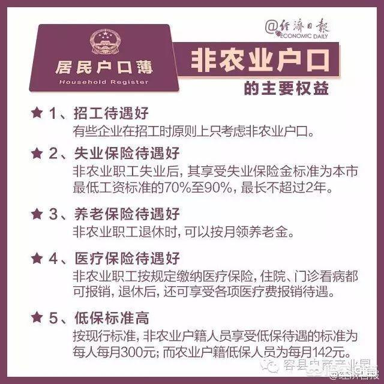
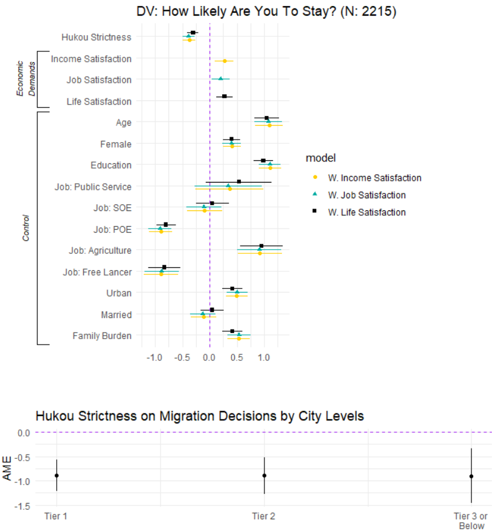
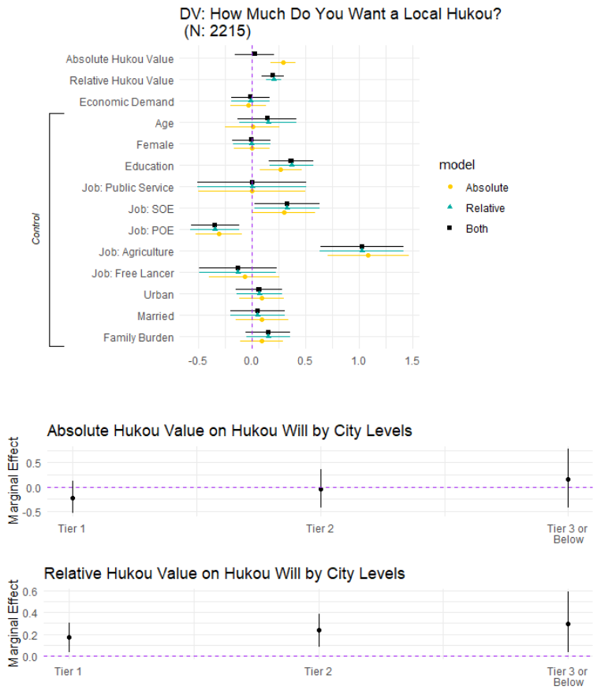

```{r setup, include = FALSE}
knitr::opts_chunk$set(echo = FALSE, message = FALSE, warning = FALSE, htmltools.dir.version = FALSE)

xaringanExtra::use_xaringan_extra(c("tile_view", # O
                                    "broadcast", 
                                    "panelset",
                                    "tachyons"))


library(pacman)

p_load(icons)

# Functions preload
set.seed(313)
```

## Overview

+ .red[Unboxing] the decision-making process of (internal) migration
    + Are migrants only economy-oriented?
+ .red[Unearthing] the influence of public policy (*Hukou*)
    + Does hukou system resist or attract migrants? (How do you know?)
    
--

### Highlights

+ .red[Micro]-foundation study of migration
+ .red[Causal] inference of migration decision making
+ Experiment-survey .red[mixed] method

---

class: inverse, bottom

# Migration in China: Facts and Puzzles

---

class: middle

.pull-left[
Migrants of China: > 1,500,000/yr (2019)

No doubt migrants move for .red[jobs and better opportunities]!

But is that all? 
]

--

.pull-right[ ]

???

Not perfectly fitting, right?

全国各省人口净流入数据：浙江、广东、新疆、重庆成宠儿

> 对比经济增速与净流入比例，可以发现：经济增长快不一定代表人口净流入，但经济增速差的省份基本上人口都上净流出。其中河北、北京比较独特（或许是因为雄安新区功能转移因素）

https://www.163.com/dy/article/FBT930NO053265JA.html

If so, what does the migrant policies for 

---

## Puzzle 1: Unequal Attraction

Cities with the .blue[same] prosperity are .red[not equally] appealing

.center[]

???

first-tier cities (bei,shang, guang different)

Neo-first-tier cities (Hangzhou, nanjing different)

--

.center[Why do people tend to move here rather than there?]


---

## Puzzle 2: Migration Decision Making

.center[]

Migration is a family decision.

+ Family movement or one-person adventure
+ W. or w.o. children

???

Children cannot access the local schools. Partners are not easy to get job.

---

Staying rurally could be also beneficial (Chan and Buckingham, 2008)

.center[]

???

Chan Kam-Wing (陈金永, Professor of Geography, University of Washington) And Buckingham Will  (2008) Is China Abolishing the Hukou System? The China Quarterly 195: 582–606. 

In more urbanized settings such as Guangzhou and the Pearl River Delta, people may prefer to keep their rural hukou status so they can continue to enjoy various rural benefits such as extra birth allowance while living in urban settings.

---

## Puzzle 3: Influence of Hukou

Hukou, a .red[pastime] system?

1. Sure, being in reforming but still "alive and well" .small[(Wang 2004; Chan and Buckingham 2008; Zhang and Treiman 2013)]
    + Changing the conversion opportunity
    + Adjusting the associated social benefit
    
???

Wang Fei-Ling (2004) Reformed Migration Control and New Targeted People: China’s Hukou System in the 2000s. The China Quarterly 177: 115–132.

Zhang Zhuoni(張卓妮, 香港城市大学，social and behavioural sciences) And Treiman Donald J. (2013) Social Origins, Hukou Conversion, and the Wellbeing of Urban Residents in Contemporary China. Social science research 42(1): 71–89.

    
--

1. Decentralized policy .small[(Fan 2008; Ha, Yi and Zhang 2009; Zhan 2011; Zhang 2012; Zhou and Wang 2016)]

???

Fan C.Cindy (2008, UCLA, International Studies and Global Engagement) Migration, Hukou, and the City. China urbanizes: Consequences, strategies, and policies: 65–89.

Ha Wei(哈巍, 北京大学教育学院副院长), Yi Junjian (易君健, Department of Economics, National University of Singapore) And Zhang Junsen (張俊森, 港中文) (2009) Internal Migration and Income Inequality in China: Evidence from Village Panel Data.

Zhan Shaohua (南阳理工，School of Social Science) (2011) What Determines Migrant Workers’ Life Chances in Contemporary China? Hukou, Social Exclusion, and the Market. Modern China 37(3): 243–285.

ZHANG LI (张力，复旦社会发展与公共政策学院 2012) Economic Migration and Urban Citizenship in China: The Role of Points Systems. Population and Development Review 38(3): 503–533.

Zhou Yisu (周憶粟, 澳门大学教育系) And Wang Dan (2016) Understanding the Constraints on the Supply of Public Education to the Migrant Population in China: Evidence from Shanghai. Journal of Contemporary China 25(100): 563–578.

--

### What does hukou mean for migrants, barriers or benefits? 

1. The stricter, the popular? 
1. Not everyone want to change their hukou


???

Tianjin


---

class: inverse, bottom

1. Unequally appealing cities
1. Unknown decision-making process
1. Underexplored policy effects

# How Migrants Make the Decisions and How Hukou Directs
(Over Economic Inequality)

---

class: center, middle

## Existing literature can't answer, because...

Outcome driven    
Macro view

???

Studying migrants who are already in the destination

Analyzing with the flow

--

&dArr;

Psychological path identification .red[w.o.] conditioning on the migration    
Micro-foundation analysis focusing on .red[individuals]

---

## A Micro-Foundation Perspective

.pull-left[
H<sub>1</sub> (Barriers): People tend to rule out destination options based on the .red[concern of strict] Hukou requirements.


]

.pull-right[
H<sub>2</sub> (Benefits): People prefer migration destinations where they can get more local .red[benefits].


]


---


## A Micro-Foundation Perspective

.pull-left[
H<sub>1</sub> (Barriers): People prefer to migrate to cities with less strict requirements for local hukou status.


]

.pull-right[
H<sub>2</sub> (Benefits): People prefer migration destinations where they can get more local benefits.


+ H<sub>2.1</sub>: People prefer to migrate to places where the benefit of the hukou is .red[easier to gain].
+ H<sub>2.2</sub>: People prefer to migrate to places where they can .red[access benefits], regardless of hukou.
]


---

class: inverse, bottom

# Empirical Research
Experiment + Survey

---

## DGP

+ Living Environment Satisfaction Survey of Chinese Residents (LESS 2018)
    + National covered, quota sampling (N = 1,100)
    + Half migrants (vs. 15%ish in representative samples)
    + Survey experiment

+ China Labor-Force Dynamics Survey (CLDS 2016)
    + Nationally representative sample (N = 21,086)
    + Special pack of question about migration

???

LESS: quota sampling based on gender and education according to the 2010 census

---

## Mixed Design 

.pull-left[
### LESS 2018
+ Nonrepresentative
+ Native-migrant comparable
+ Experiment
+ Causal
]

.pull-right[
### CLDS 2016
+ Representative
+ 13% migrants
+ Unique questions
+ Correlative & inferential
]

--

.center[
.huge[&dArr;]

Mixed sources (LESS + CLDS) + mixed analyses (econometric + experiment)
]

---

## An Examination of the Barrier Effect

### Being aware to care

Subjective strictness: self-report

Objective strictness: 
+ Overimputation + Machine-Learning based prediction
+ Seed: Zhang and Tao 2012 (Liu 2016) 
+ Prediction method: Random-forest

???

Objective strictness is the largest predictor

---

.pull-left[]

--

.pull-right[]


---

### Care based on being aware

.center[]

.center[.red[Nobody] care &rArr; Reject the barrier hypothesis (H<sub>1</sub>)]

???

Ranking: do they take hukou policy into account when making the migration decision

Hukou is the least cared and across all the groups

No difference across the groups

---

## An Examination of the Benefit Effect

Hukou .large[&#10144;] migration decisions (unconsciously?)

Situational experiment:

> Assuming you have a plan to leave from the city your hukou was registered, there are two available options: City A and B. The two cities are very similar. Both are in economically developed areas and have similar distances to your hukou city. You don’t have any social relations in either of them. The difference is that .blue[you expect to earn twice as much in City A as in City B, while the average living cost in A is also about 1. 5 times of the cost in B]. .red[Also, it is easier to obtain a local hukou in City B than in A.] Given these conditions, where do you prefer to move, A or B?

Tend to moving A or B (Likert scale)

???

Econ is controlled

---

.center[]

???

Noticeable increase towards B and indifferent

Empirical cumulative distributive function, the dots march the cumlative difference
Kolmogorov-Smirnov test, comparing the distributive differences

---

.center[]

???

The benefit stimulus shows more effect

---

## Confirmation from the Representative Sample

.center[]

???

Hukou is negative in terms of staying in the destination 

The effect does not differ across different level of destinations

---

## Confirmation of the Mechanism

.pull-left[
A value-perspective of Hukou strictness:

+ Absolutely high value &harr; high restriction
+ Relatively high value &harr; high.red[er] restriction
]

.pull-right[]


---

class: inverse, bottom

# Conclusion and Discussion

---

## What We've Learned


1. Hukou as a ~~barrier~~
    + People don't (intentionally) care about hukou when making the migration decision.

1. Hukou as a benefit
    + Hukou alters people's migration decision with a *benefit-based* mechanism

---

## Implications

1. Policy does drive migration flows beyond the economic benefit, and we partially  know how. 
1. Appealing = More public goods > Released hukou

.bg-black.golden.ba.shadow-5.ph4.mt3.center[
The future form of citizenship and patterns of migration are still not clear. 
]

???

Solinger Dorothy J. (Associate Professor of Political Science, UC Irvine, 1999) Contesting Citizenship in Urban China: Peasant Migrants, the State, and the Logic of the Market. Univ of California Press.

--

.center[Hint: .red[Language] plays a role, too .<sup>\*</sup> ]

.footnote[\* See Hu, Yue, and Elise Pizzi. 2022. “The Role of Language Policy in Migration Decisions.” *China: An International Journal*: Accepted.]

???

Vernacular and putonghua plays different roles (after 60 years of Putonghua promotion)

---

class: inverse, center, middle

# Thank you!

`r feather_icons("mail")`&nbsp;[yuehu@tsinghua.edu.cn](mailto:yuehu@tsinghua.edu.cn) 

`r feather_icons("globe")`&nbsp; https://sammo3182.github.io/

`r feather_icons("github")`&nbsp; [sammo3182](https://github.com/sammo3182)
