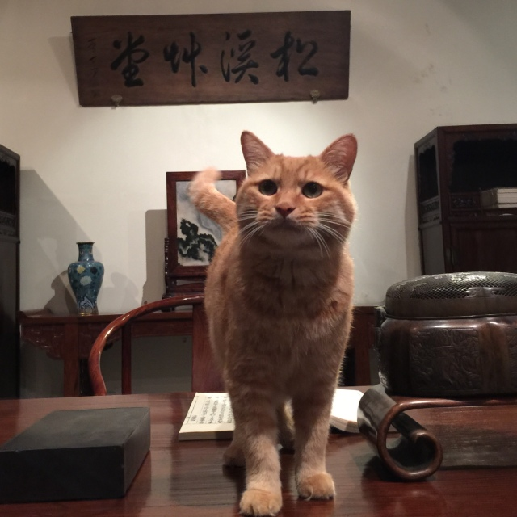
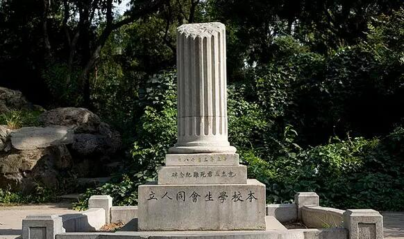
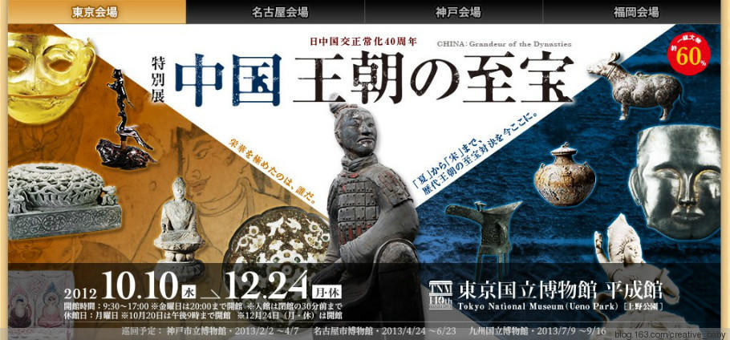
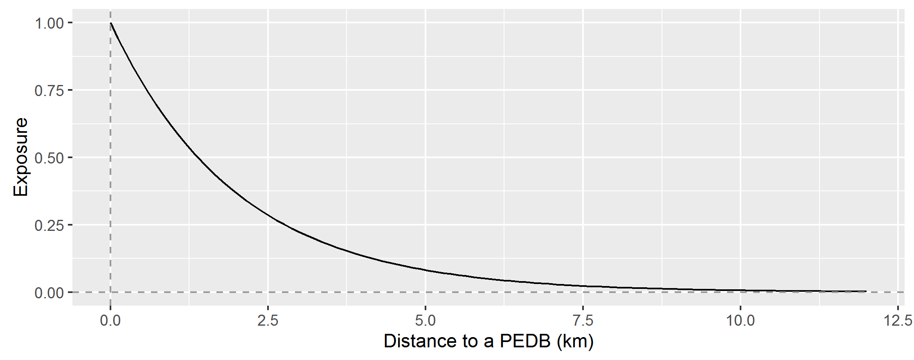
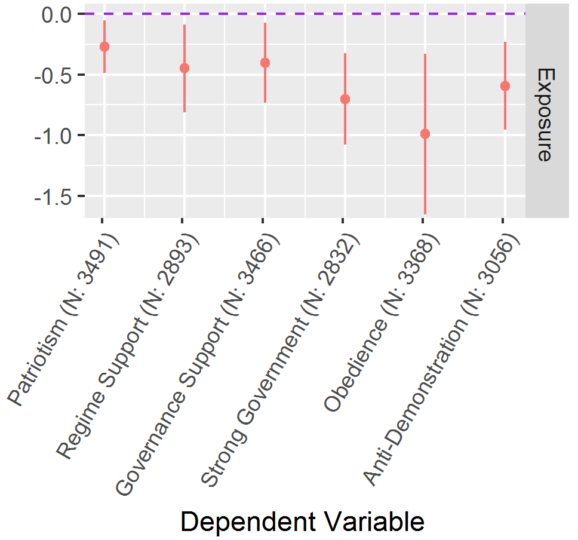

```{r setup, include=FALSE}
options(htmltools.dir.version = FALSE)
# knitr::opts_chunk$set(echo = FALSE,
#                       message = FALSE,
#                       warning = FALSE)
```

## 目标

非常规教育设施（Informal Education Facilities, IEF）：

--

1. 是嘛？
1. 能干嘛？
1. 有嘛用？

---

## 热身：《祭侄文稿》事件


???

https://www.weibo.com/2803301701/HbXo4wFHV?type=comment

---

## IEF

* 常规教育：
    + 小学、中学、大学……
    + 语文、历史、政治……
    
--
    
* 非常规教育：
    1. 课堂之外；
    1. （原则上）自愿参与。
    
---

## 几个栗子



---

## 几个栗子


---

## 几个栗子



---

## 认识IEF：政治传播视角

* 传播者与传播对象

* 政治目的与效果

* （研究方法）

---

## 传播者与传播对象

政府 &#8703; 政府


???

2010.9 Cyrus Cylinder: 英国vs.伊朗
http://news.ifeng.com/world/detail_2010_09/27/2641638_0.shtml


---

政府 &#8703; 民众；


---

民众 &#8703; 民众/政府


---

## 政治效果

方向1：形象建设（Image Building）

???

1980s 日本在美国展览
T. W. Luke, ‘Japan - the shaping of Daimyo culture, 1185 -1868: the ironies of imperialism in the empire of signs’, in T. W. Luke, ed., Shows of Force: Power, Politics, and Ideology in Art Exhibitions, Duke University Press, Durham and London, 1992, 107-118.


--

方向2：信号传递（Signaling)



???

2012, 中日建交40年，钓鱼岛


---

## 目标回顾

非常规教育设施（Informal Education Facilities, IEF）：

* 是嘛？

--

*博物馆、纪念碑、大型活动神马的~*

--

* 能干嘛？

--

*立人设 + 发信号*

--

* 有嘛用？(咋知道？)


---

## 衡量IEF效用：TIME范式

--

1. 理论(Theory)

1. 推论(Inference)

1. 测量(Measurement)

1. 证据(Empirics)


---

## 示范

* China: The Three Emperors, 1662-1795 （案例分析）
* 爱国主义教育基地 （Large-N 分析）


---

class: inverse

# China: The Three Emperors


---

## 借展有何用？

1. 发起者：是否是（准）官办？

--

1. 实施过程：如何产生（测量）效用?

--

1. 影响力：效用如何？

---

## 发起者

.left-column[

]

.right-column[

]


???

Royal Academy of Art
An independent, privately funded institution led by eminent artists and architects


---

## 概要

* 2005-11-12 ~ 2006-04-17

* 400件: 书画卷、金玉器、陶瓷漆器、服饰、家具等。
    + “The largest and most comprehensive loan from the Palace Museum
in the Forbidden City in Beijing." (Bailey 2005: 22)


---

## 官办？

"No political intent...a celebration of the cultural richness of London and a demonstration of how leading organisations are able to work together to promote all that this city has to offer." 

--- Rikesh Sha, Acting Director of the Somerset House Trust


???

RA 坐落于Somerset House Trust

---

## 官办！

### 背景证据

.left-column[

时代背景：中国威胁论甚嚣尘上


]


???

2005-09 British Prime Minister Tony Blair 访华 
2005-11-08~10 胡锦涛访英

--

.right-column[

实时背景：胡锦涛访英


]


---

### 过程证据

改期事件

???

原定2006-01开展；推迟了瑞典展览

*The Times*: "A gift of President Hu sent ahead of his state visit"

*The Economist*: 故宫博物院驳回；"Department of Culture and Heritage" (?)

--

### 展品证据

* 50%以上是一级文物

???

需国务院核准

---

class: small

## 实施过程

1. "Images of Imperial Grandeur";
1. "Qing Dynasty Court Painting";
1. "Ritual";
1. "**Religion**";
1. "**Territories of the Qing**";
1. "**Diplomats, Jesuits and Foreign Inventions**";
1. "The Kangxi Emperor (Horseman, man of letters and man of science)";
1. "The Yongzheng Emperor (Art collector and patron)";
1. "The Qianlong Emperor (Virtue and the possession of antiquity)";
1. "Silent Satisfactions (painting and calligraphy of the Chinese educated elite)";
1. "Auspicious Universe".

???

1. "**Religion**";
1. "**Territories of the Qing**";
1. "**Diplomats, Jesuits and Foreign Inventions**";

---

## 效果

测量：媒体反馈

--

"...would have been inconceivable little more than fifteen years ago, at a time when we still associated red with Communism rather than the Chinese traditional colour of celebration."---*Helen Wang (BM's Curator of East Asian Money)*

---

## 效果1：Legitimacy

"[T]he Qing dynasty turned China into a kind of melting pot of ethnic groups"---*John Gulliver， *West End Extra* 2006: x-xi*

--

西藏、新疆、台湾的主权归属


---

## 效果2: Past as privilege

"[P]resent China accepts the past. This is important... It’s so exciting---the Chinese now view their past as their privilege." ---*Jessica Rawson, Warden of Merton College at Oxford University*

???

who led the curatorial team for The Three Emperors

改变传统印象

---

## 效果3: Multiculturalism

.left-column[


]

.right-column[


]

???

Jesuits: Giuseppe Castiglione

---

## 效果4: Openness

"[L]]ooking at the treasures brought over for the show......including paintings, clocks, calligraphy, porcelain and jades---it's hard to escape the conclusion that the Emperor had a point.....for the early Qing weren’t isolationists exactly. They even employed Jesuits at their court, taking what they wanted from them---mathematical, cartographic, astronomical, clock---and rejecting what they didn’t: Catholicism" ---*James Collard, The Times*

???

1793 George III, Lord Macartney issue

---

## Conclusion

* 官方刻意行为；
* 改变刻板印象。

--

潜在问题？

---

class: inverse

# 爱国主义教育基地


---

## 什么是爱国主义教育基地

全国爱国主义教育示范基地是由中共中央宣传部公布的有特殊历史意义，有利于对人民群众进行爱国主义教育的地点。自1997年7月至今，中宣部一共公布了四批共353个爱国主义教育示范基地。---[*新华网*](http://dangshi.people.com.cn/GB/151935/157318/9528324.html)

---

Patriotic Educational Demonstration Bases, PEDB

.center[]


---

## 游客调查

TI**M**E

--

* 基于对游客的考察来衡量IEF的影响
    + 调查问卷
    + 留言分析

--

---

## 游客调查局限性

### Selection Bias

1. Non-random sampling

--

1. Missing "control" group 

--

1. Missing influenced groups


---

## 超越游客调查

* Spatial analysis: 

Person type &#8594; Exposure probability

--

* Distance-Decay-Neighbor function (DDN)

$$Exposure_i=\sum_{j=1}^{n} e^{-\gamma\times d_{ij}},$$
where 

* $d_{ij}$: distance between individual $i$ and PEDB $j$;
* $\gamma$：constant parameter.

???

$\gamma$ 越大decay越快

---

## 示意图



$$\gamma = 0.5.$$

???

10公里：清华到北京动物园

---

## 理论与推论

PEDBs能：

--

* 支持强化：强化民众对政府的支持；

--

* 服从强化：增强民众对政府统治力感知；

--

* 适得其反：削弱民众对政府信任和服从感。

---

class: small

## 数据

2008 China Survey

--

### DV

* 支持度: Patriotism, regime support, government support
* 服从度: Strong government, obedience, anti-demonstration

--

### Control 

Education, generation, party membership, urban residence, social status, provincial GDP.

--

### Model

Multilevel model

---

## 结果




---

## Take Home Points

非常规教育设施：

* 是嘛？

--

*博物馆、纪念碑、大型活动神马的~*

--

* 能干嘛？

--

*立人设 + 发信号*

--

* 有嘛用？

--

*挺复杂*

---

class: small

## 万一还想多知道点……

Hu, Yue. 2019. “Are Informal Education Facilities Effective Means for Generating Political Support? A Spatial Analysis: Impact of Informal Education Facilities on Political Support.” *Social Science Quarterly*. 

Liu, Chuyu, and Xiao Ma. 2018. “Popular Threats and Nationalistic Propaganda: Political Logic of China’s Patriotic Campaign.” *Security Studies*: 1–32.

Kong, Da. 2015. “Imaging China: China’s Cultural Diplomacy Through Loan Exhibitions to British Museums.” Thesis. School of Museum Studies.

Wang, Zheng. 2008. “National Humiliation, History Education, and the Politics of Historical Memory: Patriotic Education Campaign in China.” *International Studies Quarterly* 52(4): 783–806.


---

class: inverse, center, middle

# Thank you!

<i class="fa fa-envelope fa-lg"></i>&nbsp; [yuehu@tsinghua.edu.cn](mailto:yuehu@tsinghua.edu.cn)

<i class="fa fa-globe fa-lg"></i>&nbsp; https://sammo3182.github.io/

<i class="fab fa-github fa-lg"></i>&nbsp; [sammo3182](https://github.com/sammo3182)
