class: middle, center

```{r setup, include = FALSE}
knitr::opts_chunk$set(echo = FALSE, message = FALSE, warning = FALSE)

if (!require(pacman)) install.packages("pacman")
library(pacman)

p_load(
  tidyverse, icons, xaringanExtra
) 


use_xaringan_extra(c("tile_view", # O
                     "broadcast",
                     "panelset",
                     "tachyons",
                     "fit_screen"))
use_extra_styles(
  hover_code_line = TRUE,         #<<
  mute_unhighlighted_code = FALSE  #<<
)


# Functions preload
set.seed(313)

theme_set(theme_minimal())
```

## Overview

1\. Culture for political scientists   

2\. One perspective, two challenges   

3\. Political culture: Experiences from China    

---

class: inverse, bottom

# Culture for Political Scientists

---

## What's Culture

.pull-left[
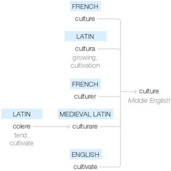
]

???

Middle English (denoting a cultivated piece of land)

The noun from French culture or directly from Latin cultura ‘growing, cultivation’; 
The verb from obsolete French culturer or medieval Latin culturare, both based on Latin colere ‘tend, cultivate’ (see cultivate). 

In late Middle English the sense was ‘cultivation of the soil’ and from this (early 16th century), arose ‘cultivation (of the mind, faculties, or manners’); culture (sense 1 of the noun) dates from the early 19th century.

--

.pull-right[
.center[]

> 《彖》曰：柔来而文刚，故亨。分，刚上而文柔。故以小利有攸往。刚柔交错，天文也；文明以止，人文也。**观乎天文，以察时变，观乎人文，以化成天下**。
]

???
彖 tuan4

贲。艮山+离火, 亨。小利有攸（you1）往。

易传“十翼”之二的象传：

《象》曰：山下有火，贲。先王以明庶政，无敢折狱。

《象辞》说：本卦上卦为艮为山，下卦为离为火，山下有火，火燎群山，这是贲卦的卦象。君子观此卦象，思及猛火燎山，玉石俱焚，草木皆尽，以此为戒，从而明察各项政事，不敢以威猛断狱。

---

## Definition of Culture: Two Key Joints

.pull-left[
.center[

]
]

???

Behavior (anthopologist) or beyond (sociologist)

--

.pull-right[
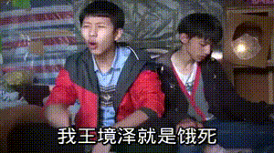
]

???

Pierre Bourdieu 皮埃尔·布迪厄： Embodied cultural capital (skill), objectified cultural capital (expensive car), institutional cultural captial (dr degree) https://www.youtube.com/watch?v=dQ5MdAjX4NU


---

.center[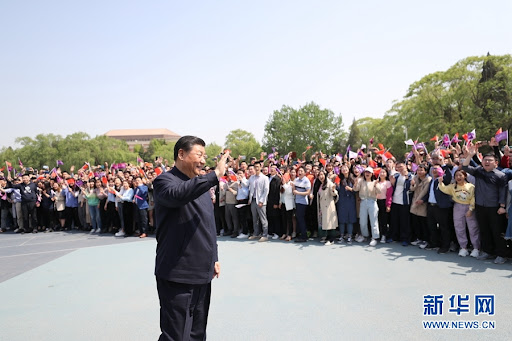]


???

Individual or group

---

class: large, middle, center

Pick a definition and     
seek an example!

---

class: center, middle

## Culture: In the View of Political Scientists


.bg-black.golden.ba.shadow-5.ph4.mt3[

One of two still viable general approach to political theory and explanation.

.tr[
---Harry Eckstein (1988)
]
]

???

He taught at Harvard and then for 20 years at Princeton, after which he moved to the University of California, Irvine 

The second one is rational choice

---

## Culture: An Approach

.pull-left[
.center[
Structuralism

&dArr;

Culturalism

&uArr;    

Rational choice
]
]

.pull-right[
.center[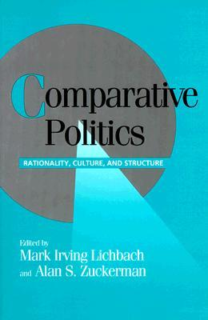]
]

???

Lichbach, M. I., and A. S. Zuckerman. 1997. Comparative Politics: Rationality, Culture, and Structure. Cambridge Univ Pr.

meso-level

---

## Culture: An Approach

.pull-left[
.center[
Structuralism

(How a system affect individuals)   
&dArr;

Culturalism

&uArr;    
(What desides people's preferences)

Rational choice
]
]

.pull-right[
.center[]
]

???

Lichbach, M. I., and A. S. Zuckerman. 1997. Comparative Politics: Rationality, Culture, and Structure. Cambridge Univ Pr.

meso-level

---

class: inverse, bottom

# One Perspective, Two Challenges

---

## Understand Human Politics with a Cultural Approach

*One Perspective*

Civic culture (status) &rArr; Renaissance of culture (continuity)

*Two Challenges*

1. Conceptualization
1. Operation

---

## Type of Cultural Approaches

A sociological approach: Collective character

--

A anthropological approach: Symbol, discourse, and ritual

--

**A psychological approach**: Integration of individual attitudes and preferences

+ Civic culture + survey-based investigation

---

## Benchmark: Civic Culture

.pull-left[
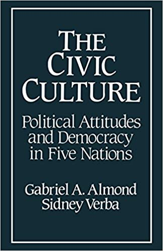
]

--

.pull-right[
Contribution: 

+ **Concept** of "civic culture"    
(theoretical)
{{content}}
]

--

+ **Typology** of culture-regime relationship   
(empirical)
{{content}}

--

+ **Operation** of cross-national comparison    
(methodological)
{{content}}

---

> .red[Attitudes] toward the political system and its various parts, and .red[attitudes] toward the role of the self in the system --- Almond and Verba (1963, 13)

TL;DR: 

1. Regime is determined by people's attitudes;
1. Too much participation, allegiance, nor detachment helps democracy;
1. The U.S. is the "best."

---

## Typology of Political Culture

.pull-left[
.center[
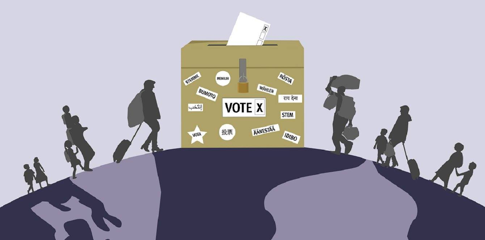
]
]

???

+ participant

--

.pull-right[
.center[

]
]

???

+ subject

--

.center[


]

???

+ parochial

+ Too much participation to polarization
+ Too much allegiance to authoritarianism
+ Too much detachment to elite control

---

## Culture and Regime

.center[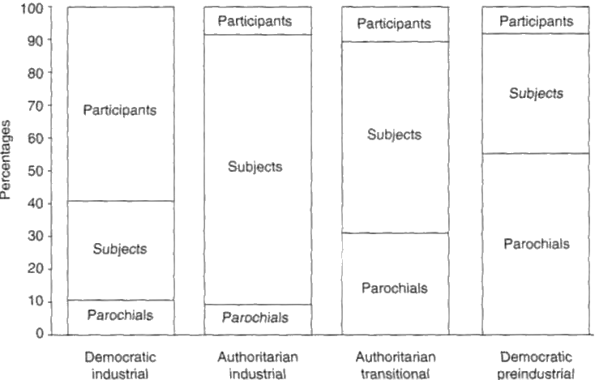]

---

## Empirical Studies

UK, US, Germany (FRG), Italy, and Mexico

Survey and interviews of a 1000 sample for each

.pull-left[
+ Conclusion
    + Italy: alienated political culture
    + Mexico: Alienated and aspirated political culture
    + FRG: Political detachment and subject competence
    + UK: Deferential civic culture
    + US: Participant civic culture, a.k.a.,
    
]

???

Italy: too much detachment

Mexico: imbalance, 不关心政治，却对体制抱有信任

FRG: 政治实用主义和犬儒主义

UK: 恭敬的公民文化

--

.pull-right[]


---

## Criticisms of Almond and Verba's Civic Culture

.pull-left[

TL;DR: 

1. Regime is determined by people's attitudes;
1. Too much participation, allegiance, nor detachment helps democracy;
1. The U.S. is the "best."

]

.pull-right[

Hint:

+ Accuracy?
+ Good for democracy?
+ Elite or mass?

]


???

+ Accurate: in terms of what culture is and how culture affects politics
+ Paradox of democracy: Too much civic culture and too little are bad
    + Especially, how much is too much---conservative anti-participation

---

class: center, middle

## Critiques of Culturalism as a Whole

.pull-left[

]

.pull-right[
🙅 Culture is deterministic;
{{content}}
]

--

🙅Class structure determines attitudes;
{{content}}

--

🙅Adding behavior to the definition;
{{content}}

--

🙅Rational behavior can explain cross-cultural differences. 
{{content}}


---

## Renaissance of Political Culture

.center[
Attacked by the rational choice theory    
&dArr;
]


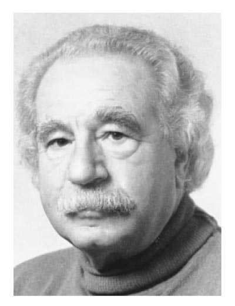


???

Three masters of the Renaissance

Wildavsky, Aaron. 1987. “Choosing Preferences by Constructing Institutions: A Cultural Theory of Preference Formation.” The American Political Science Review 81(1): 4–21.

Eckstein, Harry. 1988. “A Culturalist Theory of Political Change.” American Political Science Review 82(03): 789–804.

Inglehart, Ronald. 1988. “The Renaissance of Political Culture.” The American Political Science Review 82(4): 1203–30.

+ Eckstein: social-psychological assumptions    
+ Inglehart: Showing continuities over time    
+ Almond: Defending four critiques of political culture

---

## Postmodernization Culture

.pull-left[.center[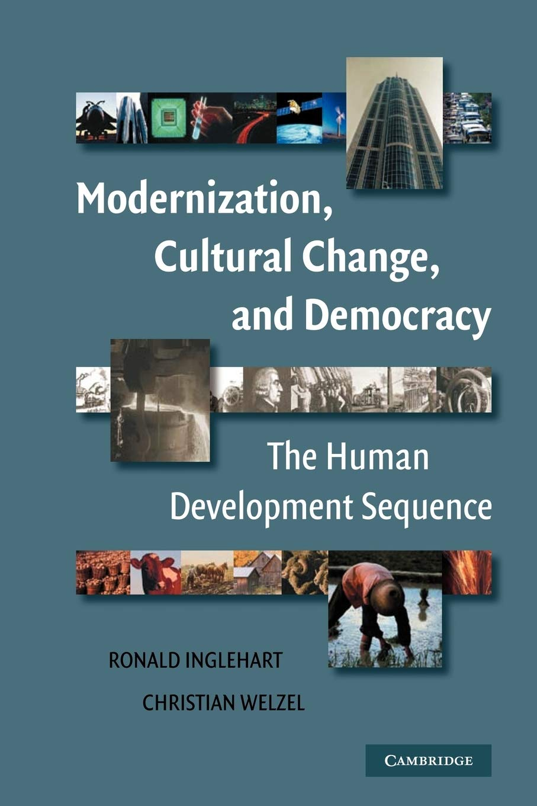]]

.pull-right[
TL;DR:

1. Socioeconomic development (probablistically) brings secularism and self-expression.

2. No global cultural convergence in sight.

3. Cultural change is a non-linear process

4. Modernization not the same as Westernization.
]

???

1. Socioeconomic development, in probabilistic terms, ‘tends to make people more secular, tolerant, and trusting and to place more emphasis on self-expression, participation, and the quality of life’.

2. No global cultural convergence in sight---religion and other traditions not disappearing.

3. Cultural modernization is reversible, e.g. post-socialist Europe.

4. Cultural change is a non-linear process. Post-industrialization moves on from industrialization’s processes of rationalizaton, centralization and bureaucratization towards ever more stress on self-expression and individual autonomy.

5. Modernization not the same as Westernization. USA not a typical example of cultural change, indeed an anomaly in its religious and traditional values.

6. Rise of self-expression values giving rise to ‘a new type of humanistic society that promotes human emancipation’, e.g. gays, women, the disabled.  Centrality of cultural change to emergence and maintenance of democracy has been downplayed in previous theories.

---

class: center, middle

.pull-left[
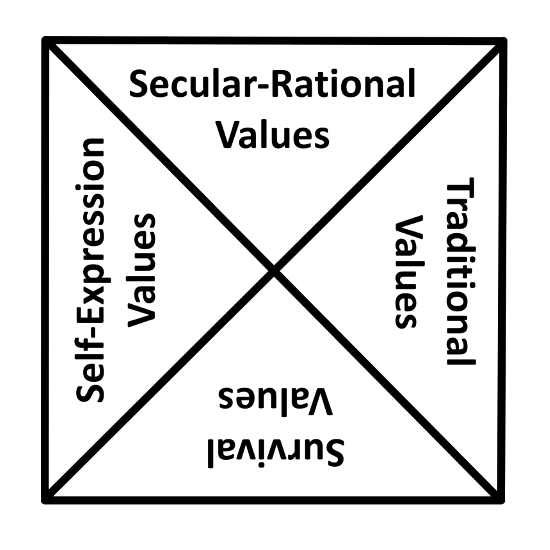
]

--

.pull-right[
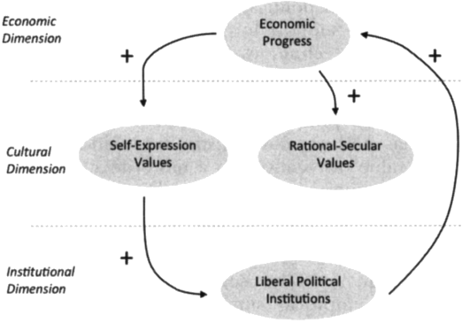
]

???

Traditional values emphasize the importance of religion, parent-child ties, deference to authority and traditional family values. People who embrace these values also reject divorce, abortion, euthanasia and suicide. These societies have high levels of national pride and a nationalistic outlook.

Secular-rational values have the opposite preferences to the traditional values. These societies place less emphasis on religion, traditional family values and authority. Divorce, abortion, euthanasia and suicide are seen as relatively acceptable. (Suicide is not necessarily more common.)

Survival values place emphasis on economic and physical security. It is linked with a relatively ethnocentric outlook and low levels of trust and tolerance.

Self-expression values give high priority to environmental protection, growing tolerance of foreigners, gays and lesbians and gender equality, and rising demands for participation in decision-making in economic and political life.

---

class: center, middle

<video width="1000" height="600" controls>
    <source src="images/pc_culturalMap.mp4" type="video/mp4">
</video>

???

Paying attention to the confucian (China) and Protestant (U.S.)

Not convergence, post-communist Europe, USA becomes more religious, not a typical westernization.

---

## Challenges of the Civic-Culture School: Conceptualization

*Inconsistent definition*
+ Almond & Verba: Attitudes 
+ Inglehart: Habits
+ Eckstein: Orientations (cultural theme)

--

*Whose culture*
+ Elites vs. mass (Fred 2008; Fred, Hu, et.al., 2017)
+ Institution vs. culture (Pye 1965, Almond and Power 1992)

--

### Solution

Rubric, sharedness, or societal-level 

???

+ (1) how to define the concept; 
+ (2) how to disentangle subcultures (for example an elite political culture) from a society's overall political culture; 
+ (3) how to integrate the many individual-level orientations of which the concept is composed; 
+ (4) how to create a societal-level variable from individual-level components; 
+ (5) if the foregoing have been resolved, how to measure the concept; 
+ (6) how to derive hypotheses about individual political behavior from the subjective orientations under study; 
+ (7) how political culture interacts with institutions and other attributes of a polity to produce a propensity for certain types of political outcomes.

Pye 1965: Institution history shapes the mass culture

Almond and Power 1992: Culture is a medium for inputs and outputs

+ Rubric: Agree we are talking about different things
+ Sharedness: only looking at the same part across societies
+ Societal-level: social attributes, but the ability to connect individual and environment lost

---

## Challenges of the Civic-Culture School: Operation

*Individual &rarr; society, how?*
+ Mechanism
+ complexity
+ Individual fallacy

--

### Solution

"A theoretical rationale for why a particular way of summarizing a large number of individual responses is culture" --- William Reisinger (1995)

???

+ Mechanism (cognitive process between brain and information)
+ Complexity (complex construct for a single individual across the society)
+ Individual fallacy (deriving aggregation conclusion from individuals, the set, pattern, system of--- meaningless); Culturalists derided scholars arguing about national character but doign similar things

---

class: inverse, bottom

# Political Culture: A Chinese Experience

---

## Understanding Chinese Politics with a Cultural View

.pull-left[
As an *explanatory variable*

* Ideological
* Institutional 
* Bureaucratic
* Society
* Economy
]

.pull-right[
.center[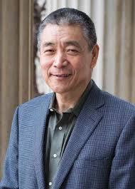]
]

???


---

## Cutting-In Point

.pull-left[
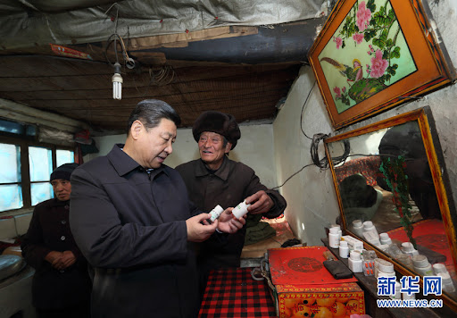
]

.pull-right[
*Distinction* from: 

* Western Democracy
{{content}}

]

???

democracy consists of an elaborate set of institutions and rules
    
--

* Totalitarianism
{{content}}

???

+ totalitarianism pursues total control of society by the state
+ mass line is a control built on the full scale interaction between the state and 

--

* Civil Society
{{content}}

???

+ civil society is autonomy and free from state control

---

## Mass Line

.left-column[
Function

* Link
* Mobilization
* Contract
]

.right-column[
.panelset[

.panel[.panel-name[History]
.center[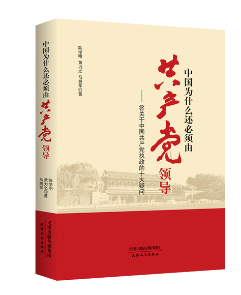]
]

.panel[.panel-name[System]
.center[]
]

.panel[.panel-name[Generation]
.center[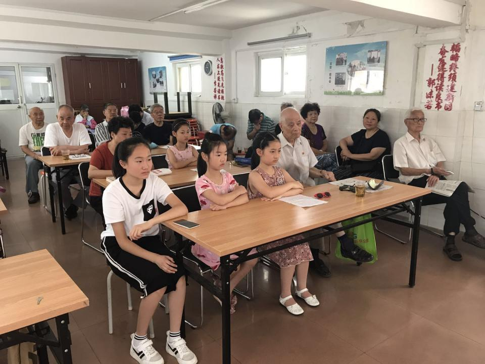]
]
]

]

???

1. a direct link between the state and society with minimum interference of intermediate organizations and institutions
1. a thorough mobilization of the masses in political participation
1. an implicit concept of social contract in which the elites serve the interest of the masses who in return grant political support for the state


* continuity political monopoly
    + only legitimate ruling party: no electoral challenges
    + Marxism-Leninism + nationalism
    + Media control + dissident suppress
        + encouraging within-system direct popular participation
* Renewal of the mass line
    + large-scale mass campaigns
* Continuity in demography
    + age and experiences

---

## Responding to General Theory

.panelset[

.panel[.panel-name[Modernization]
.center[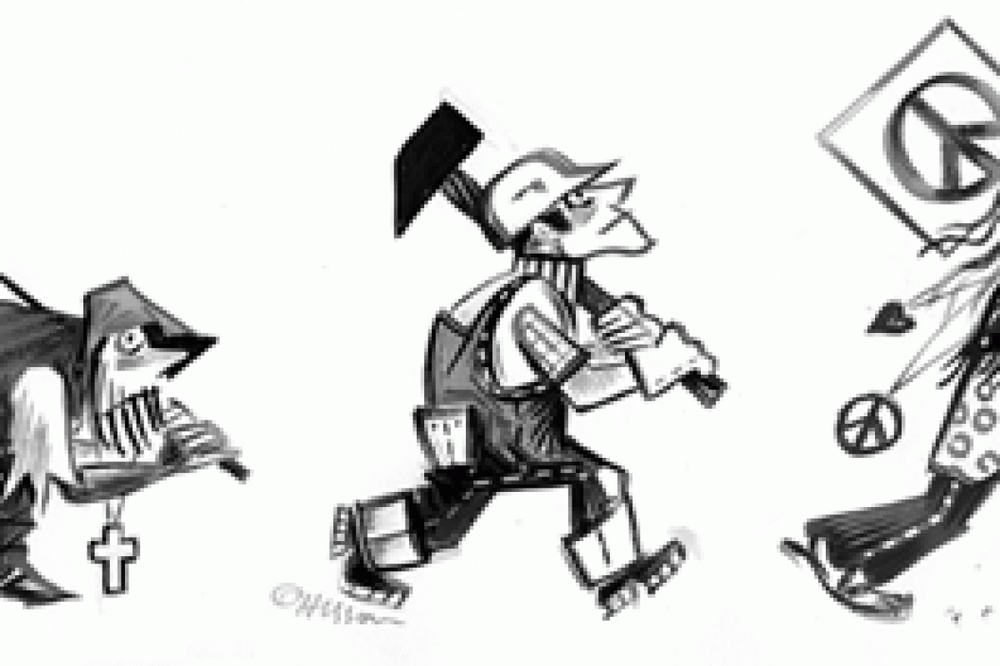]
]

.panel[.panel-name[Social Crisis]
.center[]
]

.panel[.panel-name[Durability]
.center[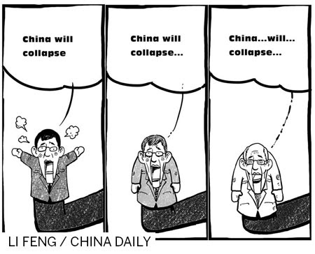
]
]

]

???

Gordon Chang, columnist, author, and lawyer arguing about collapse of China

Durability

* State power
* Advanced governance (capitalism, personnel appointment, fiscal policy, public service, etc.)
* Institution
    + Informal
    + Formal (election + predictable)

---

# Regime Sustainability

*Two perspectives*

* Horizontal vs. Vertical

???

H: 
* Easton1967: Diffuse vs. specific
* Regime vs. agents

V:
* Central vs. Local
* More important than H
* Empirical
    + dissatification with Beijing -> no activism
    + dissatification with local -> more activism
    + Education and urbanization -> more liberal demand
    
    
--

*Two Attitudes*
* Happiness & Regime support
* Groups
    + Disadvantage groups
    + Educated
    + Private sectors
    
???

* Disadvantage and educated -> crisis
* Private sector -> durability

---

## Interpersonal Trust

A critical part of social capital

--

* Trust and Regime
    + Stabilize rather than promoting democracy
    + Discourage direct challenges
    + Promote stability and solidarity
    

---

class: center

## Interpersonal Trust in China: Type and Source

.pull-left[
.center[]
]

--

.pull-right[

{{content}}
]

--


{{content}}


???

* Source
    + Confucian tradition
    + Socialist legacy
    + Economic growth

* Classification
    + Parochial
    + Communual
    + Civic

---

## Nationalism

.pull-left[
*Sources*

* Functionalism
* Culturalism
* Constructivism
]

???
* mixed pic for functionalism
    + education: middle (primary and middle school) most nationalist
    + urbanization: urban less nationalist
    + income: low income high nationalism
* no evidence for culturalism
    + ethnic minorities are more nationalist
* constructivist the most powerful
    + old high nationalist: anti-fenqing theory
    + party members more nationalist

2008 China survey
+ Proud if my country doew well in international sports
+ I would rather be a citizen of my country
+ My country is a better country
+ Other countries were more like my country

&rArr; Nationalism

--

.pull-right[
*Consequences*

* Instrument to strengthen regime stability
* Destabilizing factor
* Promote social trust

]


???

* Zheng 1999
* Shirk 2007
* Wang Shaoguang 2004a

* Empirical
    + short-term: reduce public demand for democracy, civil disobedience, and disatissfaction to the life and the Beijing government
    + long-term: nationalism anti- market capitalism and social and political tolerance
    + treat international critiques of Chinese human rights through nationalism anti-democracy


---

## More Mass-Line Culture Can Explain...

+ Regime-inspired contentious politics
+ Individual dispute resolution (court or non-court)
+ Political desirability

--

(Omitted)

.center[]


---

class: center, middle

## Political Sustainability of China: A Cultural Explanation

--

Mass Line ideology

--

Rich social capital

--

High degrees of public political activism and contention

--

Weak political institutions

--

Highly responsive government

--

Strong regime support

---

## Take-Home Points


1\. Culture for political scientists   
+ As a concept
    + Behavior or beyond
    + Individual or beyond
+ As an approach
    + Meso-level theory
    + Sociological, anthropological, psychological


--

2\. An approach, two challenges   
+ Civic culture &rarr; Postmodernization values
+ Challenges from conceptualization and operation

---

class: center

3\. Political culture: Experiences from China  

Political culture &rarr; Regime operation + mass expectation &darr;     

&darr; Contentious politics + individual disputes &larr; Interpersonal trust + nationalism

&rarr; Political trust + regime sustainability

--

.large[Good to see, more to work!]

---

class: inverse, center, middle

# Thank you!

`r feather_icons("mail")`&nbsp;[yuehu@tsinghua.edu.cn](mailto:yuehu@tsinghua.edu.cn) 

`r feather_icons("globe")`&nbsp; https://sammo3182.github.io/

`r feather_icons("github")`&nbsp; [sammo3182](https://github.com/sammo3182)

```{r pdfPrinting, eval = FALSE, include = FALSE}
pagedown::chrome_print(list.files(pattern = "politicalCulture.html"), timeout = 400)
```