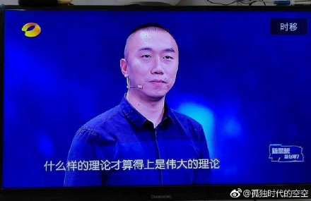

class: large

# A Cultural View of Chinese Politics

---
class: large

# Chinese Cultural Tradition

* Ideological
* Institutional 
* Bureaucratic
* Society
* Economy

---

# Feature of the Contemporary Political Culture

.center[]

---

# Mass Line

## Distinctive

From 

* Westeran Democracy

--

* Totalitarianism

--

* Civil Society

???

* From democracy
    + democracy consists of an elaborate set of institutions and rules
* From totalitarianism
    + totalitarianism pursues total control of society by the state
    + mass line is a control built on the full scale interaction between the state and society
* From civil society
    + civil society is autonomy and free from state control

---

class: large

# Function

* Link
* Mobilization
* Contract

???

1. a direct link between the state and society with minimum interference of intermediate organizations and institutions
1. a thorough mobilization of the masses in political participation
1. an implicit concept of social contract in which the elites serve the interest of the masses who in return grant political support for the state

---

# Post-Mao Period

.center[]

---

# Post-Mao Period

.center[]

???

* continuitypoliticla monopoly
    + only legitimate ruling party: no electoral challenges
    + Marxism-Leninism + nationaism
    + Media control + dissident suppress
        + encouraging within-system direct popular participation
* Renewal of the mass line
    + large-scale mass campaigns
* Continuity in demography
    + age and experiences

---

# Post-Mao Period

.center[]

---

class: large

# Changes

* Attitude towards public opinion
* Social structure

---

class: large

# Regime Sustainability

## Two theories

* Social crisis theory

--

* Regime durability theory

???

Durability

* State power
* Advanced governance (capitalism, personnel appointment, fiscal policy, public service, etc.)
* Institution
    + Informal
    + Formal (election + predictable)

---

class: large

# Regime Sustainability

## Two perspectives

* Horizontal
* Vertical

???

H: 
* Easton1967: Diffuse vs. specific
* Regime vs. agents

V:
* Central vs. Local
* More important than H
* Empirical
    + dissatification with Beijing -> no activism
    + dissatification with local -> more activism
    + Education and urbanization -> more liberal demand
    
    
---

class: large

# Regime Sustainability

## Two attitudes

* Happiness
* Regime support

--

* Groups
    + Disadvantage groups
    + Educated
    + Private sectors
    
???

* Disadvantage and educated -> crisis
* Private sector -> durability

---

class: large

# Nationalism

## Where does nationalism come from? 
### Theory and Examinations

* Functionalism
* Culturalism
* Constructivism

???
* mixed pic for functionalism
    + education: middle (primary and middle school) most nationalist
    + urbanization: urban less nationalist
    + income: low income high nationalism
* no evidence for culturalism
    + ethnic minorities are more nationalist
* constructivist the most powerful
    + old high nationalist: anti-fenqing theory
    + party members more nationalist

---

class: large

# Nationalism

## Consequences

* Instrument to strengthen regime stability

--

* Destabilizing factor

--

* Promote socal trust

???

* Zheng 1999
* Shirk 2007
* Wang Shaoguang 2004a

* Empirical
    + short-term: reduce public demand for democracy, civil disobedience, and disatissfaction to the life and the Beijing government
    + long-term: nationalism anti- market capitalism and social and political tolerance
    + treat international critiques of Chinese human rights through nationalism anti-democracy

---

class: large

# Interpersonal Trust

* Social capital!!

--

* Trust and Regime
    + Stablize rather than promoting democracy
    + Discourage direct challenges
    + Promote stability and solidarity
    

---

class: large

# Interpersonal Trust in China

* Source
    + Confucian tradition
    + Socialist legacy
    + Economic growth

--

* Classification
    + Parochial
    + Communual
    + Civic

---

class: large

# Interpersonal Trust in China
## What changes it and what can it changes?

* Democracy?

--

* Democracy?

???
Not necessary

Not promote

---

class: large

# Political Trust and Contentious Politics

--

(Omitted)

.center[]

---

class: large

# Populist Authoritarianism

1. Mass Line ideology
1. Rich social capital
1. High degrees of public political activism and contention
1. Weak political institutions
1. Highly responsive government
1. Strong regime support

---

class: inverse, center, middle

# May I help you, Ma'am/Sir?

<i class="fa fa-envelope fa-lg"></i>&nbsp; [yue-hu-1@uiowa.edu](mailto:yue-hu-1@uiowa.edu)

<i class="fa fa-globe fa-lg"></i>&nbsp; https://sammo3182.github.io/

<i class="fa fa-github fa-lg"></i>&nbsp; [sammo3182](https://github.com/sammo3182)

<i class="fa fa-twitter fa-lg"></i>&nbsp; [@yuehupolisci](https://twitter.com/yuehupolisci)
