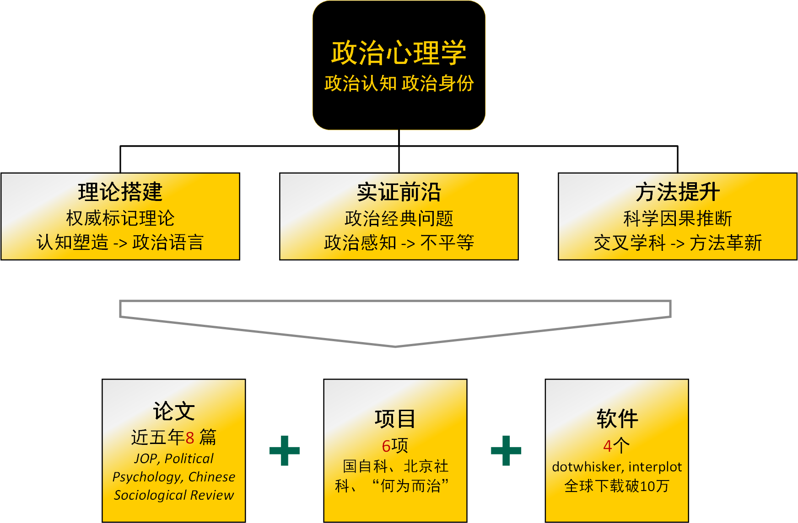
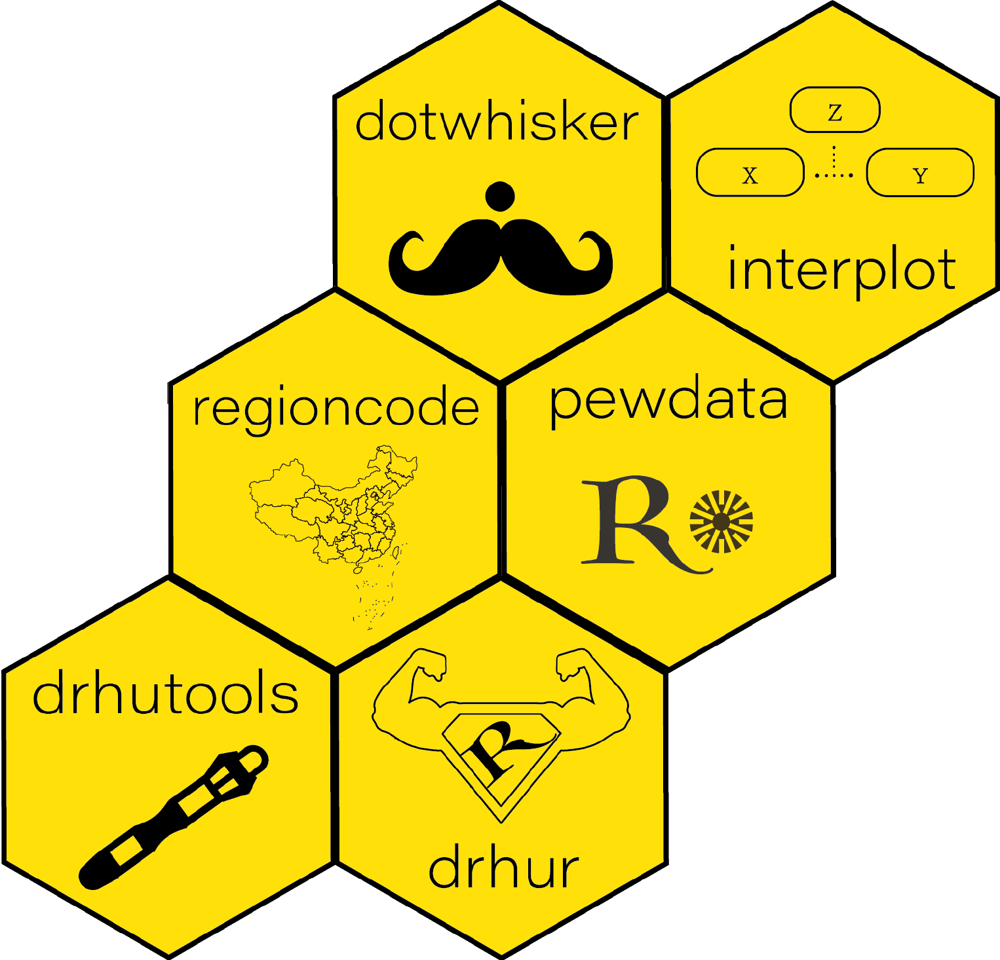
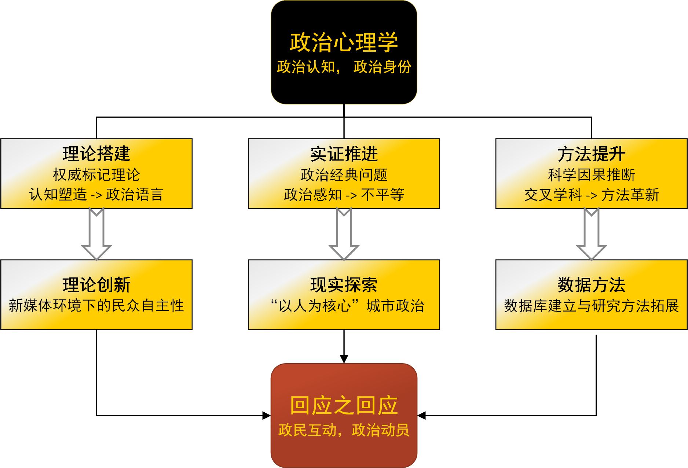

```{r setup, include=FALSE}
knitr::opts_chunk$set(echo = FALSE, message = FALSE, warning = FALSE)

xaringanExtra::use_xaringan_extra(c("tile_view", # O
                                    "broadcast", 
                                    "panelset",
                                    "tachyons"))
```

## 提要

.pull-left[
### 工作总结

1. 学术研究
1. 教育培养
1. 公共服务
]

.pull-right[
### 下一步工作计划

1. 学术研究
1. 学术影响
1. 教书育人
1. 公共服务
]

---

class: inverse, bottom

# 工作总结

---

## 学术研究

.center[

]

???

psychological view of politics: rational choice; personality; cognition

---

## 基于认知塑造框架，建构政治语言认知影响理论

.bg-black.golden.ba.shadow-5.ph1.mt1[
.center[语言 &hArr; 思想]
]

--

+ 权威标记理论：.red[政治心理路径]    
.small[*Political Psychology*，*Democratization*]

???

1. David Laitin, 语言学方向 (Stanford)
1. Amy Liu, 政治经济学方向

--
    
+ 语言政治塑造功能：.navy[国别观]    
.small[*Journal of East Asian Studies*；Stephan Haggard]
.center[]

???

Stephan Haggard, UCSD, director of the Korea-Pacific Program

---

## 基于政治感知理论，深化政治经济不平等的实证研究

人类发展路径：.navy[阶层否定 vs. 阶层复制]   

+ 经济不平等 &rArr; 阶级意识、择优发展    
.small[*Journal of Politics*，*Research & Politics*]
    
--

发展主要矛盾：.red[弥合社会经济不平等]    

+ 发展差异 &nhArr; 教育差异
+ 语言能力    
.small[*Chinese Sociological Review*]

---

## 基于交叉学科思维，推动政治科学研究方法革新

学科内
+ 美国政治 &rarr; 中国政治

--

跨学科
+ 语言学、经济学方法 &rarr; 政治学实验

--

数据库与软件

.pull-left[
+ 爱国主义教育基地    
时空数据库
+ 《人民日报》（1946~2003）   
全文本数据库
]
.pull-right[]

---

## 教育培养

### 教育教学

研究生：紧抓核心前沿，推动.red[教学体系化]
+ 课程：《政治数据分析》、《政务大数据》.small[（合教）]
+ 成效：.blue[前沿性]和国际性，教发中心院系.blue[支持项目]

--

本科生：提高政治素养，推动.red[社会科学普及化]
+ 课程：《公共政策分析》
+ 成效：多院学生报课，规模扩大.blue[四倍]，.blue[教改项目]

--

其他：聚焦课后教学实践，推进.red[教育教学改革]
+ 课程：《定量俱乐部·R语言工作坊》
+ 成效：.blue[3,000]人，清华.blue[最大]R语言社区，互动.blue[教材]

---

### 人才培养

博士生2人；本科生2人；指导SRT、学推项目；

学生获得国际知名高校研究生学位。

???

指导的优秀本科生获得UPenn、CMU、Brandeis、Rochester、UCI等多所名校研究生项目offer, 并于UCSD、UChicago等国际知名高校攻读研究生学位。

--

+ 清华大学学生社会实践优秀指导教师    
+ 清华大学第九届青教赛三等奖

---

## 公共服务

+ 学院

“双肩挑”，研工组组长（.red[956]，.red[141]）

+ 学科
    + 清华大学计算科学平台
    + 清华大学数据治理研究中心
    + 双一流、学科评估

+ 学校
    + “天津招生组”成员，“优秀招生新人”

---

class: inverse, bottom

# 下一步工作计划

---

## 学术研究

.center[

]

???

## 理论：新媒体环境中的民众政治自主性研究

回应身份、回应动机、回应效果

## 实证：“以人为核心”的当代中国城市政治研究

+ 语言制度主义与现代政治表达：建制化语言的政治心理效果、语言制度与制度化语言互构关系，政治制度化过程中政治用语塑造
+ 新型城镇化背景下的新老市民政治意识研究：新型城镇化背景下有效动员、高效治理新模式

## 方法：数据时代的政治认知数据库与研究方法

---

class: small

## 研究产出预期

.pull-left[

### 理论

+ 中英文专著、论文
+ 北京社科项目

### 实证

+ 中英文论文
+ 国家自科项目
+ 招商局慈善基金会项目
+ 智库重点项目

]

--

.pull-right[
### 方法


+ 城市社会经济发展.navy[均衡指数]数据库
+ 疫情社交媒体回应.navy[跨平台]数据库
+ 动态公共舆论.navy[跨国比较]数据库
+ .navy[孔子学院]数据库

<br>

+ .red[混合]分析方法
+ .red[实验室]政治学
+ .red[敏感问题]的调查实验方法

]

???

清华大学经济社会数据研究中心


---

## 学术影响

.pull-left[
+ 研究团队

+ 学术社群

+ 国际合作
]

--

.pull-right[

]

???

1. 五人团队
1. 打造科研、教学、宣传一体化的学术社群 + 全国性前沿研究社区发表研究作品
1. 英文发表、国际合作项目（DCPO）

NUS survey of Chinese contemporary politics

United States | Darkgreen
Mainland China | Red
Taiwan | Blue
Hong Kong | Orange
other (including Africa and Middle East) | Purple
Europe | Yellow
North America (other) | Pink
Asia (other) | Green
South America) | Brown


---

## 教书育人

1. 进一步提高教学能力，提升.blue[教学质量]；
1. 打造工作坊.blue[精品项目]，搭建 `drhur`教学软件集群；
1. 培养研究生、博士后，培育学术.blue[后备人才]；
1. 利用.blue[国际学术网络]，为有志学生提供机会。

???

美国爱荷华大学（美国政治学排名 37）、香港科技大学（ QS 社会科学排名大中华区第 4 位，香港第 2 位）

--

## 公共服务

+ .red[院内]：研工组作，“社稷担当”；
+ .red[校内]：推广计算社会科学；
+ .red[国内]：推动数据治理中心与政府部门密切合作。

---

class: inverse, center, middle

# 感谢聆听
# 期待指导