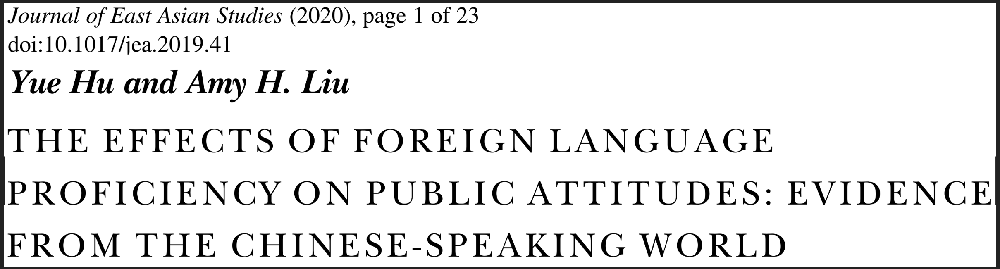

```{r setup, include=FALSE}
knitr::opts_chunk$set(echo = FALSE, message = FALSE, warning = FALSE)

xaringanExtra::use_xaringan_extra(c("tile_view", # O
                                    "broadcast", 
                                    "panelset",
                                    "tachyons"))
```

## 个人简介


### 教育与学术经历

+ 2005-2009：南开大学国际关系学士
+ 2009-2013：里加纳大学（加）、南卡罗来纳大学（美）政治学硕士 
+ 2013-2018：爱荷华大学（美）政治学博士 
+ 2019.01-今：清华大学社会科学学院政治学系助理教授

.pull-left[
### 研究方向

+ 政治认知
    + 政治语言学
    + 分配政治与感知
]

.pull-right[
<br>

+ 政治科学研究方法
    + 实证方法交叉引入
    + 计算社会科学、实验政治
]

???

大家好，我是胡悦！非常感谢这个机会和诸位老师汇报，我自2019年入职以来进行的工作以及对未来的展望。首先，先为大家介绍一下我的基本情况，我自2018年自美国爱荷华大学毕业，翌年1月加入清华大学社会科学学院政治系。主要研究方向是基于正知人知的政治语言学研究和分配政治的感知研究。另外，我也热衷于对政治科学研究方法的研究，尤其是在实证法的交叉引用，以及计算社会科学和实验政治学方法名。

---

## 学术成果

.pull-left[

共发表学术论文.red[12]篇，近五年.red[8]篇   
(.red[100%]SSCI论文，.red[50%]独作/一作)


+ .red[1]篇国际顶刊
+ .red[2]篇A+期刊
+ .red[2]篇A类期刊
+ .red[3]篇B类期刊


+ .red[6]套统计分析软件   
全球下载量累积.red[\>24万]次
]


.pull-right[


]

???

目前我共发表学术论文12篇，近五年发表8篇，全部为SSCI论文，一半以上是独立或者作为一作发表。其中就包含政治学三大刊之一的JOP文章一篇，以及另外两篇A+类期刊，2篇A类，以及3篇B类。除此以外我还主持和参与了6款统计分析软件的研发，这些软件的全球下载量已达到24万次。


---

## 研究项目

进入清华以来，作为主要负责人立项科研项目.red[6]项：

.center[国自科项目.red[1]项、省部级项目.red[2]项、其他项目.red[3]项]


.small[
|     序号    |     项目名称                                                                |     项目来源                                |     起止时间      |     经费     |
|-------------|-----------------------------------------------------------------------------|---------------------------------------------|-------------------|--------------|
|     1       |     新型城镇化进程中新老市民身份认同建构的社会心理机制与政策引导路径研究    |     国家自然科学基金委                      |     2021~2023     |     24       |
|     2       |     突发公共卫生事件互联网政治生态与话语竞争研究                            |     北京市社科联                            |     2020~2023     |     6        |
|     3       |     北京市违法建设专题研究                                                  |     北京市规划和自然资源委员会              |     2020~2020     |     95.88    |
|     4       |     新型城镇化进程中身份认同危机与语言治理                                  |     中国人口福利基金会、招商局慈善基金会    |     2020~2021     |     5        |
|     5       |     香港群体身份认同的互动塑造机制研究                                      |     清华大学国家高端智库                    |     2020~2021    |     20       |
|     6       |     新时代国民身份认同建构机制研究                                          |     清华大学文科处                          |     2020~2022     |     10       |
]

.right[\* 另作为成员参与国社科项目1项，校级项目3项]

???

在研究项目方面，我已主要负责人成功立项科研项目6项，包含国自科青年项目1项，省部级2项，以及其他项目3项。我还支持了另一项国社科项目和三项校级项目的理想。

---

class: inverse, bottom

# 学术创新

## 1. .large[.red[基于认知塑造的政治语言学]]
## 2. .large[.blue[基于分配政治的政治感知研究]]
## 3. .large[.orange[基于学科交叉的研究方法革新]]

???

在学术上，我的工作可以被归纳为三个方向：基于认知塑造的政治语言学、基于分配政治的政治感知研究以及学科交叉的方法革新。

---

.Small[

**Hu, Yue**. .red[2020a. “Culture Marker Versus Authority Marker: How Do Language Attitudes Affect Political Trust?” Political Psychology 41(4): 699–716.]	
**Hu, Yue**. .red[2020b. “Refocusing Democracy: The Chinese Government’s Framing Strategy in Political Language.” Democratization 72(2): 302–20.]		
**Hu, Yue**, and Amy H. Liu. .red[2020\. “The Effects of Foreign Language Proficiency on Public Attitudes: Evidence from the Chinese-Speaking World.” Journal of East Asian Studies 20(1): 1–23.]   

Solt, Frederick, **Yue Hu**, Kevan Hudson, Jungmin Song, Dong Yu. .blue[2016\. “Economic Inequality and Class Consciousness.” The Journal of Politics 79(3): 1079–83.]		
Solt, Frederick, **Yue Hu**, Kevan Hudson, Jungmin Song, Dong Yu. .blue[2017\. “Economic Inequality and Belief in Meritocracy in the United States.” Research & Politics 3(4): 1–7.]		
Tang, Wenfang, **Yue Hu**, and Shuai Jin. .blue[2016\. “Affirmative Inaction: Language Education and Labor Mobility among China’s Muslim Minorities.” Chinese Sociological Review 48(4): 346–66.]


**Hu, Yue**. .orange[2019\. “Are Informal Education Facilities Effective Means for Generating Political Support? A Spatial Analysis.” Social Science Quarterly 100(3): 701–24.]		
Claypool, Vicki Hesli, William Reisinger, Marina Zaloznaya, **Yue Hu**, and Jenny Juehring. .orange[2018\. “Tsar Putin and the ‘Corruption’ Thorn in His Side: The Demobilization of Votes in a Competitive Authoritarian Regime.” Electoral Studies 54: 182–204.]	
]

???

这里大家看到的是我现有代表性著作在这三方面的分布。三种颜色代表着三个方向。当然研究中间也有交叉。下面为大家简要介绍一下在各方面取得的一些进展：

---

## 学术贡献点1：基于认知塑造的政治语言学
.pull-left[
+ 建构基于政治认知的“.red[权威标记]”理论，提出政府通过语言政策建立政治标记，进而影响国民政治行为偏好的解释路径。   
（*Political Psychology*,     
*Democratization*）

+ 运用政治语言学框架，理解大众政治心态构建过程，探索民众国别观认知塑造机制，加深对“.red[政治意识塑造机制]”和“.red[公共教育的政治影响]”的理解和认知
（*Journal of East Asian Studies*）
]

.pull-right[
.center[




]
]

???

在政治语言学方面，我注重理论和应用两方面。理论上建立基于政治认知的“权威标记”理论，提出政府通过语言政策建立政治标记，进而影响国民政治欣慰偏好的解释路径。右图就是这一新理论逻辑对比传统“文化标记”理论的实验检验结果。在应用方面，我用政治语言学框架，去理解大众政治心态的建构过程，其中一个研究突破点是对于国别观的认识。相关研究也已经发表。那天还看到UCSD的韩亚中心主任Stephan Haggard在社交媒体上对我们研究不错的评价。

---

## 学术贡献点2：基于分配政治的政治感知研究

.pull-left[
+ 聚焦.red[不平等感知]，理解社会不平等结构与个体社会身份认同的关系。    
（*Journal of Politics*，*Research & Politics*）
.center[]
]

.pull-right[
+ 聚焦中国社会发展族群不平衡现状和差异，探索社会发展不平衡问题的.red[改善途径]。（*Chinese Sociological Review*）


]

???

我的第二个学术贡献点聚焦于分配导致的社会经济不平等，以及民众对这一状况的感知，用以理解社会不平等结构与个体社会身份认同之间的关系；基于这种理解，我还试图探索对不平等问题的改善途径。以下是我在这些方面发表的学术期刊和主要发现的图示。

---

## 学术贡献点3: 基于学科交叉的研究方法革新
.pull-left[]

.pull-right[
+ .red[学科内]，将美政“距离衰减毗邻”方法，应用于爱国主义教育基地的空间研究。（*Social Science Quarterly *）

+ .red[跨学科]，与社会学家协同提出腐败经历对选民的“反动员”模型。(*Electoral Studies*)

+ .red[数据库]和.red[分析软件]搭建，爱国主义教育基地时空数据库、《人民日报》全文数据库等，`interplot`、`dotwhisker`等软件。
]

???

除了前两个对具体政治议题的考虑，我还在政治研究方法上做出了一些探索。总结而言，可以分为三方面：第一，学科内的借鉴，比如使用美国政治的研究方法来研究中国爱国主义教育基地；第二，学科间的交叉借鉴，我们和社会学家合作研究混合政体内的对选民的反动员模型。同时我也将研究过程中的一些产出作为公共学术资源，就包括人民日报数据库、爱国主义教育基地数据库等。左图就是根据我的爱国主义教育基地数据库画出来的基体发展过程。

Although voting in competitive authoritarian systems is unlikely to bring about regime change, citizens do use elections to express their political preferences and their opinions about the performance of their leaders.

Exposure to corruption: perception of corruption popularity, and perception of leadership corruption

---

background-image: url("image/pro_students.png")
background-position: right top 20px
background-size: 58% 90%

## 教育培养

.pull-left[
研究生课程：
+ 《政治数据分析》    
前.red[25%]，4项指标前.red[5%]
+ 《政务大数据》（合教）

本科生课程：
+ 《公共政策分析》
+ 《理解政策》

其他：
+ 《R语言工作坊》
]

???

在教育教学方面，我开设了两门研究生课程《政治数据分析》以及与天广老师合教的《政务大数据》，其中《政治数据分析》上学期评教为全校同类课程前25%，四项指标达到5%。本科我也开设了两门课程：一门专业基础课《公共政策分析》和一门通识课《理解政策》。中间两个微信截图分别是我研究生课和本科课学生上课后的感受，上面“学习之余了我、学习使我快乐”，下面说“到了大学，上课居然没还有游戏环节，我爱了”。很让我欣慰的是，这些学生我其实没他们微信，是一些朋友看到转给我的，也就是说他们发的应该是真情实感，不是专门给我看的。再右面的截图是我主持的一个课外教学项目《r语言工作坊》的截图，这个课外讲座也已经进行了三轮，大家反应也都很好。

---

## 人才培养
.pull-left[
### 培养学生

博士生2人，本科生2人

### 教学项目：

主持:
+ 本科教改项目1项
+ 研究生院系支持项目1项；

指导:

+ 本科SRT项目1项
+ 学推项目1项

]

.pull-right[
### 教学奖项

+ 学生社会实践优秀指导教师    
+ 清华大学第九届青教赛三等奖

.center[]

]

???

在人才培养上，我指导了两名博士生，同时也和院内很多老师一样，从去年开始担任学院的本科新生导师，现在指导国内和国际各一名学生。我现在主持了一项本科教改项目和一项研究生院系支持项目，另一项研究生教改项目也在申请中。此外还指导了一些学术给主导科研项目。感谢学校鼓励，给我了《社会实践优秀指导教师》和《青教赛三等奖》两个荣誉。

---

class: Small

## 公共服务

### 担当社科党委研工组组长，争做“双肩挑”教师骨干

+ 协助建立.red[3]个暑期实践基地、.red[1]个就业实践基地，及配套奖助学金。
+ 组织领导学生工作，助力社科学生团体获.red[研究生先进集体]、.red[“一二·九”综奖三连冠]等。
+ 落实.red[人才培养]项目“社稷担当”规模化、规范化、多样化发展；
+ 牵头编写.red[《社科学院学生心理危机预警与干预行为准则》]，获得校研工部表扬。
+ 接手社科学院研究生疫情防控工作，处理疫情审批事宜.red[\>1,100]项。

### 参与学科建设，推动学科共同体建设

+ 积极参与清华政治学系和学科发展，参与“.red[双一流]”、.red[学科评估]资料收集撰写。
+ 助力计算社会科学学科共同体建设,参与组织 “.red[大数据社会科学讲习班]”、 “.red[计算社会科学高端论坛]”各两次，主持首届“.red[青年计算社会科学家]”训练营和称号评选工作。

### 深入地方纳贤才，为强基计划开展做贡献

积极参与招生工作，作为清华大学“天津招生组”成员，负责清华首次“强基计划”地方推广、选拔和数据汇总工作获得“.red[优秀招生新人]”称号。

???

在公共服务方面，感谢学院的信任，任命我为社科学院党委研工组组长。在院领导和诸位老师的支持下，我们也取得了一些成绩。特别想向诸位老师汇报的是，咱们现在属于学院自己的实践基地已经达到三家(重庆九龙坡、北京十一中、肃宁朔黄铁路)以及1个就业实践基地（卓育英才），基本能够满足咱们同学的学业和实践需求。我们也取得了很多成绩，比如研究生先进集体、一二九三连冠等。当然这也都离不开诸位院领导和诸位导师们的倾情支持。我们在人才培养方面、心理健康方面、以及疫情防控方面，研工口也都取得了一些成绩。除了这些，我还参与到“双一流”、“学科评估”、“大数据讲习班”等学科建设工作中，去年也有幸主持了咱们首届“青年计算社会科学家”项目。此外我还去体验了一下招生工作，拿回来一个“优秀招生新人”的称号。

---

class: inverse, bottom

# 下一步工作计划

???

以上是研究的一些发展，下面向老师们汇报一下我之后的发展计划，也请大家多批评指导。

---

## 学术研究

### 短期：新媒体环境内的民众身份与政治认知研究

+ .red[香港群体身份]塑造机制研究（国家高端智库重点项目，报告）
+ “回应之回应”.red[官媒受众]政治认知与心态研究（中英文论文）
+ 突发公共卫生事件.red[叙事话语竞争]研究（北京社科项目，论文）

### 中长期：新型城镇化背景下的市民身份塑造研究

+ 语言制度主义与.red[现代政治身份]和政治表达：*Under the Tower of Babel:Public Political Perception and Regime Legitimacy in the
View of Political Linguistics* （专著）
+ 新型城镇化市民.red[身份认同危机]与语言治理（招商局慈基会项目，论文）
+ .red[新老市民身份认同]建构的社会心理机制与政策引导路径研究    
（国自科项目，论文）


???

在学术上，我将继续以政治认知为基础开展研究，探索政治认知与政治行为、治理需要之间的关系。那么个体认知与社会政治结构是怎么联系在一起的呢，我找到的勾连群体身份认同，通过这个勾连，我将在短期内针对香港问题、网络时代主流媒体受众、以及应急事件的话语治理等中国面临的显示治理挑战进行分析研究、建言献策。二中长期，我将在一个更广泛的视角，尤其是结合新型城镇化这一社会发展洪流，讨论城镇化、现代化过程中政治身份与政治结构互动。

---

### 方法：数据时代的政治认知数据库与研究方法

.pull-left[

]

.pull-right[

+ 动态公共舆论.navy[跨国比较]数据库
+ .navy[孔子学院]数据库
+ 城市发展.navy[均衡指数]数据库
+ 疫情社交媒体.navy[跨平台]数据库

<br>

+ 调查数据.red[跨时空]比较方法；
+ .red[实验室]政治学；
+ 基于.red[观察数据]的因果推断

]

???

在研究方法上，我在筹建右面四个数据库，左面就是我们为第一个动态舆论跨国比较数据库建立的可视化界面。同时我也会在调查数据跨时空比较、实验室政治学和观察数据的因果推断三方面进行发展。

---

## 学术影响

.pull-left[

+ 建立以博、硕士研究生为主体的.red[研究团队]

+ 在.red[全国性前沿研究社区]发表研究作品

+ 加强.red[与政府合作]，服务政治实践
    + 与北京规自委合作项目
    + 与北京其他部门合作项目

+ 开展国际合作，推进学科发展，.red[讲好中国故事]

]

.pull-right[

"NUS survey of Chinese Contemporary Politics"


]

???

俗话说，不想当将军的士兵不是好士兵，我也希望通过自己的努力逐步扩展自己的学术影响，建立自己的团队，在全国前言研究社区宣传自己的作品。同时作为中国政治学者，我知道，必须要接触政府、了解政府，他们的很多治理难题，有时也能反映中国政治的深层问题，值得研究。我现在已经牵头和北京市规自委达成合作，撰写的报告也已两次获得市领导批示；下面我也会进一步推动和北京民政局等政府部分合作，一方面增强对于政府的认识，另一方面也提升清华政治系的政策影响力。最后，我也会利用自身优势继续开展国际合作，右图是新加坡国立寄给我的关于中国当代政治研究者的调查，根据这个调查，我正处于中美两个学术圈的交界处。我也希望利用这种有时，向国际学界展示中国研究成果，讲好中国故事。


NUS survey of Chinese contemporary politics

United States | Darkgreen
Mainland China | Red
Taiwan | Blue
Hong Kong | Orange
other (including Africa and Middle East) | Purple
Europe | Yellow
North America (other) | Pink
Asia (other) | Green
South America) | Brown


---

## 教书育人

1. 提升教学质量，打造“文科生也听得懂”的.red[社会科学方法论训练系统]；
1. .继续打造.red[编程工作坊]精品项目，搭建 .red[`drhur`] 教学软件集群；
1. 培养研究生、博士后，培育学术.red[后备人才]；
1. 利用国际学术网络，为有志学生提升到国际顶尖高校.red[深造机会]。


## 公共服务


+ 研究生工作：“社稷担当”人才培养项目、“师友会”专题项目；
+ 学术共同体：计算社会科学平台、大数据讲习班

???

最后在教书育人方面, 我也会继续打造我的“打造文科生也听得懂的科学方法训练体系”以及工作坊，着手软件和教材开发，培养有理论有技术的“新文科”人才，以及为大家搭建国际交流网络。在公共服务上，继续致力院内研究生和计算社会科学平台工作。为学院、为学生服务好。

---

class: inverse, center, middle

# 感谢聆听
# 敬请指导

???

这就是我的汇报，期待老师们的批评指正。

```{r pdfPrinting, eval = FALSE, include = FALSE}
pagedown::chrome_print(list.files(pattern = "tenure.*.html"), timeout = 300)
```