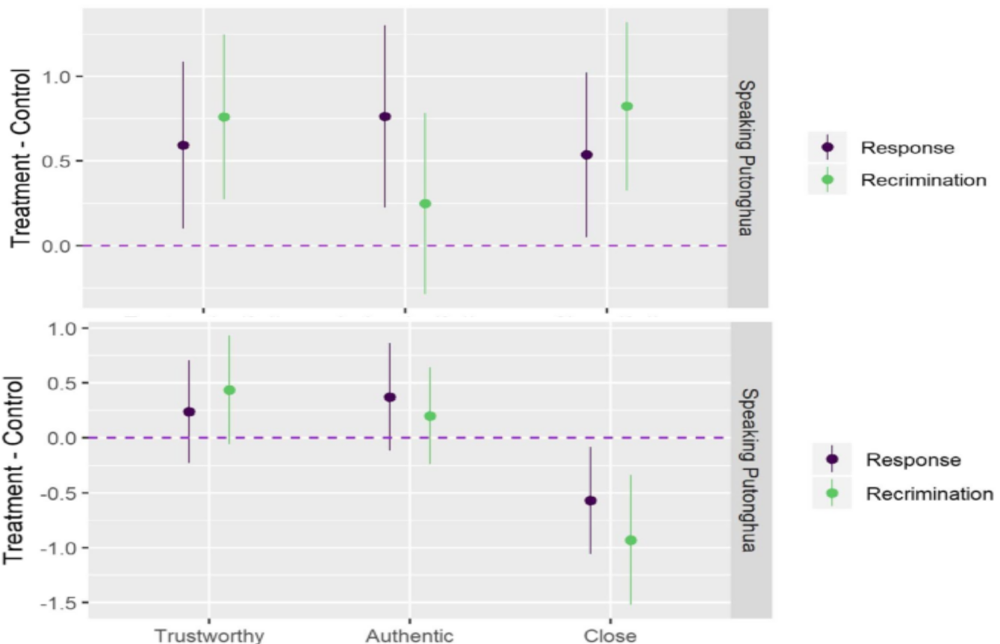
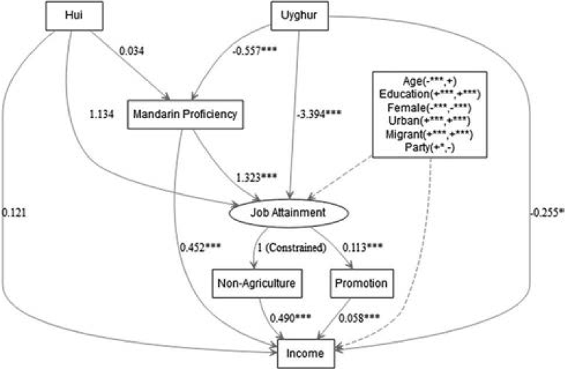

```{r setup, include=FALSE}
knitr::opts_chunk$set(echo = FALSE, message = FALSE, warning = FALSE)

xaringanExtra::use_xaringan_extra(c("tile_view", # O
                                    "broadcast", 
                                    "panelset",
                                    "tachyons"))
```

## 个人简介


### 教育与学术经历

+ 2005-2009：南开大学国际关系学士
+ 2009-2013：里加纳大学（加）、南卡罗来纳大学（美）政治学硕士 
+ 2013-2018：爱荷华大学（美）政治学博士 
+ 2019.01-今：清华大学社会科学学院政治学系助理教授

.pull-left[
### 研究方向

+ 政治认知
    + 政治语言学
    + 分配政治与政治意识塑造
]

.pull-right[
<br>

+ 政治科学方法
    + 实证方法交叉引入
    + 计算社会科学、实验政治
]

---

## 学术成果

.pull-left[

共发表学术论文.red[12]篇，近五年.red[8]篇   
(.red[100%]SSCI论文，.red[50%]独作/一作)


+ .red[1]篇国际顶刊
+ .red[2]篇A+期刊
+ .red[2]篇A类期刊
+ .red[3]篇B类期刊


+ .red[6]套统计教学软件   
全球下载量累积.red[\>24万]次
]


.pull-right[


]


---

## 研究项目

近五年，作为主要负责人立项科研项目.red[6]项：

.center[国家自然科学基金项目.red[1]项、省部级项目.red[2]项、其他项目.red[3]项]


.small[
|     序号    |     项目名称                                                                |     项目来源                                |     起止时间      |     经费     |
|-------------|-----------------------------------------------------------------------------|---------------------------------------------|-------------------|--------------|
|     1       |     新型城镇化进程中新老市民身份认同建构的社会心理机制与政策引导路径研究    |     国家自然科学基金委                      |     2021~2023     |     24       |
|     2       |     突发公共卫生事件互联网政治生态与话语竞争研究                            |     北京市社科联                            |     2020~2023     |     6        |
|     3       |     北京市违法建设专题研究                                                  |     北京市规划和自然资源委员会              |     2020~2020     |     95.88    |
|     4       |     新型城镇化进程中身份认同危机与语言治理                                  |     中国人口福利基金会、招商局慈善基金会    |     2020~2021     |     5        |
|     5       |     香港群体身份认同的互动塑造机制研究                                      |     清华大学国家高端智库                    |     2020~2021    |     20       |
|     6       |     新时代国民身份认同建构机制研究                                          |     清华大学文科处                          |     2020~2022     |     10       |
]

.right[\* 另作为成员参与国家级科研项目1项，校级项目3项]

---

class: inverse, bottom

# 学术创新

## 1. .large[.red[基于认知塑造的政治语言学]]
## 2. .large[.blue[基于分配政治的政治感知研究]]
## 3. .large[.orange[基于学科交叉的研究方法革新]]

---

.Small[

**Hu, Yue**. .red[2020a. “Culture Marker Versus Authority Marker: How Do Language Attitudes Affect Political Trust?” Political Psychology 41(4): 699–716.]	
**Hu, Yue**. .red[2020b. “Refocusing Democracy: The Chinese Government’s Framing Strategy in Political Language.” Democratization 72(2): 302–20.]		
**Hu, Yue**, and Amy H. Liu. .red[2020\. “The Effects of Foreign Language Proficiency on Public Attitudes: Evidence from the Chinese-Speaking World.” Journal of East Asian Studies 20(1): 1–23.]   

Solt, Frederick, **Yue Hu**, Kevan Hudson, Jungmin Song, Dong Yu. .blue[2016\. “Economic Inequality and Class Consciousness.” The Journal of Politics 79(3): 1079–83.]		
Solt, Frederick, **Yue Hu**, Kevan Hudson, Jungmin Song, Dong Yu. .blue[2017\. “Economic Inequality and Belief in Meritocracy in the United States.” Research & Politics 3(4): 1–7.]		
Tang, Wenfang, **Yue Hu**, and Shuai Jin. .blue[2016\. “Affirmative Inaction: Language Education and Labor Mobility among China’s Muslim Minorities.” Chinese Sociological Review 48(4): 346–66.]


**Hu, Yue**. .orange[2019\. “Are Informal Education Facilities Effective Means for Generating Political Support? A Spatial Analysis.” Social Science Quarterly 100(3): 701–24.]		
Claypool, Vicki Hesli, William Reisinger, Marina Zaloznaya, **Yue Hu**, and Jenny Juehring. .orange[2018\. “Tsar Putin and the ‘Corruption’ Thorn in His Side: The Demobilization of Votes in a Competitive Authoritarian Regime.” Electoral Studies 54: 182–204.]	
]

---

## 学术贡献点1：基于认知塑造的政治语言学
.pull-left[
+ 建构“.red[权威标记]”理论，提出政府通过语言治理建立语言的政治标记，进而影响使用者行为偏好的解释路径。   
（*Political Psychology*,     
*Democratization*）

+ 运用政治语言学理论框架，理解大众政治心态构建过程，探索民众国别观认知塑造机制，加深对“.red[政治意识塑造机制]”和“.red[公共教育的政治影响]”的理解和认知
（*Journal of East Asian Studies*）
]

.pull-right[
.center[


]
]

???

Stephan Haggard, UCSD, director of the Korea-Pacific Program

---

## 学术贡献点2：基于分配政治的政治感知研究

.pull-left[
+ 聚焦.red[社会阶层感知]，理解对经济不平等与民众社会身份认同的关系。    
（*Journal of Politics*，*Research & Politics*）
.center[]
]

.pull-right[
+ 聚焦中国社会发展.red[族群不平衡]现状和差异，探索改善社会发展不平衡问题的新途径。（*Chinese Sociological Review*）


]

---

## 学术贡献点3: 基于学科交叉的研究方法革新
.pull-left[]

.pull-right[
+ .red[学科内]，将美政“距离衰减毗邻”方法，应用于爱国主义教育基地的空间研究。（*Social Science Quarterly *）

+ .red[跨学科]，与政治学家和社会学家协同提出腐败经历对选民的“反动员”模型。(*Electoral Studies*)

+ .red[数据库]和.red[数据分析软件]搭建，爱国主义教育基地时空数据库、《人民日报》全文数据库等，`interplot`、`dotwhisker`等软件。
]

???

Although voting in competitive authoritarian systems is unlikely to bring about regime change, citizens do use elections to express their political preferences and their opinions about the performance of their leaders.

Exposure to corruption: perception of corruption popularity, and perception of leadership corruption

---

background-image: url("image/pro_students.png")
background-position: right top 20px
background-size: 58% 90%

## 教育培养

.pull-left[
研究生课程：
+ 《政治数据分析》    
前.red[25%]，4项指标前.red[5%]
+ 《政务大数据》（合教）

本科生课程：
+ 《公共政策分析》
+ 《理解政策》

其他：
+ 《R语言工作坊》
]

---

## 人才培养
.pull-left[
### 培养学生

博士生2人，本科生2人

### 教学项目：

主持:
+ 本科教改项目1项
+ 研究生院系支持项目1项；

指导:

+ 本科SRT项目1项
+ 学推项目1项

]

.pull-right[
### 教学奖项

+ 学生社会实践优秀指导教师    
+ 清华大学第九届青教赛三等奖

.center[]

]

---

class: Small

## 公共服务

### 担当社科党委研工组组长，争做“双肩挑”教师骨干

+ 落实.red[人才培养]项目“社稷担当”规模化、规范化、多样化发展；
+ 组织领导学生工作，助力社科学生团体获.red[研究生先进集体]、.red[“一二·九”综奖三连冠]等。
+ 处理学生高危、应急事件，牵头编写.red[《社科学院学生心理危机预警与干预行为准则》]，获得校研工部表扬。
+ 接手社科学院研究生疫情防控工作，处理疫情审批事宜.red[\>1,100]项。


### 参与学科建设，推动学科共同体建设

+ 积极参与清华政治学系和学科发展，参与“.red[双一流]”、.red[学科评估]资料收集撰写。
+ 助力计算社会科学学科共同体建设,参与组织 “.red[大数据社会科学讲习班]”、 “.red[计算社会科学高端论坛]”各两次，主持首届“.red[青年计算社会科学家]”训练营和称号评选工作。


### 深入地方纳贤才，为强基计划开展做贡献

积极参与招生工作，作为清华大学“天津招生组”成员，负责清华首次“强基计划”地方推广、选拔和数据汇总工作获得“.red[优秀招生新人]”称号。

---

class: inverse, bottom

# 下一步工作计划

---

## 学术研究

### 短期：新媒体环境内的民众身份与政治认知研究

+ .red[香港群体身份]塑造机制研究（国家高端智库重点项目，报告）
+ “回应之回应”.red[官媒受众]政治认知与心态研究（中英文论文）
+ 突发公共卫生事件.red[叙事话语竞争]研究（北京社科项目，论文）

### 中长期：新型城镇化背景下的市民身份塑造研究

+ 语言制度主义与.red[现代政治身份]和政治表达：*Under the Tower of Babel:Public Political Perception and Regime Legitimacy in the
View of Political Linguistics* （专著）
+ 新型城镇化市民.red[身份认同危机]与语言治理（招商局慈基会项目，论文）
+ .red[新老市民身份认同]建构的社会心理机制与政策引导路径研究    
（国自科项目，论文）


---

### 方法：数据时代的政治认知数据库与研究方法

.pull-left[

]

.pull-right[

+ 动态公共舆论.navy[跨国比较]数据库
+ .navy[孔子学院]数据库
+ 城市发展.navy[均衡指数]数据库
+ 疫情社交媒体.navy[跨平台]数据库

<br>

+ 调查数据.red[跨时空]比较方法；
+ .red[实验室]政治学；
+ 基于.red[观察数据]的因果机制模型

]


---

## 学术影响

.pull-left[

+ 建立以博、硕士研究生为主体的.red[研究团队]

+ 在.red[全国性前沿研究社区]发表研究作品

+ 加强.red[与政府合作]，服务政治实践

+ 开展国际合作，推进学科发展，.red[讲好中国故事]

]

.pull-right[

"NUS survey of Chinese Contemporary Politics"


]

???


NUS survey of Chinese contemporary politics

United States | Darkgreen
Mainland China | Red
Taiwan | Blue
Hong Kong | Orange
other (including Africa and Middle East) | Purple
Europe | Yellow
North America (other) | Pink
Asia (other) | Green
South America) | Brown


---

## 教书育人

1. 提升教学质量，打造全国独特的.red[政治科学方法论训练系统]；
1. .继续打造.red[编程工作坊]精品项目，搭建 .red[`drhur`] 教学软件集群；
1. 培养研究生、博士后，培育学术.red[后备人才]；
1. 利用国际学术网络，为有志学生提升到国际顶尖高校.red[深造机会]。


## 公共服务

+ .red[对内]：
    + 研究生工作：“社稷担当”人才培养项目、“师友会”专题项目；
    + 学术共同体：计算社会科学平台、大数据讲习班
+ .red[对外]：
    + 与北京规自委合作项目
    + 与北京其他部门合作项目（待推）

---

class: inverse, center, middle

# 感谢聆听
# 敬请指导

```{r pdfPrinting, eval = FALSE, include = FALSE}
pagedown::chrome_print(list.files(pattern = "tenure.*.html"), timeout = 300)
```