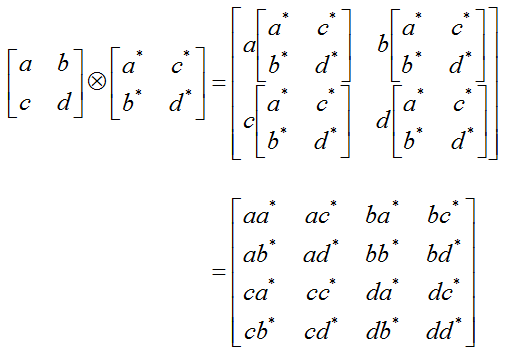
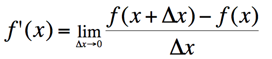

```{r setup, include = FALSE}
knitr::opts_chunk$set(message = FALSE, warning = FALSE)

library(pacman)
p_load(dotwhisker, ggplot2, interplot, # Visualization
       ordinal, RefManageR,# Applied
       # dependency
       readxl, haven, descr, stringi, stringr, arm, car, stargazer, data.table,
       broom, tidyverse) # data wrangling

set.seed(313)
```

class: middle, center, inverse

# [Anxious about Math?](http://player.bilibili.com/player.html?aid=11303109&cid=18692261&page=1)


---

# Function

## What's a Function?

* Definition: "A relation that assigns one element of the range to each element of the domain (Moore & Siegel 2013, 45)"
    + $Y = f(X).$
    + X: domain
    + Y: codomain

---

## Vivid Interpretation

.left-column[
* Domain: <br><br><div class="centered"></div>
]

.right-column[
* Codomain: <br><br><div class="centered"></div>
]

???

Optimus prime

---

## So, the Function Is...

.center[]

---

## In Math?

* Implicit function: $y = f(X).$
    + y: A function of x.
    + x: Argument.
    + f: Mapping
        + *We map the values of Y for any given set of X values.*
        + *f maps x into y.*

--

* Explicit function: $y = 1 - x^2.$

--

* Composition: $g(f(x))$, "g composed with f."

---

<div class="centered"></div>

---

## Properties (Continued)

* Identity function: $f(x) = x.$
* Inverse function: 
$$
\begin{align}
f(x) =& 2x + 3;\\
f^{-1}(x) =& \frac{x - 3}{2}.
\end{align}
$$

* $f(f^{-1}(x)) = x$
    
* $f^{-1}(f(x)) = x$

---

## Monotonic Functions

* Increasing vs. Decreasing
* Strictly increasing/decreasing
* Weakly increasing/decreasing

???

* Strictly increasing/decreasing
    + "A strictly monotonic function is strictly increasing over its entire domain (Moore & Siegel 2013, 50)." 
    + A function is monotonic if its first derivative does not change sign.
* Weakly increasing/decreasing
    + Not decreasing
    + Not increasing

---

## Functions with More than One Argument

.center[]

---

## Linear function

$$y = f(x) = ax + bx^0.$$

* a: slope
* b: intercept.

--

Properties:

Additivity (superposition): $f(x_1 + x_2) = f(x_1) + f(x_2).$

Scaling (homogeneity): $f(ax) = af(x).$

---

## Nonlinear function: Exponents

$$b^n = x.$$

* Exponential function is to solve for x.
    + e.g., $y = x^2.$
* Property: x is called the base.
    + Multiplication: m and n are constant.
        + $x^m * x^n = x^{m + n};$ 
        + $x^m * z^m = (xz)^m;$
        + $(x^m)^n = x^{mn}.$
        + $x^0 = 1.$
        
---
        
* Division
    + $\frac{x^m}{x^n} = x^{m - n};$ 
    + $\frac{x^m}{z^m} = (\frac{x}{z})^m.$
    
* Some terminology
    + Quadratic (parabola): $y = \beta_0 + \beta_1x + \beta_2x^2.$
    + Polynomial: $y = \sum_0^n \beta_n x^n$

---

## Nonlinear function: Radicals

$$b^n = x.$$

* Radical function is to solve for b.
    + e.g., $y = \sqrt[n]{x} = x^{\frac{1}{n}}.$
* Properties
    + Multiplication: $\sqrt[n]{x}\times \sqrt[n]{z} = x^{\frac{1}{n}}\times z^{\frac{1}{n}} = (xz)^{\frac{1}{n}}.$
    + Division: $\frac{\sqrt[n]{x}}{\sqrt[n]{z}} = (\frac{x}{z})^{\frac{1}{n}}.$

---

## Nonlinear function: Logarithms

$$b^n = x.$$

* Logarithm function is to solve for n.
    + The inverse of exponential functions, such as $y = e^x; y = 10^x$.
    + e.g., $y = ln(x); y = log(x).$
    
---

* Properties
    + $ln(1) = 0; log_a(a) = 1$
    + $ln(x_1\cdot x_2) = ln(x_1) + ln(x_2);$
    + $ln(\frac{x_1}{x_2}) = ln(x_1) - ln(x_2);$
        + NB: $ln(x_1\pm x_2)\neq ln(x_1)\pm ln(x_2).$
    + $ln(x^b) = bln(x).$

---

class: inverse, bottom

# Linear Algebra


---

## Why Should We Care? 

* Methodologically
    + Reading the method papers.
    + Spatial, game, dynamic, etc.
    + Learning R.

--

* As a lazy guy,
    + $y = \beta_0 + \beta_1X_1 + \beta_2X_2 + ... + \beta_nX_n + \varepsilon$
    + $\boldsymbol{Y} = \boldsymbol{X\beta}$

---

## Concept

### Scalar vs. Vector
  
.center[]

???

scalar is only about the speed; 

vector is speed and direction.

---

### Matrix

.center[]

    
---

## Vector Algorithm

### Length:

$$||\boldsymbol{x}|| = \sqrt{\sum x_i^2}.$$

--

Example: If $\boldsymbol{x} = (2, 4, 4, 1)$, its length $||\boldsymbol{x}|| = \sqrt{2^2 + 4^2 + 4^2 + 1^2} = \sqrt{37}$. 

--

* Vector normalization: $\frac{\boldsymbol{x}}{||\boldsymbol{x}||}.$
    
---

### Addition

$$\boldsymbol{a} \pm \boldsymbol{b} = (a_1 \pm b_1, a_2 \pm b_2, ..., a_n \pm b_n).$$

.center[]

--

Example: $(1,2) + (5,8) = (1 + 5, 2 + 8) = (6, 10).$

---

### Multiplication

* Scalar Multiplication: $c\boldsymbol{x} = (cx_1, cx_2,..., cx_n).$

.center[]

* Vector Multiplication 
    + Dot product: $\boldsymbol{a\cdot b} = \sum a_ib_i = |\boldsymbol{a}||\boldsymbol{b}|cos\theta.$

---

## Matrix in Types

**Square matrix**: 

$$A_{2\times2} = \left(\begin{array}{cc} 
                  1 & 2\\
                  3 & 4
                  \end{array}\right)$$
                  
**Zero matrix**: 

$$\left(\begin{array}{ccc} 
                  0 & 0 & 0\\
                  0 & 0 & 0
                  \end{array}\right)$$

---

**Diagonal matrix**: 

$$\left(\begin{array}{ccc} 
          1 & 0 & 0\\
          0 & 2 & 0\\
          0 & 0 & 3
          \end{array}\right)$$

**Identity matrix **

$$I = \left(\begin{array}{cc} 
                      1 & 0 & 0\\
                      0 & 1 & 0\\
                      0 & 0 & 1
                      \end{array}\right)$$

---

**Permutation matrix**

$$\left(\begin{array}{cc} 
                      0 & 1 & 0\\
                      1 & 0 & 0\\
                      0 & 0 & 1
                      \end{array}\right)$$


**Upper/lower matrix**

$$\left(\begin{array}{cc} 
                      1 & 4 & 5\\
                      0 & 2 & 6\\
                      0 & 0 & 3
                      \end{array}\right)$$

---

## Matrix Transposition

Row to column, $A^t$.

.center[]


---

## Matrix Addition
$A \pm B = a_{ij} \pm b_{ij}$

Example

$$A = \left(\begin{array}{cc} 
                  1 & 2\\
                  3 & 4
                  \end{array}\right)$$

$$B = \left(\begin{array}{cc} 
                  5 & 6\\
                  7 & 8
                  \end{array}\right)$$

$$A + B = \left(\begin{array}{cc} 
                  6 & 8\\
                  10 & 12
                  \end{array}\right)$$

---

## Matrix Multiplication

### Scalar Multiplication: $cA = ca_{ij}.$

--

### Matrix Multiplication

$C_{n\times p} = A_{n\times m}B_{m\times p} = \sum_{k = i}^{m}a_{ik}b_{kj}.$

--

$AB \neq BA$!

---


.center[]

--

.center[]
  
---

### Kronecker Product

$A_{m\times n}\otimes B_{p\times q} = C_{mp\times nq}.$


.center[]

---

## Determinant

.center[]

* Used to convert the matrix into scalar.

---

* $2\times 2$ matrix (butterfly method)
    + 
* Laplace expansion: using minors.
    + 
* Matrices with non-zero determinant are **non-singular matrices**, which means invertible.

---

## Inverse

* If $AB = BA = I$, then B is the inverse of A, i.e., $B = A^{-1}$. Therefore, 
$A\cdot A^{-1} = I.$

* Calculate the inverse
    + Cofactor Matrix: $A_{ij} = (-1)^{i + j}M_{ij}$, where $M$ is the minor of $a_{ij}$.
    + Adjoint matrix: the matrix of cofactor matrices.
    + $A^{-1} = \frac{1}{|A|}adj(A)$
    + Example: Moore & Siegel 2013, pp.295-6.

---

## Properties
* Matrix
    + Associative: $(AB)C = A(BC)$.
    + Additive distributive: $(A + B)C = AC + BC$.
    + Scalar commutative: $xAB = (xA)B = A(xB) = ABx$
* Transpose
    + Inverse: $(A^T)^T = A$.
    + Additive: $(A + B)^T = A^T + B^T$.
    + Multiplicative: $(AB)^T = B^TA^T$.
    + Scalar multiplication: $(cA)^T = cA^T$.
    + Inverse transpose: $(A^{-1})^T = (A^T)^{-1}$.

---

* Determinant
    + Transpose: $det(A) = det(A^T)$.
    + Identity: $det(I) = 1$.
    + Multiplicative: $det(AB) = det(A)det(B)$.
    + Inverse: $det(A^{-1}) = \frac{1}{det(A)}$.
    + Scalar multiplicative: $det(cA_{n\times n}) = c^ndet(A)$.
* Inverse
    + Inverse: $(A^{-1})^{-1} = A$.
    + Multiplicative: $(AB)^{-1} = B^{-1}A^{-1}$.
    + Scalar multi: $(cA)^{-1} = c^{-1}A^{-1}, \mbox{if}\ c\neq 0$.
    
---

class: inverse, bottom

# Differentiation

---

## Derivative

* Formal



--

* Geomatric

.center[]

---
    
## Rules

* $(C)' = 0$.
* $(x^{\mu})' = \mu x^{\mu - 1}$.
* $(a^x)' = a^xln\ a$.
* $(log_ax)' = \frac{1}{xln\ a}$.
* Let u, v are derivable, 
    + $(u\pm v)' = u' \pm v'$.
    + $(Cu)' = Cu, C\ is\ constant.$
    + $(uv)' = u'v + uv'$.
    + $(\frac{u}{v})' = \frac{u'v - uv'}{v^2},\ where v\neq 0.$
  
---

* Chain rule: $g(f(x))' = g'(f(x))f'(x)$
    + To solve $g(f(x))'$, let $u = f(x)$.
    + $g(f(x))' = g(u)'u' = g(u)'f(x)'$

---

class: inverse

.center[]


