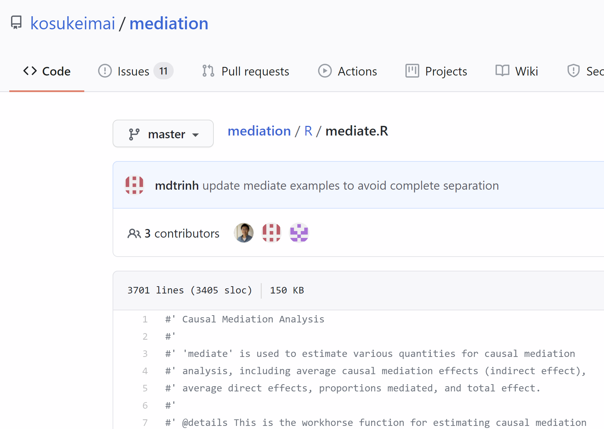
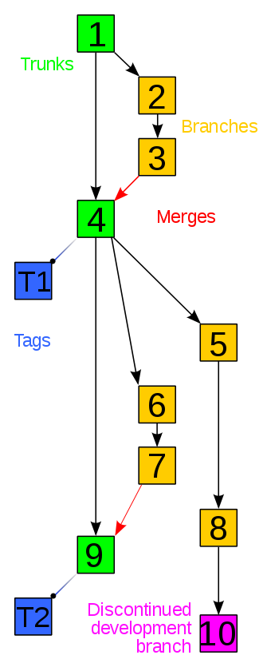
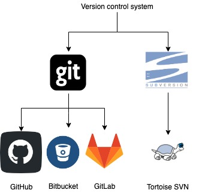
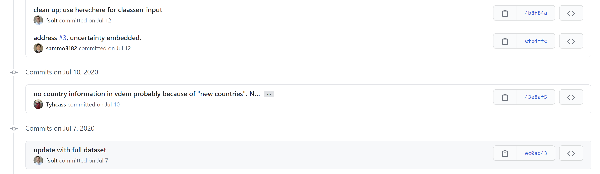
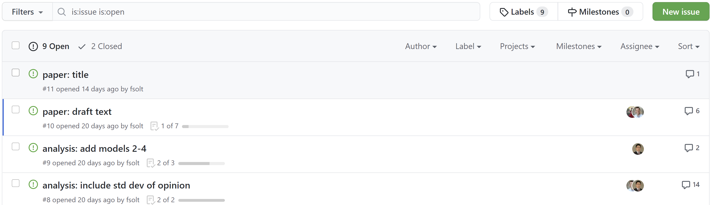
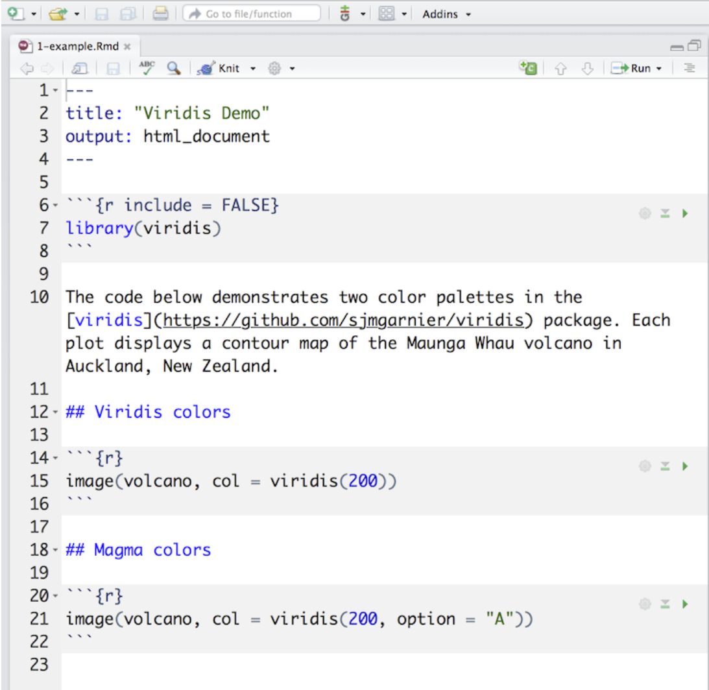

```{r setup, include=FALSE}
knitr::opts_chunk$set(echo = TRUE, message = FALSE, warning = FALSE)

htmltools::tagList(rmarkdown::html_dependency_font_awesome()) #fontawesome

if (!require(pacman)) install.packages("pacman")
library(pacman)

p_load(
  mediation,
  knitr, # dependency
  readxl, haven, descr, stringr, broom, tidyverse
) # data wrangling # data wrangling

# Functions preload
set.seed(114)
```


class: inverse

## Overview

* Going deep with packages
* Project
* Version Control
* Rmarkdown
* "Deep secret"

---

class: inverse, bottom


# Unbox the Functions

---

When you see someone/confusing awesome functions, how do you...

1. Know what they did in the background;
1. Replicate some part of the novel techs.

---

## If the Help File Isn't That Helpful

See Behind the Function Name: "Source code"

Step 1. Seek the right function    
Step 2. Seek the function codes    
Step 3. Locate the argument of interest   
Step 4. Witness the magic.

---

## E.g.,  How did Imai et al. conduct mediation test with continuous variables?

Conventionally, binary variables, but...

--

### Help file:

> `treat`: ...The treatment can be either binary (integer or a two-valued factor) or .red[continuous (numeric)].

How? 

---

## Seek the Function

```{r source}
library(mediation)
methods(mediate)
```

`mediate.ced`: 

+ `mediate`: Function name.
+ `.ced`: The data that function will work on.

---

## Pull Out the Codes

Way 1. In R

```{r meanFunction}
mediate.ced
```

---

Way 2. In the repo

Search for the repo of the package in the browser: https://github.com/kosukeimai/mediation

.center[]

---

## Locate the Argument

```{r eval = FALSE}
 if(isFactorT){
    t.levels <- levels(y.data[,treat])
    if(treat.value %in% t.levels & control.value %in% t.levels){
      cat.0 <- control.value
      cat.1 <- treat.value
    } else {
      cat.0 <- t.levels[1]
      cat.1 <- t.levels[2]
      warning("treatment and control values do not match factor levels; using ", cat.0, " and ", cat.1, " as control and treatment, respectively")
    }
  } else {
    cat.0 <- control.value #<<
    cat.1 <- treat.value #<<
  }
  
```

--

```{r eval = FALSE}
mediate <- function(model.m, model.y, sims = 1000, 
                    boot = FALSE, boot.ci.type = "perc",
                    treat = "treat.name", mediator = "med.name",
                    covariates = NULL, outcome = NULL,
                    control = NULL, conf.level = .95,
                    control.value = 0, treat.value = 1, #<<
                    long = TRUE, dropobs = FALSE,
                    robustSE = FALSE, cluster = NULL, group.out = NULL, 
                    use_speed = FALSE, ...){
```

---

class: small

## Answer in the Help File Actually

### Arguments

`control.value`	
> value of the treatment variable used as the control condition. .red[Default is 0].

`treat.value`	
> value of the treatment variable used as the treatment condition. .red[Default is 1].

### Details

> When the treatment variable is continuous or a factor with multiple levels, user .red[must specify the values of t1 and t0 using the 'treat.value' and 'control.value' arguments], respectively. The value of t in the above expressions is set to t0 for 'd0', 'z0', etc. and to t1 for 'd1', 'z1', etc.

---

class: inverse, bottom

# Project and Version Control

---

## Why Bother?


.center[]

An folder to store the input, codes, and output.


---

## Create a Project

.center[]


`.Rproj` file means success.


---

## Programing w. a Project

* A new R session
* Custom .Rprofile
* .Rhistory file
* Current wording directory: Where the project is
*The current working directory is set to the project directory.
* Previously edited source documents

--

<center>"Work like the air."</center>

---

## Version Control

.center[]

???

"A forced habit"

---

## What's VCS

.center[]

---

## Choices

.center[]

--

* Free
* Transparent (unless `private`)
* Favoring the academic

---

## Starting Point

.center[]

---

## Then

.left-column[
1. Commit
1. Pull
1. Push
]

--

.right-column[]

---

## Outcome

.center[]


---

## Team Work

.center[]

--

.center[]

---

## Wanna Learn?

Jenny Bryan's fantastic book

.center[[*Happy Git and GitHub for the useR*](https://happygitwithr.com/)]

--

*Do Cool Stuff with Dr. Hu* (coming)

.center[Wrote and edited by students.]

---

## One of the Coolest

.center[.huge[Rmarkdown]]

--

1. Easy to learn
1. Openning in any text editor
1. No mouse needed
1. .red[Embedding R/Python/Stata outcomes into a document]

---

## What You Can Get

.center[]


---

## "Replace" LaTex

.left-column[

]

--

.right-column[

]

---

## Easy-Peasy

.center[]


---

## YAML

"YAML Ain't Markup Language"

```{markdown}
---
title: "Learn R with Dr. Hu"
subtitle: "Become A Decent R User!"
author: "Yue Hu"
institute: "Political Science, Tsinghua University"
output: pdf_document
fontsize: 12pt
bibliography: "theResearch.bib"
csl: "american-political-science-association.csl"
link-citations: true
abstract: |
  **Abstract**: From on a combined view of political psychology and political linguistics....
---

```

---

## Content

.left-column[
`# Header 1`    
`## Header 2`    
`### Header 3`

`+ Bullet Point 1`    
`+ Bullet Point 2`

`1. Num item 1`    
`1. Num item 2`

`Paragraph 1`    
(Blank line)    
`Paragraph 2`    
]

.right-column[

\`\`\`    
"Hello~!"    
\`\`\`

`[](hyper link)`    
``

`**Bold**`    
`*Italic*`    
`~~Deleted~~`    

`$\delta_1 = \sigma_i^2 - 1$`

]

---

## Extention of Rmarkdown

.center[]

---

class: inverse, bottom

## Something Only Deep R Learner Would Tell You!

---

.small[*Inspired by Amanda Gadrow*]

--

.center[]

.center[.large[Be lazy,]  
but in the right track]

???

"Lessons about R I learned from my cat"

---

.center[.large[Be lazy,] but in the right track]

.center[]

```{r eval = FALSE}
## Set up
library(tidyverse)
set.seed(114)
source("codes.R")

## Analysis
df_input <- read.csv("../data/relative_address.Rds")
An_object <- whatever(df_input) # readable
No_forLoop <- purrr::map(vars, fun(vars){
  # analyze each var
  })
```

---

.center[.large[Trying things...]]

.center[]

---

.center[.large[...and land on your feet]]

.center[]

---

.center[.large[Ask for help...]]

.left-column[]

.right-column[
+ StackOverflow
+ Search engines
+ Local Rstudio Community (us~~)
+ Github issues
]


---

.center[.large[...unless you've already tried]]

.right-column[]

.left-column[Please search for "GIYF" alike .red[before] asking programming question to anyone!]

???

JFGI, FGI, STFW

---

.center[.large[Keep your claws sharp]]

.left-column[]

.right-column[

* R-bloggers
* Package NEWS
* .red[Dr. Hu & his friends' R Workshops]
* R-Ladies

]

---

.center[.large[Hang out with friends]]

.center[]

---

.center[.large[Bask in the sun]]

.center[]

---

class: center, middle

.large[More to Learn!]  
.large[Keep in touch!]

--

<i class="fa fa-envelope fa-lg"></i>&nbsp; [yuehu@tsinghua.edu.cn](mailto:yuehu@tsinghua.edu.cn)

<i class="fa fa-globe fa-lg"></i>&nbsp; https://sammo3182.github.io/

<i class="fab fa-github fa-lg"></i>&nbsp; [sammo3182](https://github.com/sammo3182)
