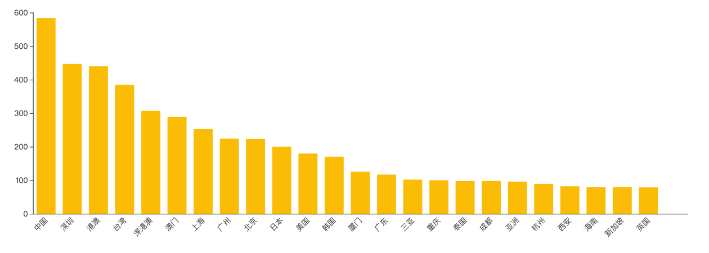
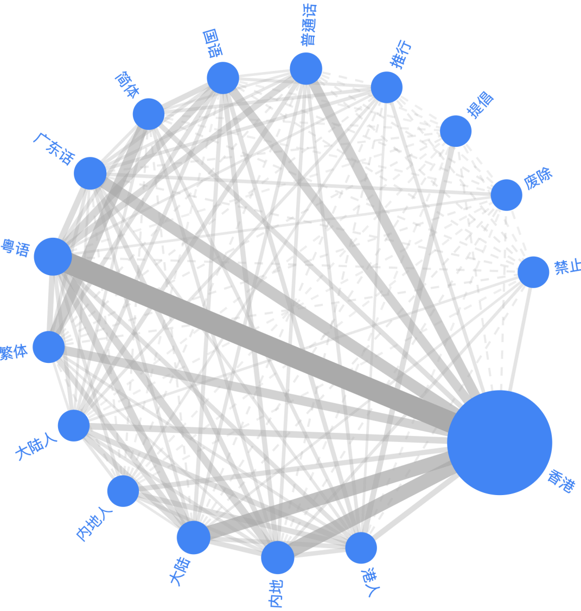
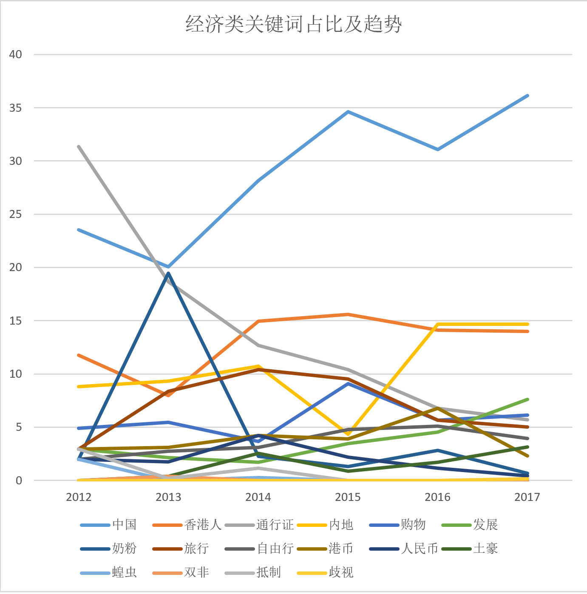

```{r setup, include = FALSE}
knitr::opts_chunk$set(echo = FALSE, message = FALSE, warning = FALSE, htmltools.dir.version = FALSE)

xaringanExtra::use_xaringan_extra(c("tile_view", 
                                    "broadcast", 
                                    "panelset",
                                    "tachyons"))


library(pacman)

p_load(icons)

# Functions preload
set.seed(313)
```


class: center, middle, normal

## 摘要

**核心指向**

深挖香港政治经济不稳定.red[根源]，维护香港.red[长治久安]
+ 理解香港问题社会经济根源
+ “一国”框架下，引导身份认同良性建构
+ “两制”条件下，促进协同发展

**解题方法**

以.red[群体]身份认同切口
+ 代表性全港调查 + 批量媒体文本 + 深度访谈
+ 大数据与小数据结合、定量与定性方法结合

---

class: normal

## 研究成果

+ 身份认同的内在危机    
+ 身份认同的外部塑造    
+ 内外互动塑造机制    

.large[&dArr;]

《香港群体身份认同的互动塑造机制研究》

1. 《香港群体身份认同现状——“反修例”事件前夕港人政治心态初探》
1. 《香港与内地群体身份认同之互动机制研究》

---

## 香港群体身份认同内在危机

.pull-left[
数据：2016年全港代表性数据

发现：

+ 整体性悲观
    + **超过一半**认为回归后香港的整体发展情况“倒退了”，仅有**两成**左右受访者认为“进步了”。
    + 最多占比则为**高学历人士**（大专或以上），而且比例远高于其他组别
]

.pull-right[

]

???

香港新一代文化协会

---

.pull-left[]
.pull-right[
+ 跨年龄层现象
    + “倒退了”的群体中，各年龄层人群占比**均衡**
        + **中年群体**比例较高；**高知**比例高
    + 认同香港回归后整体发展情况**进步**群体当中，占比最多的反而是**青年人**
    
+ 悲观植根于发展
    + 并非单纯来自于香港回归以来发展的情况
    + 42%市民对于未来五年香港的经济发展表示“信心不大”和“没有信心”
]

---
.pull-left[
+ "分裂"与团结
    + **四分之一**受访者认为主张“港独”的团体成立目的在于“维护香港利益”
        + 最多为**中年、青年**群体，占比分别为41%和42%
        + **低收入**群体的港独倾向更加明显
        + **高知**支持更多，比例高达43.3%且远高于其他学历背景人群。
            + 在认为是为了“获取个人利益”的人群当中，多达83.3%“拒答”，拒绝透露其教育背景。
]
.pull-right[

]
---

class: normal

## 总结

+ 香港问题是.red[群体身份认同危机]的集中体现，而不仅是国家认同问题；
+ 香港动乱的根源在于香港市民对香港.red[现状和未来发展]缺乏信心，市民悲观情绪有两极化趋势；
+ 香港问题是.red[全港性]的，在各市民群体中的特征是异质性的

---

## 外部因素：内地人香港观

+ 新浪微博与香港有关的发帖
    + 2012年1月1日至2017年10月10日
    + 20万 &rarr; 10885条

+ 万页文本分析系统

---

## 总体描述

.left-column[
### 高频词

以文化、生活、休闲娱乐等性质为主
]
.right-column[

]

---

## 总体描述

.left-column[
### 高频词
### 高频人物

+ 基本为明星艺人
+ 只有李嘉诚是商人背景
+ 没有政治人物

]
.right-column[

]

---

## 总体描述

.left-column[
### 高频词
### 高频人物
### 高频空间

+ 占比较多的都是相邻地区，包括深圳、台湾、澳门等
+ 还包括了地域词组如“港澳”、“深港澳”等
]
.right-column[

]

---

## 融合与疏离：

### 关系分析模型： 

融合与疏离

+ 政治
+ 经济
+ 文化

--

### 研究方法：

趋势分析 + 案例分析

+ 内地人最为关注的、和香港相关的话题，还是生活和休闲娱乐方面的内容。
+ 从高流量的发帖当中可见，融合性质贴文较疏离性质为多。

但融合和疏离的.red[概念关系]和.red[时间趋势]尤其值得注意！

---

## 政治

.pull-left[]
.pull-right[
+ 融合: 多提“中国”、“内地”、“一国两制”表示内地与香港紧密联系。

+ 疏离: 香港和“美国”、“英国”、“占中”、“冲突”等
    + “分裂”分别和“民族”、“示威”关系密切
    + “占中”和“分裂”、“示威”、“冲突”等关系紧密
    + “港独”则和“示威”联系较强


**“占中”和“英国”直接关系不大，但是两者皆与“爱国”存在紧密关系**
]

---

## 经济

.pull-left[]
.pull-right[
+ 融合: 较多提到“中国”、“香港人”、“通行证”、“内地”、“旅行”、“奶粉”、“购物”等字眼

+ 疏离: 
    + **“双非”**与“内地”、“购物”、“港币”存在紧密的联系
    + **“蝗虫”**与“内地”、“旅行”、“通行证”等关系密切
    + **“抵制”**和**“通行证”**较强关系
    + **“歧视”**和**“自由行”**强关联性

]

???

+ “双非”问题是指父母皆非香港居民以生育旅行方式在香港所生的婴儿可取得香港永久居留权，并可享有香港社会资源及福利引起的一系列社会争议问题。
+ “蝗虫”一词，是由于“双非”人数在香港回归约5到15年间不断增多，正是该数据覆盖的时间段，再加上通过“自由行”来港的内地旅客持续增加，导致一系列冲突事件，引起香港社会的不满情绪，并就此发生过游行抗议，甚至引发“蝗虫论”的歧视争议。


---

## 文化

.pull-left[]
.pull-right[
+ “香港人”和“粤语”、“国语”、“英语”关系密切，反映内地网民对香港人的看法是**集合多种语言群体**。
+ “提倡”和“禁止”有强关联性，但除此之外只和“繁体”存在联系，显示内地网民倾向表达**禁止提倡繁体字之类讯息**
+ “废除”只和“广东话”发生联系，表示内地网民在讨论废除语言这类话题的时候，只会提到广东话，反映了内地与香港在语言文化和沟通上的**差异与误解**，从而对于群体认同造成负向影响
]

---

## 时间趋势分析

.left-column[
### 政治类

+ “中国”一直占比最高;
+ “占中”2014年引起广泛的关注，翌年淡出。
    + **“港独” 2016年更多讨论**
+ “一国两制” 占比上升；“英国”下降
]
.right-column[
.center[]
]

???

受到年初旺角的街头骚乱以及立法会“宣誓风波”等政治事件影响

---

## 时间趋势分析

.left-column[
### 政治类
### 经济类
+ “通行证” 、“旅行” 和“自由行” 呈现明显下降趋势，反映了内地人**前往香港意愿减少**
]
.right-column[
.center[]
]

---

## 时间趋势分析

.left-column[
### 政治类
### 经济类
### 文化类

+ “国语”和“普通话”较为平稳，但热度远不如“粤语”
+ “繁体”2016年到达峰值, 2017年回落

]
.right-column[
.center[]
]

???

与当年香港教育局发表了“谈繁简字问题”的政府评论有关该评论表示，香港政府并没有计划在中、小学阶段规范学生在常规课堂内学习简化字，更没有以简化字取代繁体字、「一体化」或令繁体字消失的含意或意图，对社会人士作出澄清，从而引起了内地网民的讨论

---

## “北漂”研究：香港与内地群体身份认同互动塑造

2019年香港爆发的“反修例事件”，往往被认为是香港人的国家认同问题所致。然而本研究基于25名“北漂”港人的深度访谈发现，.red[事件问题绝非仅仅是国家认同问题，缺乏国家认同也更趋近于结果而非原因]。

.red[群体认同]的问题才是核心症结所在。

--

### 研究对象

“北漂”港生

1. “极端不可能案例分析”（least-likely case analysis）框架
1. 国家在进行涉港工作、处理香港问题的时候，最能够接触到的人群
1. 能够有效连接起香港和内地，作为传播和交流的桥梁

\*区分“内地港生”和“港籍内地生”

---

background-image: url("images/interviewees.png")
background-position: center
background-size: contain

---

## 认同问题

“身份隐匿”倾向: 
在与内地人交流时，.red[有刻意回避或隐瞒]其“香港人”法律身份取态

1. 同样现象也发生在**港籍内地生**身上
1. 对香港前景越感到**悲观**，越表现出消极情绪的受访者，越倾向于**隐藏**其“香港人”身份
1. 没有刻意表现出“身份隐匿”现象的港生，普遍存在内地拥有比较**发达的个人社交网络**。

--

### 原因

1. **叙事话语差异**导致群体间认知差异   
    + 多于三分之二的港生认为内地对香港的观感是负面大于正面

1. 学校“**区隔化**”管理模式造成群体身份互动隔阂

---

class: center, middle, normal

## 政策建议

1. 香港.red[群体认同]塑造亟待重视

1. 全方位增强港生.red[个人社会网络]搭建

1. 高校在港生管理政策上宜采用趋于“.red[一体化]”模式

1. “.red[港籍内地生]”能够且需要发挥更大的弥合作用

---

class: inverse, center, middle, normal

# 感谢聆听

`r feather_icons("mail")`&nbsp;[yuehu@tsinghua.edu.cn](mailto:yuehu@tsinghua.edu.cn) 

`r feather_icons("globe")`&nbsp; https://sammo3182.github.io/

`r feather_icons("github")`&nbsp; [sammo3182](https://github.com/sammo3182)

```{r pdfPrinting, eval = FALSE, include = FALSE}
pagedown::chrome_print(list.files(pattern = "hongkong.html"), 
                       timeout = 500, 
                       box_model = "padding")
```