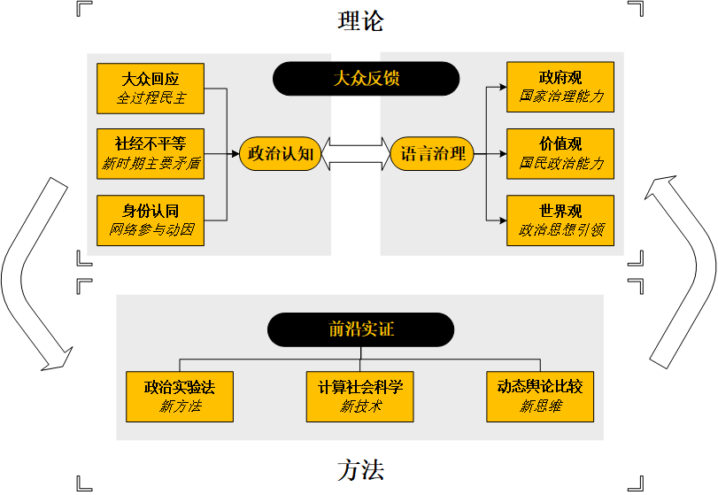
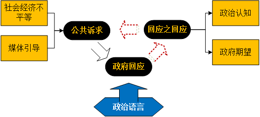
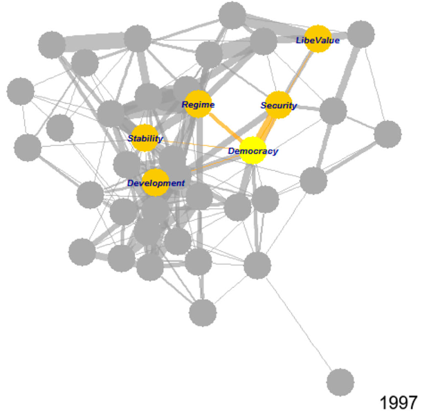
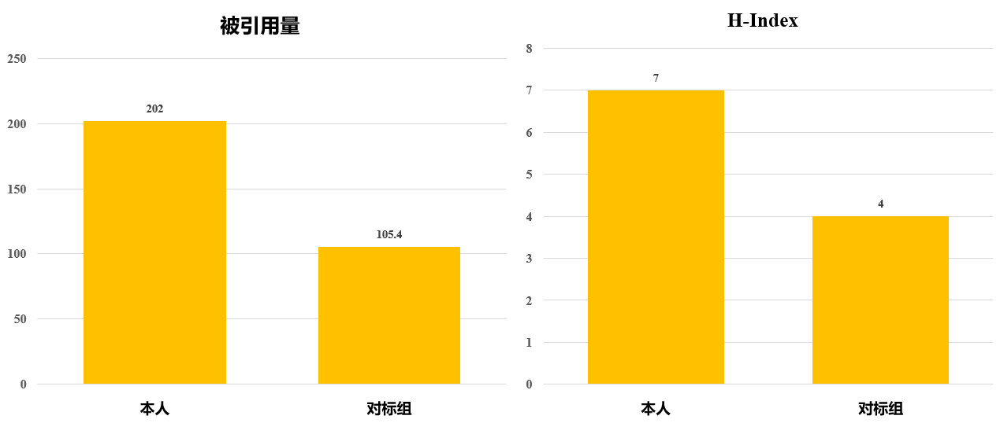
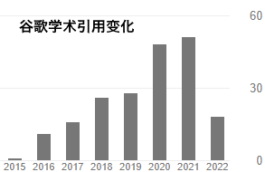
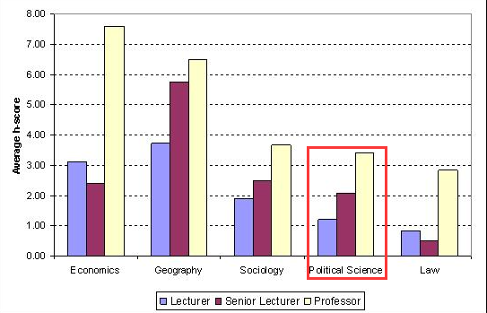

```{r setup, include=FALSE}
knitr::opts_chunk$set(echo = FALSE, message = FALSE, warning = FALSE)

if (!require(pacman)) install.packages("pacman")
library(pacman)

p_load(
  dplyr,flextable
) # data wrangling # data wrangling

xaringanExtra::use_xaringan_extra(c("tile_view", # O
                                    "broadcast", 
                                    "panelset",
                                    "tachyons"))

# Functions preload
set.seed(313)
```

## 个人简介

*学术经历*

- 2021-今：清华大学社会科学学院政治系&nbsp; &nbsp;副教授
- 2019-2021：清华大学社会科学学院政治系&nbsp; &nbsp;助理教授
- 2013-2018：美国爱荷华大学&nbsp;&nbsp;政治学博士
- 2011-2013：美国南卡罗莱纳大学&nbsp;&nbsp;政治学硕士
- 2009-2011：加拿大里贾纳大学&nbsp;&nbsp;政治学硕士
- 2005-2009：南开大学&nbsp;&nbsp;国际政治学士

*学术兼职*

- 2021-今：清华大学计算社会科学平台&nbsp;&nbsp;副主任
- 2021-今：清华大学苏世民学院&nbsp;&nbsp;论文导师
- 2020-今：上海交通大学中国发展研究院&nbsp;&nbsp;“流动的中国”网络研究员
- 2019-今：清华大学数据治理研究中心&nbsp;&nbsp;副主任
- 2019-今：APSR, AJPS, JOP等学术期刊&nbsp;&nbsp;匿名评审
- 2015-2018：爱荷华社会科学研究中心&nbsp;&nbsp;统计学顾问


---

## 研究内容

.center[]

---

## 学术成果

独立性高：入职以来论文.red[**100%**]为一作/通讯，.red[**三分之一**](5/15篇)为独作。

创新型强：国际顶刊发表高水平论文
- 数个国际顶刊创刊以来.red[**前10**]仅由大陆作者发表论文；
- 学科国际“三大刊”第一刊.red[**首位**]大陆一作；
- 三大顶刊已发.red[**其二**]；


.small[
| 作者                                     	| 发表时间 	| 期刊                              	| 质量                         	| 仅大陆作者                      	|
|------------------------------------------	|----------	|-----------------------------------	|------------------------------	|-------------------------------	|
| Tai, Y., **Hu, Y.\***, & Solt, F. 	| 2022     	| American Political Science Review<br>(创刊于1906年，约40篇/年)	| .red[**SSCI A+**]<br>IF: 7.828 	| &nbsp;&nbsp;&nbsp;&nbsp;.red[**第1篇**]（共1篇）            	|
| **Hu, Y.\***                    	| 2020     	| Political Psychology<br>(创刊于1920年，约40篇/年)              	| .red[**SSCI A+**]<br>IF: 4.333 	| &nbsp;&nbsp;&nbsp;&nbsp;.red[**第2篇**]<br>（共3篇，独作第2篇） 	|
| **Hu, Y.\***                      	| 2020     	| Democratization<br> (创刊于1994年，约40篇/年)                  	| .red[**SSCI A**]<br>IF: 3.055  	| &nbsp;&nbsp;&nbsp;&nbsp;.red[**第7篇**] (独作第4篇)          	|
]
---

## 学术贡献I: 大众政治反馈理论

.pull-left[
创新点：.red[基础命题理论创新]
- 探索民众政治认知建构机制
- 拓展“政治语言学”交叉领域
- 补全“全过程民主”研究闭环



]

.pull-right[
*代表作*    
.small[
- Tai, Y., .red[**Hu, Y.\\***], & Solt, F. (2022). Democracy, Public Support, and Measurement Uncertainty. *American Political Science Review*, Forthcoming.(.red[**SSCI A+**], IF: 7.828, .red[**"政治学三大刊"第一**]，创刊116年来.red[**第1篇大陆作者作为一作（共同）+通讯**]的发表文章)

- .red[**Hu, Y.\\***] (2020). Culture Marker Versus Authority Marker: How Do Language Attitudes Affect Political Trust? *Political Psychology*, 41(4), 699–716. (.red[**SSCI A+**], IF: 4.333，.red[**社会心理学期刊国际排名第七**]，创刊42年来.red[**第2篇大陆学者独作文章**])
- Solt, F., .red[**Hu, Y.**], Hudson, K., Song, J., & Yu, D. “Erico.” (2017). Economic Inequality and Class Consciousness. *The Journal of Politics*, 79(3), 1079–1083. (.red[**SSCI A+**], IF: 3.458，.red[**"政治学三大刊"第三**]，创刊54年来.red[**第2篇大陆学者发表文章**])
]
]

???

## American Political Science Review:

1. Getting Ahead in the Communist Party: Explaining the Advancement of Central Committee Members in China
Liu, Mingxing，2012（北京大学中国教育财政科学研究所，第 4 作者）

2. Informal Institutions, Collective Action, and Public Investment in Rural China
Yao, Yang，2015（北京大学中国经济研究中心，第 2 作者）

3. Democracy, Public Support, and Measurement Uncertainty.” American Political Science Review 2022: Forthcoming

## Political Psychology:

1. Ideological orientation and political transition in Hong Kong: Confidence in the future
Peng, SQ，2003（北京大学光华管理学院市场营销学系，第 4 作者）

2. Working for the Hierarchical System: The Role of Meritocratic Ideology in the Endorsement of Corruption
Tan, Xuyun，2017（北京师范大学心理学院，第 1 作者，非独作）

3. Who Is Afraid of the Chinese State? Evidence Calling into Question Political Fear as an Explanation for Overreporting of Political Trust
Zhang, Jie，2018（中国传媒大学传媒教育研究中心，第 3 作者）

4. Life History and System Justification: Higher Individual Fertility and Lower Provincial Life Expectancy Correlate With Stronger Progovernment Attitudes in China
Zhong, Zhijin，2019（中山大学传播与设计学院教授，第 2 作者）

5. Encountering Dissimilar Views in Deliberation: Political Knowledge, Attitude Strength, and Opinion Change
Zhang, Kaiping，2019（清华大学政治学系，第 1 作者，独作，政治学者）

6. Culture Marker Versus Authority Marker: How Do Language Attitudes Affect Political Trust?
*Yue Hu，2022（清华大学政治学系，第 1 作者，独作，政治学者）

## The Journal of Politics:

1. Why Do Authoritarian Regimes Allow Citizens to Voice Opinions Publicly?
Chen, Jidong，2017（北京师范大学经济与工商管理学院，第 1 作者，非独作）
Published：JUL 2017
Indexed：2017-07-01

2. Economic Inequality and Class Consciousness
*Yue Hu，2017（清华大学政治学系，第 2 作者）
Published：JUL 2017
Indexed：2017-07-04
*胡悦是Journal of Politics自从1968年以来，第 2 位在该刊发表论文的大陆学者，更是第 1 位大陆背景的政治学者。


---

## 学术贡献II: 科学研究方法

.pull-left[
创新点: 引入政治实验法
.small[
- **反腐**：Tang, W., & .red[**Hu, Y.\\***] (2022). Detecting Grassroots Bribery and its Sources in China: A Survey Experimental Approach. *Journal of Contemporary China*, Forthcoming. (.red[**SSCI A+**], IF: 3.748，.red[**地区研究期刊国际排名第二**])
- **动员**：Jiang, Q., Liu, S., .red[**Hu, Y.\\***], & Xu, J.\* (2022). Social Media for Health Campaign and Solidarity Among Chinses Fandom Publics During the Covid-19 Pandemic. *Frontiers in Psychology: Health Psychology*, 12, 824377. (.red[**SCI/SSCI A**],，IF: 2.990)
- **主流媒体**：Hu, Y., & Shao, Z. (2022). What Drives Chinese Internet Users to Watch State-Media Broadcasts? An Audience Analysis. *Journal of Chinese Political Science*, 27(1), 19–40. (.red[**SSCI A**]，IF: 1.694)
- **方法论**：.red[**胡悦\\***]. (2021). 实验室实验：政治科学研究的一种有效方法? 《国外理论动态》, 06, 160–171. (.red[**CSSCI**], IF: 1.109，发表四月.red[**下载178次**]，.red[**人大复印报刊资料转载**])

]
]

.pull-right[
推广计算社会科学
.small[
- .red[**Hu, Y.**], Sun, Y.\*&,  Lien, D. (2022). The Resistance and Resilience of National Image Building: An Empirical Analysis of Confucius Institute Closures in the U.S. *Chinese Journal of International Politics*, 15(3), Forthcoming. (.red[**SSCI A+**], IF: 3.649)
- .red[**Hu, Y.\\***] (2020). Refocusing Democracy: The Chinese Government’s Framing Strategy in Political Language. *Democratization*, 72(2), 302–320. (.red[**SSCI A**]，IF: 3.055，创刊以来.red[**第4篇大陆学者独作文章**])
.center[]
]
]

???

.red[经典议题实证前沿]

---

class: small

## 学术影响力

.pull-left[
- 谷歌学术引用指标：被引用.red[**202次**]且逐年增长，    h-index(高引用指数) = .red[**7**]
- 被引用量是国内对标组约.red[**1.9倍**]，h指数是国内对标组约.red[**1.7倍**]
- H-index是LSE政治学高级讲师（副教授）.red[**约3.5倍**]，.red[**超过正教授**]




对标组（n = 10)
- **强院校**：第四轮政治学学科评估A及A+学校（北大、人大、复旦）
- **同年龄**：本科毕业2004-2012（本人2009）
- **近领域**：政治心理/政治文化/政治传播

]

.pull-right[
.center[

**伦敦正经政治学教师H-index平均水平为3.43**
]
.footnote[Source: Bastow, Dunleavy & Tinkler. *The Impact of Social Sciences*.]
]

---

## 学术影响力

.pull-left[
.pull-left[
**学科内**
- 人大复印报刊资料转载
- 专家社交媒体视频专荐

**学术圈**
- 方法软件矩阵
- 全球下载量屡破十万
`dotwhisker`
`interplot`
]

.pull-right[


]

]

.pull-right[
**政府**

运用计算社会科学，协助北京规自委，获中央政治局委员、北京市委书记蔡奇、北京市委副书记、市长陈吉宁、北京市副市长隋振江肯定性批示
.center[]
]


???

Stephan Haggard is the Lawrence and Sallye Krause Professor of Korea-Pacific Studies at the School of Global Policy and Strategy and distinguished professor of political scientist specializing in comparative politics at the University of California San Diego.

---

class: small

## 科研项目

.center[主持国自科、北京社科等科研项目.red[**6**]项，获得科研资助累计.red[**160.88万**]，另作为主要人员参与5项]

```{r tb-funding}
readxl::read_xlsx("images/funding.xlsx", sheet = "funding") %>% 
  flextable() %>% 
  bold(i = c(1,3, 11)) %>% 
  autofit()
```

---

## 未来展望

**形成理解国家治理效能理论创新，回应治理现代化挑战**
- 城市政治、语言治理、新媒体政治回馈
- 国自科项目、北京社科；.red[专著已与Springer出版社签约]

**聚焦科学性，推动学科DA-RT(Data Access and Research Transparent)**
- 中英方法论文章、.red[公共舆论动态比较(DCPO)国际合作项目]

**落实计算社会科学平台建设，普及社会科学、提供公共产品**
- R 语言工作坊；.red[计算社会科学编程语言证书项目]

**推进教学科研改革，出版高质量前沿教材**
- .red[清华教师培训评估专家组]工作
- 方法论.red[教材已与重庆大学出版社签约]，“万卷方法”系列
- 教改项目

???

邱勇倡议、郑力牵头、袁驷主持

---

## 教学情况

.pull-left[
本科生课程：
+ 通识课：    
《理解政策：多元视角与案例分析》
前.red[**25%**]
+ 专业课：    
《公共政策分析》

研究生课程：
+ 《政治数据分析》前.red[**25%**]，4项指标前.red[**5%**]
+ 《政务大数据》（合教）    
服务清华师生兼政府干部
]

.pull-right[
其他：
+ 《R语言工作坊》累计学员.red[**超过3000人**]，包括来自.red[**牛津大学、宾夕法尼亚大学**]等国外高校学生

指导学生：

- 博士生3名   
(一名入学第三年即获得.red[**国家奖学金**]，一名两次获得.red[**教育部港澳及华侨学生奖学金**])   
- 硕士生1名
]

---

## 公共服务

**科研服务**
- .red[**清华计算社会科学平台**]和.red[**清华数据治理中心**]副主任
    - 组织 “大数据社会科学讲习班”、“计算社会科学高端论坛”
- Github Campus Advisor （.red[**全国仅三位，唯一文科教师**]）
- APSR, AJPS, JOP, BJPS等国内外.red[**权威期刊审稿人**]

**院系服务**
- 担当社科党委.red[**研工组组长**]、清华大学校友会社科分会.red[**副秘书长**]，管理研究生.red[**947人**]，领导学生获.red[**先进集体、甲级团支部、“一二·九”综奖三连冠**]等。
- 完成建立.red[**3**]个暑期实践基地、.red[**1**]个就业实践基地及配套奖助学金。
- 接手社科学院研究生疫情防控工作，处理疫情审批事宜.red[**\>1,500**]项。


**学校服务**
+ 清华大学“天津招生组”成员，负责首次“强基计划”招生工作。
+ 获得“.red[**优秀招生新人**]”称号。

---

## 获奖情况

.pull-left[
- 北京市第十六届哲学社会科学优秀成果二等奖 （2021）

- 清华大学教学成果奖二等奖（2021）

- 清华大学毕业生就业工作先进个人（2021）

- 清华大学研究生社会实践优秀指导教师（2020/2021）

- 清华大学第九届青教赛三等奖（2020）

- 清华大学优秀招生新人（2020）
]

.pull-right[
.center[]
]

---

class: center, middle

.large[
衷心感谢各位专家    
敬请批评指正！
]

???

这就是我的汇报，期待老师们的批评指正。

```{r pdfPrinting, eval = FALSE, include = FALSE}
pagedown::chrome_print(list.files(pattern = "tenure.*.html"), 
                       timeout = 500, 
                       box_model = "padding")
```