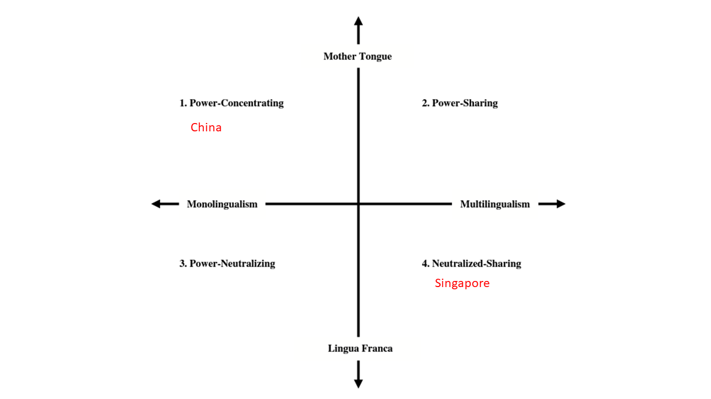

## 目标

- 了解.red[什么]是语言政策

--

- 了解.red[为什么]要研究语言政策

--

- 熟悉语言政策的.red[MM-ML分类系统]和.colored[主要类型]

---

class: inverse, bottom

# 语言政策之是什么

---

## 语言政策的范畴

- 关于语言的所有政策和实施过程。

--

- Linguistic standardization (*政府说什么语言*)
    + Language education (*老师说什么语言*)

--

- Linguistic ecology (*母语非官方语言者说什么语言*)

---

语言政策不一定是全国性的

.center[]

???

Red: English only

Blue: English plus

Yellow: Bilingual

White: None (Nevada[nəˈvɑd ə])

---

class:inverse, bottom

# 语言政策之为什么
## Why Should We Care?

---

## 为什么要研究语言政策

之于*政治学者* 而言：

1. 降低社会.red[损耗]；
1. 增加治理.navy[效率]。

---

## 社会损耗

.pull-left[

**沟通损耗**

]

--

.pull-right[

**身份损耗**

]

---

background-image: url(image/tax.gif)
background-size: 300px
background-position: 99% 1%

## 语言政策相关治理

--

* 收税

--

* 行政效率

--

* 治理效能

???

Money

Within the government

Government to citizens

---

## 治理问题

* 人际沟通
* 集体行动

--

.center[]

---

class:inverse, bottom

# 如何研究语言政治

---

## 语言政治分类学 （MM-ML）

核心: 官方语言（official language）

--

维度1: 官方语言.colored[数量]

Monolingualism vs. Multilingualism

--

维度2: 官方语言.colored[来源]

Mother tongue vs. Lingua franca

???

Mono: Korea

Mult: Canada

Mother vs. Lingua: Spanish the official 

---

background-image: url(image/theory1.png)
background-size: 1200px

???

Power sharing: 1 + the dominant group

Power neutralizing: 1 + lingua franca

Power sharing: N + native languages

Neutralized-sharing: N + lingua franca + native languages

---

background-image: url(image/theory2.png)
background-size: 1200px

???

Indonesia [ɪndoʊˈniʒə]:
- Official: Malay (called Indonesian, 从Netherlands独立)
- Native: Javanese, Sundanese, and other indigenous (700)

Malaysia[məˈleɪʒə]: power concentrating/sharing
- One official: Malay
- Education: Malay, Chinese, and Tamil[təˈmɪl]

---

name:example

background-image: url(image/theory3.png)
background-size: 1200px

???

Why these countries? Przwaski and Teune's most similar systems (*The Logic of Comparative Social Inquiry* 1970)

---

class: inverse, bottom

# 应用
## 中国 vs. 新加坡

---

background-image: url(image/mandarindisb.JPG)
background-size: 550px
background-position: 50% 50%

## 中国语言政策

---

## 中国的语言政策

.pull-left[

#### Power-concentrating: 

+ .red[单一]国家通用语言
    + 普通话+标准汉字
    + 少数民族自治区双通用语政策
+  以.red[主体]民族语言为基础
    + **汉: 91.51%**; 壮: 1.27%; 回: 0.79% ...

]

.pull-right[]

---

## Language Policy in Singapore

---

name: singapore

## Language Policy in Singapore

.pull-left[

]

.pull-right[

- Neutralized-Sharing: 
    + 官方语言数量？  
    + 官方语言来源？

]

???

问: Guess what's the official language?

---

## Language Policy in Singapore

.pull-left[

]

.pull-right[

- Neutralized-Sharing: 
    + 官方语言数量
        + 英、普、马、塔
    
    + 官方语言来源: *Lingua franca*
]

???

英语、普通话、马来语、塔米尔语

---

## 总结

### 什么是语言政策

* Lingual standardization + ecology
* Core: official language

--

### 为什么研究语言政策

1. 降低社会损耗；
1. 增加治理效率。

--

### 如何研究语言政策

* MM-ML

???

Num of OL: Monolingualism vs. multilingualism

Nativity of OL: Mother tongue vs. lingua franca

1. Power-concentrating; 
1. Power-neutralizing; 
1. Power-sharing;
1. Neutralized-sharing.

---

class: small

## 延伸

语言政策如何影响政治态度与行为？

+ Hu, Yue. 2020. “Culture Marker Versus Authority Marker: How Do Language Attitudes Affect Political Trust?” *Political Psychology* 41(4): 699–716.    
+ Hu, Yue, and Amy H. Liu. 2020. “The Effects of Foreign Language Proficiency on Public Attitudes: Evidence from the Chinese-Speaking World.” *Journal of East Asian Studies* 20(1): 1–23.    
+ Tang, Wenfang, Yue Hu, and Shuai Jin. 2016. “Affirmative Inaction: Language Education and Labor Mobility among China’s Muslim Minorities.” *Chinese Sociological Review* 48(4): 346–66.

---

.center[]

---

class: inverse, center, middle

# That's it!

